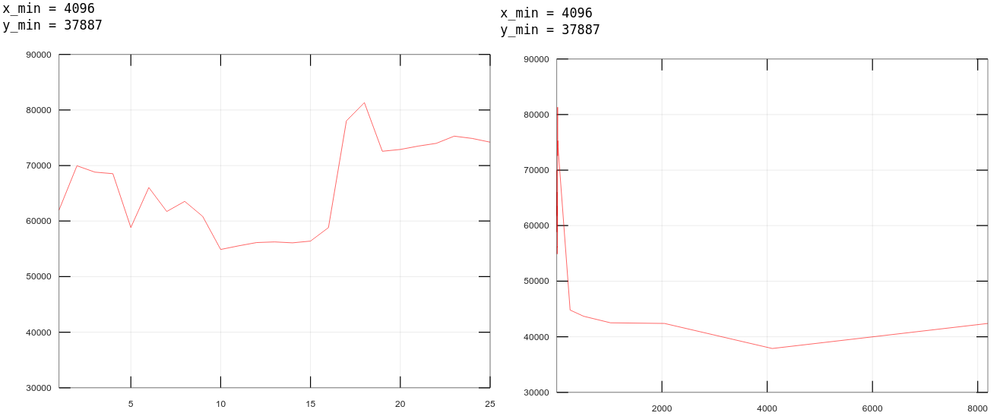

# Введение

Цель работы: исследовать управление файловой системой с
помощью Win32 API.

Задания:

1) Управление дисками, каталогами и файлами. Создайте консольное приложение с меню (каждая выполняемая функция и/или операция должна быть доступна по отдельному пункту меню), которое выполняет:

- вывод списка дисков (функции Win32 API – GetLogicalDrives, GetLogicalDriveStrings);

- для одного из выбранных дисков вывод информации о диске и размер свободного пространства (функции Win32 API – GetDriveType, GetVolumeInformation, GetDiskFreeSpace);

- создание и удаление заданных каталогов (функции Win32 API – CreateDirectory, RemoveDirectory);

- создание файлов в новых каталогах (функция Win32 API – CreateFile)

- копирование и перемещение файлов между каталогами с возможностью выявления попытки работы с файлами, имеющими совпадающие имена (функции Win32 API – CopyFile, MoveFile, MoveFileEx);

- анализ и изменение атрибутов файлов (функции Win32 API – GetFileAttributes, SetFileAttributes, GetFileInformationByHandle, GetFileTime, SetFileTime).

2) Копирование файла с помощью операций перекрывающегося ввода-вывода. Приложение должно копировать существующий файл в новый файл, «одновременно» выполняя n перекрывающихся операций ввода-вывода (механизм APC) блоками данных кратными размеру кластера.

Исходный код доступен в [этом репозитории](https://github.com/The220th/etu2021_OC): https://github.com/The220th/etu2021_OC

# Управление дисками, каталогами и файлами

В ходе выполнения лабораторной работы была написана программа, которая выполняет поставленные задачи. Пример меню программы приведён на рисунке 1.


<center>Рисунок 1 - меню программы</center>

Выбрав первый пункт меню, можно увидеть доступные устройства. Пример выбора пункта меню 1 приведён на рисунке 2.


<center>Рисунок 2 - пример списка доступных устройств</center>

То же самое показывает и проводник Windows (см. рисунок 3).


<center>Рисунок 3 - пример окна проводника Windows</center>

Чтобы узнать информацию о диске, нужно выбрать пункт меню 2 и вести индекс диска. Пример таких действий изображён на рисунке 4.


<center>Рисунок 4 - пример второго пункта меню</center>

С помощью пунктов меню 3 и 4 можно создать и удалить директорию. Пример создания и удаления директории показано на рисунке 5.


<center>Рисунок 5 - пример создания и удаления директории</center>

С помощью пунктов меню 5, 6 и 7 можно создать файл, переместить его и скопировать соответственно. Пример выполнения этих операций приведён на рисунках 6 и 7.


<center>Рисунок 6 - пример создания и перемещения файла</center>


<center>Рисунок 7 - пример копирования файла</center>

Чтобы просмотреть установленные атрибуты файла можно воспользоваться пунктом 8, а если нужна подробная информация о файле, то можно воспользоваться пунктом 9. Также, выбрав пункт 11, можно просмотреть временные метки у файла. Пример этих действий приведён на рисунках 8, 9 и 10 соответственно.


<center>Рисунок 8 - пример просмотра атрибутов файла</center>


<center>Рисунок 9 - пример просмотра информации о файле</center>


<center>Рисунок 10 - пример просмотра временных меток</center>

С помощью пункта 10 можно менять атрибуты файла. Пример изменения атрибутов показан на рисунке 11.


<center>Рисунок 11 - пример изменения атрибутов файла</center>

Чтобы поменять временную метку файла, нужно воспользоваться пунктом 12. Пример изменения временной метки приведён на рисунке 12. Смотря на рисунки 9 и 10, можно убедиться, что временные метки файла "Makefile" скопировались файлу "testFile".


<center>Рисунок 12 - пример изменения временной метки</center>

Чтобы выйти из программы можно воспользоваться пунктом меню 0 (см. рисунок 13).


<center>Рисунок 13 - пример выхода из программы</center>

Исходный код программы доступен [здесь](https://github.com/The220th/etu2021_OC/tree/main/lab1/work1): https://github.com/The220th/etu2021_OC/tree/main/lab1/work1.

# Копирование файла с помощью операций перекрывающегося ввода-вывода

В ходе выполнения лабораторной работы была написана программа, которая асинхронно копирует файл. После её написания были проведены замеры времени копирования: 
1. Когда постоянно кол-во перекрывающихся операций ввода-вывода (1 штука), но меняется размер копируемого блока
1. Когда постоянен размер копируемого блока, но меняется кол-во перекрывающихся операций ввода-вывода.

В замерах используются такие обозначения как "bs" и "thNum". Под "bs" подразумевается размер копируемого блока, а под "thNum" - количество перекрывающихся операций ввода-вывода.

Замеры были проведены на разных ПК с разными характеристиками аппаратной конфигурации. Протоколы программы приведены в Приложении А и в Приложении Б.

## Замер времени с изменяющимся копируемым блоком данных

Первый замер (см. Приложении А). Копировался файл размером 1.5 ГБ. График зависимости времени от блока копируемых данных приведён на рисунке 14.


<center>Рисунок 14 - замер 1 с изменяющимся копируемым блоком данных</center>

Второй замер (см. Приложении А). Копировался файл размером 1.5 ГБ. График зависимости времени от блока копируемых данных приведён на рисунке 15.


<center>Рисунок 15 - замер 2 с изменяющимся копируемым блоком данных</center>

Третий замер (см. Приложении А). Копировался файл размером 191 МБ. График зависимости времени от блока копируемых данных приведён на рисунке 16.


<center>Рисунок 16 - замер 3 с изменяющимся копируемым блоком данных</center>

Можно заметить, что график похож на экспоненту в степени минус x. То есть в какой-то момент времени скорость уже будет слабо зависеть от блока копируемых данных. Также необходимо учесть, что ПК во время замеров мог быть нагружен в неопределённый момент времени, и поэтому на графике можно заметить "впадины".

## Замер времени с изменяющимся количеством перекрывающихся операций ввода-вывода

Первый замер (см. Приложении Б). Копировался файл размером 477 МБ. График зависимости времени от блока копируемых данных приведён на рисунке 17.



<center>Рисунок 17 - замер 1 с изменяющимся количеством операций в-в</center>

Второй замер (см. Приложении Б). Копировался файл размером 477 МБ. График зависимости времени от блока копируемых данных приведён на рисунке 18.


<center>Рисунок 18 - замер 2 с изменяющимся количеством операций в-в</center>

Третий замер (см. Приложении Б). Копировался файл размером 1.5 ГБ. График зависимости времени от блока копируемых данных приведён на рисунке 19.


<center>Рисунок 19 - замер 3 с изменяющимся количеством операций в-в</center>

Четвёртый замер (см. Приложении Б). Копировался файл размером 191 МБ. График зависимости времени от блока копируемых данных приведён на рисунке 20.


<center>Рисунок 20 - замер 4 с изменяющимся количеством операций в-в</center>

Можно заметить, что в какой-то момент времени скорость уже будет слабо зависеть от количества перекрывающихся операций ввода-вывода. В зависимости от ПК оптимальное количество операций в-в будет разным. Например, для замера 3, можно сказать, что оптимальное количество около 8 операций. А если задать их слишком много при относительно небольшом размере файла, то копирование будет производиться только медленнее. Также необходимо учесть, что ПК во время замеров мог быть нагружен в неопределённый момент времени, и поэтому на графике можно заметить "горки".

Исходный код программы доступен [здесь](https://github.com/The220th/etu2021_OC/tree/main/lab1/work2): https://github.com/The220th/etu2021_OC/tree/main/lab1/work2.

# Вывод

В ходе выполнения лабораторной работы были изучены некоторые API Windows для работы с файловой системой. С помощью API Windows было реализовано: просмотр информации о дисках, создание и удаление директорий, создание и открытие, перемещение и копирования файлов, просмотр и изменение их атрибутов и временных меток. Также был изучен способ асинхронного копирования файлов и проведены замеры. 

# Приложение А

Замер 1. Размер файла 1610612739 байт (1.5 ГБ):

``` bash
D:\git\lab1\work2>lab1.2.exe in 1610612739 out
Generating file with random bytes (length=1610612739): "in"...
bytes=1610612739 8
Generating done.
Hash of the file "in" is "d83f72f0245244a77feb2bd2f406ede7".
Drive sector size: 512 bytes.
Drive cluster size: 8 sectors (4096 bytes).

bs = 512 (1*512), thNum = 1, time = 689131. Hash of result file = "d83f72f0245244a77feb2bd2f406ede7".
bs = 1024 (2*512), thNum = 1, time = 350322. Hash of result file = "d83f72f0245244a77feb2bd2f406ede7".
bs = 1536 (3*512), thNum = 1, time = 238125. Hash of result file = "d83f72f0245244a77feb2bd2f406ede7".
bs = 2048 (4*512), thNum = 1, time = 167881. Hash of result file = "d83f72f0245244a77feb2bd2f406ede7".
bs = 2560 (5*512), thNum = 1, time = 141046. Hash of result file = "d83f72f0245244a77feb2bd2f406ede7".
bs = 3072 (6*512), thNum = 1, time = 118004. Hash of result file = "d83f72f0245244a77feb2bd2f406ede7".
bs = 3584 (7*512), thNum = 1, time = 103855. Hash of result file = "d83f72f0245244a77feb2bd2f406ede7".
bs = 4096 (8*512), thNum = 1, time = 84770. Hash of result file = "d83f72f0245244a77feb2bd2f406ede7".
bs = 4608 (9*512), thNum = 1, time = 83622. Hash of result file = "d83f72f0245244a77feb2bd2f406ede7".
bs = 5120 (10*512), thNum = 1, time = 76631. Hash of result file = "d83f72f0245244a77feb2bd2f406ede7".
bs = 5632 (11*512), thNum = 1, time = 71824. Hash of result file = "d83f72f0245244a77feb2bd2f406ede7".
bs = 6144 (12*512), thNum = 1, time = 63915. Hash of result file = "d83f72f0245244a77feb2bd2f406ede7".
bs = 6656 (13*512), thNum = 1, time = 64533. Hash of result file = "d83f72f0245244a77feb2bd2f406ede7".
bs = 7168 (14*512), thNum = 1, time = 59664. Hash of result file = "d83f72f0245244a77feb2bd2f406ede7".
bs = 7680 (15*512), thNum = 1, time = 58313. Hash of result file = "d83f72f0245244a77feb2bd2f406ede7".
bs = 8192 (16*512), thNum = 1, time = 48461. Hash of result file = "d83f72f0245244a77feb2bd2f406ede7".
bs = 8704 (17*512), thNum = 1, time = 52863. Hash of result file = "d83f72f0245244a77feb2bd2f406ede7".
bs = 9216 (18*512), thNum = 1, time = 49524. Hash of result file = "d83f72f0245244a77feb2bd2f406ede7".
bs = 9728 (19*512), thNum = 1, time = 59788. Hash of result file = "d83f72f0245244a77feb2bd2f406ede7".
bs = 10240 (20*512), thNum = 1, time = 43781. Hash of result file = "d83f72f0245244a77feb2bd2f406ede7".
bs = 10752 (21*512), thNum = 1, time = 44750. Hash of result file = "d83f72f0245244a77feb2bd2f406ede7".
bs = 11264 (22*512), thNum = 1, time = 43448. Hash of result file = "d83f72f0245244a77feb2bd2f406ede7".
bs = 11776 (23*512), thNum = 1, time = 42367. Hash of result file = "d83f72f0245244a77feb2bd2f406ede7".
bs = 12288 (24*512), thNum = 1, time = 36826. Hash of result file = "d83f72f0245244a77feb2bd2f406ede7".
bs = 12800 (25*512), thNum = 1, time = 40450. Hash of result file = "d83f72f0245244a77feb2bd2f406ede7".
bs = 13312 (26*512), thNum = 1, time = 39011. Hash of result file = "d83f72f0245244a77feb2bd2f406ede7".
bs = 13824 (27*512), thNum = 1, time = 39125. Hash of result file = "d83f72f0245244a77feb2bd2f406ede7".
bs = 14336 (28*512), thNum = 1, time = 37311. Hash of result file = "d83f72f0245244a77feb2bd2f406ede7".
bs = 14848 (29*512), thNum = 1, time = 38642. Hash of result file = "d83f72f0245244a77feb2bd2f406ede7".
bs = 15360 (30*512), thNum = 1, time = 38477. Hash of result file = "d83f72f0245244a77feb2bd2f406ede7".
bs = 15872 (31*512), thNum = 1, time = 38528. Hash of result file = "d83f72f0245244a77feb2bd2f406ede7".
bs = 16384 (32*512), thNum = 1, time = 34050. Hash of result file = "d83f72f0245244a77feb2bd2f406ede7".
bs = 16896 (33*512), thNum = 1, time = 38418. Hash of result file = "d83f72f0245244a77feb2bd2f406ede7".
bs = 17408 (34*512), thNum = 1, time = 38709. Hash of result file = "d83f72f0245244a77feb2bd2f406ede7".
bs = 17920 (35*512), thNum = 1, time = 36802. Hash of result file = "d83f72f0245244a77feb2bd2f406ede7".
bs = 18432 (36*512), thNum = 1, time = 35466. Hash of result file = "d83f72f0245244a77feb2bd2f406ede7".
bs = 18944 (37*512), thNum = 1, time = 37353. Hash of result file = "d83f72f0245244a77feb2bd2f406ede7".
bs = 19456 (38*512), thNum = 1, time = 36439. Hash of result file = "d83f72f0245244a77feb2bd2f406ede7".
bs = 19968 (39*512), thNum = 1, time = 35943. Hash of result file = "d83f72f0245244a77feb2bd2f406ede7".
bs = 20480 (40*512), thNum = 1, time = 33098. Hash of result file = "d83f72f0245244a77feb2bd2f406ede7".
bs = 20992 (41*512), thNum = 1, time = 36527. Hash of result file = "d83f72f0245244a77feb2bd2f406ede7".
bs = 21504 (42*512), thNum = 1, time = 34892. Hash of result file = "d83f72f0245244a77feb2bd2f406ede7".
bs = 22016 (43*512), thNum = 1, time = 35089. Hash of result file = "d83f72f0245244a77feb2bd2f406ede7".
bs = 22528 (44*512), thNum = 1, time = 36379. Hash of result file = "d83f72f0245244a77feb2bd2f406ede7".
bs = 23040 (45*512), thNum = 1, time = 34806. Hash of result file = "d83f72f0245244a77feb2bd2f406ede7".
bs = 23552 (46*512), thNum = 1, time = 37073. Hash of result file = "d83f72f0245244a77feb2bd2f406ede7".
bs = 24064 (47*512), thNum = 1, time = 34938. Hash of result file = "d83f72f0245244a77feb2bd2f406ede7".
bs = 24576 (48*512), thNum = 1, time = 32231. Hash of result file = "d83f72f0245244a77feb2bd2f406ede7".
bs = 25088 (49*512), thNum = 1, time = 35393. Hash of result file = "d83f72f0245244a77feb2bd2f406ede7".
bs = 25600 (50*512), thNum = 1, time = 35774. Hash of result file = "d83f72f0245244a77feb2bd2f406ede7".
bs = 26112 (51*512), thNum = 1, time = 34800. Hash of result file = "d83f72f0245244a77feb2bd2f406ede7".
bs = 26624 (52*512), thNum = 1, time = 34842. Hash of result file = "d83f72f0245244a77feb2bd2f406ede7".
bs = 27136 (53*512), thNum = 1, time = 34252. Hash of result file = "d83f72f0245244a77feb2bd2f406ede7".
bs = 27648 (54*512), thNum = 1, time = 34607. Hash of result file = "d83f72f0245244a77feb2bd2f406ede7".
bs = 28160 (55*512), thNum = 1, time = 34963. Hash of result file = "d83f72f0245244a77feb2bd2f406ede7".
bs = 28672 (56*512), thNum = 1, time = 31877. Hash of result file = "d83f72f0245244a77feb2bd2f406ede7".
bs = 29184 (57*512), thNum = 1, time = 34296. Hash of result file = "d83f72f0245244a77feb2bd2f406ede7".
bs = 29696 (58*512), thNum = 1, time = 34126. Hash of result file = "d83f72f0245244a77feb2bd2f406ede7".
bs = 30208 (59*512), thNum = 1, time = 34213. Hash of result file = "d83f72f0245244a77feb2bd2f406ede7".
bs = 30720 (60*512), thNum = 1, time = 33917. Hash of result file = "d83f72f0245244a77feb2bd2f406ede7".
bs = 31232 (61*512), thNum = 1, time = 33597. Hash of result file = "d83f72f0245244a77feb2bd2f406ede7".
bs = 31744 (62*512), thNum = 1, time = 33666. Hash of result file = "d83f72f0245244a77feb2bd2f406ede7".
bs = 32256 (63*512), thNum = 1, time = 34871. Hash of result file = "d83f72f0245244a77feb2bd2f406ede7".
bs = 32768 (64*512), thNum = 1, time = 31114. Hash of result file = "d83f72f0245244a77feb2bd2f406ede7".
bs = 33280 (65*512), thNum = 1, time = 33543. Hash of result file = "d83f72f0245244a77feb2bd2f406ede7".
bs = 33792 (66*512), thNum = 1, time = 34363. Hash of result file = "d83f72f0245244a77feb2bd2f406ede7".
bs = 34304 (67*512), thNum = 1, time = 34523. Hash of result file = "d83f72f0245244a77feb2bd2f406ede7".
bs = 34816 (68*512), thNum = 1, time = 33371. Hash of result file = "d83f72f0245244a77feb2bd2f406ede7".
bs = 35328 (69*512), thNum = 1, time = 34062. Hash of result file = "d83f72f0245244a77feb2bd2f406ede7".
bs = 35840 (70*512), thNum = 1, time = 33824. Hash of result file = "d83f72f0245244a77feb2bd2f406ede7".
Code for MatLab:

function res = showPlot()

polX = [1, 2, 3, 4, 5, 6, 7, 8, 9, 10, 11, 12, 13, 14, 15, 16, 17, 18, 19, 20, 21, 22, 23, 24, 25, 26, 27, 28, 29, 30, 31, 32, 33, 34, 35, 36, 37, 38, 39, 40, 41, 42, 43, 44, 45, 46, 47, 48, 49, 50, 51, 52, 53, 54, 55, 56, 57, 58, 59, 60, 61, 62, 63, 64, 65, 66, 67, 68, 69, 70];
polY = [689131, 350322, 238125, 167881, 141046, 118004, 103855, 84770, 83622, 76631, 71824, 63915, 64533, 59664, 58313, 48461, 52863, 49524, 59788, 43781, 44750, 43448, 42367, 36826, 40450, 39011, 39125, 37311, 38642, 38477, 38528, 34050, 38418, 38709, 36802, 35466, 37353, 36439, 35943, 33098, 36527, 34892, 35089, 36379, 34806, 37073, 34938, 32231, 35393, 35774, 34800, 34842, 34252, 34607, 34963, 31877, 34296, 34126, 34213, 33917, 33597, 33666, 34871, 31114, 33543, 34363, 34523, 33371, 34062, 33824];

plot(polX, polY, 'r');
grid on;
xlim([1 70]);

[mini, nmin] = min(polY);
x_min = polX(nmin)
y_min = mini
```

Замер 2. Размер файла 500000007 байт (477 МБ):

``` bash
D:\git\etu2021_OC-main\lab1\work2>lab1.2.exe in 500000007 out
Generating file with random bytes (length=500000007): "in"...
Generating done.
Hash of the file "in" is "8ad3c224670b521ebe04e5243b1a27dd".
Drive sector size: 512 bytes.
Drive cluster size: 8 sectors (4096 bytes).

bs = 512 B (1*512), thNum = 1, time = 205657. Hash of result file = "8ad3c224670b521ebe04e5243b1a27dd".
bs = 1024 B (2*512), thNum = 1, time = 102225. Hash of result file = "8ad3c224670b521ebe04e5243b1a27dd".
bs = 1536 B (3*512), thNum = 1, time = 72606. Hash of result file = "8ad3c224670b521ebe04e5243b1a27dd".
bs = 2048 B (4*512), thNum = 1, time = 51296. Hash of result file = "8ad3c224670b521ebe04e5243b1a27dd".
bs = 2560 B (5*512), thNum = 1, time = 43784. Hash of result file = "8ad3c224670b521ebe04e5243b1a27dd".
bs = 3072 B (6*512), thNum = 1, time = 35982. Hash of result file = "8ad3c224670b521ebe04e5243b1a27dd".
bs = 3584 B (7*512), thNum = 1, time = 32094. Hash of result file = "8ad3c224670b521ebe04e5243b1a27dd".
bs = 4096 B (8*512), thNum = 1, time = 25963. Hash of result file = "8ad3c224670b521ebe04e5243b1a27dd".
bs = 4608 B (9*512), thNum = 1, time = 25650. Hash of result file = "8ad3c224670b521ebe04e5243b1a27dd".
bs = 5120 B (10*512), thNum = 1, time = 22988. Hash of result file = "8ad3c224670b521ebe04e5243b1a27dd".
bs = 5632 B (11*512), thNum = 1, time = 21977. Hash of result file = "8ad3c224670b521ebe04e5243b1a27dd".
bs = 6144 B (12*512), thNum = 1, time = 19119. Hash of result file = "8ad3c224670b521ebe04e5243b1a27dd".
bs = 6656 B (13*512), thNum = 1, time = 19162. Hash of result file = "8ad3c224670b521ebe04e5243b1a27dd".
bs = 7168 B (14*512), thNum = 1, time = 18076. Hash of result file = "8ad3c224670b521ebe04e5243b1a27dd".
bs = 7680 B (15*512), thNum = 1, time = 17210. Hash of result file = "8ad3c224670b521ebe04e5243b1a27dd".
bs = 8192 B (16*512), thNum = 1, time = 14408. Hash of result file = "8ad3c224670b521ebe04e5243b1a27dd".
bs = 8704 B (17*512), thNum = 1, time = 15865. Hash of result file = "8ad3c224670b521ebe04e5243b1a27dd".
bs = 9216 B (18*512), thNum = 1, time = 16502. Hash of result file = "8ad3c224670b521ebe04e5243b1a27dd".
bs = 9728 B (19*512), thNum = 1, time = 14285. Hash of result file = "8ad3c224670b521ebe04e5243b1a27dd".
bs = 10240 B (20*512), thNum = 1, time = 12935. Hash of result file = "8ad3c224670b521ebe04e5243b1a27dd".
bs = 10752 B (21*512), thNum = 1, time = 15117. Hash of result file = "8ad3c224670b521ebe04e5243b1a27dd".
bs = 11264 B (22*512), thNum = 1, time = 12344. Hash of result file = "8ad3c224670b521ebe04e5243b1a27dd".
bs = 11776 B (23*512), thNum = 1, time = 12235. Hash of result file = "8ad3c224670b521ebe04e5243b1a27dd".
bs = 12288 B (24*512), thNum = 1, time = 10553. Hash of result file = "8ad3c224670b521ebe04e5243b1a27dd".
bs = 12800 B (25*512), thNum = 1, time = 11593. Hash of result file = "8ad3c224670b521ebe04e5243b1a27dd".
bs = 13312 B (26*512), thNum = 1, time = 11980. Hash of result file = "8ad3c224670b521ebe04e5243b1a27dd".
bs = 13824 B (27*512), thNum = 1, time = 12858. Hash of result file = "8ad3c224670b521ebe04e5243b1a27dd".
bs = 14336 B (28*512), thNum = 1, time = 11274. Hash of result file = "8ad3c224670b521ebe04e5243b1a27dd".
bs = 14848 B (29*512), thNum = 1, time = 11391. Hash of result file = "8ad3c224670b521ebe04e5243b1a27dd".
bs = 15360 B (30*512), thNum = 1, time = 10886. Hash of result file = "8ad3c224670b521ebe04e5243b1a27dd".
bs = 15872 B (31*512), thNum = 1, time = 11099. Hash of result file = "8ad3c224670b521ebe04e5243b1a27dd".
bs = 16384 B (32*512), thNum = 1, time = 9776. Hash of result file = "8ad3c224670b521ebe04e5243b1a27dd".
bs = 16896 B (33*512), thNum = 1, time = 10961. Hash of result file = "8ad3c224670b521ebe04e5243b1a27dd".
bs = 17408 B (34*512), thNum = 1, time = 10444. Hash of result file = "8ad3c224670b521ebe04e5243b1a27dd".
bs = 17920 B (35*512), thNum = 1, time = 10765. Hash of result file = "8ad3c224670b521ebe04e5243b1a27dd".
bs = 18432 B (36*512), thNum = 1, time = 10198. Hash of result file = "8ad3c224670b521ebe04e5243b1a27dd".
bs = 18944 B (37*512), thNum = 1, time = 10653. Hash of result file = "8ad3c224670b521ebe04e5243b1a27dd".
bs = 19456 B (38*512), thNum = 1, time = 10508. Hash of result file = "8ad3c224670b521ebe04e5243b1a27dd".
bs = 19968 B (39*512), thNum = 1, time = 10938. Hash of result file = "8ad3c224670b521ebe04e5243b1a27dd".
bs = 20480 B (40*512), thNum = 1, time = 9374. Hash of result file = "8ad3c224670b521ebe04e5243b1a27dd".
bs = 20992 B (41*512), thNum = 1, time = 10586. Hash of result file = "8ad3c224670b521ebe04e5243b1a27dd".
bs = 21504 B (42*512), thNum = 1, time = 9932. Hash of result file = "8ad3c224670b521ebe04e5243b1a27dd".
bs = 22016 B (43*512), thNum = 1, time = 10344. Hash of result file = "8ad3c224670b521ebe04e5243b1a27dd".
bs = 22528 B (44*512), thNum = 1, time = 9857. Hash of result file = "8ad3c224670b521ebe04e5243b1a27dd".
bs = 23040 B (45*512), thNum = 1, time = 10235. Hash of result file = "8ad3c224670b521ebe04e5243b1a27dd".
bs = 23552 B (46*512), thNum = 1, time = 9741. Hash of result file = "8ad3c224670b521ebe04e5243b1a27dd".
bs = 24064 B (47*512), thNum = 1, time = 10244. Hash of result file = "8ad3c224670b521ebe04e5243b1a27dd".
bs = 24576 B (48*512), thNum = 1, time = 9179. Hash of result file = "8ad3c224670b521ebe04e5243b1a27dd".
bs = 25088 B (49*512), thNum = 1, time = 10215. Hash of result file = "8ad3c224670b521ebe04e5243b1a27dd".
bs = 25600 B (50*512), thNum = 1, time = 9796. Hash of result file = "8ad3c224670b521ebe04e5243b1a27dd".
bs = 26112 B (51*512), thNum = 1, time = 10542. Hash of result file = "8ad3c224670b521ebe04e5243b1a27dd".
bs = 26624 B (52*512), thNum = 1, time = 9633. Hash of result file = "8ad3c224670b521ebe04e5243b1a27dd".
bs = 27136 B (53*512), thNum = 1, time = 10039. Hash of result file = "8ad3c224670b521ebe04e5243b1a27dd".
bs = 27648 B (54*512), thNum = 1, time = 9731. Hash of result file = "8ad3c224670b521ebe04e5243b1a27dd".
bs = 28160 B (55*512), thNum = 1, time = 9997. Hash of result file = "8ad3c224670b521ebe04e5243b1a27dd".
bs = 28672 B (56*512), thNum = 1, time = 8894. Hash of result file = "8ad3c224670b521ebe04e5243b1a27dd".
bs = 29184 B (57*512), thNum = 1, time = 10018. Hash of result file = "8ad3c224670b521ebe04e5243b1a27dd".
bs = 29696 B (58*512), thNum = 1, time = 9500. Hash of result file = "8ad3c224670b521ebe04e5243b1a27dd".
bs = 30208 B (59*512), thNum = 1, time = 9783. Hash of result file = "8ad3c224670b521ebe04e5243b1a27dd".
bs = 30720 B (60*512), thNum = 1, time = 9834. Hash of result file = "8ad3c224670b521ebe04e5243b1a27dd".
bs = 31232 B (61*512), thNum = 1, time = 9987. Hash of result file = "8ad3c224670b521ebe04e5243b1a27dd".
bs = 31744 B (62*512), thNum = 1, time = 9635. Hash of result file = "8ad3c224670b521ebe04e5243b1a27dd".
bs = 32256 B (63*512), thNum = 1, time = 10018. Hash of result file = "8ad3c224670b521ebe04e5243b1a27dd".
bs = 32768 B (64*512), thNum = 1, time = 8963. Hash of result file = "8ad3c224670b521ebe04e5243b1a27dd".
bs = 33280 B (65*512), thNum = 1, time = 11900. Hash of result file = "8ad3c224670b521ebe04e5243b1a27dd".
bs = 33792 B (66*512), thNum = 1, time = 9623. Hash of result file = "8ad3c224670b521ebe04e5243b1a27dd".
bs = 34304 B (67*512), thNum = 1, time = 9624. Hash of result file = "8ad3c224670b521ebe04e5243b1a27dd".
bs = 34816 B (68*512), thNum = 1, time = 9813. Hash of result file = "8ad3c224670b521ebe04e5243b1a27dd".
bs = 35328 B (69*512), thNum = 1, time = 10008. Hash of result file = "8ad3c224670b521ebe04e5243b1a27dd".
bs = 35840 B (70*512), thNum = 1, time = 9778. Hash of result file = "8ad3c224670b521ebe04e5243b1a27dd".
Code for MatLab:

function res = showPlot()

polX = [1, 2, 3, 4, 5, 6, 7, 8, 9, 10, 11, 12, 13, 14, 15, 16, 17, 18, 19, 20, 21, 22, 23, 24, 25, 26, 27, 28, 29, 30, 31, 32, 33, 34, 35, 36, 37, 38, 39, 40, 41, 42, 43, 44, 45, 46, 47, 48, 49, 50, 51, 52, 53, 54, 55, 56, 57, 58, 59, 60, 61, 62, 63, 64, 65, 66, 67, 68, 69, 70];
polY = [205657, 102225, 72606, 51296, 43784, 35982, 32094, 25963, 25650, 22988, 21977, 19119, 19162, 18076, 17210, 14408, 15865, 16502, 14285, 12935, 15117, 12344, 12235, 10553, 11593, 11980, 12858, 11274, 11391, 10886, 11099, 9776, 10961, 10444, 10765, 10198, 10653, 10508, 10938, 9374, 10586, 9932, 10344, 9857, 10235, 9741, 10244, 9179, 10215, 9796, 10542, 9633, 10039, 9731, 9997, 8894, 10018, 9500, 9783, 9834, 9987, 9635, 10018, 8963, 11900, 9623, 9624, 9813, 10008, 9778];

plot(polX, polY, 'r');
grid on;
xlim([1 70]);

[mini, nmin] = min(polY);
x_min = polX(nmin)
y_min = mini
```

Замер 3. Размер файла 200010003 байт (191 МБ):

``` bash
C:\Users\User\Desktop\etu2021_OC-main\lab1\work2>lab1.2.exe in 200010003 out
Generating file with random bytes (length=200010003): "in"...
Generating done.
Hash of the file "in" is "7ec4c448a14d2cd03f3df6d112084318".
Drive sector size: 512 bytes.
Drive cluster size: 8 sectors (4096 bytes).

bs = 512 B (1*512), thNum = 1, time = 111714. Hash of result file = "7ec4c448a14d2cd03f3df6d112084318".
bs = 1024 B (2*512), thNum = 1, time = 58678. Hash of result file = "7ec4c448a14d2cd03f3df6d112084318".
bs = 1536 B (3*512), thNum = 1, time = 40325. Hash of result file = "7ec4c448a14d2cd03f3df6d112084318".
bs = 2048 B (4*512), thNum = 1, time = 31636. Hash of result file = "7ec4c448a14d2cd03f3df6d112084318".
bs = 2560 B (5*512), thNum = 1, time = 25392. Hash of result file = "7ec4c448a14d2cd03f3df6d112084318".
bs = 3072 B (6*512), thNum = 1, time = 21251. Hash of result file = "7ec4c448a14d2cd03f3df6d112084318".
bs = 3584 B (7*512), thNum = 1, time = 18980. Hash of result file = "7ec4c448a14d2cd03f3df6d112084318".
bs = 4096 B (8*512), thNum = 1, time = 13339. Hash of result file = "7ec4c448a14d2cd03f3df6d112084318".
bs = 4608 B (9*512), thNum = 1, time = 15890. Hash of result file = "7ec4c448a14d2cd03f3df6d112084318".
bs = 5120 B (10*512), thNum = 1, time = 14309. Hash of result file = "7ec4c448a14d2cd03f3df6d112084318".
bs = 5632 B (11*512), thNum = 1, time = 13625. Hash of result file = "7ec4c448a14d2cd03f3df6d112084318".
bs = 6144 B (12*512), thNum = 1, time = 12358. Hash of result file = "7ec4c448a14d2cd03f3df6d112084318".
bs = 6656 B (13*512), thNum = 1, time = 12469. Hash of result file = "7ec4c448a14d2cd03f3df6d112084318".
bs = 7168 B (14*512), thNum = 1, time = 11251. Hash of result file = "7ec4c448a14d2cd03f3df6d112084318".
bs = 7680 B (15*512), thNum = 1, time = 11115. Hash of result file = "7ec4c448a14d2cd03f3df6d112084318".
bs = 8192 B (16*512), thNum = 1, time = 8317. Hash of result file = "7ec4c448a14d2cd03f3df6d112084318".
bs = 8704 B (17*512), thNum = 1, time = 10694. Hash of result file = "7ec4c448a14d2cd03f3df6d112084318".
bs = 9216 B (18*512), thNum = 1, time = 9688. Hash of result file = "7ec4c448a14d2cd03f3df6d112084318".
bs = 9728 B (19*512), thNum = 1, time = 9786. Hash of result file = "7ec4c448a14d2cd03f3df6d112084318".
bs = 10240 B (20*512), thNum = 1, time = 9135. Hash of result file = "7ec4c448a14d2cd03f3df6d112084318".
bs = 10752 B (21*512), thNum = 1, time = 9115. Hash of result file = "7ec4c448a14d2cd03f3df6d112084318".
bs = 11264 B (22*512), thNum = 1, time = 8288. Hash of result file = "7ec4c448a14d2cd03f3df6d112084318".
bs = 11776 B (23*512), thNum = 1, time = 8430. Hash of result file = "7ec4c448a14d2cd03f3df6d112084318".
bs = 12288 B (24*512), thNum = 1, time = 6834. Hash of result file = "7ec4c448a14d2cd03f3df6d112084318".
bs = 12800 B (25*512), thNum = 1, time = 7788. Hash of result file = "7ec4c448a14d2cd03f3df6d112084318".
bs = 13312 B (26*512), thNum = 1, time = 7842. Hash of result file = "7ec4c448a14d2cd03f3df6d112084318".
bs = 13824 B (27*512), thNum = 1, time = 7851. Hash of result file = "7ec4c448a14d2cd03f3df6d112084318".
bs = 14336 B (28*512), thNum = 1, time = 7772. Hash of result file = "7ec4c448a14d2cd03f3df6d112084318".
bs = 14848 B (29*512), thNum = 1, time = 7311. Hash of result file = "7ec4c448a14d2cd03f3df6d112084318".
bs = 15360 B (30*512), thNum = 1, time = 7330. Hash of result file = "7ec4c448a14d2cd03f3df6d112084318".
bs = 15872 B (31*512), thNum = 1, time = 7396. Hash of result file = "7ec4c448a14d2cd03f3df6d112084318".
bs = 16384 B (32*512), thNum = 1, time = 6371. Hash of result file = "7ec4c448a14d2cd03f3df6d112084318".
bs = 16896 B (33*512), thNum = 1, time = 7447. Hash of result file = "7ec4c448a14d2cd03f3df6d112084318".
bs = 17408 B (34*512), thNum = 1, time = 6790. Hash of result file = "7ec4c448a14d2cd03f3df6d112084318".
bs = 17920 B (35*512), thNum = 1, time = 7197. Hash of result file = "7ec4c448a14d2cd03f3df6d112084318".
bs = 18432 B (36*512), thNum = 1, time = 6892. Hash of result file = "7ec4c448a14d2cd03f3df6d112084318".
bs = 18944 B (37*512), thNum = 1, time = 6950. Hash of result file = "7ec4c448a14d2cd03f3df6d112084318".
bs = 19456 B (38*512), thNum = 1, time = 6874. Hash of result file = "7ec4c448a14d2cd03f3df6d112084318".
bs = 19968 B (39*512), thNum = 1, time = 6603. Hash of result file = "7ec4c448a14d2cd03f3df6d112084318".
bs = 20480 B (40*512), thNum = 1, time = 6095. Hash of result file = "7ec4c448a14d2cd03f3df6d112084318".
bs = 20992 B (41*512), thNum = 1, time = 6570. Hash of result file = "7ec4c448a14d2cd03f3df6d112084318".
bs = 21504 B (42*512), thNum = 1, time = 6686. Hash of result file = "7ec4c448a14d2cd03f3df6d112084318".
bs = 22016 B (43*512), thNum = 1, time = 6449. Hash of result file = "7ec4c448a14d2cd03f3df6d112084318".
bs = 22528 B (44*512), thNum = 1, time = 6283. Hash of result file = "7ec4c448a14d2cd03f3df6d112084318".
bs = 23040 B (45*512), thNum = 1, time = 6166. Hash of result file = "7ec4c448a14d2cd03f3df6d112084318".
bs = 23552 B (46*512), thNum = 1, time = 6151. Hash of result file = "7ec4c448a14d2cd03f3df6d112084318".
bs = 24064 B (47*512), thNum = 1, time = 6392. Hash of result file = "7ec4c448a14d2cd03f3df6d112084318".
bs = 24576 B (48*512), thNum = 1, time = 5609. Hash of result file = "7ec4c448a14d2cd03f3df6d112084318".
bs = 25088 B (49*512), thNum = 1, time = 6290. Hash of result file = "7ec4c448a14d2cd03f3df6d112084318".
bs = 25600 B (50*512), thNum = 1, time = 7307. Hash of result file = "7ec4c448a14d2cd03f3df6d112084318".
bs = 26112 B (51*512), thNum = 1, time = 6800. Hash of result file = "7ec4c448a14d2cd03f3df6d112084318".
bs = 26624 B (52*512), thNum = 1, time = 5881. Hash of result file = "7ec4c448a14d2cd03f3df6d112084318".
bs = 27136 B (53*512), thNum = 1, time = 5899. Hash of result file = "7ec4c448a14d2cd03f3df6d112084318".
bs = 27648 B (54*512), thNum = 1, time = 6329. Hash of result file = "7ec4c448a14d2cd03f3df6d112084318".
bs = 28160 B (55*512), thNum = 1, time = 6255. Hash of result file = "7ec4c448a14d2cd03f3df6d112084318".
bs = 28672 B (56*512), thNum = 1, time = 5829. Hash of result file = "7ec4c448a14d2cd03f3df6d112084318".
bs = 29184 B (57*512), thNum = 1, time = 6087. Hash of result file = "7ec4c448a14d2cd03f3df6d112084318".
bs = 29696 B (58*512), thNum = 1, time = 6267. Hash of result file = "7ec4c448a14d2cd03f3df6d112084318".
bs = 30208 B (59*512), thNum = 1, time = 5897. Hash of result file = "7ec4c448a14d2cd03f3df6d112084318".
bs = 30720 B (60*512), thNum = 1, time = 5823. Hash of result file = "7ec4c448a14d2cd03f3df6d112084318".
bs = 31232 B (61*512), thNum = 1, time = 6245. Hash of result file = "7ec4c448a14d2cd03f3df6d112084318".
bs = 31744 B (62*512), thNum = 1, time = 5962. Hash of result file = "7ec4c448a14d2cd03f3df6d112084318".
bs = 32256 B (63*512), thNum = 1, time = 5986. Hash of result file = "7ec4c448a14d2cd03f3df6d112084318".
bs = 32768 B (64*512), thNum = 1, time = 5827. Hash of result file = "7ec4c448a14d2cd03f3df6d112084318".
bs = 33280 B (65*512), thNum = 1, time = 5663. Hash of result file = "7ec4c448a14d2cd03f3df6d112084318".
bs = 33792 B (66*512), thNum = 1, time = 5676. Hash of result file = "7ec4c448a14d2cd03f3df6d112084318".
bs = 34304 B (67*512), thNum = 1, time = 5718. Hash of result file = "7ec4c448a14d2cd03f3df6d112084318".
bs = 34816 B (68*512), thNum = 1, time = 6070. Hash of result file = "7ec4c448a14d2cd03f3df6d112084318".
bs = 35328 B (69*512), thNum = 1, time = 5412. Hash of result file = "7ec4c448a14d2cd03f3df6d112084318".
bs = 35840 B (70*512), thNum = 1, time = 5847. Hash of result file = "7ec4c448a14d2cd03f3df6d112084318".
bs = 262144 B (512*512), thNum = 1, time = 4674. Hash of result file = "7ec4c448a14d2cd03f3df6d112084318".
bs = 524288 B (1024*512), thNum = 1, time = 4088. Hash of result file = "7ec4c448a14d2cd03f3df6d112084318".
bs = 1048576 B (2048*512), thNum = 1, time = 4586. Hash of result file = "7ec4c448a14d2cd03f3df6d112084318".
bs = 2097152 B (4096*512), thNum = 1, time = 3752. Hash of result file = "7ec4c448a14d2cd03f3df6d112084318".
bs = 4194304 B (8192*512), thNum = 1, time = 4650. Hash of result file = "7ec4c448a14d2cd03f3df6d112084318".
Code for MatLab:

function res = showPlot()

polX = [1, 2, 3, 4, 5, 6, 7, 8, 9, 10, 11, 12, 13, 14, 15, 16, 17, 18, 19, 20, 21, 22, 23, 24, 25, 26, 27, 28, 29, 30, 31, 32, 33, 34, 35, 36, 37, 38, 39, 40, 41, 42, 43, 44, 45, 46, 47, 48, 49, 50, 51, 52, 53, 54, 55, 56, 57, 58, 59, 60, 61, 62, 63, 64, 65, 66, 67, 68, 69, 70, 512, 1024, 2048, 4096, 8192];
polY = [111714, 58678, 40325, 31636, 25392, 21251, 18980, 13339, 15890, 14309, 13625, 12358, 12469, 11251, 11115, 8317, 10694, 9688, 9786, 9135, 9115, 8288, 8430, 6834, 7788, 7842, 7851, 7772, 7311, 7330, 7396, 6371, 7447, 6790, 7197, 6892, 6950, 6874, 6603, 6095, 6570, 6686, 6449, 6283, 6166, 6151, 6392, 5609, 6290, 7307, 6800, 5881, 5899, 6329, 6255, 5829, 6087, 6267, 5897, 5823, 6245, 5962, 5986, 5827, 5663, 5676, 5718, 6070, 5412, 5847, 4674, 4088, 4586, 3752, 4650];

plot(polX, polY, 'r');
grid on;
xlim([1 8192]);

[mini, nmin] = min(polY);
x_min = polX(nmin)
y_min = mini
```

# Приложение Б

Замер 1. Размер файла 500000007 байт (477 МБ):

``` bash
bs = 2048 (4*512), thNum = 1, time = 177381. Hash of result file = "d83f72f0245244a77feb2bd2f406ede7".
bs = 2048 (4*512), thNum = 2, time = 155503. Hash of result file = "d83f72f0245244a77feb2bd2f406ede7".
bs = 2048 (4*512), thNum = 3, time = 150902. Hash of result file = "d83f72f0245244a77feb2bd2f406ede7".
bs = 2048 (4*512), thNum = 4, time = 144694. Hash of result file = "d83f72f0245244a77feb2bd2f406ede7".
bs = 2048 (4*512), thNum = 5, time = 144585. Hash of result file = "d83f72f0245244a77feb2bd2f406ede7".
bs = 2048 (4*512), thNum = 6, time = 142797. Hash of result file = "d83f72f0245244a77feb2bd2f406ede7".
bs = 2048 (4*512), thNum = 7, time = 144935. Hash of result file = "d83f72f0245244a77feb2bd2f406ede7".
bs = 2048 (4*512), thNum = 8, time = 141149. Hash of result file = "d83f72f0245244a77feb2bd2f406ede7".
bs = 2048 (4*512), thNum = 9, time = 142350. Hash of result file = "d83f72f0245244a77feb2bd2f406ede7".
bs = 2048 (4*512), thNum = 10, time = 139177. Hash of result file = "d83f72f0245244a77feb2bd2f406ede7".
bs = 2048 (4*512), thNum = 11, time = 141569. Hash of result file = "d83f72f0245244a77feb2bd2f406ede7".
bs = 2048 (4*512), thNum = 12, time = 137285. Hash of result file = "d83f72f0245244a77feb2bd2f406ede7".
bs = 2048 (4*512), thNum = 13, time = 140620. Hash of result file = "d83f72f0245244a77feb2bd2f406ede7".
bs = 2048 (4*512), thNum = 14, time = 137183. Hash of result file = "d83f72f0245244a77feb2bd2f406ede7".
bs = 2048 (4*512), thNum = 15, time = 141514. Hash of result file = "d83f72f0245244a77feb2bd2f406ede7".
bs = 2048 (4*512), thNum = 16, time = 136642. Hash of result file = "d83f72f0245244a77feb2bd2f406ede7".
bs = 2048 (4*512), thNum = 17, time = 140843. Hash of result file = "d83f72f0245244a77feb2bd2f406ede7".
bs = 2048 (4*512), thNum = 18, time = 136694. Hash of result file = "d83f72f0245244a77feb2bd2f406ede7".
bs = 2048 (4*512), thNum = 19, time = 140464. Hash of result file = "d83f72f0245244a77feb2bd2f406ede7".
bs = 2048 (4*512), thNum = 20, time = 135893. Hash of result file = "d83f72f0245244a77feb2bd2f406ede7".
bs = 2048 (4*512), thNum = 21, time = 139204. Hash of result file = "d83f72f0245244a77feb2bd2f406ede7".
bs = 2048 (4*512), thNum = 22, time = 136669. Hash of result file = "d83f72f0245244a77feb2bd2f406ede7".
bs = 2048 (4*512), thNum = 23, time = 139640. Hash of result file = "d83f72f0245244a77feb2bd2f406ede7".
bs = 2048 (4*512), thNum = 24, time = 135572. Hash of result file = "d83f72f0245244a77feb2bd2f406ede7".
bs = 2048 (4*512), thNum = 25, time = 141525. Hash of result file = "d83f72f0245244a77feb2bd2f406ede7".
Code for MatLab:

function res = showPlot()

polX = [1, 2, 3, 4, 5, 6, 7, 8, 9, 10, 11, 12, 13, 14, 15, 16, 17, 18, 19, 20, 21, 22, 23, 24, 25];
polY = [177381, 155503, 150902, 144694, 144585, 142797, 144935, 141149, 142350, 139177, 141569, 137285, 140620, 137183, 141514, 136642, 140843, 136694, 140464, 135893, 139204, 136669, 139640, 135572, 141525];

plot(polX, polY, 'r');
grid on;
xlim([1 25]);

[mini, nmin] = min(polY);
x_min = polX(nmin)
y_min = mini
```

Замер 2. Размер файла 500000007 байт (477 МБ):

``` bash
D:\git\etu2021_OC-main\lab1\work2>lab1.2.exe in 500000007 out
Generating file with random bytes (length=500000007): "in"...
Generating done.
Hash of the file "in" is "8ad3c224670b521ebe04e5243b1a27dd".
Drive sector size: 512 bytes.
Drive cluster size: 8 sectors (4096 bytes).

bs = 8192 B (16*512), thNum = 1, time = 14599. Hash of result file = "8ad3c224670b521ebe04e5243b1a27dd".
bs = 8192 B (16*512), thNum = 2, time = 13474. Hash of result file = "8ad3c224670b521ebe04e5243b1a27dd".
bs = 8192 B (16*512), thNum = 3, time = 12999. Hash of result file = "8ad3c224670b521ebe04e5243b1a27dd".
bs = 8192 B (16*512), thNum = 4, time = 12808. Hash of result file = "8ad3c224670b521ebe04e5243b1a27dd".
bs = 8192 B (16*512), thNum = 5, time = 12775. Hash of result file = "8ad3c224670b521ebe04e5243b1a27dd".
bs = 8192 B (16*512), thNum = 6, time = 12770. Hash of result file = "8ad3c224670b521ebe04e5243b1a27dd".
bs = 8192 B (16*512), thNum = 7, time = 12543. Hash of result file = "8ad3c224670b521ebe04e5243b1a27dd".
bs = 8192 B (16*512), thNum = 8, time = 12880. Hash of result file = "8ad3c224670b521ebe04e5243b1a27dd".
bs = 8192 B (16*512), thNum = 9, time = 12425. Hash of result file = "8ad3c224670b521ebe04e5243b1a27dd".
bs = 8192 B (16*512), thNum = 10, time = 12572. Hash of result file = "8ad3c224670b521ebe04e5243b1a27dd".
bs = 8192 B (16*512), thNum = 11, time = 12213. Hash of result file = "8ad3c224670b521ebe04e5243b1a27dd".
bs = 8192 B (16*512), thNum = 12, time = 12710. Hash of result file = "8ad3c224670b521ebe04e5243b1a27dd".
bs = 8192 B (16*512), thNum = 13, time = 12851. Hash of result file = "8ad3c224670b521ebe04e5243b1a27dd".
bs = 8192 B (16*512), thNum = 14, time = 12389. Hash of result file = "8ad3c224670b521ebe04e5243b1a27dd".
bs = 8192 B (16*512), thNum = 15, time = 13128. Hash of result file = "8ad3c224670b521ebe04e5243b1a27dd".
bs = 8192 B (16*512), thNum = 16, time = 13019. Hash of result file = "8ad3c224670b521ebe04e5243b1a27dd".
bs = 8192 B (16*512), thNum = 17, time = 12290. Hash of result file = "8ad3c224670b521ebe04e5243b1a27dd".
bs = 8192 B (16*512), thNum = 18, time = 13729. Hash of result file = "8ad3c224670b521ebe04e5243b1a27dd".
bs = 8192 B (16*512), thNum = 19, time = 12343. Hash of result file = "8ad3c224670b521ebe04e5243b1a27dd".
bs = 8192 B (16*512), thNum = 20, time = 12620. Hash of result file = "8ad3c224670b521ebe04e5243b1a27dd".
bs = 8192 B (16*512), thNum = 21, time = 12316. Hash of result file = "8ad3c224670b521ebe04e5243b1a27dd".
bs = 8192 B (16*512), thNum = 22, time = 12322. Hash of result file = "8ad3c224670b521ebe04e5243b1a27dd".
bs = 8192 B (16*512), thNum = 23, time = 12197. Hash of result file = "8ad3c224670b521ebe04e5243b1a27dd".
bs = 8192 B (16*512), thNum = 24, time = 12628. Hash of result file = "8ad3c224670b521ebe04e5243b1a27dd".
bs = 8192 B (16*512), thNum = 25, time = 12913. Hash of result file = "8ad3c224670b521ebe04e5243b1a27dd".
Code for MatLab:

function res = showPlot()

polX = [1, 2, 3, 4, 5, 6, 7, 8, 9, 10, 11, 12, 13, 14, 15, 16, 17, 18, 19, 20, 21, 22, 23, 24, 25];
polY = [14599, 13474, 12999, 12808, 12775, 12770, 12543, 12880, 12425, 12572, 12213, 12710, 12851, 12389, 13128, 13019, 12290, 13729, 12343, 12620, 12316, 12322, 12197, 12628, 12913];

plot(polX, polY, 'r');
grid on;
xlim([1 25]);

[mini, nmin] = min(polY);
x_min = polX(nmin)
y_min = mini
```

Замер 3. Размер файла 1610612739 байт (1.5 ГБ):

``` bash
Generating file with random bytes (length=1610612739): "in"...
Generating done.
Hash of the file "in" is "ec6e2ea51d9a75b4f7749693f461c786".
Drive sector size: 512 bytes.
Drive cluster size: 8 sectors (4096 bytes).

bs = 32768 (64*512), thNum = 1, time = 187108. Hash of result file = "ec6e2ea51d9a75b4f7749693f461c786".
bs = 32768 (64*512), thNum = 2, time = 178759. Hash of result file = "ec6e2ea51d9a75b4f7749693f461c786".
bs = 32768 (64*512), thNum = 3, time = 148175. Hash of result file = "ec6e2ea51d9a75b4f7749693f461c786".
bs = 32768 (64*512), thNum = 4, time = 142631. Hash of result file = "ec6e2ea51d9a75b4f7749693f461c786".
bs = 32768 (64*512), thNum = 5, time = 80430. Hash of result file = "ec6e2ea51d9a75b4f7749693f461c786".
bs = 32768 (64*512), thNum = 6, time = 80838. Hash of result file = "ec6e2ea51d9a75b4f7749693f461c786".
bs = 32768 (64*512), thNum = 7, time = 78774. Hash of result file = "ec6e2ea51d9a75b4f7749693f461c786".
bs = 32768 (64*512), thNum = 8, time = 78609. Hash of result file = "ec6e2ea51d9a75b4f7749693f461c786".
bs = 32768 (64*512), thNum = 9, time = 79249. Hash of result file = "ec6e2ea51d9a75b4f7749693f461c786".
bs = 32768 (64*512), thNum = 10, time = 75869. Hash of result file = "ec6e2ea51d9a75b4f7749693f461c786".
bs = 32768 (64*512), thNum = 11, time = 76375. Hash of result file = "ec6e2ea51d9a75b4f7749693f461c786".
bs = 32768 (64*512), thNum = 12, time = 75513. Hash of result file = "ec6e2ea51d9a75b4f7749693f461c786".
bs = 32768 (64*512), thNum = 13, time = 75614. Hash of result file = "ec6e2ea51d9a75b4f7749693f461c786".
bs = 32768 (64*512), thNum = 14, time = 72666. Hash of result file = "ec6e2ea51d9a75b4f7749693f461c786".
bs = 32768 (64*512), thNum = 15, time = 74329. Hash of result file = "ec6e2ea51d9a75b4f7749693f461c786".
Code for MatLab:

function res = showPlot()

polX = [1, 2, 3, 4, 5, 6, 7, 8, 9, 10, 11, 12, 13, 14, 15];
polY = [187108, 178759, 148175, 142631, 80430, 80838, 78774, 78609, 79249, 75869, 76375, 75513, 75614, 72666, 74329];

plot(polX, polY, 'r');
grid on;
xlim([1 15]);

[mini, nmin] = min(polY);
x_min = polX(nmin)
y_min = mini
```

Замер 4. Размер файла 200010003 байт (191 МБ):

``` bash
C:\Users\User\Desktop\etu2021_OC-main\lab1\work2>lab1.2.exe in 200010003 out
Generating file with random bytes (length=200010003): "in"...
Generating done.
Hash of the file "in" is "7ec4c448a14d2cd03f3df6d112084318".
Drive sector size: 512 bytes.
Drive cluster size: 8 sectors (4096 bytes).

bs = 8192 B (16*512), thNum = 1, time = 8570. Hash of result file = "7ec4c448a14d2cd03f3df6d112084318".
bs = 8192 B (16*512), thNum = 2, time = 7830. Hash of result file = "7ec4c448a14d2cd03f3df6d112084318".
bs = 8192 B (16*512), thNum = 3, time = 7206. Hash of result file = "7ec4c448a14d2cd03f3df6d112084318".
bs = 8192 B (16*512), thNum = 4, time = 7236. Hash of result file = "7ec4c448a14d2cd03f3df6d112084318".
bs = 8192 B (16*512), thNum = 5, time = 6356. Hash of result file = "7ec4c448a14d2cd03f3df6d112084318".
bs = 8192 B (16*512), thNum = 6, time = 6931. Hash of result file = "7ec4c448a14d2cd03f3df6d112084318".
bs = 8192 B (16*512), thNum = 7, time = 6069. Hash of result file = "7ec4c448a14d2cd03f3df6d112084318".
bs = 8192 B (16*512), thNum = 8, time = 6628. Hash of result file = "7ec4c448a14d2cd03f3df6d112084318".
bs = 8192 B (16*512), thNum = 9, time = 5835. Hash of result file = "7ec4c448a14d2cd03f3df6d112084318".
bs = 8192 B (16*512), thNum = 10, time = 5327. Hash of result file = "7ec4c448a14d2cd03f3df6d112084318".
bs = 8192 B (16*512), thNum = 11, time = 6053. Hash of result file = "7ec4c448a14d2cd03f3df6d112084318".
bs = 8192 B (16*512), thNum = 12, time = 5368. Hash of result file = "7ec4c448a14d2cd03f3df6d112084318".
bs = 8192 B (16*512), thNum = 13, time = 5943. Hash of result file = "7ec4c448a14d2cd03f3df6d112084318".
bs = 8192 B (16*512), thNum = 14, time = 5879. Hash of result file = "7ec4c448a14d2cd03f3df6d112084318".
bs = 8192 B (16*512), thNum = 15, time = 5761. Hash of result file = "7ec4c448a14d2cd03f3df6d112084318".
bs = 8192 B (16*512), thNum = 16, time = 6184. Hash of result file = "7ec4c448a14d2cd03f3df6d112084318".
bs = 8192 B (16*512), thNum = 17, time = 5743. Hash of result file = "7ec4c448a14d2cd03f3df6d112084318".
bs = 8192 B (16*512), thNum = 18, time = 5352. Hash of result file = "7ec4c448a14d2cd03f3df6d112084318".
bs = 8192 B (16*512), thNum = 19, time = 5004. Hash of result file = "7ec4c448a14d2cd03f3df6d112084318".
bs = 8192 B (16*512), thNum = 20, time = 5716. Hash of result file = "7ec4c448a14d2cd03f3df6d112084318".
bs = 8192 B (16*512), thNum = 21, time = 5435. Hash of result file = "7ec4c448a14d2cd03f3df6d112084318".
bs = 8192 B (16*512), thNum = 22, time = 5082. Hash of result file = "7ec4c448a14d2cd03f3df6d112084318".
bs = 8192 B (16*512), thNum = 23, time = 5513. Hash of result file = "7ec4c448a14d2cd03f3df6d112084318".
bs = 8192 B (16*512), thNum = 24, time = 5209. Hash of result file = "7ec4c448a14d2cd03f3df6d112084318".
bs = 8192 B (16*512), thNum = 25, time = 5567. Hash of result file = "7ec4c448a14d2cd03f3df6d112084318".
bs = 8192 B (16*512), thNum = 512, time = 6934. Hash of result file = "7ec4c448a14d2cd03f3df6d112084318".
bs = 8192 B (16*512), thNum = 1024, time = 8126. Hash of result file = "7ec4c448a14d2cd03f3df6d112084318".
bs = 8192 B (16*512), thNum = 2048, time = 7382. Hash of result file = "7ec4c448a14d2cd03f3df6d112084318".
bs = 8192 B (16*512), thNum = 4096, time = 7601. Hash of result file = "7ec4c448a14d2cd03f3df6d112084318".
bs = 8192 B (16*512), thNum = 8192, time = 5789. Hash of result file = "7ec4c448a14d2cd03f3df6d112084318".
Code for MatLab:

function res = showPlot()

polX = [1, 2, 3, 4, 5, 6, 7, 8, 9, 10, 11, 12, 13, 14, 15, 16, 17, 18, 19, 20, 21, 22, 23, 24, 25, 512, 1024, 2048, 4096, 8192];
polY = [8570, 7830, 7206, 7236, 6356, 6931, 6069, 6628, 5835, 5327, 6053, 5368, 5943, 5879, 5761, 6184, 5743, 5352, 5004, 5716, 5435, 5082, 5513, 5209, 5567, 6934, 8126, 7382, 7601, 5789];

plot(polX, polY, 'r');
grid on;
xlim([1 8192]);

[mini, nmin] = min(polY);
x_min = polX(nmin)
y_min = mini
```
