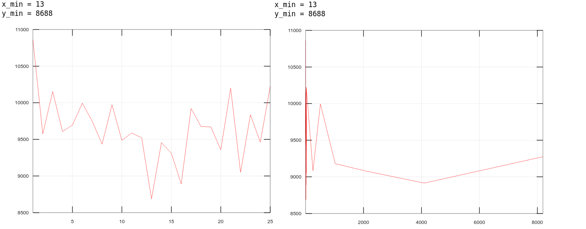

# Введение

Цель работы: исследовать управление файловой системой с
помощью Win32 API.

Задания:

1) Управление дисками, каталогами и файлами. Создайте консольное приложение с меню (каждая выполняемая функция и/или операция должна быть доступна по отдельному пункту меню), которое выполняет:

- вывод списка дисков (функции Win32 API – GetLogicalDrives, GetLogicalDriveStrings);

- для одного из выбранных дисков вывод информации о диске и размер свободного пространства (функции Win32 API – GetDriveType, GetVolumeInformation, GetDiskFreeSpace);

- создание и удаление заданных каталогов (функции Win32 API – CreateDirectory, RemoveDirectory);

- создание файлов в новых каталогах (функция Win32 API – CreateFile)

- копирование и перемещение файлов между каталогами с возможностью выявления попытки работы с файлами, имеющими совпадающие имена (функции Win32 API – CopyFile, MoveFile, MoveFileEx);

- анализ и изменение атрибутов файлов (функции Win32 API – GetFileAttributes, SetFileAttributes, GetFileInformationByHandle, GetFileTime, SetFileTime).

2) Копирование файла с помощью операций перекрывающегося ввода-вывода. Приложение должно копировать существующий файл в новый файл, «одновременно» выполняя n перекрывающихся операций ввода-вывода (механизм APC) блоками данных кратными размеру кластера.

Исходный код доступен в [этом репозитории](https://github.com/The220th/etu2021_OC): https://github.com/The220th/etu2021_OC

# Управление дисками, каталогами и файлами

В ходе выполнения лабораторной работы была написана программа, которая выполняет поставленные задачи. Пример меню программы приведён на рисунке 1.


<center>Рисунок 1 - меню программы</center>

Выбрав первый пункт меню, можно увидеть доступные устройства. Пример выбора пункта меню 1 приведён на рисунке 2.


<center>Рисунок 2 - пример списка доступных устройств</center>

То же самое показывает и проводник Windows (см. рисунок 3).


<center>Рисунок 3 - пример окна проводника Windows</center>

Чтобы узнать информацию о диске, нужно выбрать пункт меню 2 и вести индекс диска. Пример таких действий изображён на рисунке 4.


<center>Рисунок 4 - пример второго пункта меню</center>

С помощью пунктов меню 3 и 4 можно создать и удалить директорию. Пример создания и удаления директории показано на рисунке 5.


<center>Рисунок 5 - пример создания и удаления директории</center>

С помощью пунктов меню 5, 6 и 7 можно создать файл, переместить его и скопировать соответственно. Пример выполнения этих операций приведён на рисунках 6 и 7.


<center>Рисунок 6 - пример создания и перемещения файла</center>


<center>Рисунок 7 - пример копирования файла</center>

Чтобы просмотреть установленные атрибуты файла можно воспользоваться пунктом 8, а если нужна подробная информация о файле, то можно воспользоваться пунктом 9. Также, выбрав пункт 11, можно просмотреть временные метки у файла. Пример этих действий приведён на рисунках 8, 9 и 10 соответственно.


<center>Рисунок 8 - пример просмотра атрибутов файла</center>


<center>Рисунок 9 - пример просмотра информации о файле</center>


<center>Рисунок 10 - пример просмотра временных меток</center>

С помощью пункта 10 можно менять атрибуты файла. Пример изменения атрибутов показан на рисунке 11.


<center>Рисунок 11 - пример изменения атрибутов файла</center>

Чтобы поменять временную метку файла, нужно воспользоваться пунктом 12. Пример изменения временной метки приведён на рисунке 12. Смотря на рисунки 9 и 10, можно убедиться, что временные метки файла "Makefile" скопировались файлу "testFile".


<center>Рисунок 12 - пример изменения временной метки</center>

Чтобы выйти из программы можно воспользоваться пунктом меню 0 (см. рисунок 13).


<center>Рисунок 13 - пример выхода из программы</center>

Исходный код программы доступен [здесь](https://github.com/The220th/etu2021_OC/tree/main/lab1/work1): https://github.com/The220th/etu2021_OC/tree/main/lab1/work1.

# Копирование файла с помощью операций перекрывающегося ввода-вывода

В ходе выполнения лабораторной работы была написана программа, которая асинхронно копирует файл. После её написания были проведены замеры времени копирования: 

1. Когда постоянно кол-во перекрывающихся операций ввода-вывода (1 штука), но меняется размер копируемого блока

1. Когда постоянен размер копируемого блока, но меняется кол-во перекрывающихся операций ввода-вывода.

В замерах используются такие обозначения как "bs" и "thNum". Под "bs" подразумевается размер копируемого блока, а под "thNum" - количество перекрывающихся операций ввода-вывода.

Замеры были проведены на разных ПК с разными характеристиками аппаратной конфигурации. Протоколы программы приведены в Приложении А и в Приложении Б.

## Замер времени с изменяющимся копируемым блоком данных

Первый замер (см. Приложение А). Копировался файл размером 2.79 ГБ. График зависимости времени от блока копируемых данных приведён на рисунке 14.


<center>Рисунок 14 - замер 1 с изменяющимся копируемым блоком данных</center>

Второй замер (см. Приложение А). Копировался файл размером 1.4 ГБ. График зависимости времени от блока копируемых данных приведён на рисунке 15.


<center>Рисунок 15 - замер 2 с изменяющимся копируемым блоком данных</center>

Третий замер (см. Приложение А). Копировался файл размером 4.7 ГБ. График зависимости времени от блока копируемых данных приведён на рисунке 16.


<center>Рисунок 16 - замер 3 с изменяющимся копируемым блоком данных</center>

Можно заметить, что график похож на экспоненту в степени минус x. То есть в какой-то момент времени скорость уже будет слабо зависеть от блока копируемых данных. Также необходимо учесть, что ПК во время замеров мог быть нагружен в неопределённый момент времени, и поэтому на графике можно заметить "впадины".

## Замер времени с изменяющимся количеством перекрывающихся операций ввода-вывода

Первый замер (см. Приложение Б). Копировался файл размером 2.79 ГБ. График зависимости времени от количества перекрывающихся операций ввода-вывода приведён на рисунке 17.


<center>Рисунок 17 - замер 1 с изменяющимся количеством операций в-в</center>

Второй замер (см. Приложение Б). Копировался файл размером 1.4 ГБ. График зависимости времени от количества перекрывающихся операций ввода-вывода приведён на рисунке 18.



<center>Рисунок 18 - замер 2 с изменяющимся количеством операций в-в</center>

Третий замер (см. Приложение Б). Копировался файл размером 4.7 ГБ. График зависимости времени от количества перекрывающихся операций ввода-вывода приведён на рисунке 19.


<center>Рисунок 19 - замер 3 с изменяющимся количеством операций в-в</center>

Четвёртый замер (см. Приложение Б). Копировался файл размером 1.5 ГБ. График зависимости времени от количества перекрывающихся операций ввода-вывода приведён на рисунке 20.


<center>Рисунок 20 - замер 4 с изменяющимся количеством операций в-в</center>

Можно заметить, что в какой-то момент времени скорость уже будет слабо зависеть от количества перекрывающихся операций ввода-вывода. В зависимости от ПК оптимальное количество операций в-в будет разным. Например, для замера 4, можно сказать, что оптимальное количество около 8 операций. А если задать их слишком много при относительно небольшом размере файла, то копирование будет производиться только медленнее. Можно лишь сказать, что несколько перекрывающихся операций в-в лучше, чем одна. Также необходимо учесть, что ПК во время замеров мог быть нагружен в неопределённый момент времени, и поэтому на графике можно заметить "горки".

Исходный код программы доступен [здесь](https://github.com/The220th/etu2021_OC/tree/main/lab1/work2): https://github.com/The220th/etu2021_OC/tree/main/lab1/work2.

# Вывод

В ходе выполнения лабораторной работы были изучены некоторые API Windows для работы с файловой системой. С помощью API Windows было реализовано: просмотр информации о дисках, создание и удаление директорий, создание и открытие, перемещение и копирования файлов, просмотр и изменение их атрибутов и временных меток. Также был изучен способ асинхронного копирования файлов и проведены замеры. 

# Приложение А

Замер 1. Размер файла 3000001057 байт (2.79 ГБ):

``` bash
C:\Users\wex\Downloads\etu2021_OC-main (4)\etu2021_OC-main\lab1\work2>lab1.2.exe in 3000001057 out
Generating file with random bytes (length=3000001057): "in"... 
Generating done. 
Hash of the file "in" is "0f4d53e7058f7b3b72252596316ceeaf".  

Drive sector size: 512 bytes. 
Drive cluster size: 8 sectors (4096 bytes). 

bs = 4096 B (1*4096), thNum = 1, time = 390271. Hash of result file = "0f4d53e7058f7b3b72252596316ceeaf".  
bs = 8192 B (2*4096), thNum = 1, time = 234533. Hash of result file = "0f4d53e7058f7b3b72252596316ceeaf".  
bs = 12288 B (3*4096), thNum = 1, time = 180635. Hash of result file = "0f4d53e7058f7b3b72252596316ceeaf".  
bs = 16384 B (4*4096), thNum = 1, time = 133693. Hash of result file = "0f4d53e7058f7b3b72252596316ceeaf".  
bs = 20480 B (5*4096), thNum = 1, time = 105494. Hash of result file = "0f4d53e7058f7b3b72252596316ceeaf".  
bs = 24576 B (6*4096), thNum = 1, time = 108423. Hash of result file = "0f4d53e7058f7b3b72252596316ceeaf".  
bs = 28672 B (7*4096), thNum = 1, time = 91783. Hash of result file = "0f4d53e7058f7b3b72252596316ceeaf".  
bs = 32768 B (8*4096), thNum = 1, time = 88530. Hash of result file = "0f4d53e7058f7b3b72252596316ceeaf".  
bs = 36864 B (9*4096), thNum = 1, time = 83980. Hash of result file = "0f4d53e7058f7b3b72252596316ceeaf".  
bs = 40960 B (10*4096), thNum = 1, time = 77803. Hash of result file = "0f4d53e7058f7b3b72252596316ceeaf".  
bs = 45056 B (11*4096), thNum = 1, time = 77304. Hash of result file = "0f4d53e7058f7b3b72252596316ceeaf".  
bs = 49152 B (12*4096), thNum = 1, time = 69069. Hash of result file = "0f4d53e7058f7b3b72252596316ceeaf".  
bs = 53248 B (13*4096), thNum = 1, time = 70516. Hash of result file = "0f4d53e7058f7b3b72252596316ceeaf".  
bs = 57344 B (14*4096), thNum = 1, time = 68734. Hash of result file = "0f4d53e7058f7b3b72252596316ceeaf".  
bs = 61440 B (15*4096), thNum = 1, time = 67237. Hash of result file = "0f4d53e7058f7b3b72252596316ceeaf".  
bs = 65536 B (16*4096), thNum = 1, time = 62713. Hash of result file = "0f4d53e7058f7b3b72252596316ceeaf".  
bs = 69632 B (17*4096), thNum = 1, time = 62989. Hash of result file = "0f4d53e7058f7b3b72252596316ceeaf".  
bs = 73728 B (18*4096), thNum = 1, time = 61589. Hash of result file = "0f4d53e7058f7b3b72252596316ceeaf".  
bs = 77824 B (19*4096), thNum = 1, time = 62612. Hash of result file = "0f4d53e7058f7b3b72252596316ceeaf".  
bs = 81920 B (20*4096), thNum = 1, time = 57492. Hash of result file = "0f4d53e7058f7b3b72252596316ceeaf".  
bs = 86016 B (21*4096), thNum = 1, time = 59606. Hash of result file = "0f4d53e7058f7b3b72252596316ceeaf".  
bs = 90112 B (22*4096), thNum = 1, time = 58268. Hash of result file = "0f4d53e7058f7b3b72252596316ceeaf".  
bs = 94208 B (23*4096), thNum = 1, time = 56673. Hash of result file = "0f4d53e7058f7b3b72252596316ceeaf".  
bs = 98304 B (24*4096), thNum = 1, time = 52213. Hash of result file = "0f4d53e7058f7b3b72252596316ceeaf".  
bs = 102400 B (25*4096), thNum = 1, time = 55021. Hash of result file = "0f4d53e7058f7b3b72252596316ceeaf".  
bs = 106496 B (26*4096), thNum = 1, time = 53458. Hash of result file = "0f4d53e7058f7b3b72252596316ceeaf".  
bs = 110592 B (27*4096), thNum = 1, time = 52721. Hash of result file = "0f4d53e7058f7b3b72252596316ceeaf".  
bs = 114688 B (28*4096), thNum = 1, time = 53261. Hash of result file = "0f4d53e7058f7b3b72252596316ceeaf".  
bs = 118784 B (29*4096), thNum = 1, time = 52103. Hash of result file = "0f4d53e7058f7b3b72252596316ceeaf".  
bs = 122880 B (30*4096), thNum = 1, time = 49661. Hash of result file = "0f4d53e7058f7b3b72252596316ceeaf".  
bs = 126976 B (31*4096), thNum = 1, time = 56350. Hash of result file = "0f4d53e7058f7b3b72252596316ceeaf".  
bs = 131072 B (32*4096), thNum = 1, time = 50557. Hash of result file = "0f4d53e7058f7b3b72252596316ceeaf".  
bs = 135168 B (33*4096), thNum = 1, time = 61866. Hash of result file = "0f4d53e7058f7b3b72252596316ceeaf".  
bs = 139264 B (34*4096), thNum = 1, time = 60848. Hash of result file = "0f4d53e7058f7b3b72252596316ceeaf".  
bs = 143360 B (35*4096), thNum = 1, time = 62017. Hash of result file = "0f4d53e7058f7b3b72252596316ceeaf".  
bs = 147456 B (36*4096), thNum = 1, time = 59213. Hash of result file = "0f4d53e7058f7b3b72252596316ceeaf".  
bs = 151552 B (37*4096), thNum = 1, time = 59141. Hash of result file = "0f4d53e7058f7b3b72252596316ceeaf".  
bs = 155648 B (38*4096), thNum = 1, time = 57307. Hash of result file = "0f4d53e7058f7b3b72252596316ceeaf".  
bs = 159744 B (39*4096), thNum = 1, time = 58685. Hash of result file = "0f4d53e7058f7b3b72252596316ceeaf".  
bs = 163840 B (40*4096), thNum = 1, time = 55893. Hash of result file = "0f4d53e7058f7b3b72252596316ceeaf".  
bs = 167936 B (41*4096), thNum = 1, time = 59092. Hash of result file = "0f4d53e7058f7b3b72252596316ceeaf".  
bs = 172032 B (42*4096), thNum = 1, time = 59726. Hash of result file = "0f4d53e7058f7b3b72252596316ceeaf".  
bs = 176128 B (43*4096), thNum = 1, time = 59250. Hash of result file = "0f4d53e7058f7b3b72252596316ceeaf".  
bs = 180224 B (44*4096), thNum = 1, time = 59003. Hash of result file = "0f4d53e7058f7b3b72252596316ceeaf".  
bs = 184320 B (45*4096), thNum = 1, time = 57818. Hash of result file = "0f4d53e7058f7b3b72252596316ceeaf".  
bs = 188416 B (46*4096), thNum = 1, time = 58487. Hash of result file = "0f4d53e7058f7b3b72252596316ceeaf".  
bs = 192512 B (47*4096), thNum = 1, time = 56942. Hash of result file = "0f4d53e7058f7b3b72252596316ceeaf".  
bs = 196608 B (48*4096), thNum = 1, time = 58517. Hash of result file = "0f4d53e7058f7b3b72252596316ceeaf".  
bs = 200704 B (49*4096), thNum = 1, time = 62742. Hash of result file = "0f4d53e7058f7b3b72252596316ceeaf".  
bs = 204800 B (50*4096), thNum = 1, time = 58861. Hash of result file = "0f4d53e7058f7b3b72252596316ceeaf".  
bs = 208896 B (51*4096), thNum = 1, time = 57209. Hash of result file = "0f4d53e7058f7b3b72252596316ceeaf".  
bs = 212992 B (52*4096), thNum = 1, time = 56290. Hash of result file = "0f4d53e7058f7b3b72252596316ceeaf".  
bs = 217088 B (53*4096), thNum = 1, time = 55291. Hash of result file = "0f4d53e7058f7b3b72252596316ceeaf".  
bs = 221184 B (54*4096), thNum = 1, time = 55036. Hash of result file = "0f4d53e7058f7b3b72252596316ceeaf".  
bs = 225280 B (55*4096), thNum = 1, time = 54324. Hash of result file = "0f4d53e7058f7b3b72252596316ceeaf".  
bs = 229376 B (56*4096), thNum = 1, time = 52393. Hash of result file = "0f4d53e7058f7b3b72252596316ceeaf".  
bs = 233472 B (57*4096), thNum = 1, time = 52551. Hash of result file = "0f4d53e7058f7b3b72252596316ceeaf".  
bs = 237568 B (58*4096), thNum = 1, time = 51781. Hash of result file = "0f4d53e7058f7b3b72252596316ceeaf".  
bs = 241664 B (59*4096), thNum = 1, time = 53337. Hash of result file = "0f4d53e7058f7b3b72252596316ceeaf".  
bs = 245760 B (60*4096), thNum = 1, time = 52756. Hash of result file = "0f4d53e7058f7b3b72252596316ceeaf".  
bs = 249856 B (61*4096), thNum = 1, time = 54415. Hash of result file = "0f4d53e7058f7b3b72252596316ceeaf".  
bs = 253952 B (62*4096), thNum = 1, time = 53148. Hash of result file = "0f4d53e7058f7b3b72252596316ceeaf".  
bs = 258048 B (63*4096), thNum = 1, time = 52410. Hash of result file = "0f4d53e7058f7b3b72252596316ceeaf".  
bs = 262144 B (64*4096), thNum = 1, time = 53461. Hash of result file = "0f4d53e7058f7b3b72252596316ceeaf".  
bs = 266240 B (65*4096), thNum = 1, time = 58999. Hash of result file = "0f4d53e7058f7b3b72252596316ceeaf".  
bs = 270336 B (66*4096), thNum = 1, time = 57530. Hash of result file = "0f4d53e7058f7b3b72252596316ceeaf".  
bs = 274432 B (67*4096), thNum = 1, time = 55471. Hash of result file = "0f4d53e7058f7b3b72252596316ceeaf".  
bs = 278528 B (68*4096), thNum = 1, time = 55735. Hash of result file = "0f4d53e7058f7b3b72252596316ceeaf".  
bs = 282624 B (69*4096), thNum = 1, time = 55819. Hash of result file = "0f4d53e7058f7b3b72252596316ceeaf".  
bs = 286720 B (70*4096), thNum = 1, time = 55510. Hash of result file = "0f4d53e7058f7b3b72252596316ceeaf".  
bs = 1048576 B (256*4096), thNum = 1, time = 40358. Hash of result file = "0f4d53e7058f7b3b72252596316ceeaf".
bs = 2097152 B (512*4096), thNum = 1, time = 50669. Hash of result file = "0f4d53e7058f7b3b72252596316ceeaf".
bs = 4194304 B (1024*4096), thNum = 1, time = 50699. Hash of result file = "0f4d53e7058f7b3b72252596316ceeaf".
bs = 8388608 B (2048*4096), thNum = 1, time = 43191. Hash of result file = "0f4d53e7058f7b3b72252596316ceeaf".
bs = 16777216 B (4096*4096), thNum = 1, time = 37510. Hash of result file = "0f4d53e7058f7b3b72252596316ceeaf".
bs = 33554432 B (8192*4096), thNum = 1, time = 34382. Hash of result file = "0f4d53e7058f7b3b72252596316ceeaf".

Code for MatLab:

function res = showPlot()

polX = [1, 2, 3, 4, 5, 6, 7, 8, 9, 10, 11, 12, 13, 14, 15, 16, 17, 18, 19, 20, 21, 22, 23, 24, 25, 26, 27, 28, 29, 30, 31, 32, 33, 34, 35, 36, 37, 38, 39, 40, 41, 42, 43, 44, 45, 46, 47, 48, 49, 50, 51, 52, 53, 54, 55, 56, 57, 58, 59, 60, 61, 62, 63, 64, 65, 66, 67, 68, 69, 70, 256, 512, 1024, 2048, 4096, 8192];
polY = [390271, 234533, 180635, 133693, 105494, 108423, 91783, 88530, 83980, 77803, 77304, 69069, 70516, 68734, 67237, 62713, 62989, 61589, 62612, 57492, 59606, 58268, 56673, 52213, 55021, 53458, 52721, 53261, 52103, 49661, 56350, 50557, 61866, 60848, 62017, 59213, 59141, 57307, 58685, 55893, 59092, 59726, 59250, 59003, 57818, 58487, 56942, 58517, 62742, 58861, 57209, 56290, 55291, 55036, 54324, 52393, 52551, 51781, 53337, 52756, 54415, 53148, 52410, 53461, 58999, 57530, 55471, 55735, 55819, 55510, 40358, 50669, 50699, 43191, 37510, 34382];

plot(polX, polY, 'r');
grid on;
xlim([1 8192]);

[mini, nmin] = min(polY);
x_min = polX(nmin)
y_min = mini
```

Замер 2. Размер файла 1500001757 байт (1.4 ГБ):

``` bash
E:\work2>lab1.2.exe in 1500001757 out
Generating file with random bytes (length=1500001757): "in"...
Generating done.
Hash of the file "in" is "a18b0031b0b8d8db5fc7c1db4c762cdc".

Drive sector size: 512 bytes.
Drive cluster size: 8 sectors (4096 bytes).

bs = 4096 B (1*4096), thNum = 1, time = 56691. Hash of result file = "a18b0031b0b8d8db5fc7c1db4c762cdc".
bs = 8192 B (2*4096), thNum = 1, time = 31207. Hash of result file = "a18b0031b0b8d8db5fc7c1db4c762cdc".
bs = 12288 B (3*4096), thNum = 1, time = 22769. Hash of result file = "a18b0031b0b8d8db5fc7c1db4c762cdc".
bs = 16384 B (4*4096), thNum = 1, time = 18733. Hash of result file = "a18b0031b0b8d8db5fc7c1db4c762cdc".
bs = 20480 B (5*4096), thNum = 1, time = 16580. Hash of result file = "a18b0031b0b8d8db5fc7c1db4c762cdc".
bs = 24576 B (6*4096), thNum = 1, time = 14755. Hash of result file = "a18b0031b0b8d8db5fc7c1db4c762cdc".
bs = 28672 B (7*4096), thNum = 1, time = 13576. Hash of result file = "a18b0031b0b8d8db5fc7c1db4c762cdc".
bs = 32768 B (8*4096), thNum = 1, time = 12644. Hash of result file = "a18b0031b0b8d8db5fc7c1db4c762cdc".
bs = 36864 B (9*4096), thNum = 1, time = 12249. Hash of result file = "a18b0031b0b8d8db5fc7c1db4c762cdc".
bs = 40960 B (10*4096), thNum = 1, time = 11758. Hash of result file = "a18b0031b0b8d8db5fc7c1db4c762cdc".
bs = 45056 B (11*4096), thNum = 1, time = 12023. Hash of result file = "a18b0031b0b8d8db5fc7c1db4c762cdc".
bs = 49152 B (12*4096), thNum = 1, time = 11086. Hash of result file = "a18b0031b0b8d8db5fc7c1db4c762cdc".
bs = 53248 B (13*4096), thNum = 1, time = 10688. Hash of result file = "a18b0031b0b8d8db5fc7c1db4c762cdc".
bs = 57344 B (14*4096), thNum = 1, time = 10179. Hash of result file = "a18b0031b0b8d8db5fc7c1db4c762cdc".
bs = 61440 B (15*4096), thNum = 1, time = 10421. Hash of result file = "a18b0031b0b8d8db5fc7c1db4c762cdc".
bs = 65536 B (16*4096), thNum = 1, time = 9922. Hash of result file = "a18b0031b0b8d8db5fc7c1db4c762cdc".
bs = 69632 B (17*4096), thNum = 1, time = 13206. Hash of result file = "a18b0031b0b8d8db5fc7c1db4c762cdc".
bs = 73728 B (18*4096), thNum = 1, time = 10613. Hash of result file = "a18b0031b0b8d8db5fc7c1db4c762cdc".
bs = 77824 B (19*4096), thNum = 1, time = 9996. Hash of result file = "a18b0031b0b8d8db5fc7c1db4c762cdc".
bs = 81920 B (20*4096), thNum = 1, time = 9490. Hash of result file = "a18b0031b0b8d8db5fc7c1db4c762cdc".
bs = 86016 B (21*4096), thNum = 1, time = 10164. Hash of result file = "a18b0031b0b8d8db5fc7c1db4c762cdc".
bs = 90112 B (22*4096), thNum = 1, time = 10107. Hash of result file = "a18b0031b0b8d8db5fc7c1db4c762cdc".
bs = 94208 B (23*4096), thNum = 1, time = 9128. Hash of result file = "a18b0031b0b8d8db5fc7c1db4c762cdc".
bs = 98304 B (24*4096), thNum = 1, time = 10182. Hash of result file = "a18b0031b0b8d8db5fc7c1db4c762cdc".
bs = 102400 B (25*4096), thNum = 1, time = 9706. Hash of result file = "a18b0031b0b8d8db5fc7c1db4c762cdc".
bs = 106496 B (26*4096), thNum = 1, time = 10268. Hash of result file = "a18b0031b0b8d8db5fc7c1db4c762cdc".
bs = 110592 B (27*4096), thNum = 1, time = 9887. Hash of result file = "a18b0031b0b8d8db5fc7c1db4c762cdc".
bs = 114688 B (28*4096), thNum = 1, time = 10302. Hash of result file = "a18b0031b0b8d8db5fc7c1db4c762cdc".
bs = 118784 B (29*4096), thNum = 1, time = 9876. Hash of result file = "a18b0031b0b8d8db5fc7c1db4c762cdc".
bs = 122880 B (30*4096), thNum = 1, time = 10031. Hash of result file = "a18b0031b0b8d8db5fc7c1db4c762cdc".
bs = 126976 B (31*4096), thNum = 1, time = 9882. Hash of result file = "a18b0031b0b8d8db5fc7c1db4c762cdc".
bs = 131072 B (32*4096), thNum = 1, time = 9791. Hash of result file = "a18b0031b0b8d8db5fc7c1db4c762cdc".
bs = 135168 B (33*4096), thNum = 1, time = 9553. Hash of result file = "a18b0031b0b8d8db5fc7c1db4c762cdc".
bs = 139264 B (34*4096), thNum = 1, time = 9799. Hash of result file = "a18b0031b0b8d8db5fc7c1db4c762cdc".
bs = 143360 B (35*4096), thNum = 1, time = 9574. Hash of result file = "a18b0031b0b8d8db5fc7c1db4c762cdc".
bs = 147456 B (36*4096), thNum = 1, time = 9964. Hash of result file = "a18b0031b0b8d8db5fc7c1db4c762cdc".
bs = 151552 B (37*4096), thNum = 1, time = 9652. Hash of result file = "a18b0031b0b8d8db5fc7c1db4c762cdc".
bs = 155648 B (38*4096), thNum = 1, time = 8882. Hash of result file = "a18b0031b0b8d8db5fc7c1db4c762cdc".
bs = 159744 B (39*4096), thNum = 1, time = 9774. Hash of result file = "a18b0031b0b8d8db5fc7c1db4c762cdc".
bs = 163840 B (40*4096), thNum = 1, time = 9066. Hash of result file = "a18b0031b0b8d8db5fc7c1db4c762cdc".
bs = 167936 B (41*4096), thNum = 1, time = 8703. Hash of result file = "a18b0031b0b8d8db5fc7c1db4c762cdc".
bs = 172032 B (42*4096), thNum = 1, time = 9690. Hash of result file = "a18b0031b0b8d8db5fc7c1db4c762cdc".
bs = 176128 B (43*4096), thNum = 1, time = 9296. Hash of result file = "a18b0031b0b8d8db5fc7c1db4c762cdc".
bs = 180224 B (44*4096), thNum = 1, time = 8593. Hash of result file = "a18b0031b0b8d8db5fc7c1db4c762cdc".
bs = 184320 B (45*4096), thNum = 1, time = 9882. Hash of result file = "a18b0031b0b8d8db5fc7c1db4c762cdc".
bs = 188416 B (46*4096), thNum = 1, time = 9265. Hash of result file = "a18b0031b0b8d8db5fc7c1db4c762cdc".
bs = 192512 B (47*4096), thNum = 1, time = 8726. Hash of result file = "a18b0031b0b8d8db5fc7c1db4c762cdc".
bs = 196608 B (48*4096), thNum = 1, time = 9542. Hash of result file = "a18b0031b0b8d8db5fc7c1db4c762cdc".
bs = 200704 B (49*4096), thNum = 1, time = 9323. Hash of result file = "a18b0031b0b8d8db5fc7c1db4c762cdc".
bs = 204800 B (50*4096), thNum = 1, time = 8561. Hash of result file = "a18b0031b0b8d8db5fc7c1db4c762cdc".
bs = 208896 B (51*4096), thNum = 1, time = 9699. Hash of result file = "a18b0031b0b8d8db5fc7c1db4c762cdc".
bs = 212992 B (52*4096), thNum = 1, time = 9170. Hash of result file = "a18b0031b0b8d8db5fc7c1db4c762cdc".
bs = 217088 B (53*4096), thNum = 1, time = 8875. Hash of result file = "a18b0031b0b8d8db5fc7c1db4c762cdc".
bs = 221184 B (54*4096), thNum = 1, time = 8519. Hash of result file = "a18b0031b0b8d8db5fc7c1db4c762cdc".
bs = 225280 B (55*4096), thNum = 1, time = 9685. Hash of result file = "a18b0031b0b8d8db5fc7c1db4c762cdc".
bs = 229376 B (56*4096), thNum = 1, time = 9016. Hash of result file = "a18b0031b0b8d8db5fc7c1db4c762cdc".
bs = 233472 B (57*4096), thNum = 1, time = 8847. Hash of result file = "a18b0031b0b8d8db5fc7c1db4c762cdc".
bs = 237568 B (58*4096), thNum = 1, time = 8329. Hash of result file = "a18b0031b0b8d8db5fc7c1db4c762cdc".
bs = 241664 B (59*4096), thNum = 1, time = 9488. Hash of result file = "a18b0031b0b8d8db5fc7c1db4c762cdc".
bs = 245760 B (60*4096), thNum = 1, time = 9404. Hash of result file = "a18b0031b0b8d8db5fc7c1db4c762cdc".
bs = 249856 B (61*4096), thNum = 1, time = 8334. Hash of result file = "a18b0031b0b8d8db5fc7c1db4c762cdc".
bs = 253952 B (62*4096), thNum = 1, time = 9291. Hash of result file = "a18b0031b0b8d8db5fc7c1db4c762cdc".
bs = 258048 B (63*4096), thNum = 1, time = 9637. Hash of result file = "a18b0031b0b8d8db5fc7c1db4c762cdc".
bs = 262144 B (64*4096), thNum = 1, time = 8170. Hash of result file = "a18b0031b0b8d8db5fc7c1db4c762cdc".
bs = 266240 B (65*4096), thNum = 1, time = 9123. Hash of result file = "a18b0031b0b8d8db5fc7c1db4c762cdc".
bs = 270336 B (66*4096), thNum = 1, time = 9365. Hash of result file = "a18b0031b0b8d8db5fc7c1db4c762cdc".
bs = 274432 B (67*4096), thNum = 1, time = 8051. Hash of result file = "a18b0031b0b8d8db5fc7c1db4c762cdc".
bs = 278528 B (68*4096), thNum = 1, time = 9253. Hash of result file = "a18b0031b0b8d8db5fc7c1db4c762cdc".
bs = 282624 B (69*4096), thNum = 1, time = 9436. Hash of result file = "a18b0031b0b8d8db5fc7c1db4c762cdc".
bs = 286720 B (70*4096), thNum = 1, time = 8603. Hash of result file = "a18b0031b0b8d8db5fc7c1db4c762cdc".
bs = 1048576 B (256*4096), thNum = 1, time = 8606. Hash of result file = "a18b0031b0b8d8db5fc7c1db4c762cdc".
bs = 2097152 B (512*4096), thNum = 1, time = 7793. Hash of result file = "a18b0031b0b8d8db5fc7c1db4c762cdc".
bs = 4194304 B (1024*4096), thNum = 1, time = 9567. Hash of result file = "a18b0031b0b8d8db5fc7c1db4c762cdc".
bs = 8388608 B (2048*4096), thNum = 1, time = 8582. Hash of result file = "a18b0031b0b8d8db5fc7c1db4c762cdc".
bs = 16777216 B (4096*4096), thNum = 1, time = 7675. Hash of result file = "a18b0031b0b8d8db5fc7c1db4c762cdc".
bs = 33554432 B (8192*4096), thNum = 1, time = 7770. Hash of result file = "a18b0031b0b8d8db5fc7c1db4c762cdc".

Code for MatLab:

function res = showPlot()

polX = [1, 2, 3, 4, 5, 6, 7, 8, 9, 10, 11, 12, 13, 14, 15, 16, 17, 18, 19, 20, 21, 22, 23, 24, 25, 26, 27, 28, 29, 30, 31, 32, 33, 34, 35, 36, 37, 38, 39, 40, 41, 42, 43, 44, 45, 46, 47, 48, 49, 50, 51, 52, 53, 54, 55, 56, 57, 58, 59, 60, 61, 62, 63, 64, 65, 66, 67, 68, 69, 70, 256, 512, 1024, 2048, 4096, 8192];
polY = [56691, 31207, 22769, 18733, 16580, 14755, 13576, 12644, 12249, 11758, 12023, 11086, 10688, 10179, 10421, 9922, 13206, 10613, 9996, 9490, 10164, 10107, 9128, 10182, 9706, 10268, 9887, 10302, 9876, 10031, 9882, 9791, 9553, 9799, 9574, 9964, 9652, 8882, 9774, 9066, 8703, 9690, 9296, 8593, 9882, 9265, 8726, 9542, 9323, 8561, 9699, 9170, 8875, 8519, 9685, 9016, 8847, 8329, 9488, 9404, 8334, 9291, 9637, 8170, 9123, 9365, 8051, 9253, 9436, 8603, 8606, 7793, 9567, 8582, 7675, 7770];

plot(polX, polY, 'r');
grid on;
xlim([1 8192]);

[mini, nmin] = min(polY);
x_min = polX(nmin)
y_min = mini
```

Замер 3. Размер файла 5000001057 байт (4.7 ГБ):

``` bash
Generating file with random bytes (length=5000001057): "in"... 
Generating done. 
Hash of the file "in" is "81fb110ba36250ee7ceb2fc00b58d3d4". 

Drive sector size: 512 bytes. 
Drive cluster size: 8 sectors (4096 bytes). 

bs = 4096 B (1*4096), thNum = 1, time = 575080. Hash of result file = "81fb110ba36250ee7ceb2fc00b58d3d4". 
bs = 8192 B (2*4096), thNum = 1, time = 333328. Hash of result file = "81fb110ba36250ee7ceb2fc00b58d3d4". 
bs = 12288 B (3*4096), thNum = 1, time = 269356. Hash of result file = "81fb110ba36250ee7ceb2fc00b58d3d4". 
bs = 16384 B (4*4096), thNum = 1, time = 221675. Hash of result file = "81fb110ba36250ee7ceb2fc00b58d3d4". 
bs = 20480 B (5*4096), thNum = 1, time = 168988. Hash of result file = "81fb110ba36250ee7ceb2fc00b58d3d4". 
bs = 24576 B (6*4096), thNum = 1, time = 148138. Hash of result file = "81fb110ba36250ee7ceb2fc00b58d3d4". 
bs = 28672 B (7*4096), thNum = 1, time = 135573. Hash of result file = "81fb110ba36250ee7ceb2fc00b58d3d4". 
bs = 32768 B (8*4096), thNum = 1, time = 141000. Hash of result file = "81fb110ba36250ee7ceb2fc00b58d3d4". 
bs = 36864 B (9*4096), thNum = 1, time = 129095. Hash of result file = "81fb110ba36250ee7ceb2fc00b58d3d4". 
bs = 40960 B (10*4096), thNum = 1, time = 124494. Hash of result file = "81fb110ba36250ee7ceb2fc00b58d3d4". 
bs = 45056 B (11*4096), thNum = 1, time = 110783. Hash of result file = "81fb110ba36250ee7ceb2fc00b58d3d4". 
bs = 49152 B (12*4096), thNum = 1, time = 110088. Hash of result file = "81fb110ba36250ee7ceb2fc00b58d3d4". 
bs = 53248 B (13*4096), thNum = 1, time = 102825. Hash of result file = "81fb110ba36250ee7ceb2fc00b58d3d4". 
bs = 57344 B (14*4096), thNum = 1, time = 104403. Hash of result file = "81fb110ba36250ee7ceb2fc00b58d3d4". 
bs = 61440 B (15*4096), thNum = 1, time = 97401. Hash of result file = "81fb110ba36250ee7ceb2fc00b58d3d4". 
bs = 65536 B (16*4096), thNum = 1, time = 100457. Hash of result file = "81fb110ba36250ee7ceb2fc00b58d3d4". 
bs = 69632 B (17*4096), thNum = 1, time = 94423. Hash of result file = "81fb110ba36250ee7ceb2fc00b58d3d4". 
bs = 73728 B (18*4096), thNum = 1, time = 92701. Hash of result file = "81fb110ba36250ee7ceb2fc00b58d3d4". 
bs = 77824 B (19*4096), thNum = 1, time = 91499. Hash of result file = "81fb110ba36250ee7ceb2fc00b58d3d4". 
bs = 81920 B (20*4096), thNum = 1, time = 91333. Hash of result file = "81fb110ba36250ee7ceb2fc00b58d3d4". 
bs = 86016 B (21*4096), thNum = 1, time = 91788. Hash of result file = "81fb110ba36250ee7ceb2fc00b58d3d4". 
bs = 90112 B (22*4096), thNum = 1, time = 86147. Hash of result file = "81fb110ba36250ee7ceb2fc00b58d3d4". 
bs = 94208 B (23*4096), thNum = 1, time = 86851. Hash of result file = "81fb110ba36250ee7ceb2fc00b58d3d4". 
bs = 98304 B (24*4096), thNum = 1, time = 82468. Hash of result file = "81fb110ba36250ee7ceb2fc00b58d3d4". 
bs = 102400 B (25*4096), thNum = 1, time = 82658. Hash of result file = "81fb110ba36250ee7ceb2fc00b58d3d4". 
bs = 106496 B (26*4096), thNum = 1, time = 83374. Hash of result file = "81fb110ba36250ee7ceb2fc00b58d3d4". 
bs = 110592 B (27*4096), thNum = 1, time = 80125. Hash of result file = "81fb110ba36250ee7ceb2fc00b58d3d4". 
bs = 114688 B (28*4096), thNum = 1, time = 81320. Hash of result file = "81fb110ba36250ee7ceb2fc00b58d3d4". 
bs = 118784 B (29*4096), thNum = 1, time = 79306. Hash of result file = "81fb110ba36250ee7ceb2fc00b58d3d4". 
bs = 122880 B (30*4096), thNum = 1, time = 80727. Hash of result file = "81fb110ba36250ee7ceb2fc00b58d3d4". 
bs = 126976 B (31*4096), thNum = 1, time = 85983. Hash of result file = "81fb110ba36250ee7ceb2fc00b58d3d4". 
bs = 131072 B (32*4096), thNum = 1, time = 82281. Hash of result file = "81fb110ba36250ee7ceb2fc00b58d3d4". 
bs = 135168 B (33*4096), thNum = 1, time = 93207. Hash of result file = "81fb110ba36250ee7ceb2fc00b58d3d4". 
bs = 139264 B (34*4096), thNum = 1, time = 93372. Hash of result file = "81fb110ba36250ee7ceb2fc00b58d3d4". 
bs = 143360 B (35*4096), thNum = 1, time = 91235. Hash of result file = "81fb110ba36250ee7ceb2fc00b58d3d4". 
bs = 147456 B (36*4096), thNum = 1, time = 90057. Hash of result file = "81fb110ba36250ee7ceb2fc00b58d3d4". 
bs = 151552 B (37*4096), thNum = 1, time = 89319. Hash of result file = "81fb110ba36250ee7ceb2fc00b58d3d4". 
bs = 155648 B (38*4096), thNum = 1, time = 89114. Hash of result file = "81fb110ba36250ee7ceb2fc00b58d3d4". 
bs = 159744 B (39*4096), thNum = 1, time = 89397. Hash of result file = "81fb110ba36250ee7ceb2fc00b58d3d4". 
bs = 163840 B (40*4096), thNum = 1, time = 89857. Hash of result file = "81fb110ba36250ee7ceb2fc00b58d3d4". 
bs = 167936 B (41*4096), thNum = 1, time = 91614. Hash of result file = "81fb110ba36250ee7ceb2fc00b58d3d4". 
bs = 172032 B (42*4096), thNum = 1, time = 93633. Hash of result file = "81fb110ba36250ee7ceb2fc00b58d3d4". 
bs = 176128 B (43*4096), thNum = 1, time = 93441. Hash of result file = "81fb110ba36250ee7ceb2fc00b58d3d4". 
bs = 180224 B (44*4096), thNum = 1, time = 92122. Hash of result file = "81fb110ba36250ee7ceb2fc00b58d3d4". 
bs = 184320 B (45*4096), thNum = 1, time = 91867. Hash of result file = "81fb110ba36250ee7ceb2fc00b58d3d4". 
bs = 188416 B (46*4096), thNum = 1, time = 90643. Hash of result file = "81fb110ba36250ee7ceb2fc00b58d3d4". 
bs = 192512 B (47*4096), thNum = 1, time = 89085. Hash of result file = "81fb110ba36250ee7ceb2fc00b58d3d4". 
bs = 196608 B (48*4096), thNum = 1, time = 88248. Hash of result file = "81fb110ba36250ee7ceb2fc00b58d3d4". 
bs = 200704 B (49*4096), thNum = 1, time = 87102. Hash of result file = "81fb110ba36250ee7ceb2fc00b58d3d4". 
bs = 204800 B (50*4096), thNum = 1, time = 86715. Hash of result file = "81fb110ba36250ee7ceb2fc00b58d3d4". 
bs = 208896 B (51*4096), thNum = 1, time = 85632. Hash of result file = "81fb110ba36250ee7ceb2fc00b58d3d4". 
bs = 212992 B (52*4096), thNum = 1, time = 84731. Hash of result file = "81fb110ba36250ee7ceb2fc00b58d3d4". 
bs = 217088 B (53*4096), thNum = 1, time = 84679. Hash of result file = "81fb110ba36250ee7ceb2fc00b58d3d4". 
bs = 221184 B (54*4096), thNum = 1, time = 84560. Hash of result file = "81fb110ba36250ee7ceb2fc00b58d3d4". 
bs = 225280 B (55*4096), thNum = 1, time = 82314. Hash of result file = "81fb110ba36250ee7ceb2fc00b58d3d4". 
bs = 229376 B (56*4096), thNum = 1, time = 79761. Hash of result file = "81fb110ba36250ee7ceb2fc00b58d3d4". 
bs = 233472 B (57*4096), thNum = 1, time = 78483. Hash of result file = "81fb110ba36250ee7ceb2fc00b58d3d4". 
bs = 237568 B (58*4096), thNum = 1, time = 78006. Hash of result file = "81fb110ba36250ee7ceb2fc00b58d3d4". 
bs = 241664 B (59*4096), thNum = 1, time = 77880. Hash of result file = "81fb110ba36250ee7ceb2fc00b58d3d4". 
bs = 245760 B (60*4096), thNum = 1, time = 77361. Hash of result file = "81fb110ba36250ee7ceb2fc00b58d3d4". 
bs = 249856 B (61*4096), thNum = 1, time = 77352. Hash of result file = "81fb110ba36250ee7ceb2fc00b58d3d4". 
bs = 253952 B (62*4096), thNum = 1, time = 76980. Hash of result file = "81fb110ba36250ee7ceb2fc00b58d3d4". 
bs = 258048 B (63*4096), thNum = 1, time = 76332. Hash of result file = "81fb110ba36250ee7ceb2fc00b58d3d4". 
bs = 262144 B (64*4096), thNum = 1, time = 76598. Hash of result file = "81fb110ba36250ee7ceb2fc00b58d3d4". 
bs = 266240 B (65*4096), thNum = 1, time = 79981. Hash of result file = "81fb110ba36250ee7ceb2fc00b58d3d4". 
bs = 270336 B (66*4096), thNum = 1, time = 80253. Hash of result file = "81fb110ba36250ee7ceb2fc00b58d3d4". 
bs = 274432 B (67*4096), thNum = 1, time = 81308. Hash of result file = "81fb110ba36250ee7ceb2fc00b58d3d4". 
bs = 278528 B (68*4096), thNum = 1, time = 82694. Hash of result file = "81fb110ba36250ee7ceb2fc00b58d3d4". 
bs = 282624 B (69*4096), thNum = 1, time = 84275. Hash of result file = "81fb110ba36250ee7ceb2fc00b58d3d4". 
bs = 286720 B (70*4096), thNum = 1, time = 83604. Hash of result file = "81fb110ba36250ee7ceb2fc00b58d3d4". 
bs = 1048576 B (256*4096), thNum = 1, time = 65297. Hash of result file = "81fb110ba36250ee7ceb2fc00b58d3d4". 
bs = 2097152 B (512*4096), thNum = 1, time = 75922. Hash of result file = "81fb110ba36250ee7ceb2fc00b58d3d4".
bs = 4194304 B (1024*4096), thNum = 1, time = 80225. Hash of result file = "81fb110ba36250ee7ceb2fc00b58d3d4". 
bs = 8388608 B (2048*4096), thNum = 1, time = 66066. Hash of result file = "81fb110ba36250ee7ceb2fc00b58d3d4". 
bs = 16777216 B (4096*4096), thNum = 1, time = 59005. Hash of result file = "81fb110ba36250ee7ceb2fc00b58d3d4". 
bs = 33554432 B (8192*4096), thNum = 1, time = 54741. Hash of result file = "81fb110ba36250ee7ceb2fc00b58d3d4". 

Code for MatLab:

function res = showPlot()

polX = [1, 2, 3, 4, 5, 6, 7, 8, 9, 10, 11, 12, 13, 14, 15, 16, 17, 18, 19, 20, 21, 22, 23, 24, 25, 26, 27, 28, 29, 30, 31, 32, 33, 34, 35, 36, 37, 38, 39, 40, 41, 42, 43, 44, 45, 46, 47, 48, 49, 50, 51, 52, 53, 54, 55, 56, 57, 58, 59, 60, 61, 62, 63, 64, 65, 66, 67, 68, 69, 70, 256, 512, 1024, 2048, 4096, 8192];
polY = [575080, 333328, 269356, 221675, 168988, 148138, 135573, 141000, 129095, 124494, 110783, 110088, 102825, 104403, 97401, 100457, 94423, 92701, 91499, 91333, 91788, 86147, 86851, 82468, 82658, 83374, 80125, 81320, 79306, 80727, 85983, 82281, 93207, 93372, 91235, 90057, 89319, 89114, 89397, 89857, 91614, 93633, 93441, 92122, 91867, 90643, 89085, 88248, 87102, 86715, 85632, 84731, 84679, 84560, 82314, 79761, 78483, 78006, 77880, 77361, 77352, 76980, 76332, 76598, 79981, 80253, 81308, 82694, 84275, 83604, 65297, 75922, 80225, 66066, 59005, 54741];

plot(polX, polY, 'r');
grid on;
xlim([1 8192]);

[mini, nmin] = min(polY);
x_min = polX(nmin)
y_min = mini
```

# Приложение Б

Замер 1. Размер файла 3000001057 байт (2.79 ГБ):

``` bash
C:\Users\wex\Downloads\etu2021_OC-main (4)\etu2021_OC-main\lab1\work2>lab1.2.exe in 3000001057 out
Generating file with random bytes (length=3000001057): "in"... 
Generating done. 
Hash of the file "in" is "0f4d53e7058f7b3b72252596316ceeaf".  

Drive sector size: 512 bytes. 
Drive cluster size: 8 sectors (4096 bytes). 

bs = 65536 B (16*4096), thNum = 1, time = 61977. Hash of result file = "0f4d53e7058f7b3b72252596316ceeaf".
bs = 65536 B (16*4096), thNum = 2, time = 69956. Hash of result file = "0f4d53e7058f7b3b72252596316ceeaf".
bs = 65536 B (16*4096), thNum = 3, time = 68818. Hash of result file = "0f4d53e7058f7b3b72252596316ceeaf".
bs = 65536 B (16*4096), thNum = 4, time = 68537. Hash of result file = "0f4d53e7058f7b3b72252596316ceeaf".
bs = 65536 B (16*4096), thNum = 5, time = 58837. Hash of result file = "0f4d53e7058f7b3b72252596316ceeaf".
bs = 65536 B (16*4096), thNum = 6, time = 66037. Hash of result file = "0f4d53e7058f7b3b72252596316ceeaf".
bs = 65536 B (16*4096), thNum = 7, time = 61737. Hash of result file = "0f4d53e7058f7b3b72252596316ceeaf".
bs = 65536 B (16*4096), thNum = 8, time = 63555. Hash of result file = "0f4d53e7058f7b3b72252596316ceeaf".
bs = 65536 B (16*4096), thNum = 9, time = 60852. Hash of result file = "0f4d53e7058f7b3b72252596316ceeaf".
bs = 65536 B (16*4096), thNum = 10, time = 54894. Hash of result file = "0f4d53e7058f7b3b72252596316ceeaf".
bs = 65536 B (16*4096), thNum = 11, time = 55541. Hash of result file = "0f4d53e7058f7b3b72252596316ceeaf".
bs = 65536 B (16*4096), thNum = 12, time = 56137. Hash of result file = "0f4d53e7058f7b3b72252596316ceeaf".
bs = 65536 B (16*4096), thNum = 13, time = 56245. Hash of result file = "0f4d53e7058f7b3b72252596316ceeaf".
bs = 65536 B (16*4096), thNum = 14, time = 56086. Hash of result file = "0f4d53e7058f7b3b72252596316ceeaf".
bs = 65536 B (16*4096), thNum = 15, time = 56406. Hash of result file = "0f4d53e7058f7b3b72252596316ceeaf".
bs = 65536 B (16*4096), thNum = 16, time = 58820. Hash of result file = "0f4d53e7058f7b3b72252596316ceeaf".
bs = 65536 B (16*4096), thNum = 17, time = 78052. Hash of result file = "0f4d53e7058f7b3b72252596316ceeaf".
bs = 65536 B (16*4096), thNum = 18, time = 81328. Hash of result file = "0f4d53e7058f7b3b72252596316ceeaf".
bs = 65536 B (16*4096), thNum = 19, time = 72573. Hash of result file = "0f4d53e7058f7b3b72252596316ceeaf".
bs = 65536 B (16*4096), thNum = 20, time = 72899. Hash of result file = "0f4d53e7058f7b3b72252596316ceeaf".
bs = 65536 B (16*4096), thNum = 21, time = 73502. Hash of result file = "0f4d53e7058f7b3b72252596316ceeaf".
bs = 65536 B (16*4096), thNum = 22, time = 73988. Hash of result file = "0f4d53e7058f7b3b72252596316ceeaf".
bs = 65536 B (16*4096), thNum = 23, time = 75297. Hash of result file = "0f4d53e7058f7b3b72252596316ceeaf".
bs = 65536 B (16*4096), thNum = 24, time = 74884. Hash of result file = "0f4d53e7058f7b3b72252596316ceeaf".
bs = 65536 B (16*4096), thNum = 25, time = 74203. Hash of result file = "0f4d53e7058f7b3b72252596316ceeaf".
bs = 65536 B (16*4096), thNum = 256, time = 44804. Hash of result file = "0f4d53e7058f7b3b72252596316ceeaf".
bs = 65536 B (16*4096), thNum = 512, time = 43688. Hash of result file = "0f4d53e7058f7b3b72252596316ceeaf".
bs = 65536 B (16*4096), thNum = 1024, time = 42509. Hash of result file = "0f4d53e7058f7b3b72252596316ceeaf".
bs = 65536 B (16*4096), thNum = 2048, time = 42389. Hash of result file = "0f4d53e7058f7b3b72252596316ceeaf".
bs = 65536 B (16*4096), thNum = 4096, time = 37887. Hash of result file = "0f4d53e7058f7b3b72252596316ceeaf".
bs = 65536 B (16*4096), thNum = 8192, time = 42391. Hash of result file = "0f4d53e7058f7b3b72252596316ceeaf".

Code for MatLab:

function res = showPlot()

polX = [1, 2, 3, 4, 5, 6, 7, 8, 9, 10, 11, 12, 13, 14, 15, 16, 17, 18, 19, 20, 21, 22, 23, 24, 25, 256, 512, 1024, 2048, 4096, 8192];
polY = [61977, 69956, 68818, 68537, 58837, 66037, 61737, 63555, 60852, 54894, 55541, 56137, 56245, 56086, 56406, 58820, 78052, 81328, 72573, 72899, 73502, 73988, 75297, 74884, 74203, 44804, 43688, 42509, 42389, 37887, 42391];

plot(polX, polY, 'r');
grid on;
xlim([1 8192]);

[mini, nmin] = min(polY);
x_min = polX(nmin)
y_min = mini
```

Замер 2. Размер файла 1500001757 байт (1.4 ГБ):

``` bash
E:\work2>lab1.2.exe in 1500001757 out
Generating file with random bytes (length=1500001757): "in"...
Generating done.
Hash of the file "in" is "a18b0031b0b8d8db5fc7c1db4c762cdc".

Drive sector size: 512 bytes.
Drive cluster size: 8 sectors (4096 bytes).

bs = 65536 B (16*4096), thNum = 1, time = 10863. Hash of result file = "a18b0031b0b8d8db5fc7c1db4c762cdc".
bs = 65536 B (16*4096), thNum = 2, time = 9575. Hash of result file = "a18b0031b0b8d8db5fc7c1db4c762cdc".
bs = 65536 B (16*4096), thNum = 3, time = 10152. Hash of result file = "a18b0031b0b8d8db5fc7c1db4c762cdc".
bs = 65536 B (16*4096), thNum = 4, time = 9607. Hash of result file = "a18b0031b0b8d8db5fc7c1db4c762cdc".
bs = 65536 B (16*4096), thNum = 5, time = 9696. Hash of result file = "a18b0031b0b8d8db5fc7c1db4c762cdc".
bs = 65536 B (16*4096), thNum = 6, time = 9995. Hash of result file = "a18b0031b0b8d8db5fc7c1db4c762cdc".
bs = 65536 B (16*4096), thNum = 7, time = 9748. Hash of result file = "a18b0031b0b8d8db5fc7c1db4c762cdc".
bs = 65536 B (16*4096), thNum = 8, time = 9436. Hash of result file = "a18b0031b0b8d8db5fc7c1db4c762cdc".
bs = 65536 B (16*4096), thNum = 9, time = 9972. Hash of result file = "a18b0031b0b8d8db5fc7c1db4c762cdc".
bs = 65536 B (16*4096), thNum = 10, time = 9487. Hash of result file = "a18b0031b0b8d8db5fc7c1db4c762cdc".
bs = 65536 B (16*4096), thNum = 11, time = 9587. Hash of result file = "a18b0031b0b8d8db5fc7c1db4c762cdc".
bs = 65536 B (16*4096), thNum = 12, time = 9522. Hash of result file = "a18b0031b0b8d8db5fc7c1db4c762cdc".
bs = 65536 B (16*4096), thNum = 13, time = 8688. Hash of result file = "a18b0031b0b8d8db5fc7c1db4c762cdc".
bs = 65536 B (16*4096), thNum = 14, time = 9456. Hash of result file = "a18b0031b0b8d8db5fc7c1db4c762cdc".
bs = 65536 B (16*4096), thNum = 15, time = 9311. Hash of result file = "a18b0031b0b8d8db5fc7c1db4c762cdc".
bs = 65536 B (16*4096), thNum = 16, time = 8893. Hash of result file = "a18b0031b0b8d8db5fc7c1db4c762cdc".
bs = 65536 B (16*4096), thNum = 17, time = 9922. Hash of result file = "a18b0031b0b8d8db5fc7c1db4c762cdc".
bs = 65536 B (16*4096), thNum = 18, time = 9676. Hash of result file = "a18b0031b0b8d8db5fc7c1db4c762cdc".
bs = 65536 B (16*4096), thNum = 19, time = 9670. Hash of result file = "a18b0031b0b8d8db5fc7c1db4c762cdc".
bs = 65536 B (16*4096), thNum = 20, time = 9359. Hash of result file = "a18b0031b0b8d8db5fc7c1db4c762cdc".
bs = 65536 B (16*4096), thNum = 21, time = 10199. Hash of result file = "a18b0031b0b8d8db5fc7c1db4c762cdc".
bs = 65536 B (16*4096), thNum = 22, time = 9051. Hash of result file = "a18b0031b0b8d8db5fc7c1db4c762cdc".
bs = 65536 B (16*4096), thNum = 23, time = 9836. Hash of result file = "a18b0031b0b8d8db5fc7c1db4c762cdc".
bs = 65536 B (16*4096), thNum = 24, time = 9462. Hash of result file = "a18b0031b0b8d8db5fc7c1db4c762cdc".
bs = 65536 B (16*4096), thNum = 25, time = 10223. Hash of result file = "a18b0031b0b8d8db5fc7c1db4c762cdc".
bs = 65536 B (16*4096), thNum = 256, time = 9083. Hash of result file = "a18b0031b0b8d8db5fc7c1db4c762cdc".
bs = 65536 B (16*4096), thNum = 512, time = 9994. Hash of result file = "a18b0031b0b8d8db5fc7c1db4c762cdc".
bs = 65536 B (16*4096), thNum = 1024, time = 9180. Hash of result file = "a18b0031b0b8d8db5fc7c1db4c762cdc".
bs = 65536 B (16*4096), thNum = 2048, time = 9082. Hash of result file = "a18b0031b0b8d8db5fc7c1db4c762cdc".
bs = 65536 B (16*4096), thNum = 4096, time = 8915. Hash of result file = "a18b0031b0b8d8db5fc7c1db4c762cdc".
bs = 65536 B (16*4096), thNum = 8192, time = 9275. Hash of result file = "a18b0031b0b8d8db5fc7c1db4c762cdc".

Code for MatLab:

function res = showPlot()

polX = [1, 2, 3, 4, 5, 6, 7, 8, 9, 10, 11, 12, 13, 14, 15, 16, 17, 18, 19, 20, 21, 22, 23, 24, 25, 256, 512, 1024, 2048, 4096, 8192];
polY = [10863, 9575, 10152, 9607, 9696, 9995, 9748, 9436, 9972, 9487, 9587, 9522, 8688, 9456, 9311, 8893, 9922, 9676, 9670, 9359, 10199, 9051, 9836, 9462, 10223, 9083, 9994, 9180, 9082, 8915, 9275];

plot(polX, polY, 'r');
grid on;
xlim([1 8192]);

[mini, nmin] = min(polY);
x_min = polX(nmin)
y_min = mini
```

Замер 3. Размер файла 5000001057 байт (4.7 ГБ):

``` bash
Generating file with random bytes (length=5000001057): "in"... 
Generating done. 
Hash of the file "in" is "81fb110ba36250ee7ceb2fc00b58d3d4". 

Drive sector size: 512 bytes. 
Drive cluster size: 8 sectors (4096 bytes). 

bs = 65536 B (16*4096), thNum = 1, time = 96730. Hash of result file = "81fb110ba36250ee7ceb2fc00b58d3d4". 
bs = 65536 B (16*4096), thNum = 2, time = 99299. Hash of result file = "81fb110ba36250ee7ceb2fc00b58d3d4". 
bs = 65536 B (16*4096), thNum = 3, time = 92777. Hash of result file = "81fb110ba36250ee7ceb2fc00b58d3d4". 
bs = 65536 B (16*4096), thNum = 4, time = 100068. Hash of result file = "81fb110ba36250ee7ceb2fc00b58d3d4". 
bs = 65536 B (16*4096), thNum = 5, time = 86775. Hash of result file = "81fb110ba36250ee7ceb2fc00b58d3d4". 
bs = 65536 B (16*4096), thNum = 6, time = 99174. Hash of result file = "81fb110ba36250ee7ceb2fc00b58d3d4". 
bs = 65536 B (16*4096), thNum = 7, time = 94560. Hash of result file = "81fb110ba36250ee7ceb2fc00b58d3d4". 
bs = 65536 B (16*4096), thNum = 8, time = 93639. Hash of result file = "81fb110ba36250ee7ceb2fc00b58d3d4". 
bs = 65536 B (16*4096), thNum = 9, time = 95960. Hash of result file = "81fb110ba36250ee7ceb2fc00b58d3d4". 
bs = 65536 B (16*4096), thNum = 10, time = 83165. Hash of result file = "81fb110ba36250ee7ceb2fc00b58d3d4". 
bs = 65536 B (16*4096), thNum = 11, time = 82130. Hash of result file = "81fb110ba36250ee7ceb2fc00b58d3d4". 
bs = 65536 B (16*4096), thNum = 12, time = 81525. Hash of result file = "81fb110ba36250ee7ceb2fc00b58d3d4". 
bs = 65536 B (16*4096), thNum = 13, time = 82090. Hash of result file = "81fb110ba36250ee7ceb2fc00b58d3d4". 
bs = 65536 B (16*4096), thNum = 14, time = 81574. Hash of result file = "81fb110ba36250ee7ceb2fc00b58d3d4". 
bs = 65536 B (16*4096), thNum = 15, time = 81182. Hash of result file = "81fb110ba36250ee7ceb2fc00b58d3d4". 
bs = 65536 B (16*4096), thNum = 16, time = 89663. Hash of result file = "81fb110ba36250ee7ceb2fc00b58d3d4". 
bs = 65536 B (16*4096), thNum = 17, time = 128017. Hash of result file = "81fb110ba36250ee7ceb2fc00b58d3d4". 
bs = 65536 B (16*4096), thNum = 18, time = 123917. Hash of result file = "81fb110ba36250ee7ceb2fc00b58d3d4". 
bs = 65536 B (16*4096), thNum = 19, time = 122509. Hash of result file = "81fb110ba36250ee7ceb2fc00b58d3d4". 
bs = 65536 B (16*4096), thNum = 20, time = 127047. Hash of result file = "81fb110ba36250ee7ceb2fc00b58d3d4". 
bs = 65536 B (16*4096), thNum = 21, time = 130828. Hash of result file = "81fb110ba36250ee7ceb2fc00b58d3d4". 
bs = 65536 B (16*4096), thNum = 22, time = 127904. Hash of result file = "81fb110ba36250ee7ceb2fc00b58d3d4". 
bs = 65536 B (16*4096), thNum = 23, time = 126381. Hash of result file = "81fb110ba36250ee7ceb2fc00b58d3d4". 
bs = 65536 B (16*4096), thNum = 24, time = 124166. Hash of result file = "81fb110ba36250ee7ceb2fc00b58d3d4". 
bs = 65536 B (16*4096), thNum = 25, time = 126083. Hash of result file = "81fb110ba36250ee7ceb2fc00b58d3d4". 
bs = 65536 B (16*4096), thNum = 256, time = 60471. Hash of result file = "81fb110ba36250ee7ceb2fc00b58d3d4". 
bs = 65536 B (16*4096), thNum = 512, time = 56370. Hash of result file = "81fb110ba36250ee7ceb2fc00b58d3d4". 
bs = 65536 B (16*4096), thNum = 1024, time = 54901. Hash of result file = "81fb110ba36250ee7ceb2fc00b58d3d4". 
bs = 65536 B (16*4096), thNum = 2048, time = 54259. Hash of result file = "81fb110ba36250ee7ceb2fc00b58d3d4". 
bs = 65536 B (16*4096), thNum = 4096, time = 54834. Hash of result file = "81fb110ba36250ee7ceb2fc00b58d3d4". 
bs = 65536 B (16*4096), thNum = 8192, time = 55554. Hash of result file = "81fb110ba36250ee7ceb2fc00b58d3d4". 

Code for MatLab:

function res = showPlot()

polX = [1, 2, 3, 4, 5, 6, 7, 8, 9, 10, 11, 12, 13, 14, 15, 16, 17, 18, 19, 20, 21, 22, 23, 24, 25, 256, 512, 1024, 2048, 4096, 8192];
polY = [96730, 99299, 92777, 100068, 86775, 99174, 94560, 93639, 95960, 83165, 82130, 81525, 82090, 81574, 81182, 89663, 128017, 123917, 122509, 127047, 130828, 127904, 126381, 124166, 126083, 60471, 56370, 54901, 54259, 54834, 55554];

plot(polX, polY, 'r');
grid on;
xlim([1 8192]);

[mini, nmin] = min(polY);
x_min = polX(nmin)
y_min = mini
```

Замер 4. Размер файла 1610612739 байт (1.5 ГБ):

``` bash
Generating file with random bytes (length=1610612739): "in"...
Generating done.
Hash of the file "in" is "ec6e2ea51d9a75b4f7749693f461c786".
Drive sector size: 512 bytes.
Drive cluster size: 8 sectors (4096 bytes).

bs = 32768 (8*4096), thNum = 1, time = 187108. Hash of result file = "ec6e2ea51d9a75b4f7749693f461c786".
bs = 32768 (8*4096), thNum = 2, time = 178759. Hash of result file = "ec6e2ea51d9a75b4f7749693f461c786".
bs = 32768 (8*4096), thNum = 3, time = 148175. Hash of result file = "ec6e2ea51d9a75b4f7749693f461c786".
bs = 32768 (8*4096), thNum = 4, time = 142631. Hash of result file = "ec6e2ea51d9a75b4f7749693f461c786".
bs = 32768 (8*4096), thNum = 5, time = 80430. Hash of result file = "ec6e2ea51d9a75b4f7749693f461c786".
bs = 32768 (8*4096), thNum = 6, time = 80838. Hash of result file = "ec6e2ea51d9a75b4f7749693f461c786".
bs = 32768 (8*4096), thNum = 7, time = 78774. Hash of result file = "ec6e2ea51d9a75b4f7749693f461c786".
bs = 32768 (8*4096), thNum = 8, time = 78609. Hash of result file = "ec6e2ea51d9a75b4f7749693f461c786".
bs = 32768 (8*4096), thNum = 9, time = 79249. Hash of result file = "ec6e2ea51d9a75b4f7749693f461c786".
bs = 32768 (8*4096), thNum = 10, time = 75869. Hash of result file = "ec6e2ea51d9a75b4f7749693f461c786".
bs = 32768 (8*4096), thNum = 11, time = 76375. Hash of result file = "ec6e2ea51d9a75b4f7749693f461c786".
bs = 32768 (8*4096), thNum = 12, time = 75513. Hash of result file = "ec6e2ea51d9a75b4f7749693f461c786".
bs = 32768 (8*4096), thNum = 13, time = 75614. Hash of result file = "ec6e2ea51d9a75b4f7749693f461c786".
bs = 32768 (8*4096), thNum = 14, time = 72666. Hash of result file = "ec6e2ea51d9a75b4f7749693f461c786".
bs = 32768 (8*4096), thNum = 15, time = 74329. Hash of result file = "ec6e2ea51d9a75b4f7749693f461c786".
Code for MatLab:

function res = showPlot()

polX = [1, 2, 3, 4, 5, 6, 7, 8, 9, 10, 11, 12, 13, 14, 15];
polY = [187108, 178759, 148175, 142631, 80430, 80838, 78774, 78609, 79249, 75869, 76375, 75513, 75614, 72666, 74329];

plot(polX, polY, 'r');
grid on;
xlim([1 15]);

[mini, nmin] = min(polY);
x_min = polX(nmin)
y_min = mini
```