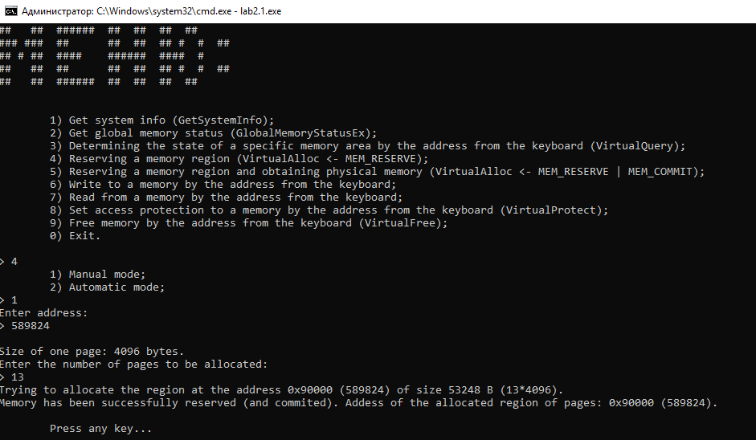

# Введение

Цель работы: исследовать механизмы управления виртуальной памятью Win32.

Задание:

1) Исследовать виртуальное адресное пространство процесса. Создать консольное приложение с меню, которое выполняет: 

- - получение  информации  о  вычислительной  системе  (функция Win32 API – GetSystemInfo); 

- - определение статуса виртуальной памяти (функция Win32 API – GlobalMemoryStatus); 

- - определение  состояния  конкретного  участка  памяти  по заданному  с  клавиатуры  адресу (функция  Win32  API  – VirtualQuery); 

- - резервирование региона в автоматическом режиме и в режиме ввода адреса начала региона (функция Win32 API – VirtualAlloc);

- - резервирование региона и передача ему физической памяти в автоматическом режиме и в режиме ввода адреса начала региона (функция Win32 API – VirtualAlloc);  

- - запись данных в  ячейки  памяти по  заданным  с  клавиатуры адресам; 

- - установку защиты доступа для заданного (с клавиатуры) региона памяти и ее проверку (функция Win32 API – VirtualProtect); 

- - возврат физической памяти и освобождение региона адресного пространства заданного (с клавиатуры) региона памяти (функция Win32 API – VirtualFree). 

2) Использовать проецируемые файлы для обмена данными между процессами. Создать два консольных приложения, которые выполняют: 

- - приложение-писатель создает проецируемый файл (функции Win32 API – CreateFile, CreateFileMapping), проецирует фрагмент файла в память (функции Win32 API – MapViewOfFile, UnmapViewOfFile), осуществляет ввод данных с клавиатуры и их запись в спроецированный файл; 

- - приложение-читатель открывает проецируемый файл (функция Win32  API  –  OpenFileMapping), проецирует фрагмент файла в память (функции  Win32  API  – MapViewOfFile, UnmapViewOfFile), считывает содержимое из спроецированного файла и отображает на экран. 

Исходный код доступен в [этом репозитории](https://github.com/The220th/etu2021_OC): https://github.com/The220th/etu2021_OC

# Исследование виртуального адресного пространства процесса

В ходе выполнения лабораторной работы была написана программа, которая выполняет поставленные задачи. Пример меню программы приведён на рисунке 1.

Рисунок 1 - Меню программы

Выбрав первый пункт меню, можно увидеть информацию о системе. Пример выбора пункта меню 1 приведён на рисунке 2.

Рисунок 2 - Пример информации о системе

Выбрав второй пункт меню, можно увидеть информацию о памяти в системе. Пример выбора пункта меню 2 приведён на рисунке 3.

Рисунок 3 - Пример информации о доступной памяти

Чтобы узнать информацию о конкретном регионе памяти, нужно выбрать пункт меню 3 и вести адрес. Пример таких действий изображён на рисунке 4.

Рисунок 4 - Пример информации об регионе памяти с адресом 589824

С помощью пункта меню 4 можно зарезервировать виртуальную память в автоматическом или ручном режиме. Пример резервирования памяти в ручном режиме показан на рисунке 5. Проверка успешной резервации показана на рисунке 6.

Рисунок 5 - Пример резервирования региона памяти с адресом 589824

Рисунок 6 - Пример проверки успешного зареверзирования региона памяти с адресом 589824

С помощью пункта меню 5 можно зарезервировать регион виртуальной памяти и передать ему физическую память в автоматическом или ручном режиме. Пример резервирования памяти в автоматическом режиме показан на рисунке 7. Можно заметить, что при умножении количества страниц на их размер (то есть 25*4096) в данном случае получится 102400. Именно столько указано в пункте "The size of the region (beginning at the base address) in which all pages have identical attributes".

Рисунок 7 - Пример резервирования региона и передача ему физической памяти в автоматическом режиме

Если успешно передать зарезервированному региону физическую память, то с помощью пункта меню 6 можно записать в этом регион что-нибудь. Прочитать с заданного региона можно с помощью пункта меню 7. Пример записи и чтения с региона памяти приведен на рисунках 8 и 9.

Рисунок 8 - Пример записи по адресу 1638400

Рисунок 9 - Пример чтения из региона по адресу 1638400

Чтобы установить защиту для заданного региона памяти, можно воспользоваться пунктом меню 8. Выделим 12 страниц с помощью пункта меню 5. Начальный адресс региона получился 1441792, затем изменим защиту для региона, начиная с адреса 1449984 (то есть пропустив две страницы). После проверим регионы с помощью пункта меню 3, начинающиеся с 1441792 (начало исходного региона), 1449984 (пропустив 2 региона) и 1454080 (пропустив 3 региона). Пример выполнения указанных действий приведён на рисунках 10, 11 и 12 и 13.

Рисунок 10 - Пример изменения зашиты региона

Рисунок 11 - Проверка региона по адресу 1441792

Рисунок 12 - Проверка региона по адресу 1449984

Рисунок 13 - Проверка региона по адресу 1454080

Выбрав пункт меню 9 можно освободить регион. Если регион "разбит" на несколько после изменения защиты "в середине", то можно указать любой адрес, который входит в изначальный регион. Программа сама выберет нужный "A pointer to the base address of a range of pages allocated by the VirtualAlloc". Пример освобождения памяти приведён на рисунке 14.

Рисунок 14 - Пример особождения памяти

Чтобы выйти из программы можно воспользоваться пунктом меню 0 (см. рисунок 15).

Рисунок 15 - Пример выхода из программы

Попытка записать (прочитать) данные в (из) регион(а) памяти, если параметры доступа не позволяют, окончится неудачей. Пример такой попытки приведён на рисунках 16, 17, 18. Хоть и программа обрабатывает такие случаи, но, например, при попытке записи данных в регион с параметром доступа "только чтение" поведение программы непредсказуемо (возможно аварийное завершение).

Автоматическое резервирование региона и передача ему физической памяти

Рисунок 17 - Пример изменения зашиты региона на режим "только чтение"

Рисунок 18 - Попытка записать что-нибудь в регион с правами доступа "только чтение"

Можно сделать следующие выводы. Виртуальное адресное пространство сильно больше, чем реально доступная физическая память. Резервирование региона и передача ему физической памяти работает правильно, если регион уже не был до этого зарезервирован, при этом нужно учитывать, что указанный адрес округлится до ближайшего числа, "кратного" размеру страницы (в данном случае 4096). Чтобы автоматически зарезервировать регион (и передать ему физическую память) нужно передать первым аргументом NULL в функцию VirtualAlloc. Изменение защиты поменяет начало этого региона памяти, но при этом указатель на "base address of a range of pages allocated by the VirtualAlloc" не изменится. Доступ к региону можно будет иметь только в соответствии параметрам доступа (см. рисунки 16-18), иначе поведение программы непредсказуемо. При освобождении памяти необходимо учитывать, что освобождаться будет регион, который был ``изначально`` выделен функцией VirtualAlloc (см. рисунки 10-14).

Исходный код программы доступен [здесь](https://github.com/The220th/etu2021_OC/tree/main/lab2/work1): https://github.com/The220th/etu2021_OC/tree/main/lab2/work1.

# Использование проецируемых файлов для обмена данными между процессами

Для этой цели были реализованы 2 программы: writer.exe и reader.exe. Первой должна отработать writer, которая произведёт запись в спроецированный файл, после этого reader может считать данные из этого спроецированного файла. Пример протокола работы writer.exe приведён на рисунке 19, а reader.exe - на рисунке 20.

Рисунок 19 - Пример протокола работы программы writer

Рисунок 20 - Пример протокола работы программы reader

Можно сделать некоторые выводы. Первый, адреса проекций writer и reader разные. Это произошло, потому что writer и reader проецируют объект в ``своё`` виртуальное адресное пространство. И второй, имя "file mapping object", должно быть уникальным и известным обоим программам.

Исходный код программ доступен [здесь](https://github.com/The220th/etu2021_OC/tree/main/lab2/work2): https://github.com/The220th/etu2021_OC/tree/main/lab2/work2.

# Вывод

В ходе выполнения лабораторной работы были исследованы некоторые механизмы управления виртуальной памятью Win32, в частности были изучены некоторые способы работы с виртуальным адресным пространством процесса и был использован проецируемый файл для обмена данными между двумя разными процессами.
