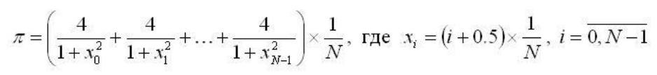
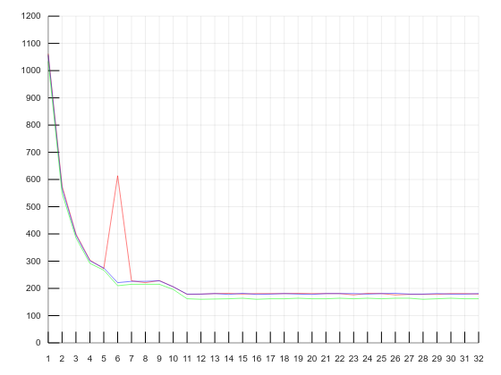
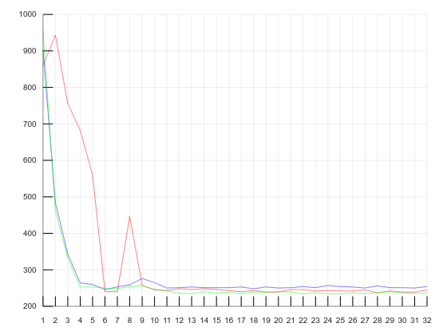
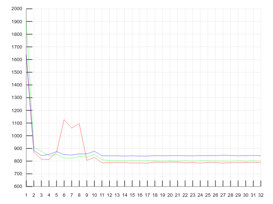
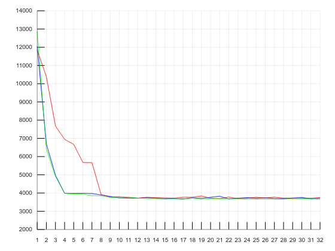
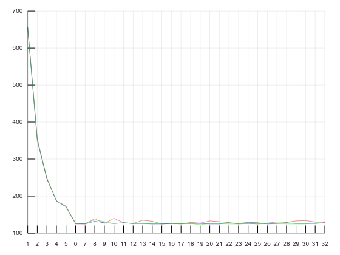
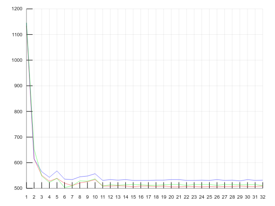
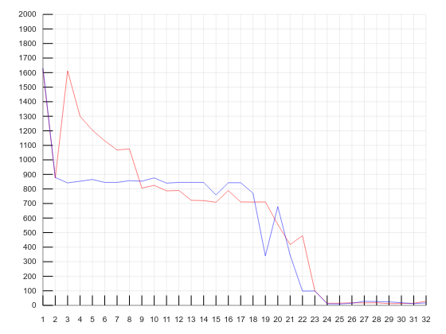

# Введение

Цель работы: исследовать механизмы создания и управления процессами и потоками в ОС Windows.

Задание:

1) Реализация многопоточного приложения с использованием функций Win32 API: 

- Создать приложение, которое вычисляет число pi с точностью N знаков после запятой по следующей формуле (N = 100000000):



- Использовать распределение итераций блоками (размер блока = 10 * N студбилета) по потокам. Сначала каждый поток по очереди получает свой блок итераций, затем тот поток, который заканчивает выполнение своего блока, получает следующий свободный блок итераций. Освободившиеся потоки получают новые блоки итераций до тех пор, пока все блоки не будут исчерпаны; 

- Создать потоки с помощью функции Win32 API `CreateThread`; 

- Для реализации механизма распределения блоков итераций необходимо сразу в начале программы создать необходимое количество потоков в приостановленном состоянии, для освобождения потока из приостановленного состояния использовать функцию Win32 API `ResumeThread`;

- По окончании обработки текущего блока итераций поток не должен завершаться, а должен быть, например, приостановлен с помощью функции Win32 API `SuspendThread`. Затем потоку должен быть предоставлен следующий свободный блок итераций, и поток должен быть освобожден, например, с помощью функции Win32 API `ResumeThread`;

- Произвести замеры времени выполнения приложения для разного числа потоков (1, 2, 4, 8, 12, 16, 32). По результатам измерений построить график и определить число потоков, при котором достигается наибольшая скорость выполнения. 

2) Реализация многопоточного приложения с использованием технологии OpenMP: 

- Создать приложение, которое вычисляет число pi с точностью N знаков после запятой по следующей формуле (N = 100000000):

 

- Распределить работу по потокам с помощью OpenMP-директивы `for`; 

- Использовать динамическое планирование блоками итераций (размер блока = 10 * N студбилета); 

- Произвести замеры времени выполнения приложения для разного числа потоков (1, 2, 4, 8, 12, 16, 32). По результатам измерений построить график и определить число потоков, при котором достигается наибольшая скорость выполнения. 

Исходный код доступен в [этом репозитории](https://github.com/The220th/etu2021_OC): https://github.com/The220th/etu2021_OC

# Выполнение работы

В ходе выполнения лабораторной работы были написаны программы, которые выполняют поставленные задачи. Для приложения с Win32 API использовалось 2 подхода.

Первый. Для каждого потока выдаются определённые блоки итераций. Отдельно высчитывается "локальная" сумма для каждого такого блока, после чего синхронизировано эта локальная сумма суммируется к итоговой. Суммирует к итоговой сумме только один поток, остальные, если есть такая нужда (например, если поток уже закончил высчитывать свою локальную сумму и тоже хочет прибавить её к итоговой), будут ждать. Как только поток прибавил локальную сумму к итоговой, он сразу, не дожидаясь пока остальные прибавят тоже, берёт следующий блок итераций. И так пока не закончатся эти самые блоки.

Второй. Всё то же самое, но суммирование всех локальных сумм происходит в конце и одним (основным) потоком. 

Для приложения с OpenMP использовались директивы препроцессора `#pragma omp parallel reduction (+: sum) num_threads(threadNum)` и `#pragma omp for schedule(dynamic, blocksize) nowait`. Первая означает, что блок нужно выполнять параллельно и что нужно задать локальную переменную sym, которая потом "просуммируется" к итоговой sum. Вторая директива означает, что планирование будет динамическим, где каждый поток будет получать blocksize итераций, а после выполнения запросит ещё; nowait означает, что барьерной синхронизации в конце цикла не будет. 

Для замера времени была написана [программа-замерщик](https://github.com/The220th/etu2021_OC/tree/main/lab3/comparino). Она для каждого количества потоков от 1 до 32 по 10 раз считает число пи и фиксирует среднее время подсчёта для каждого приложения. В дальнейшем на графиках зависимости времени от количества потоков приложения будут обозначаться следующим образом: 

- Приложение с использованием функций Win32 API с первым подходом — красный цвет

- Приложение с использованием функций Win32 API со вторым подходом — синий цвет

- Приложение с использованием технологии OpenMP — зелёный цвет

Протоколы программы-замерщика приведены в приложениях А, Б, В, Г, Д и Е. 

Получились следующие результаты. График зависимости времени от количества потоков для ПК с Ryzen 5 3600 (6 физических ядер или 12 логических) и DDR4 приведён на рисунке 1, для ПК с Intel Core i5-3570 (4 физических ядра или 4 логических) и DDR3 — на рисунке 2, для ПК с Intel Core i5-4300U (2 физических ядра или 4 логических) и DDR3 — на рисунке 3, для ПК с Intel Atom N570 (2 физических ядра или 4 логических) и DDR2 — на рисунке 4, для ПК с Intel Core i5-9400F (6 физических ядра или 6 логических) и DDR4 — на рисунке 5, для ПК с Intel Pentium 5405U класса GOLD (2 физических ядра или 4 логических) и DDR4 — на рисунке 6.



<center>Рисунок 1 — Замер для ПК с Ryzen 5 3600</center>



<center>Рисунок 2 — Замер для ПК с Intel Core i5-3570</center>



<center>Рисунок 3 — Замер для ПК с Intel Core i5-4300U</center>



<center>Рисунок 4 — Замер для ПК с Intel Atom N570</center>



<center>Рисунок 5 — Замер для ПК с Intel Core i5-9400F</center>



<center>Рисунок 6 — Замер для ПК с Intel Pentium 5405U класса GOLD</center>

Из замеров видно, что результаты примерно похожи. Иногда быстрее реализация с технологией OpenMP (см. рис. 1), иногда быстрее реализация с Win32 API с первым подходом (см. рис. 3), а иногда какая реализация быстрее нельзя сказать (см. рисунки 2 и 4). Всё это также зависит от реализации "распараллеливания" программы. "Горки" и "пики" на графиках можно объяснить тем, что ПК во время замеров мог быть нагружен в неопределённый момент времени.

Из графиков также можно сделать вывод, что время почти не будет меняться, начиная с количества потоков, равное примерно количеству ядер процессора. Особенно это хорошо видно на рисунке 1 — начиная с примерно 12 потоков время уже почти не меняется и остаётся минимальным. Также, переставив начало таймера в разные места, можно сделать вывод о том, что на создание и возобновление после создания потоков уходит очень много времени. Это хорошо видно на замере, изображённого на рисунке 7.



<center>Рисунок 7 — Замер, где не учитывается время создания и возобновления после создания потоков</center>

Сам отсчёт времени на рисунке 7 начинается после возобновления всех потоков (функция `ResumeThread`). На графике видно, что, начиная где-то с 24 потоков, время просто не успевает нормально зафиксироваться, потому что потоки, которые уже возобновились с помощью функции Win32 API `ResumeThread`, посчитали число пи почти до конца.

Исходный код всех программ доступен [здесь](https://github.com/The220th/etu2021_OC/tree/main/lab3): https://github.com/The220th/etu2021_OC/tree/main/lab3.

# Вывод

В ходе выполнения лабораторной работы были исследованы некоторые механизмы создания и управления процессами и потоками в ОС Windows. Также были изучены азы применения технологии OpenMP.

# Приложение А

Протокол выполнения программы на ПК Ryzen 5 3600 (6 физических ядер или 12 логических), DDR4:

``` bash
C:\Users\wex\Downloads\etu2021_OC-main (4)\etu2021_OC-main\lab3\comparino>comparino.exe
work1:
For 1 threads:
Circle 1: 3.1415929662565249204549122641338954053935594856739044189453125
Circle 2: 3.1415929662565249204549122641338954053935594856739044189453125
Circle 3: 3.1415929662565249204549122641338954053935594856739044189453125
Circle 4: 3.1415929662565249204549122641338954053935594856739044189453125
Circle 5: 3.1415929662565249204549122641338954053935594856739044189453125
Circle 6: 3.1415929662565249204549122641338954053935594856739044189453125
Circle 7: 3.1415929662565249204549122641338954053935594856739044189453125
Circle 8: 3.1415929662565249204549122641338954053935594856739044189453125
Circle 9: 3.1415929662565249204549122641338954053935594856739044189453125
Circle 10: 3.1415929662565249204549122641338954053935594856739044189453125
Threads 1: 1062 milisec (1.0619999999999999999895916591441391574335284531116485595703125 sec).
For 2 threads:
Circle 1: 3.1415929662565249204549122641338954053935594856739044189453125
Circle 2: 3.1415929662565249204549122641338954053935594856739044189453125
Circle 3: 3.1415929662565249204549122641338954053935594856739044189453125
Circle 4: 3.1415929662565249204549122641338954053935594856739044189453125
Circle 5: 3.1415929662565249204549122641338954053935594856739044189453125
Circle 6: 3.1415929662565249204549122641338954053935594856739044189453125
Circle 7: 3.1415929662565249204549122641338954053935594856739044189453125
Circle 8: 3.1415929662565249204549122641338954053935594856739044189453125
Circle 9: 3.1415929662565249204549122641338954053935594856739044189453125
Circle 10: 3.1415929662565249204549122641338954053935594856739044189453125
Threads 2: 576 milisec (0.5760000000000000000099746599868666407928685657680034637451171875 sec).
For 3 threads:
Circle 1: 3.1415929662565249204549122641338954053935594856739044189453125
Circle 2: 3.1415929662565249204549122641338954053935594856739044189453125
Circle 3: 3.1415929662565249204549122641338954053935594856739044189453125
Circle 4: 3.1415929662565249204549122641338954053935594856739044189453125
Circle 5: 3.1415929662565249204549122641338954053935594856739044189453125
Circle 6: 3.1415929662565249204549122641338954053935594856739044189453125
Circle 7: 3.1415929662565249204549122641338954053935594856739044189453125
Circle 8: 3.1415929662565249204549122641338954053935594856739044189453125
Circle 9: 3.1415929662565249204549122641338954053935594856739044189453125
Circle 10: 3.1415929662565249204549122641338954053935594856739044189453125
Threads 3: 400 milisec (0.40000000000000000000542101086242752217003726400434970855712890625 sec).
For 4 threads:
Circle 1: 3.1415929662565249204549122641338954053935594856739044189453125
Circle 2: 3.1415929662565249204549122641338954053935594856739044189453125
Circle 3: 3.1415929662565249204549122641338954053935594856739044189453125
Circle 4: 3.1415929662565249204549122641338954053935594856739044189453125
Circle 5: 3.1415929662565249204549122641338954053935594856739044189453125
Circle 6: 3.1415929662565249204549122641338954053935594856739044189453125
Circle 7: 3.1415929662565249204549122641338954053935594856739044189453125
Circle 8: 3.1415929662565249204549122641338954053935594856739044189453125
Circle 9: 3.1415929662565249204549122641338954053935594856739044189453125
Circle 10: 3.1415929662565249204549122641338954053935594856739044189453125
Threads 4: 304 milisec (0.30400000000000000001279358563532895232128794305026531219482421875 sec).
For 5 threads:
Circle 1: 3.1415929662565249204549122641338954053935594856739044189453125
Circle 2: 3.1415929662565249204549122641338954053935594856739044189453125
Circle 3: 3.1415929662565249204549122641338954053935594856739044189453125
Circle 4: 3.1415929662565249204549122641338954053935594856739044189453125
Circle 5: 3.14159296625652551654926669666423322269110940396785736083984375
Circle 6: 3.14159296625652551654926669666423322269110940396785736083984375
Circle 7: 3.1415929662565249204549122641338954053935594856739044189453125
Circle 8: 3.1415929662565249204549122641338954053935594856739044189453125
Circle 9: 3.1415929662565249204549122641338954053935594856739044189453125
Circle 10: 3.14159296625652432436055783160355758809600956737995147705078125
Threads 5: 273 milisec (0.2729999999999999999908927017511217627543373964726924896240234375 sec).
For 6 threads:
Circle 1: 3.1415929662565249204549122641338954053935594856739044189453125
Circle 2: 3.1415929662565249204549122641338954053935594856739044189453125
Circle 3: 3.1415929662565249204549122641338954053935594856739044189453125
Circle 4: 3.14159296625652432436055783160355758809600956737995147705078125
Circle 5: 3.1415929662565249204549122641338954053935594856739044189453125
Circle 6: 3.1415929662565249204549122641338954053935594856739044189453125
Circle 7: 3.1415929662565249204549122641338954053935594856739044189453125
Circle 8: 3.14159296625652432436055783160355758809600956737995147705078125
Circle 9: 3.1415929662565249204549122641338954053935594856739044189453125
Circle 10: 3.14159296625652432436055783160355758809600956737995147705078125
Threads 6: 614 milisec (0.61399999999999999998785693566816235033911652863025665283203125 sec).
For 7 threads:
Circle 1: 3.1415929662565249204549122641338954053935594856739044189453125
Circle 2: 3.14159296625652432436055783160355758809600956737995147705078125
Circle 3: 3.1415929662565249204549122641338954053935594856739044189453125
Circle 4: 3.1415929662565249204549122641338954053935594856739044189453125
Circle 5: 3.1415929662565249204549122641338954053935594856739044189453125
Circle 6: 3.1415929662565249204549122641338954053935594856739044189453125
Circle 7: 3.1415929662565249204549122641338954053935594856739044189453125
Circle 8: 3.1415929662565249204549122641338954053935594856739044189453125
Circle 9: 3.14159296625652432436055783160355758809600956737995147705078125
Circle 10: 3.14159296625652432436055783160355758809600956737995147705078125
Threads 7: 228 milisec (0.22800000000000000000281892564846231152841937728226184844970703125 sec).
For 8 threads:
Circle 1: 3.1415929662565249204549122641338954053935594856739044189453125
Circle 2: 3.14159296625652432436055783160355758809600956737995147705078125
Circle 3: 3.1415929662565249204549122641338954053935594856739044189453125
Circle 4: 3.14159296625652432436055783160355758809600956737995147705078125
Circle 5: 3.1415929662565249204549122641338954053935594856739044189453125
Circle 6: 3.1415929662565249204549122641338954053935594856739044189453125
Circle 7: 3.1415929662565249204549122641338954053935594856739044189453125
Circle 8: 3.14159296625652432436055783160355758809600956737995147705078125
Circle 9: 3.14159296625652432436055783160355758809600956737995147705078125
Circle 10: 3.1415929662565249204549122641338954053935594856739044189453125
Threads 8: 221 milisec (0.221000000000000000006179952383167375273842480964958667755126953125 sec).
For 9 threads:
Circle 1: 3.1415929662565249204549122641338954053935594856739044189453125
Circle 2: 3.1415929662565249204549122641338954053935594856739044189453125
Circle 3: 3.1415929662565249204549122641338954053935594856739044189453125
Circle 4: 3.1415929662565249204549122641338954053935594856739044189453125
Circle 5: 3.1415929662565249204549122641338954053935594856739044189453125
Circle 6: 3.1415929662565249204549122641338954053935594856739044189453125
Circle 7: 3.1415929662565249204549122641338954053935594856739044189453125
Circle 8: 3.1415929662565249204549122641338954053935594856739044189453125
Circle 9: 3.1415929662565249204549122641338954053935594856739044189453125
Circle 10: 3.1415929662565249204549122641338954053935594856739044189453125
Threads 9: 229 milisec (0.2289999999999999999965305530480463858111761510372161865234375 sec).
For 10 threads:
Circle 1: 3.1415929662565249204549122641338954053935594856739044189453125
Circle 2: 3.14159296625652551654926669666423322269110940396785736083984375
Circle 3: 3.14159296625652551654926669666423322269110940396785736083984375
Circle 4: 3.1415929662565249204549122641338954053935594856739044189453125
Circle 5: 3.1415929662565249204549122641338954053935594856739044189453125
Circle 6: 3.14159296625652551654926669666423322269110940396785736083984375
Circle 7: 3.1415929662565249204549122641338954053935594856739044189453125
Circle 8: 3.1415929662565249204549122641338954053935594856739044189453125
Circle 9: 3.1415929662565249204549122641338954053935594856739044189453125
Circle 10: 3.1415929662565249204549122641338954053935594856739044189453125
Threads 10: 206 milisec (0.2060000000000000000056378512969246230568387545645236968994140625 sec).
For 11 threads:
Circle 1: 3.14159296625652432436055783160355758809600956737995147705078125
Circle 2: 3.14159296625652551654926669666423322269110940396785736083984375
Circle 3: 3.14159296625652551654926669666423322269110940396785736083984375
Circle 4: 3.1415929662565249204549122641338954053935594856739044189453125
Circle 5: 3.1415929662565249204549122641338954053935594856739044189453125
Circle 6: 3.14159296625652432436055783160355758809600956737995147705078125
Circle 7: 3.14159296625652432436055783160355758809600956737995147705078125
Circle 8: 3.1415929662565249204549122641338954053935594856739044189453125
Circle 9: 3.14159296625652432436055783160355758809600956737995147705078125
Circle 10: 3.1415929662565249204549122641338954053935594856739044189453125
Threads 11: 178 milisec (0.178000000000000000005529431079676072613438009284436702728271484375 sec).
For 12 threads:
Circle 1: 3.14159296625652432436055783160355758809600956737995147705078125
Circle 2: 3.1415929662565249204549122641338954053935594856739044189453125
Circle 3: 3.1415929662565249204549122641338954053935594856739044189453125
Circle 4: 3.1415929662565249204549122641338954053935594856739044189453125
Circle 5: 3.14159296625652432436055783160355758809600956737995147705078125
Circle 6: 3.1415929662565249204549122641338954053935594856739044189453125
Circle 7: 3.1415929662565249204549122641338954053935594856739044189453125
Circle 8: 3.1415929662565249204549122641338954053935594856739044189453125
Circle 9: 3.14159296625652432436055783160355758809600956737995147705078125
Circle 10: 3.14159296625652551654926669666423322269110940396785736083984375
Threads 12: 179 milisec (0.178999999999999999999241058479260146896194783039391040802001953125 sec).
For 13 threads:
Circle 1: 3.1415929662565249204549122641338954053935594856739044189453125
Circle 2: 3.1415929662565249204549122641338954053935594856739044189453125
Circle 3: 3.14159296625652432436055783160355758809600956737995147705078125
Circle 4: 3.1415929662565249204549122641338954053935594856739044189453125
Circle 5: 3.1415929662565249204549122641338954053935594856739044189453125
Circle 6: 3.1415929662565249204549122641338954053935594856739044189453125
Circle 7: 3.14159296625652432436055783160355758809600956737995147705078125
Circle 8: 3.1415929662565249204549122641338954053935594856739044189453125
Circle 9: 3.1415929662565249204549122641338954053935594856739044189453125
Circle 10: 3.1415929662565249204549122641338954053935594856739044189453125
Threads 13: 181 milisec (0.18100000000000000000021684043449710088680149056017398834228515625 sec).
For 14 threads:
Circle 1: 3.14159296625652551654926669666423322269110940396785736083984375
Circle 2: 3.1415929662565249204549122641338954053935594856739044189453125
Circle 3: 3.1415929662565249204549122641338954053935594856739044189453125
Circle 4: 3.1415929662565249204549122641338954053935594856739044189453125
Circle 5: 3.14159296625652432436055783160355758809600956737995147705078125
Circle 6: 3.1415929662565249204549122641338954053935594856739044189453125
Circle 7: 3.1415929662565249204549122641338954053935594856739044189453125
Circle 8: 3.14159296625652432436055783160355758809600956737995147705078125
Circle 9: 3.14159296625652551654926669666423322269110940396785736083984375
Circle 10: 3.14159296625652432436055783160355758809600956737995147705078125
Threads 14: 182 milisec (0.181999999999999999993928467834081175169558264315128326416015625 sec).
For 15 threads:
Circle 1: 3.14159296625652432436055783160355758809600956737995147705078125
Circle 2: 3.1415929662565249204549122641338954053935594856739044189453125
Circle 3: 3.14159296625652432436055783160355758809600956737995147705078125
Circle 4: 3.1415929662565249204549122641338954053935594856739044189453125
Circle 5: 3.1415929662565249204549122641338954053935594856739044189453125
Circle 6: 3.14159296625652432436055783160355758809600956737995147705078125
Circle 7: 3.14159296625652432436055783160355758809600956737995147705078125
Circle 8: 3.1415929662565249204549122641338954053935594856739044189453125
Circle 9: 3.1415929662565249204549122641338954053935594856739044189453125
Circle 10: 3.1415929662565249204549122641338954053935594856739044189453125
Threads 15: 179 milisec (0.178999999999999999999241058479260146896194783039391040802001953125 sec).
For 16 threads:
Circle 1: 3.14159296625652432436055783160355758809600956737995147705078125
Circle 2: 3.1415929662565249204549122641338954053935594856739044189453125
Circle 3: 3.1415929662565249204549122641338954053935594856739044189453125
Circle 4: 3.1415929662565249204549122641338954053935594856739044189453125
Circle 5: 3.1415929662565249204549122641338954053935594856739044189453125
Circle 6: 3.14159296625652432436055783160355758809600956737995147705078125
Circle 7: 3.14159296625652432436055783160355758809600956737995147705078125
Circle 8: 3.14159296625652432436055783160355758809600956737995147705078125
Circle 9: 3.14159296625652551654926669666423322269110940396785736083984375
Circle 10: 3.1415929662565249204549122641338954053935594856739044189453125
Threads 16: 181 milisec (0.18100000000000000000021684043449710088680149056017398834228515625 sec).
For 17 threads:
Circle 1: 3.1415929662565249204549122641338954053935594856739044189453125
Circle 2: 3.1415929662565249204549122641338954053935594856739044189453125
Circle 3: 3.1415929662565249204549122641338954053935594856739044189453125
Circle 4: 3.1415929662565249204549122641338954053935594856739044189453125
Circle 5: 3.14159296625652432436055783160355758809600956737995147705078125
Circle 6: 3.1415929662565249204549122641338954053935594856739044189453125
Circle 7: 3.1415929662565249204549122641338954053935594856739044189453125
Circle 8: 3.1415929662565249204549122641338954053935594856739044189453125
Circle 9: 3.1415929662565249204549122641338954053935594856739044189453125
Circle 10: 3.14159296625652551654926669666423322269110940396785736083984375
Threads 17: 181 milisec (0.18100000000000000000021684043449710088680149056017398834228515625 sec).
For 18 threads:
Circle 1: 3.1415929662565249204549122641338954053935594856739044189453125
Circle 2: 3.1415929662565249204549122641338954053935594856739044189453125
Circle 3: 3.14159296625652432436055783160355758809600956737995147705078125
Circle 4: 3.14159296625652551654926669666423322269110940396785736083984375
Circle 5: 3.1415929662565249204549122641338954053935594856739044189453125
Circle 6: 3.14159296625652551654926669666423322269110940396785736083984375
Circle 7: 3.14159296625652432436055783160355758809600956737995147705078125
Circle 8: 3.1415929662565249204549122641338954053935594856739044189453125
Circle 9: 3.1415929662565249204549122641338954053935594856739044189453125
Circle 10: 3.14159296625652432436055783160355758809600956737995147705078125
Threads 18: 181 milisec (0.18100000000000000000021684043449710088680149056017398834228515625 sec).
For 19 threads:
Circle 1: 3.1415929662565249204549122641338954053935594856739044189453125
Circle 2: 3.14159296625652551654926669666423322269110940396785736083984375
Circle 3: 3.1415929662565249204549122641338954053935594856739044189453125
Circle 4: 3.1415929662565249204549122641338954053935594856739044189453125
Circle 5: 3.1415929662565249204549122641338954053935594856739044189453125
Circle 6: 3.14159296625652432436055783160355758809600956737995147705078125
Circle 7: 3.1415929662565249204549122641338954053935594856739044189453125
Circle 8: 3.14159296625652432436055783160355758809600956737995147705078125
Circle 9: 3.1415929662565249204549122641338954053935594856739044189453125
Circle 10: 3.1415929662565249204549122641338954053935594856739044189453125
Threads 19: 182 milisec (0.181999999999999999993928467834081175169558264315128326416015625 sec).
For 20 threads:
Circle 1: 3.1415929662565249204549122641338954053935594856739044189453125
Circle 2: 3.1415929662565249204549122641338954053935594856739044189453125
Circle 3: 3.1415929662565249204549122641338954053935594856739044189453125
Circle 4: 3.1415929662565249204549122641338954053935594856739044189453125
Circle 5: 3.1415929662565249204549122641338954053935594856739044189453125
Circle 6: 3.1415929662565249204549122641338954053935594856739044189453125
Circle 7: 3.1415929662565249204549122641338954053935594856739044189453125
Circle 8: 3.1415929662565249204549122641338954053935594856739044189453125
Circle 9: 3.14159296625652432436055783160355758809600956737995147705078125
Circle 10: 3.14159296625652432436055783160355758809600956737995147705078125
Threads 20: 181 milisec (0.18100000000000000000021684043449710088680149056017398834228515625 sec).
For 21 threads:
Circle 1: 3.14159296625652432436055783160355758809600956737995147705078125
Circle 2: 3.1415929662565249204549122641338954053935594856739044189453125
Circle 3: 3.14159296625652432436055783160355758809600956737995147705078125
Circle 4: 3.1415929662565249204549122641338954053935594856739044189453125
Circle 5: 3.1415929662565249204549122641338954053935594856739044189453125
Circle 6: 3.1415929662565249204549122641338954053935594856739044189453125
Circle 7: 3.1415929662565249204549122641338954053935594856739044189453125
Circle 8: 3.1415929662565249204549122641338954053935594856739044189453125
Circle 9: 3.14159296625652551654926669666423322269110940396785736083984375
Circle 10: 3.1415929662565249204549122641338954053935594856739044189453125
Threads 21: 181 milisec (0.18100000000000000000021684043449710088680149056017398834228515625 sec).
For 22 threads:
Circle 1: 3.1415929662565249204549122641338954053935594856739044189453125
Circle 2: 3.14159296625652551654926669666423322269110940396785736083984375
Circle 3: 3.1415929662565249204549122641338954053935594856739044189453125
Circle 4: 3.1415929662565249204549122641338954053935594856739044189453125
Circle 5: 3.1415929662565249204549122641338954053935594856739044189453125
Circle 6: 3.1415929662565249204549122641338954053935594856739044189453125
Circle 7: 3.1415929662565249204549122641338954053935594856739044189453125
Circle 8: 3.1415929662565249204549122641338954053935594856739044189453125
Circle 9: 3.1415929662565249204549122641338954053935594856739044189453125
Circle 10: 3.1415929662565249204549122641338954053935594856739044189453125
Threads 22: 181 milisec (0.18100000000000000000021684043449710088680149056017398834228515625 sec).
For 23 threads:
Circle 1: 3.1415929662565249204549122641338954053935594856739044189453125
Circle 2: 3.1415929662565249204549122641338954053935594856739044189453125
Circle 3: 3.1415929662565249204549122641338954053935594856739044189453125
Circle 4: 3.1415929662565249204549122641338954053935594856739044189453125
Circle 5: 3.14159296625652551654926669666423322269110940396785736083984375
Circle 6: 3.1415929662565249204549122641338954053935594856739044189453125
Circle 7: 3.14159296625652432436055783160355758809600956737995147705078125
Circle 8: 3.1415929662565249204549122641338954053935594856739044189453125
Circle 9: 3.14159296625652432436055783160355758809600956737995147705078125
Circle 10: 3.1415929662565249204549122641338954053935594856739044189453125
Threads 23: 176 milisec (0.17600000000000000000455364912443911862283130176365375518798828125 sec).
For 24 threads:
Circle 1: 3.1415929662565249204549122641338954053935594856739044189453125
Circle 2: 3.1415929662565249204549122641338954053935594856739044189453125
Circle 3: 3.1415929662565249204549122641338954053935594856739044189453125
Circle 4: 3.1415929662565249204549122641338954053935594856739044189453125
Circle 5: 3.1415929662565249204549122641338954053935594856739044189453125
Circle 6: 3.1415929662565249204549122641338954053935594856739044189453125
Circle 7: 3.14159296625652432436055783160355758809600956737995147705078125
Circle 8: 3.1415929662565249204549122641338954053935594856739044189453125
Circle 9: 3.1415929662565249204549122641338954053935594856739044189453125
Circle 10: 3.1415929662565249204549122641338954053935594856739044189453125
Threads 24: 182 milisec (0.181999999999999999993928467834081175169558264315128326416015625 sec).
For 25 threads:
Circle 1: 3.1415929662565249204549122641338954053935594856739044189453125
Circle 2: 3.1415929662565249204549122641338954053935594856739044189453125
Circle 3: 3.14159296625652432436055783160355758809600956737995147705078125
Circle 4: 3.14159296625652432436055783160355758809600956737995147705078125
Circle 5: 3.1415929662565249204549122641338954053935594856739044189453125
Circle 6: 3.1415929662565249204549122641338954053935594856739044189453125
Circle 7: 3.14159296625652551654926669666423322269110940396785736083984375
Circle 8: 3.14159296625652551654926669666423322269110940396785736083984375
Circle 9: 3.1415929662565249204549122641338954053935594856739044189453125
Circle 10: 3.1415929662565249204549122641338954053935594856739044189453125
Threads 25: 181 milisec (0.18100000000000000000021684043449710088680149056017398834228515625 sec).
For 26 threads:
Circle 1: 3.1415929662565249204549122641338954053935594856739044189453125
Circle 2: 3.1415929662565249204549122641338954053935594856739044189453125
Circle 3: 3.1415929662565249204549122641338954053935594856739044189453125
Circle 4: 3.14159296625652432436055783160355758809600956737995147705078125
Circle 5: 3.14159296625652432436055783160355758809600956737995147705078125
Circle 6: 3.1415929662565249204549122641338954053935594856739044189453125
Circle 7: 3.14159296625652551654926669666423322269110940396785736083984375
Circle 8: 3.1415929662565249204549122641338954053935594856739044189453125
Circle 9: 3.1415929662565249204549122641338954053935594856739044189453125
Circle 10: 3.1415929662565249204549122641338954053935594856739044189453125
Threads 26: 176 milisec (0.17600000000000000000455364912443911862283130176365375518798828125 sec).
For 27 threads:
Circle 1: 3.1415929662565249204549122641338954053935594856739044189453125
Circle 2: 3.14159296625652432436055783160355758809600956737995147705078125
Circle 3: 3.1415929662565249204549122641338954053935594856739044189453125
Circle 4: 3.14159296625652432436055783160355758809600956737995147705078125
Circle 5: 3.14159296625652551654926669666423322269110940396785736083984375
Circle 6: 3.1415929662565249204549122641338954053935594856739044189453125
Circle 7: 3.14159296625652432436055783160355758809600956737995147705078125
Circle 8: 3.1415929662565249204549122641338954053935594856739044189453125
Circle 9: 3.14159296625652432436055783160355758809600956737995147705078125
Circle 10: 3.1415929662565249204549122641338954053935594856739044189453125
Threads 27: 178 milisec (0.178000000000000000005529431079676072613438009284436702728271484375 sec).
For 28 threads:
Circle 1: 3.1415929662565249204549122641338954053935594856739044189453125
Circle 2: 3.1415929662565249204549122641338954053935594856739044189453125
Circle 3: 3.1415929662565249204549122641338954053935594856739044189453125
Circle 4: 3.1415929662565249204549122641338954053935594856739044189453125
Circle 5: 3.14159296625652551654926669666423322269110940396785736083984375
Circle 6: 3.1415929662565249204549122641338954053935594856739044189453125
Circle 7: 3.14159296625652432436055783160355758809600956737995147705078125
Circle 8: 3.14159296625652551654926669666423322269110940396785736083984375
Circle 9: 3.1415929662565249204549122641338954053935594856739044189453125
Circle 10: 3.1415929662565249204549122641338954053935594856739044189453125
Threads 28: 178 milisec (0.178000000000000000005529431079676072613438009284436702728271484375 sec).
For 29 threads:
Circle 1: 3.1415929662565249204549122641338954053935594856739044189453125
Circle 2: 3.14159296625652551654926669666423322269110940396785736083984375
Circle 3: 3.14159296625652432436055783160355758809600956737995147705078125
Circle 4: 3.14159296625652551654926669666423322269110940396785736083984375
Circle 5: 3.1415929662565249204549122641338954053935594856739044189453125
Circle 6: 3.14159296625652551654926669666423322269110940396785736083984375
Circle 7: 3.14159296625652432436055783160355758809600956737995147705078125
Circle 8: 3.1415929662565249204549122641338954053935594856739044189453125
Circle 9: 3.1415929662565249204549122641338954053935594856739044189453125
Circle 10: 3.1415929662565249204549122641338954053935594856739044189453125
Threads 29: 178 milisec (0.178000000000000000005529431079676072613438009284436702728271484375 sec).
For 30 threads:
Circle 1: 3.1415929662565249204549122641338954053935594856739044189453125
Circle 2: 3.1415929662565249204549122641338954053935594856739044189453125
Circle 3: 3.1415929662565249204549122641338954053935594856739044189453125
Circle 4: 3.14159296625652432436055783160355758809600956737995147705078125
Circle 5: 3.1415929662565249204549122641338954053935594856739044189453125
Circle 6: 3.14159296625652432436055783160355758809600956737995147705078125
Circle 7: 3.14159296625652432436055783160355758809600956737995147705078125
Circle 8: 3.1415929662565249204549122641338954053935594856739044189453125
Circle 9: 3.1415929662565249204549122641338954053935594856739044189453125
Circle 10: 3.1415929662565249204549122641338954053935594856739044189453125
Threads 30: 181 milisec (0.18100000000000000000021684043449710088680149056017398834228515625 sec).
For 31 threads:
Circle 1: 3.1415929662565249204549122641338954053935594856739044189453125
Circle 2: 3.14159296625652432436055783160355758809600956737995147705078125
Circle 3: 3.1415929662565249204549122641338954053935594856739044189453125
Circle 4: 3.1415929662565249204549122641338954053935594856739044189453125
Circle 5: 3.1415929662565249204549122641338954053935594856739044189453125
Circle 6: 3.1415929662565249204549122641338954053935594856739044189453125
Circle 7: 3.14159296625652432436055783160355758809600956737995147705078125
Circle 8: 3.1415929662565249204549122641338954053935594856739044189453125
Circle 9: 3.1415929662565249204549122641338954053935594856739044189453125
Circle 10: 3.1415929662565249204549122641338954053935594856739044189453125
Threads 31: 181 milisec (0.18100000000000000000021684043449710088680149056017398834228515625 sec).
For 32 threads:
Circle 1: 3.14159296625652432436055783160355758809600956737995147705078125
Circle 2: 3.14159296625652432436055783160355758809600956737995147705078125
Circle 3: 3.1415929662565249204549122641338954053935594856739044189453125
Circle 4: 3.14159296625652551654926669666423322269110940396785736083984375
Circle 5: 3.14159296625652432436055783160355758809600956737995147705078125
Circle 6: 3.1415929662565249204549122641338954053935594856739044189453125
Circle 7: 3.1415929662565249204549122641338954053935594856739044189453125
Circle 8: 3.14159296625652432436055783160355758809600956737995147705078125
Circle 9: 3.1415929662565249204549122641338954053935594856739044189453125
Circle 10: 3.1415929662565249204549122641338954053935594856739044189453125
Threads 32: 179 milisec (0.178999999999999999999241058479260146896194783039391040802001953125 sec).


work1-SHAKAL:
For 1 threads:
Circle 1: 3.14159265358980165799319961283941893270821310579776763916015625
Circle 2: 3.14159265358980165799319961283941893270821310579776763916015625
Circle 3: 3.14159265358980165799319961283941893270821310579776763916015625
Circle 4: 3.14159265358980165799319961283941893270821310579776763916015625
Circle 5: 3.14159265358980165799319961283941893270821310579776763916015625
Circle 6: 3.14159265358980165799319961283941893270821310579776763916015625
Circle 7: 3.14159265358980165799319961283941893270821310579776763916015625
Circle 8: 3.14159265358980165799319961283941893270821310579776763916015625
Circle 9: 3.14159265358980165799319961283941893270821310579776763916015625
Circle 10: 3.14159265358980165799319961283941893270821310579776763916015625
Threads 1: 1057 milisec (1.056999999999999999993928467834081175169558264315128326416015625 sec).
For 2 threads:
Circle 1: 3.14159265358980165799319961283941893270821310579776763916015625
Circle 2: 3.14159265358980165799319961283941893270821310579776763916015625
Circle 3: 3.14159265358980165799319961283941893270821310579776763916015625
Circle 4: 3.14159265358980165799319961283941893270821310579776763916015625
Circle 5: 3.14159265358980165799319961283941893270821310579776763916015625
Circle 6: 3.14159265358980165799319961283941893270821310579776763916015625
Circle 7: 3.14159265358980165799319961283941893270821310579776763916015625
Circle 8: 3.14159265358980165799319961283941893270821310579776763916015625
Circle 9: 3.14159265358980165799319961283941893270821310579776763916015625
Circle 10: 3.14159265358980165799319961283941893270821310579776763916015625
Threads 2: 567 milisec (0.566999999999999999985254850454197139697498641908168792724609375 sec).
For 3 threads:
Circle 1: 3.14159265358980165799319961283941893270821310579776763916015625
Circle 2: 3.14159265358980165799319961283941893270821310579776763916015625
Circle 3: 3.14159265358980165799319961283941893270821310579776763916015625
Circle 4: 3.14159265358980165799319961283941893270821310579776763916015625
Circle 5: 3.14159265358980165799319961283941893270821310579776763916015625
Circle 6: 3.14159265358980165799319961283941893270821310579776763916015625
Circle 7: 3.14159265358980165799319961283941893270821310579776763916015625
Circle 8: 3.14159265358980165799319961283941893270821310579776763916015625
Circle 9: 3.14159265358980165799319961283941893270821310579776763916015625
Circle 10: 3.14159265358980165799319961283941893270821310579776763916015625
Threads 3: 396 milisec (0.3960000000000000000034694469519536141888238489627838134765625 sec).
For 4 threads:
Circle 1: 3.14159265358980165799319961283941893270821310579776763916015625
Circle 2: 3.14159265358980165799319961283941893270821310579776763916015625
Circle 3: 3.14159265358980165799319961283941893270821310579776763916015625
Circle 4: 3.14159265358980165799319961283941893270821310579776763916015625
Circle 5: 3.14159265358980165799319961283941893270821310579776763916015625
Circle 6: 3.14159265358980165799319961283941893270821310579776763916015625
Circle 7: 3.14159265358980165799319961283941893270821310579776763916015625
Circle 8: 3.14159265358980165799319961283941893270821310579776763916015625
Circle 9: 3.14159265358980165799319961283941893270821310579776763916015625
Circle 10: 3.14159265358980165799319961283941893270821310579776763916015625
Threads 4: 301 milisec (0.30100000000000000000455364912443911862283130176365375518798828125 sec).
For 5 threads:
Circle 1: 3.14159265358980165799319961283941893270821310579776763916015625
Circle 2: 3.14159265358980165799319961283941893270821310579776763916015625
Circle 3: 3.14159265358980165799319961283941893270821310579776763916015625
Circle 4: 3.14159265358980165799319961283941893270821310579776763916015625
Circle 5: 3.14159265358980165799319961283941893270821310579776763916015625
Circle 6: 3.14159265358980165799319961283941893270821310579776763916015625
Circle 7: 3.14159265358980165799319961283941893270821310579776763916015625
Circle 8: 3.14159265358980165799319961283941893270821310579776763916015625
Circle 9: 3.14159265358980165799319961283941893270821310579776763916015625
Circle 10: 3.14159265358980165799319961283941893270821310579776763916015625
Threads 5: 275 milisec (0.27500000000000000000542101086242752217003726400434970855712890625 sec).
For 6 threads:
Circle 1: 3.14159265358980165799319961283941893270821310579776763916015625
Circle 2: 3.14159265358980165799319961283941893270821310579776763916015625
Circle 3: 3.14159265358980165799319961283941893270821310579776763916015625
Circle 4: 3.14159265358980165799319961283941893270821310579776763916015625
Circle 5: 3.14159265358980165799319961283941893270821310579776763916015625
Circle 6: 3.14159265358980165799319961283941893270821310579776763916015625
Circle 7: 3.14159265358980165799319961283941893270821310579776763916015625
Circle 8: 3.14159265358980165799319961283941893270821310579776763916015625
Circle 9: 3.14159265358980165799319961283941893270821310579776763916015625
Circle 10: 3.14159265358980165799319961283941893270821310579776763916015625
Threads 6: 221 milisec (0.221000000000000000006179952383167375273842480964958667755126953125 sec).
For 7 threads:
Circle 1: 3.14159265358980165799319961283941893270821310579776763916015625
Circle 2: 3.14159265358980165799319961283941893270821310579776763916015625
Circle 3: 3.14159265358980165799319961283941893270821310579776763916015625
Circle 4: 3.14159265358980165799319961283941893270821310579776763916015625
Circle 5: 3.14159265358980165799319961283941893270821310579776763916015625
Circle 6: 3.14159265358980165799319961283941893270821310579776763916015625
Circle 7: 3.14159265358980165799319961283941893270821310579776763916015625
Circle 8: 3.14159265358980165799319961283941893270821310579776763916015625
Circle 9: 3.14159265358980165799319961283941893270821310579776763916015625
Circle 10: 3.14159265358980165799319961283941893270821310579776763916015625
Threads 7: 226 milisec (0.226000000000000000001843143693225357537812669761478900909423828125 sec).
For 8 threads:
Circle 1: 3.14159265358980165799319961283941893270821310579776763916015625
Circle 2: 3.14159265358980165799319961283941893270821310579776763916015625
Circle 3: 3.14159265358980165799319961283941893270821310579776763916015625
Circle 4: 3.14159265358980165799319961283941893270821310579776763916015625
Circle 5: 3.14159265358980165799319961283941893270821310579776763916015625
Circle 6: 3.14159265358980165799319961283941893270821310579776763916015625
Circle 7: 3.14159265358980165799319961283941893270821310579776763916015625
Circle 8: 3.14159265358980165799319961283941893270821310579776763916015625
Circle 9: 3.14159265358980165799319961283941893270821310579776763916015625
Circle 10: 3.14159265358980165799319961283941893270821310579776763916015625
Threads 8: 226 milisec (0.226000000000000000001843143693225357537812669761478900909423828125 sec).
For 9 threads:
Circle 1: 3.14159265358980165799319961283941893270821310579776763916015625
Circle 2: 3.14159265358980165799319961283941893270821310579776763916015625
Circle 3: 3.14159265358980165799319961283941893270821310579776763916015625
Circle 4: 3.14159265358980165799319961283941893270821310579776763916015625
Circle 5: 3.14159265358980165799319961283941893270821310579776763916015625
Circle 6: 3.14159265358980165799319961283941893270821310579776763916015625
Circle 7: 3.14159265358980165799319961283941893270821310579776763916015625
Circle 8: 3.14159265358980165799319961283941893270821310579776763916015625
Circle 9: 3.14159265358980165799319961283941893270821310579776763916015625
Circle 10: 3.14159265358980165799319961283941893270821310579776763916015625
Threads 9: 228 milisec (0.22800000000000000000281892564846231152841937728226184844970703125 sec).
For 10 threads:
Circle 1: 3.14159265358980165799319961283941893270821310579776763916015625
Circle 2: 3.14159265358980165799319961283941893270821310579776763916015625
Circle 3: 3.14159265358980165799319961283941893270821310579776763916015625
Circle 4: 3.14159265358980165799319961283941893270821310579776763916015625
Circle 5: 3.14159265358980165799319961283941893270821310579776763916015625
Circle 6: 3.14159265358980165799319961283941893270821310579776763916015625
Circle 7: 3.14159265358980165799319961283941893270821310579776763916015625
Circle 8: 3.14159265358980165799319961283941893270821310579776763916015625
Circle 9: 3.14159265358980165799319961283941893270821310579776763916015625
Circle 10: 3.14159265358980165799319961283941893270821310579776763916015625
Threads 10: 206 milisec (0.2060000000000000000056378512969246230568387545645236968994140625 sec).
For 11 threads:
Circle 1: 3.14159265358980165799319961283941893270821310579776763916015625
Circle 2: 3.14159265358980165799319961283941893270821310579776763916015625
Circle 3: 3.14159265358980165799319961283941893270821310579776763916015625
Circle 4: 3.14159265358980165799319961283941893270821310579776763916015625
Circle 5: 3.14159265358980165799319961283941893270821310579776763916015625
Circle 6: 3.14159265358980165799319961283941893270821310579776763916015625
Circle 7: 3.14159265358980165799319961283941893270821310579776763916015625
Circle 8: 3.14159265358980165799319961283941893270821310579776763916015625
Circle 9: 3.14159265358980165799319961283941893270821310579776763916015625
Circle 10: 3.14159265358980165799319961283941893270821310579776763916015625
Threads 11: 179 milisec (0.178999999999999999999241058479260146896194783039391040802001953125 sec).
For 12 threads:
Circle 1: 3.14159265358980165799319961283941893270821310579776763916015625
Circle 2: 3.14159265358980165799319961283941893270821310579776763916015625
Circle 3: 3.14159265358980165799319961283941893270821310579776763916015625
Circle 4: 3.14159265358980165799319961283941893270821310579776763916015625
Circle 5: 3.14159265358980165799319961283941893270821310579776763916015625
Circle 6: 3.14159265358980165799319961283941893270821310579776763916015625
Circle 7: 3.14159265358980165799319961283941893270821310579776763916015625
Circle 8: 3.14159265358980165799319961283941893270821310579776763916015625
Circle 9: 3.14159265358980165799319961283941893270821310579776763916015625
Circle 10: 3.14159265358980165799319961283941893270821310579776763916015625
Threads 12: 179 milisec (0.178999999999999999999241058479260146896194783039391040802001953125 sec).
For 13 threads:
Circle 1: 3.14159265358980165799319961283941893270821310579776763916015625
Circle 2: 3.14159265358980165799319961283941893270821310579776763916015625
Circle 3: 3.14159265358980165799319961283941893270821310579776763916015625
Circle 4: 3.14159265358980165799319961283941893270821310579776763916015625
Circle 5: 3.14159265358980165799319961283941893270821310579776763916015625
Circle 6: 3.14159265358980165799319961283941893270821310579776763916015625
Circle 7: 3.14159265358980165799319961283941893270821310579776763916015625
Circle 8: 3.14159265358980165799319961283941893270821310579776763916015625
Circle 9: 3.14159265358980165799319961283941893270821310579776763916015625
Circle 10: 3.14159265358980165799319961283941893270821310579776763916015625
Threads 13: 181 milisec (0.18100000000000000000021684043449710088680149056017398834228515625 sec).
For 14 threads:
Circle 1: 3.14159265358980165799319961283941893270821310579776763916015625
Circle 2: 3.14159265358980165799319961283941893270821310579776763916015625
Circle 3: 3.14159265358980165799319961283941893270821310579776763916015625
Circle 4: 3.14159265358980165799319961283941893270821310579776763916015625
Circle 5: 3.14159265358980165799319961283941893270821310579776763916015625
Circle 6: 3.14159265358980165799319961283941893270821310579776763916015625
Circle 7: 3.14159265358980165799319961283941893270821310579776763916015625
Circle 8: 3.14159265358980165799319961283941893270821310579776763916015625
Circle 9: 3.14159265358980165799319961283941893270821310579776763916015625
Circle 10: 3.14159265358980165799319961283941893270821310579776763916015625
Threads 14: 178 milisec (0.178000000000000000005529431079676072613438009284436702728271484375 sec).
For 15 threads:
Circle 1: 3.14159265358980165799319961283941893270821310579776763916015625
Circle 2: 3.14159265358980165799319961283941893270821310579776763916015625
Circle 3: 3.14159265358980165799319961283941893270821310579776763916015625
Circle 4: 3.14159265358980165799319961283941893270821310579776763916015625
Circle 5: 3.14159265358980165799319961283941893270821310579776763916015625
Circle 6: 3.14159265358980165799319961283941893270821310579776763916015625
Circle 7: 3.14159265358980165799319961283941893270821310579776763916015625
Circle 8: 3.14159265358980165799319961283941893270821310579776763916015625
Circle 9: 3.14159265358980165799319961283941893270821310579776763916015625
Circle 10: 3.14159265358980165799319961283941893270821310579776763916015625
Threads 15: 182 milisec (0.181999999999999999993928467834081175169558264315128326416015625 sec).
For 16 threads:
Circle 1: 3.14159265358980165799319961283941893270821310579776763916015625
Circle 2: 3.14159265358980165799319961283941893270821310579776763916015625
Circle 3: 3.14159265358980165799319961283941893270821310579776763916015625
Circle 4: 3.14159265358980165799319961283941893270821310579776763916015625
Circle 5: 3.14159265358980165799319961283941893270821310579776763916015625
Circle 6: 3.14159265358980165799319961283941893270821310579776763916015625
Circle 7: 3.14159265358980165799319961283941893270821310579776763916015625
Circle 8: 3.14159265358980165799319961283941893270821310579776763916015625
Circle 9: 3.14159265358980165799319961283941893270821310579776763916015625
Circle 10: 3.14159265358980165799319961283941893270821310579776763916015625
Threads 16: 178 milisec (0.178000000000000000005529431079676072613438009284436702728271484375 sec).
For 17 threads:
Circle 1: 3.14159265358980165799319961283941893270821310579776763916015625
Circle 2: 3.14159265358980165799319961283941893270821310579776763916015625
Circle 3: 3.14159265358980165799319961283941893270821310579776763916015625
Circle 4: 3.14159265358980165799319961283941893270821310579776763916015625
Circle 5: 3.14159265358980165799319961283941893270821310579776763916015625
Circle 6: 3.14159265358980165799319961283941893270821310579776763916015625
Circle 7: 3.14159265358980165799319961283941893270821310579776763916015625
Circle 8: 3.14159265358980165799319961283941893270821310579776763916015625
Circle 9: 3.14159265358980165799319961283941893270821310579776763916015625
Circle 10: 3.14159265358980165799319961283941893270821310579776763916015625
Threads 17: 179 milisec (0.178999999999999999999241058479260146896194783039391040802001953125 sec).
For 18 threads:
Circle 1: 3.14159265358980165799319961283941893270821310579776763916015625
Circle 2: 3.14159265358980165799319961283941893270821310579776763916015625
Circle 3: 3.14159265358980165799319961283941893270821310579776763916015625
Circle 4: 3.14159265358980165799319961283941893270821310579776763916015625
Circle 5: 3.14159265358980165799319961283941893270821310579776763916015625
Circle 6: 3.14159265358980165799319961283941893270821310579776763916015625
Circle 7: 3.14159265358980165799319961283941893270821310579776763916015625
Circle 8: 3.14159265358980165799319961283941893270821310579776763916015625
Circle 9: 3.14159265358980165799319961283941893270821310579776763916015625
Circle 10: 3.14159265358980165799319961283941893270821310579776763916015625
Threads 18: 181 milisec (0.18100000000000000000021684043449710088680149056017398834228515625 sec).
For 19 threads:
Circle 1: 3.14159265358980165799319961283941893270821310579776763916015625
Circle 2: 3.14159265358980165799319961283941893270821310579776763916015625
Circle 3: 3.14159265358980165799319961283941893270821310579776763916015625
Circle 4: 3.14159265358980165799319961283941893270821310579776763916015625
Circle 5: 3.14159265358980165799319961283941893270821310579776763916015625
Circle 6: 3.14159265358980165799319961283941893270821310579776763916015625
Circle 7: 3.14159265358980165799319961283941893270821310579776763916015625
Circle 8: 3.14159265358980165799319961283941893270821310579776763916015625
Circle 9: 3.14159265358980165799319961283941893270821310579776763916015625
Circle 10: 3.14159265358980165799319961283941893270821310579776763916015625
Threads 19: 179 milisec (0.178999999999999999999241058479260146896194783039391040802001953125 sec).
For 20 threads:
Circle 1: 3.14159265358980165799319961283941893270821310579776763916015625
Circle 2: 3.14159265358980165799319961283941893270821310579776763916015625
Circle 3: 3.14159265358980165799319961283941893270821310579776763916015625
Circle 4: 3.14159265358980165799319961283941893270821310579776763916015625
Circle 5: 3.14159265358980165799319961283941893270821310579776763916015625
Circle 6: 3.14159265358980165799319961283941893270821310579776763916015625
Circle 7: 3.14159265358980165799319961283941893270821310579776763916015625
Circle 8: 3.14159265358980165799319961283941893270821310579776763916015625
Circle 9: 3.14159265358980165799319961283941893270821310579776763916015625
Circle 10: 3.14159265358980165799319961283941893270821310579776763916015625
Threads 20: 178 milisec (0.178000000000000000005529431079676072613438009284436702728271484375 sec).
For 21 threads:
Circle 1: 3.14159265358980165799319961283941893270821310579776763916015625
Circle 2: 3.14159265358980165799319961283941893270821310579776763916015625
Circle 3: 3.14159265358980165799319961283941893270821310579776763916015625
Circle 4: 3.14159265358980165799319961283941893270821310579776763916015625
Circle 5: 3.14159265358980165799319961283941893270821310579776763916015625
Circle 6: 3.14159265358980165799319961283941893270821310579776763916015625
Circle 7: 3.14159265358980165799319961283941893270821310579776763916015625
Circle 8: 3.14159265358980165799319961283941893270821310579776763916015625
Circle 9: 3.14159265358980165799319961283941893270821310579776763916015625
Circle 10: 3.14159265358980165799319961283941893270821310579776763916015625
Threads 21: 181 milisec (0.18100000000000000000021684043449710088680149056017398834228515625 sec).
For 22 threads:
Circle 1: 3.14159265358980165799319961283941893270821310579776763916015625
Circle 2: 3.14159265358980165799319961283941893270821310579776763916015625
Circle 3: 3.14159265358980165799319961283941893270821310579776763916015625
Circle 4: 3.14159265358980165799319961283941893270821310579776763916015625
Circle 5: 3.14159265358980165799319961283941893270821310579776763916015625
Circle 6: 3.14159265358980165799319961283941893270821310579776763916015625
Circle 7: 3.14159265358980165799319961283941893270821310579776763916015625
Circle 8: 3.14159265358980165799319961283941893270821310579776763916015625
Circle 9: 3.14159265358980165799319961283941893270821310579776763916015625
Circle 10: 3.14159265358980165799319961283941893270821310579776763916015625
Threads 22: 181 milisec (0.18100000000000000000021684043449710088680149056017398834228515625 sec).
For 23 threads:
Circle 1: 3.14159265358980165799319961283941893270821310579776763916015625
Circle 2: 3.14159265358980165799319961283941893270821310579776763916015625
Circle 3: 3.14159265358980165799319961283941893270821310579776763916015625
Circle 4: 3.14159265358980165799319961283941893270821310579776763916015625
Circle 5: 3.14159265358980165799319961283941893270821310579776763916015625
Circle 6: 3.14159265358980165799319961283941893270821310579776763916015625
Circle 7: 3.14159265358980165799319961283941893270821310579776763916015625
Circle 8: 3.14159265358980165799319961283941893270821310579776763916015625
Circle 9: 3.14159265358980165799319961283941893270821310579776763916015625
Circle 10: 3.14159265358980165799319961283941893270821310579776763916015625
Threads 23: 181 milisec (0.18100000000000000000021684043449710088680149056017398834228515625 sec).
For 24 threads:
Circle 1: 3.14159265358980165799319961283941893270821310579776763916015625
Circle 2: 3.14159265358980165799319961283941893270821310579776763916015625
Circle 3: 3.14159265358980165799319961283941893270821310579776763916015625
Circle 4: 3.14159265358980165799319961283941893270821310579776763916015625
Circle 5: 3.14159265358980165799319961283941893270821310579776763916015625
Circle 6: 3.14159265358980165799319961283941893270821310579776763916015625
Circle 7: 3.14159265358980165799319961283941893270821310579776763916015625
Circle 8: 3.14159265358980165799319961283941893270821310579776763916015625
Circle 9: 3.14159265358980165799319961283941893270821310579776763916015625
Circle 10: 3.14159265358980165799319961283941893270821310579776763916015625
Threads 24: 179 milisec (0.178999999999999999999241058479260146896194783039391040802001953125 sec).
For 25 threads:
Circle 1: 3.14159265358980165799319961283941893270821310579776763916015625
Circle 2: 3.14159265358980165799319961283941893270821310579776763916015625
Circle 3: 3.14159265358980165799319961283941893270821310579776763916015625
Circle 4: 3.14159265358980165799319961283941893270821310579776763916015625
Circle 5: 3.14159265358980165799319961283941893270821310579776763916015625
Circle 6: 3.14159265358980165799319961283941893270821310579776763916015625
Circle 7: 3.14159265358980165799319961283941893270821310579776763916015625
Circle 8: 3.14159265358980165799319961283941893270821310579776763916015625
Circle 9: 3.14159265358980165799319961283941893270821310579776763916015625
Circle 10: 3.14159265358980165799319961283941893270821310579776763916015625
Threads 25: 181 milisec (0.18100000000000000000021684043449710088680149056017398834228515625 sec).
For 26 threads:
Circle 1: 3.14159265358980165799319961283941893270821310579776763916015625
Circle 2: 3.14159265358980165799319961283941893270821310579776763916015625
Circle 3: 3.14159265358980165799319961283941893270821310579776763916015625
Circle 4: 3.14159265358980165799319961283941893270821310579776763916015625
Circle 5: 3.14159265358980165799319961283941893270821310579776763916015625
Circle 6: 3.14159265358980165799319961283941893270821310579776763916015625
Circle 7: 3.14159265358980165799319961283941893270821310579776763916015625
Circle 8: 3.14159265358980165799319961283941893270821310579776763916015625
Circle 9: 3.14159265358980165799319961283941893270821310579776763916015625
Circle 10: 3.14159265358980165799319961283941893270821310579776763916015625
Threads 26: 182 milisec (0.181999999999999999993928467834081175169558264315128326416015625 sec).
For 27 threads:
Circle 1: 3.14159265358980165799319961283941893270821310579776763916015625
Circle 2: 3.14159265358980165799319961283941893270821310579776763916015625
Circle 3: 3.14159265358980165799319961283941893270821310579776763916015625
Circle 4: 3.14159265358980165799319961283941893270821310579776763916015625
Circle 5: 3.14159265358980165799319961283941893270821310579776763916015625
Circle 6: 3.14159265358980165799319961283941893270821310579776763916015625
Circle 7: 3.14159265358980165799319961283941893270821310579776763916015625
Circle 8: 3.14159265358980165799319961283941893270821310579776763916015625
Circle 9: 3.14159265358980165799319961283941893270821310579776763916015625
Circle 10: 3.14159265358980165799319961283941893270821310579776763916015625
Threads 27: 179 milisec (0.178999999999999999999241058479260146896194783039391040802001953125 sec).
For 28 threads:
Circle 1: 3.14159265358980165799319961283941893270821310579776763916015625
Circle 2: 3.14159265358980165799319961283941893270821310579776763916015625
Circle 3: 3.14159265358980165799319961283941893270821310579776763916015625
Circle 4: 3.14159265358980165799319961283941893270821310579776763916015625
Circle 5: 3.14159265358980165799319961283941893270821310579776763916015625
Circle 6: 3.14159265358980165799319961283941893270821310579776763916015625
Circle 7: 3.14159265358980165799319961283941893270821310579776763916015625
Circle 8: 3.14159265358980165799319961283941893270821310579776763916015625
Circle 9: 3.14159265358980165799319961283941893270821310579776763916015625
Circle 10: 3.14159265358980165799319961283941893270821310579776763916015625
Threads 28: 179 milisec (0.178999999999999999999241058479260146896194783039391040802001953125 sec).
For 29 threads:
Circle 1: 3.14159265358980165799319961283941893270821310579776763916015625
Circle 2: 3.14159265358980165799319961283941893270821310579776763916015625
Circle 3: 3.14159265358980165799319961283941893270821310579776763916015625
Circle 4: 3.14159265358980165799319961283941893270821310579776763916015625
Circle 5: 3.14159265358980165799319961283941893270821310579776763916015625
Circle 6: 3.14159265358980165799319961283941893270821310579776763916015625
Circle 7: 3.14159265358980165799319961283941893270821310579776763916015625
Circle 8: 3.14159265358980165799319961283941893270821310579776763916015625
Circle 9: 3.14159265358980165799319961283941893270821310579776763916015625
Circle 10: 3.14159265358980165799319961283941893270821310579776763916015625
Threads 29: 181 milisec (0.18100000000000000000021684043449710088680149056017398834228515625 sec).
For 30 threads:
Circle 1: 3.14159265358980165799319961283941893270821310579776763916015625
Circle 2: 3.14159265358980165799319961283941893270821310579776763916015625
Circle 3: 3.14159265358980165799319961283941893270821310579776763916015625
Circle 4: 3.14159265358980165799319961283941893270821310579776763916015625
Circle 5: 3.14159265358980165799319961283941893270821310579776763916015625
Circle 6: 3.14159265358980165799319961283941893270821310579776763916015625
Circle 7: 3.14159265358980165799319961283941893270821310579776763916015625
Circle 8: 3.14159265358980165799319961283941893270821310579776763916015625
Circle 9: 3.14159265358980165799319961283941893270821310579776763916015625
Circle 10: 3.14159265358980165799319961283941893270821310579776763916015625
Threads 30: 179 milisec (0.178999999999999999999241058479260146896194783039391040802001953125 sec).
For 31 threads:
Circle 1: 3.14159265358980165799319961283941893270821310579776763916015625
Circle 2: 3.14159265358980165799319961283941893270821310579776763916015625
Circle 3: 3.14159265358980165799319961283941893270821310579776763916015625
Circle 4: 3.14159265358980165799319961283941893270821310579776763916015625
Circle 5: 3.14159265358980165799319961283941893270821310579776763916015625
Circle 6: 3.14159265358980165799319961283941893270821310579776763916015625
Circle 7: 3.14159265358980165799319961283941893270821310579776763916015625
Circle 8: 3.14159265358980165799319961283941893270821310579776763916015625
Circle 9: 3.14159265358980165799319961283941893270821310579776763916015625
Circle 10: 3.14159265358980165799319961283941893270821310579776763916015625
Threads 31: 179 milisec (0.178999999999999999999241058479260146896194783039391040802001953125 sec).
For 32 threads:
Circle 1: 3.14159265358980165799319961283941893270821310579776763916015625
Circle 2: 3.14159265358980165799319961283941893270821310579776763916015625
Circle 3: 3.14159265358980165799319961283941893270821310579776763916015625
Circle 4: 3.14159265358980165799319961283941893270821310579776763916015625
Circle 5: 3.14159265358980165799319961283941893270821310579776763916015625
Circle 6: 3.14159265358980165799319961283941893270821310579776763916015625
Circle 7: 3.14159265358980165799319961283941893270821310579776763916015625
Circle 8: 3.14159265358980165799319961283941893270821310579776763916015625
Circle 9: 3.14159265358980165799319961283941893270821310579776763916015625
Circle 10: 3.14159265358980165799319961283941893270821310579776763916015625
Threads 32: 181 milisec (0.18100000000000000000021684043449710088680149056017398834228515625 sec).


work2:
=====Open MP used=====
=====Open MP used=====
=====Open MP used=====
=====Open MP used=====
=====Open MP used=====
=====Open MP used=====
=====Open MP used=====
=====Open MP used=====
=====Open MP used=====
=====Open MP used=====
=====Open MP used=====
=====Open MP used=====
Logical threads available: 12
Logical threads available: 12
Logical threads available: 12
Logical threads available: 12
Logical threads available: 12
Logical threads available: 12Logical threads available:
12
Logical threads available: 12
Logical threads available: 12
Logical threads available: 12
Logical threads available: 12
Logical threads available: 12
OpenMP says: "1 threads available".
For 1 threads:
Circle 1: 3.14159265358979355509984332517348093460896052420139312744140625
Circle 2: 3.14159265358979355509984332517348093460896052420139312744140625
Circle 3: 3.14159265358979355509984332517348093460896052420139312744140625
Circle 4: 3.14159265358979355509984332517348093460896052420139312744140625
Circle 5: 3.14159265358979355509984332517348093460896052420139312744140625
Circle 6: 3.14159265358979355509984332517348093460896052420139312744140625
Circle 7: 3.14159265358979355509984332517348093460896052420139312744140625
Circle 8: 3.14159265358979355509984332517348093460896052420139312744140625
Circle 9: 3.14159265358979355509984332517348093460896052420139312744140625
Circle 10: 3.14159265358979355509984332517348093460896052420139312744140625
Threads 1: 1034 milisec (1.033999999999999999948825657458684190714848227798938751220703125 sec).
OpenMP says: "2 threads available".
For 2 threads:
Circle 1: 3.1415926535897344350732607320964007158181630074977874755859375
Circle 2: 3.1415926535897344350732607320964007158181630074977874755859375
Circle 3: 3.1415926535897344350732607320964007158181630074977874755859375
Circle 4: 3.1415926535897344350732607320964007158181630074977874755859375
Circle 5: 3.1415926535897344350732607320964007158181630074977874755859375
Circle 6: 3.1415926535897344350732607320964007158181630074977874755859375
Circle 7: 3.1415926535897344350732607320964007158181630074977874755859375
Circle 8: 3.1415926535897344350732607320964007158181630074977874755859375
Circle 9: 3.1415926535897344350732607320964007158181630074977874755859375
Circle 10: 3.1415926535897344350732607320964007158181630074977874755859375
Threads 2: 550 milisec (0.5500000000000000000108420217248550443400745280086994171142578125 sec).
OpenMP says: "3 threads available".
For 3 threads:
Circle 1: 3.14159265359020948410982698728588502490310929715633392333984375
Circle 2: 3.14159265359020948410982698728588502490310929715633392333984375
Circle 3: 3.14159265359021067629853585234656065949820913374423980712890625
Circle 4: 3.14159265359021067629853585234656065949820913374423980712890625
Circle 5: 3.14159265359020948410982698728588502490310929715633392333984375
Circle 6: 3.14159265359020948410982698728588502490310929715633392333984375
Circle 7: 3.14159265359021067629853585234656065949820913374423980712890625
Circle 8: 3.14159265359020948410982698728588502490310929715633392333984375
Circle 9: 3.14159265359021067629853585234656065949820913374423980712890625
Circle 10: 3.14159265359021067629853585234656065949820913374423980712890625
Threads 3: 386 milisec (0.38600000000000000001214306433183764966088347136974334716796875 sec).
OpenMP says: "4 threads available".
For 4 threads:
Circle 1: 3.14159265359011888514052801557596694692620076239109039306640625
Circle 2: 3.1415926535901534557941594538732488217647187411785125732421875
Circle 3: 3.141592653590124249556037039354805529001168906688690185546875
Circle 4: 3.14159265359014987944487329318832280478090979158878326416015625
Circle 5: 3.14159265359013020984906006116688104157219640910625457763671875
Circle 6: 3.14159265359013915061385524563064564063097350299358367919921875
Circle 7: 3.14159265359014570721807313447015985730104148387908935546875
Circle 8: 3.14159265359013915061385524563064564063097350299358367919921875
Circle 9: 3.14159265359013915061385524563064564063097350299358367919921875
Circle 10: 3.14159265359013915061385524563064564063097350299358367919921875
Threads 4: 292 milisec (0.292000000000000000006938893903907228377647697925567626953125 sec).
OpenMP says: "5 threads available".
For 5 threads:
Circle 1: 3.1415926535898381472509954814853472271352075040340423583984375
Circle 2: 3.14159265358983337871300045573974557555629871785640716552734375
Circle 3: 3.141592653589885830896222262964556648512370884418487548828125
Circle 4: 3.14159265358983278283548645770650864506023935973644256591796875
Circle 5: 3.1415926535898751020652042154068794843624345958232879638671875
Circle 6: 3.14159265358983337871300045573974557555629871785640716552734375
Circle 7: 3.141592653589885830896222262964556648512370884418487548828125
Circle 8: 3.1415926535898840428299993998706440834212116897106170654296875
Circle 9: 3.14159265358987569815955864793721730165998451411724090576171875
Circle 10: 3.14159265358987867841449037609180550134624354541301727294921875
Threads 5: 267 milisec (0.26700000000000000000151788304147970620761043392121791839599609375 sec).
OpenMP says: "6 threads available".
For 6 threads:
Circle 1: 3.14159265358972430233659711706906136896577663719654083251953125
Circle 2: 3.1415926535897326470070378690024881507270038127899169921875
Circle 3: 3.14159265358978271481284194610594795449287630617618560791015625
Circle 4: 3.1415926535898495881860004175223366473801434040069580078125
Circle 5: 3.14159265358976244933951471605126926078810356557369232177734375
Circle 6: 3.1415926535898603170170184650800138115300796926021575927734375
Circle 7: 3.1415926535898495881860004175223366473801434040069580078125
Circle 8: 3.1415926535897773503973329223271093724179081618785858154296875
Circle 9: 3.14159265358985781662996827900968810354243032634258270263671875
Circle 10: 3.14159265358985781662996827900968810354243032634258270263671875
Threads 6: 210 milisec (0.209999999999999999994036888051329725612959009595215320587158203125 sec).
OpenMP says: "7 threads available".
For 7 threads:
Circle 1: 3.141592653589873909876495350346203849767334759235382080078125
Circle 2: 3.14159265358978450287906480919986051958403550088405609130859375
Circle 3: 3.141592653589779138463555785421021937509067356586456298828125
Circle 4: 3.14159265358978450287906480919986051958403550088405609130859375
Circle 5: 3.14159265358979761608750058687888895292417146265506744384765625
Circle 6: 3.14159265358988576606093234833139149486669339239597320556640625
Circle 7: 3.141592653589791059483282698039374736254103481769561767578125
Circle 8: 3.14159265358986579852636211729333126640995033085346221923828125
Circle 9: 3.1415926535898854679053349148176721428171731531620025634765625
Circle 10: 3.1415926535897803306522646504816975721041671931743621826171875
Threads 7: 215 milisec (0.21500000000000000000325260651745651330202235840260982513427734375 sec).
OpenMP says: "8 threads available".
For 8 threads:
Circle 1: 3.1415926535897463560929876447147535145631991326808929443359375
Circle 2: 3.1415926535898371497849967948212679402786307036876678466796875
Circle 3: 3.14159265358976125715080585099059362619300372898578643798828125
Circle 4: 3.141592653589748144159210507808666079654358327388763427734375
Circle 5: 3.141592653589754104669073964117842479026876389980316162109375
Circle 6: 3.1415926535897374153281924602509889155044220387935638427734375
Circle 7: 3.141592653589841918106151386069768705056048929691314697265625
Circle 8: 3.14159265358975768080151969030566760920919477939605712890625
Circle 9: 3.14159265358971357350557906951138420481584034860134124755859375
Circle 10: 3.14159265358980715272980976937589048247900791466236114501953125
Threads 8: 215 milisec (0.21500000000000000000325260651745651330202235840260982513427734375 sec).
OpenMP says: "9 threads available".
For 9 threads:
Circle 1: 3.1415926535897433758380559165601653148769401013851165771484375
Circle 2: 3.14159265358975350857471953158750466172932647168636322021484375
Circle 3: 3.1415926535897529124803650990571668444317765533924102783203125
Circle 4: 3.141592653589723706242242684538723551668226718902587890625
Circle 5: 3.1415926535897529124803650990571668444317765533924102783203125
Circle 6: 3.14159265358975172050849666849359209663816727697849273681640625
Circle 7: 3.14159265358975172050849666849359209663816727697849273681640625
Circle 8: 3.14159265358971774573237922822954715229570865631103515625
Circle 9: 3.1415926535897403955831241884055771151906810700893402099609375
Circle 10: 3.141592653589742183649347051499489680281840264797210693359375
Threads 9: 215 milisec (0.21500000000000000000325260651745651330202235840260982513427734375 sec).
OpenMP says: "10 threads available".
For 10 threads:
Circle 1: 3.1415926535898154974002505213093172642402350902557373046875
Circle 2: 3.14159265358984529973272736835809837430133484303951263427734375
Circle 3: 3.14159265358983407433711432243939043473801575601100921630859375
Circle 4: 3.14159265358984529973272736835809837430133484303951263427734375
Circle 5: 3.14159265358984529973272736835809837430133484303951263427734375
Circle 6: 3.14159265358982086181575954508815584631520323455333709716796875
Circle 7: 3.14159265358981966962705068002748021172010339796543121337890625
Circle 8: 3.1415926535898214579101139776184936636127531528472900390625
Circle 9: 3.14159265358984529973272736835809837430133484303951263427734375
Circle 10: 3.14159265358981966962705068002748021172010339796543121337890625
Threads 10: 196 milisec (0.196000000000000000000758941520739853103805216960608959197998046875 sec).
OpenMP says: "11 threads available".
For 11 threads:
Circle 1: 3.14159265358981609349460495383965508153778500854969024658203125
Circle 2: 3.14159265358981609349460495383965508153778500854969024658203125
Circle 3: 3.14159265358981609349460495383965508153778500854969024658203125
Circle 4: 3.1415926535898154974002505213093172642402350902557373046875
Circle 5: 3.14159265358981609349460495383965508153778500854969024658203125
Circle 6: 3.14159265358981609349460495383965508153778500854969024658203125
Circle 7: 3.14159265358981609349460495383965508153778500854969024658203125
Circle 8: 3.14159265358981609349460495383965508153778500854969024658203125
Circle 9: 3.14159265358981609349460495383965508153778500854969024658203125
Circle 10: 3.14159265358981609349460495383965508153778500854969024658203125
Threads 11: 162 milisec (0.161999999999999999997723175437780440688584349118173122406005859375 sec).
OpenMP says: "12 threads available".
For 12 threads:
Circle 1: 3.14159265358981609349460495383965508153778500854969024658203125
Circle 2: 3.1415926535898017883143007455970519004040397703647613525390625
Circle 3: 3.14159265358980119221994631306671408310648985207080841064453125
Circle 4: 3.1415926535898017883143007455970519004040397703647613525390625
Circle 5: 3.1415926535898017883143007455970519004040397703647613525390625
Circle 6: 3.1415926535898017883143007455970519004040397703647613525390625
Circle 7: 3.1415926535898017883143007455970519004040397703647613525390625
Circle 8: 3.1415926535898017883143007455970519004040397703647613525390625
Circle 9: 3.1415926535898017883143007455970519004040397703647613525390625
Circle 10: 3.1415926535898017883143007455970519004040397703647613525390625
Threads 12: 160 milisec (0.15999999999999999999674739348254348669797764159739017486572265625 sec).
OpenMP says: "13 threads available".
For 13 threads:
Circle 1: 3.1415926535898017883143007455970519004040397703647613525390625
Circle 2: 3.1415926535898017883143007455970519004040397703647613525390625
Circle 3: 3.1415926535898017883143007455970519004040397703647613525390625
Circle 4: 3.1415926535898017883143007455970519004040397703647613525390625
Circle 5: 3.1415926535898017883143007455970519004040397703647613525390625
Circle 6: 3.1415926535898017883143007455970519004040397703647613525390625
Circle 7: 3.14159265358980238440865517812738971770158968865871429443359375
Circle 8: 3.1415926535898017883143007455970519004040397703647613525390625
Circle 9: 3.1415926535898017883143007455970519004040397703647613525390625
Circle 10: 3.1415926535898017883143007455970519004040397703647613525390625
Threads 13: 161 milisec (0.161000000000000000004011548038196366405827575363218784332275390625 sec).
OpenMP says: "14 threads available".
For 14 threads:
Circle 1: 3.1415926535898017883143007455970519004040397703647613525390625
Circle 2: 3.1415926535898017883143007455970519004040397703647613525390625
Circle 3: 3.1415926535898017883143007455970519004040397703647613525390625
Circle 4: 3.14159265358980119221994631306671408310648985207080841064453125
Circle 5: 3.1415926535898017883143007455970519004040397703647613525390625
Circle 6: 3.1415926535898017883143007455970519004040397703647613525390625
Circle 7: 3.1415926535898017883143007455970519004040397703647613525390625
Circle 8: 3.1415926535898017883143007455970519004040397703647613525390625
Circle 9: 3.1415926535898017883143007455970519004040397703647613525390625
Circle 10: 3.14159265358980119221994631306671408310648985207080841064453125
Threads 14: 162 milisec (0.161999999999999999997723175437780440688584349118173122406005859375 sec).
OpenMP says: "15 threads available".
For 15 threads:
Circle 1: 3.1415926535898017883143007455970519004040397703647613525390625
Circle 2: 3.1415926535898017883143007455970519004040397703647613525390625
Circle 3: 3.1415926535898017883143007455970519004040397703647613525390625
Circle 4: 3.1415926535898017883143007455970519004040397703647613525390625
Circle 5: 3.1415926535898017883143007455970519004040397703647613525390625
Circle 6: 3.14159265358980238440865517812738971770158968865871429443359375
Circle 7: 3.1415926535898017883143007455970519004040397703647613525390625
Circle 8: 3.1415926535898017883143007455970519004040397703647613525390625
Circle 9: 3.1415926535898017883143007455970519004040397703647613525390625
Circle 10: 3.1415926535898017883143007455970519004040397703647613525390625
Threads 15: 164 milisec (0.1639999999999999999986989573930173946791910566389560699462890625 sec).
OpenMP says: "16 threads available".
For 16 threads:
Circle 1: 3.1415926535898017883143007455970519004040397703647613525390625
Circle 2: 3.14159265358980238440865517812738971770158968865871429443359375
Circle 3: 3.1415926535898017883143007455970519004040397703647613525390625
Circle 4: 3.1415926535898017883143007455970519004040397703647613525390625
Circle 5: 3.14159265358980119221994631306671408310648985207080841064453125
Circle 6: 3.1415926535898017883143007455970519004040397703647613525390625
Circle 7: 3.1415926535898017883143007455970519004040397703647613525390625
Circle 8: 3.1415926535898017883143007455970519004040397703647613525390625
Circle 9: 3.1415926535898017883143007455970519004040397703647613525390625
Circle 10: 3.1415926535898017883143007455970519004040397703647613525390625
Threads 16: 160 milisec (0.15999999999999999999674739348254348669797764159739017486572265625 sec).
OpenMP says: "17 threads available".
For 17 threads:
Circle 1: 3.1415926535898017883143007455970519004040397703647613525390625
Circle 2: 3.1415926535898017883143007455970519004040397703647613525390625
Circle 3: 3.1415926535898017883143007455970519004040397703647613525390625
Circle 4: 3.1415926535898017883143007455970519004040397703647613525390625
Circle 5: 3.14159265358980119221994631306671408310648985207080841064453125
Circle 6: 3.1415926535898017883143007455970519004040397703647613525390625
Circle 7: 3.14159265358980119221994631306671408310648985207080841064453125
Circle 8: 3.14159265358980119221994631306671408310648985207080841064453125
Circle 9: 3.1415926535898017883143007455970519004040397703647613525390625
Circle 10: 3.1415926535898017883143007455970519004040397703647613525390625
Threads 17: 162 milisec (0.161999999999999999997723175437780440688584349118173122406005859375 sec).
OpenMP says: "18 threads available".
For 18 threads:
Circle 1: 3.1415926535898017883143007455970519004040397703647613525390625
Circle 2: 3.1415926535898017883143007455970519004040397703647613525390625
Circle 3: 3.1415926535898017883143007455970519004040397703647613525390625
Circle 4: 3.1415926535898017883143007455970519004040397703647613525390625
Circle 5: 3.14159265358980119221994631306671408310648985207080841064453125
Circle 6: 3.1415926535898017883143007455970519004040397703647613525390625
Circle 7: 3.1415926535898017883143007455970519004040397703647613525390625
Circle 8: 3.1415926535898017883143007455970519004040397703647613525390625
Circle 9: 3.1415926535898017883143007455970519004040397703647613525390625
Circle 10: 3.14159265358980119221994631306671408310648985207080841064453125
Threads 18: 162 milisec (0.161999999999999999997723175437780440688584349118173122406005859375 sec).
OpenMP says: "19 threads available".
For 19 threads:
Circle 1: 3.1415926535898017883143007455970519004040397703647613525390625
Circle 2: 3.14159265358980238440865517812738971770158968865871429443359375
Circle 3: 3.1415926535898017883143007455970519004040397703647613525390625
Circle 4: 3.1415926535898017883143007455970519004040397703647613525390625
Circle 5: 3.1415926535898017883143007455970519004040397703647613525390625
Circle 6: 3.1415926535898017883143007455970519004040397703647613525390625
Circle 7: 3.1415926535898017883143007455970519004040397703647613525390625
Circle 8: 3.14159265358980119221994631306671408310648985207080841064453125
Circle 9: 3.1415926535898017883143007455970519004040397703647613525390625
Circle 10: 3.1415926535898017883143007455970519004040397703647613525390625
Threads 19: 164 milisec (0.1639999999999999999986989573930173946791910566389560699462890625 sec).
OpenMP says: "20 threads available".
For 20 threads:
Circle 1: 3.14159265358980119221994631306671408310648985207080841064453125
Circle 2: 3.1415926535898017883143007455970519004040397703647613525390625
Circle 3: 3.1415926535898017883143007455970519004040397703647613525390625
Circle 4: 3.1415926535898017883143007455970519004040397703647613525390625
Circle 5: 3.1415926535898017883143007455970519004040397703647613525390625
Circle 6: 3.1415926535898017883143007455970519004040397703647613525390625
Circle 7: 3.1415926535898017883143007455970519004040397703647613525390625
Circle 8: 3.1415926535898017883143007455970519004040397703647613525390625
Circle 9: 3.1415926535898017883143007455970519004040397703647613525390625
Circle 10: 3.14159265358980119221994631306671408310648985207080841064453125
Threads 20: 162 milisec (0.161999999999999999997723175437780440688584349118173122406005859375 sec).
OpenMP says: "21 threads available".
For 21 threads:
Circle 1: 3.1415926535898017883143007455970519004040397703647613525390625
Circle 2: 3.14159265358980119221994631306671408310648985207080841064453125
Circle 3: 3.1415926535898017883143007455970519004040397703647613525390625
Circle 4: 3.1415926535898017883143007455970519004040397703647613525390625
Circle 5: 3.1415926535898017883143007455970519004040397703647613525390625
Circle 6: 3.1415926535898017883143007455970519004040397703647613525390625
Circle 7: 3.1415926535898017883143007455970519004040397703647613525390625
Circle 8: 3.1415926535898017883143007455970519004040397703647613525390625
Circle 9: 3.14159265358980119221994631306671408310648985207080841064453125
Circle 10: 3.1415926535898017883143007455970519004040397703647613525390625
Threads 21: 162 milisec (0.161999999999999999997723175437780440688584349118173122406005859375 sec).
OpenMP says: "22 threads available".
For 22 threads:
Circle 1: 3.14159265358980238440865517812738971770158968865871429443359375
Circle 2: 3.1415926535898017883143007455970519004040397703647613525390625
Circle 3: 3.1415926535898017883143007455970519004040397703647613525390625
Circle 4: 3.1415926535898017883143007455970519004040397703647613525390625
Circle 5: 3.14159265358980119221994631306671408310648985207080841064453125
Circle 6: 3.1415926535898017883143007455970519004040397703647613525390625
Circle 7: 3.14159265358980119221994631306671408310648985207080841064453125
Circle 8: 3.1415926535898017883143007455970519004040397703647613525390625
Circle 9: 3.1415926535898017883143007455970519004040397703647613525390625
Circle 10: 3.1415926535898017883143007455970519004040397703647613525390625
Threads 22: 164 milisec (0.1639999999999999999986989573930173946791910566389560699462890625 sec).
OpenMP says: "23 threads available".
For 23 threads:
Circle 1: 3.1415926535898017883143007455970519004040397703647613525390625
Circle 2: 3.1415926535898017883143007455970519004040397703647613525390625
Circle 3: 3.14159265358980119221994631306671408310648985207080841064453125
Circle 4: 3.1415926535898017883143007455970519004040397703647613525390625
Circle 5: 3.1415926535898017883143007455970519004040397703647613525390625
Circle 6: 3.1415926535898017883143007455970519004040397703647613525390625
Circle 7: 3.14159265358980119221994631306671408310648985207080841064453125
Circle 8: 3.1415926535898017883143007455970519004040397703647613525390625
Circle 9: 3.1415926535898017883143007455970519004040397703647613525390625
Circle 10: 3.14159265358980238440865517812738971770158968865871429443359375
Threads 23: 162 milisec (0.161999999999999999997723175437780440688584349118173122406005859375 sec).
OpenMP says: "24 threads available".
For 24 threads:
Circle 1: 3.1415926535898017883143007455970519004040397703647613525390625
Circle 2: 3.1415926535898017883143007455970519004040397703647613525390625
Circle 3: 3.1415926535898017883143007455970519004040397703647613525390625
Circle 4: 3.1415926535898017883143007455970519004040397703647613525390625
Circle 5: 3.1415926535898017883143007455970519004040397703647613525390625
Circle 6: 3.14159265358980119221994631306671408310648985207080841064453125
Circle 7: 3.1415926535898017883143007455970519004040397703647613525390625
Circle 8: 3.1415926535898017883143007455970519004040397703647613525390625
Circle 9: 3.1415926535898017883143007455970519004040397703647613525390625
Circle 10: 3.1415926535898017883143007455970519004040397703647613525390625
Threads 24: 164 milisec (0.1639999999999999999986989573930173946791910566389560699462890625 sec).
OpenMP says: "25 threads available".
For 25 threads:
Circle 1: 3.1415926535898017883143007455970519004040397703647613525390625
Circle 2: 3.1415926535898017883143007455970519004040397703647613525390625
Circle 3: 3.14159265358980119221994631306671408310648985207080841064453125
Circle 4: 3.1415926535898017883143007455970519004040397703647613525390625
Circle 5: 3.1415926535898017883143007455970519004040397703647613525390625
Circle 6: 3.1415926535898017883143007455970519004040397703647613525390625
Circle 7: 3.1415926535898017883143007455970519004040397703647613525390625
Circle 8: 3.1415926535898017883143007455970519004040397703647613525390625
Circle 9: 3.1415926535898017883143007455970519004040397703647613525390625
Circle 10: 3.1415926535898017883143007455970519004040397703647613525390625
Threads 25: 162 milisec (0.161999999999999999997723175437780440688584349118173122406005859375 sec).
OpenMP says: "26 threads available".
For 26 threads:
Circle 1: 3.1415926535898017883143007455970519004040397703647613525390625
Circle 2: 3.1415926535898017883143007455970519004040397703647613525390625
Circle 3: 3.1415926535898017883143007455970519004040397703647613525390625
Circle 4: 3.1415926535898017883143007455970519004040397703647613525390625
Circle 5: 3.14159265358980119221994631306671408310648985207080841064453125
Circle 6: 3.1415926535898017883143007455970519004040397703647613525390625
Circle 7: 3.14159265358980119221994631306671408310648985207080841064453125
Circle 8: 3.1415926535898017883143007455970519004040397703647613525390625
Circle 9: 3.1415926535898017883143007455970519004040397703647613525390625
Circle 10: 3.14159265358980119221994631306671408310648985207080841064453125
Threads 26: 164 milisec (0.1639999999999999999986989573930173946791910566389560699462890625 sec).
OpenMP says: "27 threads available".
For 27 threads:
Circle 1: 3.1415926535898017883143007455970519004040397703647613525390625
Circle 2: 3.1415926535898017883143007455970519004040397703647613525390625
Circle 3: 3.1415926535898017883143007455970519004040397703647613525390625
Circle 4: 3.1415926535898017883143007455970519004040397703647613525390625
Circle 5: 3.14159265358980119221994631306671408310648985207080841064453125
Circle 6: 3.1415926535898017883143007455970519004040397703647613525390625
Circle 7: 3.1415926535898017883143007455970519004040397703647613525390625
Circle 8: 3.14159265358980119221994631306671408310648985207080841064453125
Circle 9: 3.14159265358980119221994631306671408310648985207080841064453125
Circle 10: 3.1415926535898017883143007455970519004040397703647613525390625
Threads 27: 164 milisec (0.1639999999999999999986989573930173946791910566389560699462890625 sec).
OpenMP says: "28 threads available".
For 28 threads:
Circle 1: 3.14159265358980119221994631306671408310648985207080841064453125
Circle 2: 3.14159265358980119221994631306671408310648985207080841064453125
Circle 3: 3.1415926535898017883143007455970519004040397703647613525390625
Circle 4: 3.1415926535898017883143007455970519004040397703647613525390625
Circle 5: 3.1415926535898017883143007455970519004040397703647613525390625
Circle 6: 3.1415926535898017883143007455970519004040397703647613525390625
Circle 7: 3.1415926535898017883143007455970519004040397703647613525390625
Circle 8: 3.1415926535898017883143007455970519004040397703647613525390625
Circle 9: 3.1415926535898017883143007455970519004040397703647613525390625
Circle 10: 3.1415926535898017883143007455970519004040397703647613525390625
Threads 28: 160 milisec (0.15999999999999999999674739348254348669797764159739017486572265625 sec).
OpenMP says: "29 threads available".
For 29 threads:
Circle 1: 3.1415926535898017883143007455970519004040397703647613525390625
Circle 2: 3.1415926535898017883143007455970519004040397703647613525390625
Circle 3: 3.1415926535898017883143007455970519004040397703647613525390625
Circle 4: 3.1415926535898017883143007455970519004040397703647613525390625
Circle 5: 3.14159265358980119221994631306671408310648985207080841064453125
Circle 6: 3.1415926535898017883143007455970519004040397703647613525390625
Circle 7: 3.1415926535898017883143007455970519004040397703647613525390625
Circle 8: 3.1415926535898017883143007455970519004040397703647613525390625
Circle 9: 3.1415926535898017883143007455970519004040397703647613525390625
Circle 10: 3.1415926535898017883143007455970519004040397703647613525390625
Threads 29: 162 milisec (0.161999999999999999997723175437780440688584349118173122406005859375 sec).
OpenMP says: "30 threads available".
For 30 threads:
Circle 1: 3.1415926535898017883143007455970519004040397703647613525390625
Circle 2: 3.14159265358980119221994631306671408310648985207080841064453125
Circle 3: 3.1415926535898017883143007455970519004040397703647613525390625
Circle 4: 3.1415926535898017883143007455970519004040397703647613525390625
Circle 5: 3.1415926535898017883143007455970519004040397703647613525390625
Circle 6: 3.1415926535898017883143007455970519004040397703647613525390625
Circle 7: 3.14159265358980119221994631306671408310648985207080841064453125
Circle 8: 3.1415926535898017883143007455970519004040397703647613525390625
Circle 9: 3.1415926535898017883143007455970519004040397703647613525390625
Circle 10: 3.1415926535898017883143007455970519004040397703647613525390625
Threads 30: 164 milisec (0.1639999999999999999986989573930173946791910566389560699462890625 sec).
OpenMP says: "31 threads available".
For 31 threads:
Circle 1: 3.1415926535898017883143007455970519004040397703647613525390625
Circle 2: 3.1415926535898017883143007455970519004040397703647613525390625
Circle 3: 3.1415926535898017883143007455970519004040397703647613525390625
Circle 4: 3.14159265358980119221994631306671408310648985207080841064453125
Circle 5: 3.1415926535898017883143007455970519004040397703647613525390625
Circle 6: 3.1415926535898017883143007455970519004040397703647613525390625
Circle 7: 3.1415926535898017883143007455970519004040397703647613525390625
Circle 8: 3.14159265358980119221994631306671408310648985207080841064453125
Circle 9: 3.1415926535898017883143007455970519004040397703647613525390625
Circle 10: 3.14159265358980119221994631306671408310648985207080841064453125
Threads 31: 162 milisec (0.161999999999999999997723175437780440688584349118173122406005859375 sec).
OpenMP says: "32 threads available".
For 32 threads:
Circle 1: 3.1415926535898017883143007455970519004040397703647613525390625
Circle 2: 3.1415926535898017883143007455970519004040397703647613525390625
Circle 3: 3.1415926535898017883143007455970519004040397703647613525390625
Circle 4: 3.1415926535898017883143007455970519004040397703647613525390625
Circle 5: 3.14159265358980119221994631306671408310648985207080841064453125
Circle 6: 3.1415926535898017883143007455970519004040397703647613525390625
Circle 7: 3.1415926535898017883143007455970519004040397703647613525390625
Circle 8: 3.1415926535898017883143007455970519004040397703647613525390625
Circle 9: 3.1415926535898017883143007455970519004040397703647613525390625
Circle 10: 3.1415926535898017883143007455970519004040397703647613525390625
Threads 32: 162 milisec (0.161999999999999999997723175437780440688584349118173122406005859375 sec).


Code for MatLab:

function res = showPlot()

polX = [1, 2, 3, 4, 5, 6, 7, 8, 9, 10, 11, 12, 13, 14, 15, 16, 17, 18, 19, 20, 21, 22, 23, 24, 25, 26, 27, 28, 29, 30, 31, 32];

polY1 = [1062, 576, 400, 304, 273, 614, 228, 221, 229, 206, 178, 179, 181, 182, 179, 181, 181, 181, 182, 181, 181, 181, 176, 182, 181, 176, 178, 178, 178, 181, 181, 179];
polY2 = [1057, 567, 396, 301, 275, 221, 226, 226, 228, 206, 179, 179, 181, 178, 182, 178, 179, 181, 179, 178, 181, 181, 181, 179, 181, 182, 179, 179, 181, 179, 179, 181];
polY3 = [1034, 550, 386, 292, 267, 210, 215, 215, 215, 196, 162, 160, 161, 162, 164, 160, 162, 162, 164, 162, 162, 164, 162, 164, 162, 164, 164, 160, 162, 164, 162, 162];
hold on;

plot(polX, polY1, 'r');

plot(polX, polY2, 'b');

plot(polX, polY3, 'g');
grid on;
xlim([1 32]);
xticks(polX);
yticks(0:100:max([polY1, polY2, polY3])*1.5);

hold off;
```

# Приложение Б

Протокол выполнения программы на ПК Intel Core i5-3570 (4 настоящих физических ядер), DDR3:

``` bash
C:\Users\User\Desktop\etu2021_OC-main\lab3\comparino>make
g++ -c -Wall -fopenmp main.cpp -o main.o
g++ -c -Wall -fopenmp func/utils.cpp -o func/utils.o
g++ -c -Wall -fopenmp ../work1/func/process1.cpp -o ../work1/func/process1.o
g++ -c -Wall -fopenmp ../work1-SHAKAL/func/processSHAKAL.cpp -o ../work1-SHAKAL/func/processSHAKAL.o
g++ -c -Wall -fopenmp ../work2/func/process2.cpp -o ../work2/func/process2.o
g++ -fopenmp -ggdb main.o ./func/utils.o ../work1/func/process1.o ../work1-SHAKAL/func/processSHAKAL.o ../work2/func/process2.o -o comparino.exe

==========IGNOR IT:==========
/usr/bin/bash: del: command not found
make: [Makefile:20: CLEAN] Error 127 (ignored)

C:\Users\User\Desktop\etu2021_OC-main\lab3\comparino>comparino.exe
work1:
For 1 threads:
Circle 1: 3.1415929662565249204549122641338954053935594856739044189453125
Circle 2: 3.1415929662565249204549122641338954053935594856739044189453125
Circle 3: 3.1415929662565249204549122641338954053935594856739044189453125
Circle 4: 3.1415929662565249204549122641338954053935594856739044189453125
Circle 5: 3.1415929662565249204549122641338954053935594856739044189453125
Circle 6: 3.1415929662565249204549122641338954053935594856739044189453125
Circle 7: 3.1415929662565249204549122641338954053935594856739044189453125
Circle 8: 3.1415929662565249204549122641338954053935594856739044189453125
Circle 9: 3.1415929662565249204549122641338954053935594856739044189453125
Circle 10: 3.1415929662565249204549122641338954053935594856739044189453125
Threads 1: 861 milisec (0.8609999999999999999796169991572725166406598873436450958251953125 sec).
For 2 threads:
Circle 1: 3.1415929662565249204549122641338954053935594856739044189453125
Circle 2: 3.1415929662565249204549122641338954053935594856739044189453125
Circle 3: 3.1415929662565249204549122641338954053935594856739044189453125
Circle 4: 3.1415929662565249204549122641338954053935594856739044189453125
Circle 5: 3.1415929662565249204549122641338954053935594856739044189453125
Circle 6: 3.1415929662565249204549122641338954053935594856739044189453125
Circle 7: 3.1415929662565249204549122641338954053935594856739044189453125
Circle 8: 3.1415929662565249204549122641338954053935594856739044189453125
Circle 9: 3.1415929662565249204549122641338954053935594856739044189453125
Circle 10: 3.1415929662565249204549122641338954053935594856739044189453125
Threads 2: 943 milisec (0.943000000000000000006071532165918824830441735684871673583984375 sec).
For 3 threads:
Circle 1: 3.1415929662565249204549122641338954053935594856739044189453125
Circle 2: 3.1415929662565249204549122641338954053935594856739044189453125
Circle 3: 3.1415929662565249204549122641338954053935594856739044189453125
Circle 4: 3.1415929662565249204549122641338954053935594856739044189453125
Circle 5: 3.1415929662565249204549122641338954053935594856739044189453125
Circle 6: 3.1415929662565249204549122641338954053935594856739044189453125
Circle 7: 3.1415929662565249204549122641338954053935594856739044189453125
Circle 8: 3.1415929662565249204549122641338954053935594856739044189453125
Circle 9: 3.1415929662565249204549122641338954053935594856739044189453125
Circle 10: 3.1415929662565249204549122641338954053935594856739044189453125
Threads 3: 756 milisec (0.756000000000000000016479873021779667396913282573223114013671875 sec).
For 4 threads:
Circle 1: 3.14159296625652551654926669666423322269110940396785736083984375
Circle 2: 3.14159296625652551654926669666423322269110940396785736083984375
Circle 3: 3.14159296625652551654926669666423322269110940396785736083984375
Circle 4: 3.14159296625652551654926669666423322269110940396785736083984375
Circle 5: 3.14159296625652551654926669666423322269110940396785736083984375
Circle 6: 3.14159296625652551654926669666423322269110940396785736083984375
Circle 7: 3.14159296625652551654926669666423322269110940396785736083984375
Circle 8: 3.14159296625652551654926669666423322269110940396785736083984375
Circle 9: 3.14159296625652551654926669666423322269110940396785736083984375
Circle 10: 3.14159296625652551654926669666423322269110940396785736083984375
Threads 4: 682 milisec (0.681999999999999999993928467834081175169558264315128326416015625 sec).
For 5 threads:
Circle 1: 3.1415929662565249204549122641338954053935594856739044189453125
Circle 2: 3.14159296625652432436055783160355758809600956737995147705078125
Circle 3: 3.14159296625652432436055783160355758809600956737995147705078125
Circle 4: 3.1415929662565249204549122641338954053935594856739044189453125
Circle 5: 3.1415929662565249204549122641338954053935594856739044189453125
Circle 6: 3.1415929662565249204549122641338954053935594856739044189453125
Circle 7: 3.14159296625652432436055783160355758809600956737995147705078125
Circle 8: 3.1415929662565249204549122641338954053935594856739044189453125
Circle 9: 3.1415929662565249204549122641338954053935594856739044189453125
Circle 10: 3.1415929662565249204549122641338954053935594856739044189453125
Threads 5: 559 milisec (0.5589999999999999999813517226332493237350718118250370025634765625 sec).
For 6 threads:
Circle 1: 3.1415929662565249204549122641338954053935594856739044189453125
Circle 2: 3.1415929662565249204549122641338954053935594856739044189453125
Circle 3: 3.1415929662565249204549122641338954053935594856739044189453125
Circle 4: 3.14159296625652551654926669666423322269110940396785736083984375
Circle 5: 3.1415929662565249204549122641338954053935594856739044189453125
Circle 6: 3.1415929662565249204549122641338954053935594856739044189453125
Circle 7: 3.1415929662565249204549122641338954053935594856739044189453125
Circle 8: 3.1415929662565249204549122641338954053935594856739044189453125
Circle 9: 3.1415929662565249204549122641338954053935594856739044189453125
Circle 10: 3.14159296625652432436055783160355758809600956737995147705078125
Threads 6: 240 milisec (0.239999999999999999995121090223815230046966462396085262298583984375 sec).
For 7 threads:
Circle 1: 3.14159296625652432436055783160355758809600956737995147705078125
Circle 2: 3.14159296625652432436055783160355758809600956737995147705078125
Circle 3: 3.14159296625652432436055783160355758809600956737995147705078125
Circle 4: 3.14159296625652432436055783160355758809600956737995147705078125
Circle 5: 3.1415929662565249204549122641338954053935594856739044189453125
Circle 6: 3.1415929662565249204549122641338954053935594856739044189453125
Circle 7: 3.1415929662565249204549122641338954053935594856739044189453125
Circle 8: 3.1415929662565249204549122641338954053935594856739044189453125
Circle 9: 3.1415929662565249204549122641338954053935594856739044189453125
Circle 10: 3.1415929662565249204549122641338954053935594856739044189453125
Threads 7: 240 milisec (0.239999999999999999995121090223815230046966462396085262298583984375 sec).
For 8 threads:
Circle 1: 3.1415929662565249204549122641338954053935594856739044189453125
Circle 2: 3.1415929662565249204549122641338954053935594856739044189453125
Circle 3: 3.1415929662565249204549122641338954053935594856739044189453125
Circle 4: 3.1415929662565249204549122641338954053935594856739044189453125
Circle 5: 3.1415929662565249204549122641338954053935594856739044189453125
Circle 6: 3.1415929662565249204549122641338954053935594856739044189453125
Circle 7: 3.1415929662565249204549122641338954053935594856739044189453125
Circle 8: 3.1415929662565249204549122641338954053935594856739044189453125
Circle 9: 3.14159296625652432436055783160355758809600956737995147705078125
Circle 10: 3.1415929662565249204549122641338954053935594856739044189453125
Threads 8: 446 milisec (0.44599999999999999998720641436467104767871205694973468780517578125 sec).
For 9 threads:
Circle 1: 3.14159296625652432436055783160355758809600956737995147705078125
Circle 2: 3.1415929662565249204549122641338954053935594856739044189453125
Circle 3: 3.14159296625652551654926669666423322269110940396785736083984375
Circle 4: 3.1415929662565249204549122641338954053935594856739044189453125
Circle 5: 3.1415929662565249204549122641338954053935594856739044189453125
Circle 6: 3.1415929662565249204549122641338954053935594856739044189453125
Circle 7: 3.1415929662565249204549122641338954053935594856739044189453125
Circle 8: 3.1415929662565249204549122641338954053935594856739044189453125
Circle 9: 3.1415929662565249204549122641338954053935594856739044189453125
Circle 10: 3.1415929662565249204549122641338954053935594856739044189453125
Threads 9: 257 milisec (0.25700000000000000001019150042136374167967005632817745208740234375 sec).
For 10 threads:
Circle 1: 3.1415929662565249204549122641338954053935594856739044189453125
Circle 2: 3.1415929662565249204549122641338954053935594856739044189453125
Circle 3: 3.1415929662565249204549122641338954053935594856739044189453125
Circle 4: 3.1415929662565249204549122641338954053935594856739044189453125
Circle 5: 3.14159296625652432436055783160355758809600956737995147705078125
Circle 6: 3.1415929662565249204549122641338954053935594856739044189453125
Circle 7: 3.1415929662565249204549122641338954053935594856739044189453125
Circle 8: 3.1415929662565249204549122641338954053935594856739044189453125
Circle 9: 3.1415929662565249204549122641338954053935594856739044189453125
Circle 10: 3.1415929662565249204549122641338954053935594856739044189453125
Threads 10: 245 milisec (0.245000000000000000004336808689942017736029811203479766845703125 sec).
For 11 threads:
Circle 1: 3.1415929662565249204549122641338954053935594856739044189453125
Circle 2: 3.1415929662565249204549122641338954053935594856739044189453125
Circle 3: 3.1415929662565249204549122641338954053935594856739044189453125
Circle 4: 3.1415929662565249204549122641338954053935594856739044189453125
Circle 5: 3.1415929662565249204549122641338954053935594856739044189453125
Circle 6: 3.1415929662565249204549122641338954053935594856739044189453125
Circle 7: 3.14159296625652551654926669666423322269110940396785736083984375
Circle 8: 3.1415929662565249204549122641338954053935594856739044189453125
Circle 9: 3.1415929662565249204549122641338954053935594856739044189453125
Circle 10: 3.14159296625652551654926669666423322269110940396785736083984375
Threads 11: 243 milisec (0.243000000000000000003361026734705063745423103682696819305419921875 sec).
For 12 threads:
Circle 1: 3.1415929662565249204549122641338954053935594856739044189453125
Circle 2: 3.1415929662565249204549122641338954053935594856739044189453125
Circle 3: 3.1415929662565249204549122641338954053935594856739044189453125
Circle 4: 3.1415929662565249204549122641338954053935594856739044189453125
Circle 5: 3.1415929662565249204549122641338954053935594856739044189453125
Circle 6: 3.1415929662565249204549122641338954053935594856739044189453125
Circle 7: 3.1415929662565249204549122641338954053935594856739044189453125
Circle 8: 3.1415929662565249204549122641338954053935594856739044189453125
Circle 9: 3.1415929662565249204549122641338954053935594856739044189453125
Circle 10: 3.14159296625652551654926669666423322269110940396785736083984375
Threads 12: 248 milisec (0.247999999999999999999024218044763046009393292479217052459716796875 sec).
For 13 threads:
Circle 1: 3.1415929662565249204549122641338954053935594856739044189453125
Circle 2: 3.14159296625652551654926669666423322269110940396785736083984375
Circle 3: 3.1415929662565249204549122641338954053935594856739044189453125
Circle 4: 3.1415929662565249204549122641338954053935594856739044189453125
Circle 5: 3.1415929662565249204549122641338954053935594856739044189453125
Circle 6: 3.1415929662565249204549122641338954053935594856739044189453125
Circle 7: 3.1415929662565249204549122641338954053935594856739044189453125
Circle 8: 3.1415929662565249204549122641338954053935594856739044189453125
Circle 9: 3.1415929662565249204549122641338954053935594856739044189453125
Circle 10: 3.14159296625652551654926669666423322269110940396785736083984375
Threads 13: 246 milisec (0.24599999999999999999804843608952609201878658495843410491943359375 sec).
For 14 threads:
Circle 1: 3.1415929662565249204549122641338954053935594856739044189453125
Circle 2: 3.1415929662565249204549122641338954053935594856739044189453125
Circle 3: 3.1415929662565249204549122641338954053935594856739044189453125
Circle 4: 3.1415929662565249204549122641338954053935594856739044189453125
Circle 5: 3.1415929662565249204549122641338954053935594856739044189453125
Circle 6: 3.14159296625652551654926669666423322269110940396785736083984375
Circle 7: 3.1415929662565249204549122641338954053935594856739044189453125
Circle 8: 3.14159296625652551654926669666423322269110940396785736083984375
Circle 9: 3.1415929662565249204549122641338954053935594856739044189453125
Circle 10: 3.1415929662565249204549122641338954053935594856739044189453125
Threads 14: 248 milisec (0.247999999999999999999024218044763046009393292479217052459716796875 sec).
For 15 threads:
Circle 1: 3.1415929662565249204549122641338954053935594856739044189453125
Circle 2: 3.1415929662565249204549122641338954053935594856739044189453125
Circle 3: 3.1415929662565249204549122641338954053935594856739044189453125
Circle 4: 3.1415929662565249204549122641338954053935594856739044189453125
Circle 5: 3.1415929662565249204549122641338954053935594856739044189453125
Circle 6: 3.1415929662565249204549122641338954053935594856739044189453125
Circle 7: 3.1415929662565249204549122641338954053935594856739044189453125
Circle 8: 3.1415929662565249204549122641338954053935594856739044189453125
Circle 9: 3.1415929662565249204549122641338954053935594856739044189453125
Circle 10: 3.1415929662565249204549122641338954053935594856739044189453125
Threads 15: 246 milisec (0.24599999999999999999804843608952609201878658495843410491943359375 sec).
For 16 threads:
Circle 1: 3.1415929662565249204549122641338954053935594856739044189453125
Circle 2: 3.1415929662565249204549122641338954053935594856739044189453125
Circle 3: 3.1415929662565249204549122641338954053935594856739044189453125
Circle 4: 3.1415929662565249204549122641338954053935594856739044189453125
Circle 5: 3.1415929662565249204549122641338954053935594856739044189453125
Circle 6: 3.1415929662565249204549122641338954053935594856739044189453125
Circle 7: 3.1415929662565249204549122641338954053935594856739044189453125
Circle 8: 3.1415929662565249204549122641338954053935594856739044189453125
Circle 9: 3.1415929662565249204549122641338954053935594856739044189453125
Circle 10: 3.1415929662565249204549122641338954053935594856739044189453125
Threads 16: 243 milisec (0.243000000000000000003361026734705063745423103682696819305419921875 sec).
For 17 threads:
Circle 1: 3.1415929662565249204549122641338954053935594856739044189453125
Circle 2: 3.1415929662565249204549122641338954053935594856739044189453125
Circle 3: 3.1415929662565249204549122641338954053935594856739044189453125
Circle 4: 3.1415929662565249204549122641338954053935594856739044189453125
Circle 5: 3.14159296625652432436055783160355758809600956737995147705078125
Circle 6: 3.1415929662565249204549122641338954053935594856739044189453125
Circle 7: 3.1415929662565249204549122641338954053935594856739044189453125
Circle 8: 3.1415929662565249204549122641338954053935594856739044189453125
Circle 9: 3.1415929662565249204549122641338954053935594856739044189453125
Circle 10: 3.1415929662565249204549122641338954053935594856739044189453125
Threads 17: 240 milisec (0.239999999999999999995121090223815230046966462396085262298583984375 sec).
For 18 threads:
Circle 1: 3.1415929662565249204549122641338954053935594856739044189453125
Circle 2: 3.1415929662565249204549122641338954053935594856739044189453125
Circle 3: 3.1415929662565249204549122641338954053935594856739044189453125
Circle 4: 3.14159296625652551654926669666423322269110940396785736083984375
Circle 5: 3.14159296625652551654926669666423322269110940396785736083984375
Circle 6: 3.1415929662565249204549122641338954053935594856739044189453125
Circle 7: 3.1415929662565249204549122641338954053935594856739044189453125
Circle 8: 3.14159296625652432436055783160355758809600956737995147705078125
Circle 9: 3.1415929662565249204549122641338954053935594856739044189453125
Circle 10: 3.1415929662565249204549122641338954053935594856739044189453125
Threads 18: 243 milisec (0.243000000000000000003361026734705063745423103682696819305419921875 sec).
For 19 threads:
Circle 1: 3.1415929662565249204549122641338954053935594856739044189453125
Circle 2: 3.14159296625652432436055783160355758809600956737995147705078125
Circle 3: 3.1415929662565249204549122641338954053935594856739044189453125
Circle 4: 3.14159296625652432436055783160355758809600956737995147705078125
Circle 5: 3.1415929662565249204549122641338954053935594856739044189453125
Circle 6: 3.1415929662565249204549122641338954053935594856739044189453125
Circle 7: 3.1415929662565249204549122641338954053935594856739044189453125
Circle 8: 3.1415929662565249204549122641338954053935594856739044189453125
Circle 9: 3.1415929662565249204549122641338954053935594856739044189453125
Circle 10: 3.1415929662565249204549122641338954053935594856739044189453125
Threads 19: 239 milisec (0.239000000000000000001409462824231155764209688641130924224853515625 sec).
For 20 threads:
Circle 1: 3.1415929662565249204549122641338954053935594856739044189453125
Circle 2: 3.1415929662565249204549122641338954053935594856739044189453125
Circle 3: 3.1415929662565249204549122641338954053935594856739044189453125
Circle 4: 3.1415929662565249204549122641338954053935594856739044189453125
Circle 5: 3.1415929662565249204549122641338954053935594856739044189453125
Circle 6: 3.14159296625652551654926669666423322269110940396785736083984375
Circle 7: 3.1415929662565249204549122641338954053935594856739044189453125
Circle 8: 3.1415929662565249204549122641338954053935594856739044189453125
Circle 9: 3.1415929662565249204549122641338954053935594856739044189453125
Circle 10: 3.1415929662565249204549122641338954053935594856739044189453125
Threads 20: 239 milisec (0.239000000000000000001409462824231155764209688641130924224853515625 sec).
For 21 threads:
Circle 1: 3.1415929662565249204549122641338954053935594856739044189453125
Circle 2: 3.1415929662565249204549122641338954053935594856739044189453125
Circle 3: 3.1415929662565249204549122641338954053935594856739044189453125
Circle 4: 3.1415929662565249204549122641338954053935594856739044189453125
Circle 5: 3.1415929662565249204549122641338954053935594856739044189453125
Circle 6: 3.1415929662565249204549122641338954053935594856739044189453125
Circle 7: 3.14159296625652432436055783160355758809600956737995147705078125
Circle 8: 3.1415929662565249204549122641338954053935594856739044189453125
Circle 9: 3.1415929662565249204549122641338954053935594856739044189453125
Circle 10: 3.1415929662565249204549122641338954053935594856739044189453125
Threads 21: 246 milisec (0.24599999999999999999804843608952609201878658495843410491943359375 sec).
For 22 threads:
Circle 1: 3.14159296625652551654926669666423322269110940396785736083984375
Circle 2: 3.1415929662565249204549122641338954053935594856739044189453125
Circle 3: 3.1415929662565249204549122641338954053935594856739044189453125
Circle 4: 3.1415929662565249204549122641338954053935594856739044189453125
Circle 5: 3.1415929662565249204549122641338954053935594856739044189453125
Circle 6: 3.1415929662565249204549122641338954053935594856739044189453125
Circle 7: 3.1415929662565249204549122641338954053935594856739044189453125
Circle 8: 3.14159296625652432436055783160355758809600956737995147705078125
Circle 9: 3.1415929662565249204549122641338954053935594856739044189453125
Circle 10: 3.1415929662565249204549122641338954053935594856739044189453125
Threads 22: 246 milisec (0.24599999999999999999804843608952609201878658495843410491943359375 sec).
For 23 threads:
Circle 1: 3.1415929662565249204549122641338954053935594856739044189453125
Circle 2: 3.1415929662565249204549122641338954053935594856739044189453125
Circle 3: 3.1415929662565249204549122641338954053935594856739044189453125
Circle 4: 3.1415929662565249204549122641338954053935594856739044189453125
Circle 5: 3.14159296625652432436055783160355758809600956737995147705078125
Circle 6: 3.1415929662565249204549122641338954053935594856739044189453125
Circle 7: 3.14159296625652432436055783160355758809600956737995147705078125
Circle 8: 3.1415929662565249204549122641338954053935594856739044189453125
Circle 9: 3.14159296625652432436055783160355758809600956737995147705078125
Circle 10: 3.14159296625652432436055783160355758809600956737995147705078125
Threads 23: 242 milisec (0.2419999999999999999960968721790521840375731699168682098388671875 sec).
For 24 threads:
Circle 1: 3.14159296625652551654926669666423322269110940396785736083984375
Circle 2: 3.1415929662565249204549122641338954053935594856739044189453125
Circle 3: 3.1415929662565249204549122641338954053935594856739044189453125
Circle 4: 3.1415929662565249204549122641338954053935594856739044189453125
Circle 5: 3.1415929662565249204549122641338954053935594856739044189453125
Circle 6: 3.1415929662565249204549122641338954053935594856739044189453125
Circle 7: 3.14159296625652551654926669666423322269110940396785736083984375
Circle 8: 3.14159296625652551654926669666423322269110940396785736083984375
Circle 9: 3.1415929662565249204549122641338954053935594856739044189453125
Circle 10: 3.1415929662565249204549122641338954053935594856739044189453125
Threads 24: 243 milisec (0.243000000000000000003361026734705063745423103682696819305419921875 sec).
For 25 threads:
Circle 1: 3.1415929662565249204549122641338954053935594856739044189453125
Circle 2: 3.1415929662565249204549122641338954053935594856739044189453125
Circle 3: 3.1415929662565249204549122641338954053935594856739044189453125
Circle 4: 3.1415929662565249204549122641338954053935594856739044189453125
Circle 5: 3.1415929662565249204549122641338954053935594856739044189453125
Circle 6: 3.1415929662565249204549122641338954053935594856739044189453125
Circle 7: 3.1415929662565249204549122641338954053935594856739044189453125
Circle 8: 3.1415929662565249204549122641338954053935594856739044189453125
Circle 9: 3.1415929662565249204549122641338954053935594856739044189453125
Circle 10: 3.14159296625652432436055783160355758809600956737995147705078125
Threads 25: 242 milisec (0.2419999999999999999960968721790521840375731699168682098388671875 sec).
For 26 threads:
Circle 1: 3.1415929662565249204549122641338954053935594856739044189453125
Circle 2: 3.14159296625652432436055783160355758809600956737995147705078125
Circle 3: 3.14159296625652432436055783160355758809600956737995147705078125
Circle 4: 3.1415929662565249204549122641338954053935594856739044189453125
Circle 5: 3.1415929662565249204549122641338954053935594856739044189453125
Circle 6: 3.1415929662565249204549122641338954053935594856739044189453125
Circle 7: 3.1415929662565249204549122641338954053935594856739044189453125
Circle 8: 3.1415929662565249204549122641338954053935594856739044189453125
Circle 9: 3.14159296625652432436055783160355758809600956737995147705078125
Circle 10: 3.14159296625652432436055783160355758809600956737995147705078125
Threads 26: 242 milisec (0.2419999999999999999960968721790521840375731699168682098388671875 sec).
For 27 threads:
Circle 1: 3.1415929662565249204549122641338954053935594856739044189453125
Circle 2: 3.1415929662565249204549122641338954053935594856739044189453125
Circle 3: 3.1415929662565249204549122641338954053935594856739044189453125
Circle 4: 3.1415929662565249204549122641338954053935594856739044189453125
Circle 5: 3.1415929662565249204549122641338954053935594856739044189453125
Circle 6: 3.14159296625652551654926669666423322269110940396785736083984375
Circle 7: 3.1415929662565249204549122641338954053935594856739044189453125
Circle 8: 3.14159296625652432436055783160355758809600956737995147705078125
Circle 9: 3.1415929662565249204549122641338954053935594856739044189453125
Circle 10: 3.1415929662565249204549122641338954053935594856739044189453125
Threads 27: 245 milisec (0.245000000000000000004336808689942017736029811203479766845703125 sec).
For 28 threads:
Circle 1: 3.1415929662565249204549122641338954053935594856739044189453125
Circle 2: 3.14159296625652432436055783160355758809600956737995147705078125
Circle 3: 3.1415929662565249204549122641338954053935594856739044189453125
Circle 4: 3.1415929662565249204549122641338954053935594856739044189453125
Circle 5: 3.14159296625652432436055783160355758809600956737995147705078125
Circle 6: 3.1415929662565249204549122641338954053935594856739044189453125
Circle 7: 3.1415929662565249204549122641338954053935594856739044189453125
Circle 8: 3.1415929662565249204549122641338954053935594856739044189453125
Circle 9: 3.14159296625652551654926669666423322269110940396785736083984375
Circle 10: 3.14159296625652432436055783160355758809600956737995147705078125
Threads 28: 237 milisec (0.2370000000000000000004336808689942017736029811203479766845703125 sec).
For 29 threads:
Circle 1: 3.1415929662565249204549122641338954053935594856739044189453125
Circle 2: 3.14159296625652432436055783160355758809600956737995147705078125
Circle 3: 3.1415929662565249204549122641338954053935594856739044189453125
Circle 4: 3.1415929662565249204549122641338954053935594856739044189453125
Circle 5: 3.1415929662565249204549122641338954053935594856739044189453125
Circle 6: 3.1415929662565249204549122641338954053935594856739044189453125
Circle 7: 3.1415929662565249204549122641338954053935594856739044189453125
Circle 8: 3.1415929662565249204549122641338954053935594856739044189453125
Circle 9: 3.14159296625652432436055783160355758809600956737995147705078125
Circle 10: 3.14159296625652432436055783160355758809600956737995147705078125
Threads 29: 242 milisec (0.2419999999999999999960968721790521840375731699168682098388671875 sec).
For 30 threads:
Circle 1: 3.14159296625652551654926669666423322269110940396785736083984375
Circle 2: 3.1415929662565249204549122641338954053935594856739044189453125
Circle 3: 3.1415929662565249204549122641338954053935594856739044189453125
Circle 4: 3.1415929662565249204549122641338954053935594856739044189453125
Circle 5: 3.1415929662565249204549122641338954053935594856739044189453125
Circle 6: 3.14159296625652432436055783160355758809600956737995147705078125
Circle 7: 3.1415929662565249204549122641338954053935594856739044189453125
Circle 8: 3.14159296625652432436055783160355758809600956737995147705078125
Circle 9: 3.1415929662565249204549122641338954053935594856739044189453125
Circle 10: 3.1415929662565249204549122641338954053935594856739044189453125
Threads 30: 239 milisec (0.239000000000000000001409462824231155764209688641130924224853515625 sec).
For 31 threads:
Circle 1: 3.1415929662565249204549122641338954053935594856739044189453125
Circle 2: 3.1415929662565249204549122641338954053935594856739044189453125
Circle 3: 3.1415929662565249204549122641338954053935594856739044189453125
Circle 4: 3.1415929662565249204549122641338954053935594856739044189453125
Circle 5: 3.14159296625652432436055783160355758809600956737995147705078125
Circle 6: 3.1415929662565249204549122641338954053935594856739044189453125
Circle 7: 3.1415929662565249204549122641338954053935594856739044189453125
Circle 8: 3.1415929662565249204549122641338954053935594856739044189453125
Circle 9: 3.1415929662565249204549122641338954053935594856739044189453125
Circle 10: 3.14159296625652551654926669666423322269110940396785736083984375
Threads 31: 239 milisec (0.239000000000000000001409462824231155764209688641130924224853515625 sec).
For 32 threads:
Circle 1: 3.1415929662565249204549122641338954053935594856739044189453125
Circle 2: 3.14159296625652432436055783160355758809600956737995147705078125
Circle 3: 3.1415929662565249204549122641338954053935594856739044189453125
Circle 4: 3.1415929662565249204549122641338954053935594856739044189453125
Circle 5: 3.14159296625652432436055783160355758809600956737995147705078125
Circle 6: 3.14159296625652551654926669666423322269110940396785736083984375
Circle 7: 3.1415929662565249204549122641338954053935594856739044189453125
Circle 8: 3.1415929662565249204549122641338954053935594856739044189453125
Circle 9: 3.1415929662565249204549122641338954053935594856739044189453125
Circle 10: 3.1415929662565249204549122641338954053935594856739044189453125
Threads 32: 245 milisec (0.245000000000000000004336808689942017736029811203479766845703125 sec).


work1-SHAKAL:
For 1 threads:
Circle 1: 3.14159265358980165799319961283941893270821310579776763916015625
Circle 2: 3.14159265358980165799319961283941893270821310579776763916015625
Circle 3: 3.14159265358980165799319961283941893270821310579776763916015625
Circle 4: 3.14159265358980165799319961283941893270821310579776763916015625
Circle 5: 3.14159265358980165799319961283941893270821310579776763916015625
Circle 6: 3.14159265358980165799319961283941893270821310579776763916015625
Circle 7: 3.14159265358980165799319961283941893270821310579776763916015625
Circle 8: 3.14159265358980165799319961283941893270821310579776763916015625
Circle 9: 3.14159265358980165799319961283941893270821310579776763916015625
Circle 10: 3.14159265358980165799319961283941893270821310579776763916015625
Threads 1: 903 milisec (0.9029999999999999999865558930611797450183075852692127227783203125 sec).
For 2 threads:
Circle 1: 3.14159265358980165799319961283941893270821310579776763916015625
Circle 2: 3.14159265358980165799319961283941893270821310579776763916015625
Circle 3: 3.14159265358980165799319961283941893270821310579776763916015625
Circle 4: 3.14159265358980165799319961283941893270821310579776763916015625
Circle 5: 3.14159265358980165799319961283941893270821310579776763916015625
Circle 6: 3.14159265358980165799319961283941893270821310579776763916015625
Circle 7: 3.14159265358980165799319961283941893270821310579776763916015625
Circle 8: 3.14159265358980165799319961283941893270821310579776763916015625
Circle 9: 3.14159265358980165799319961283941893270821310579776763916015625
Circle 10: 3.14159265358980165799319961283941893270821310579776763916015625
Threads 2: 484 milisec (0.483999999999999999992193744358104368075146339833736419677734375 sec).
For 3 threads:
Circle 1: 3.14159265358980165799319961283941893270821310579776763916015625
Circle 2: 3.14159265358980165799319961283941893270821310579776763916015625
Circle 3: 3.14159265358980165799319961283941893270821310579776763916015625
Circle 4: 3.14159265358980165799319961283941893270821310579776763916015625
Circle 5: 3.14159265358980165799319961283941893270821310579776763916015625
Circle 6: 3.14159265358980165799319961283941893270821310579776763916015625
Circle 7: 3.14159265358980165799319961283941893270821310579776763916015625
Circle 8: 3.14159265358980165799319961283941893270821310579776763916015625
Circle 9: 3.14159265358980165799319961283941893270821310579776763916015625
Circle 10: 3.14159265358980165799319961283941893270821310579776763916015625
Threads 3: 343 milisec (0.34300000000000000001149254302834634700047899968922138214111328125 sec).
For 4 threads:
Circle 1: 3.14159265358980165799319961283941893270821310579776763916015625
Circle 2: 3.14159265358980165799319961283941893270821310579776763916015625
Circle 3: 3.14159265358980165799319961283941893270821310579776763916015625
Circle 4: 3.14159265358980165799319961283941893270821310579776763916015625
Circle 5: 3.14159265358980165799319961283941893270821310579776763916015625
Circle 6: 3.14159265358980165799319961283941893270821310579776763916015625
Circle 7: 3.14159265358980165799319961283941893270821310579776763916015625
Circle 8: 3.14159265358980165799319961283941893270821310579776763916015625
Circle 9: 3.14159265358980165799319961283941893270821310579776763916015625
Circle 10: 3.14159265358980165799319961283941893270821310579776763916015625
Threads 4: 264 milisec (0.26399999999999999999327794653058987250915379263460636138916015625 sec).
For 5 threads:
Circle 1: 3.14159265358980165799319961283941893270821310579776763916015625
Circle 2: 3.14159265358980165799319961283941893270821310579776763916015625
Circle 3: 3.14159265358980165799319961283941893270821310579776763916015625
Circle 4: 3.14159265358980165799319961283941893270821310579776763916015625
Circle 5: 3.14159265358980165799319961283941893270821310579776763916015625
Circle 6: 3.14159265358980165799319961283941893270821310579776763916015625
Circle 7: 3.14159265358980165799319961283941893270821310579776763916015625
Circle 8: 3.14159265358980165799319961283941893270821310579776763916015625
Circle 9: 3.14159265358980165799319961283941893270821310579776763916015625
Circle 10: 3.14159265358980165799319961283941893270821310579776763916015625
Threads 5: 260 milisec (0.25999999999999999999132638262011596452794037759304046630859375 sec).
For 6 threads:
Circle 1: 3.14159265358980165799319961283941893270821310579776763916015625
Circle 2: 3.14159265358980165799319961283941893270821310579776763916015625
Circle 3: 3.14159265358980165799319961283941893270821310579776763916015625
Circle 4: 3.14159265358980165799319961283941893270821310579776763916015625
Circle 5: 3.14159265358980165799319961283941893270821310579776763916015625
Circle 6: 3.14159265358980165799319961283941893270821310579776763916015625
Circle 7: 3.14159265358980165799319961283941893270821310579776763916015625
Circle 8: 3.14159265358980165799319961283941893270821310579776763916015625
Circle 9: 3.14159265358980165799319961283941893270821310579776763916015625
Circle 10: 3.14159265358980165799319961283941893270821310579776763916015625
Threads 6: 246 milisec (0.24599999999999999999804843608952609201878658495843410491943359375 sec).
For 7 threads:
Circle 1: 3.14159265358980165799319961283941893270821310579776763916015625
Circle 2: 3.14159265358980165799319961283941893270821310579776763916015625
Circle 3: 3.14159265358980165799319961283941893270821310579776763916015625
Circle 4: 3.14159265358980165799319961283941893270821310579776763916015625
Circle 5: 3.14159265358980165799319961283941893270821310579776763916015625
Circle 6: 3.14159265358980165799319961283941893270821310579776763916015625
Circle 7: 3.14159265358980165799319961283941893270821310579776763916015625
Circle 8: 3.14159265358980165799319961283941893270821310579776763916015625
Circle 9: 3.14159265358980165799319961283941893270821310579776763916015625
Circle 10: 3.14159265358980165799319961283941893270821310579776763916015625
Threads 7: 253 milisec (0.2530000000000000000082399365108898336984566412866115570068359375 sec).
For 8 threads:
Circle 1: 3.14159265358980165799319961283941893270821310579776763916015625
Circle 2: 3.14159265358980165799319961283941893270821310579776763916015625
Circle 3: 3.14159265358980165799319961283941893270821310579776763916015625
Circle 4: 3.14159265358980165799319961283941893270821310579776763916015625
Circle 5: 3.14159265358980165799319961283941893270821310579776763916015625
Circle 6: 3.14159265358980165799319961283941893270821310579776763916015625
Circle 7: 3.14159265358980165799319961283941893270821310579776763916015625
Circle 8: 3.14159265358980165799319961283941893270821310579776763916015625
Circle 9: 3.14159265358980165799319961283941893270821310579776763916015625
Circle 10: 3.14159265358980165799319961283941893270821310579776763916015625
Threads 8: 259 milisec (0.25899999999999999999761475522053189024518360383808612823486328125 sec).
For 9 threads:
Circle 1: 3.14159265358980165799319961283941893270821310579776763916015625
Circle 2: 3.14159265358980165799319961283941893270821310579776763916015625
Circle 3: 3.14159265358980165799319961283941893270821310579776763916015625
Circle 4: 3.14159265358980165799319961283941893270821310579776763916015625
Circle 5: 3.14159265358980165799319961283941893270821310579776763916015625
Circle 6: 3.14159265358980165799319961283941893270821310579776763916015625
Circle 7: 3.14159265358980165799319961283941893270821310579776763916015625
Circle 8: 3.14159265358980165799319961283941893270821310579776763916015625
Circle 9: 3.14159265358980165799319961283941893270821310579776763916015625
Circle 10: 3.14159265358980165799319961283941893270821310579776763916015625
Threads 9: 276 milisec (0.275999999999999999999132638262011596452794037759304046630859375 sec).
For 10 threads:
Circle 1: 3.14159265358980165799319961283941893270821310579776763916015625
Circle 2: 3.14159265358980165799319961283941893270821310579776763916015625
Circle 3: 3.14159265358980165799319961283941893270821310579776763916015625
Circle 4: 3.14159265358980165799319961283941893270821310579776763916015625
Circle 5: 3.14159265358980165799319961283941893270821310579776763916015625
Circle 6: 3.14159265358980165799319961283941893270821310579776763916015625
Circle 7: 3.14159265358980165799319961283941893270821310579776763916015625
Circle 8: 3.14159265358980165799319961283941893270821310579776763916015625
Circle 9: 3.14159265358980165799319961283941893270821310579776763916015625
Circle 10: 3.14159265358980165799319961283941893270821310579776763916015625
Threads 10: 265 milisec (0.264999999999999999986989573930173946791910566389560699462890625 sec).
For 11 threads:
Circle 1: 3.14159265358980165799319961283941893270821310579776763916015625
Circle 2: 3.14159265358980165799319961283941893270821310579776763916015625
Circle 3: 3.14159265358980165799319961283941893270821310579776763916015625
Circle 4: 3.14159265358980165799319961283941893270821310579776763916015625
Circle 5: 3.14159265358980165799319961283941893270821310579776763916015625
Circle 6: 3.14159265358980165799319961283941893270821310579776763916015625
Circle 7: 3.14159265358980165799319961283941893270821310579776763916015625
Circle 8: 3.14159265358980165799319961283941893270821310579776763916015625
Circle 9: 3.14159265358980165799319961283941893270821310579776763916015625
Circle 10: 3.14159265358980165799319961283941893270821310579776763916015625
Threads 11: 250 milisec (0.25 sec).
For 12 threads:
Circle 1: 3.14159265358980165799319961283941893270821310579776763916015625
Circle 2: 3.14159265358980165799319961283941893270821310579776763916015625
Circle 3: 3.14159265358980165799319961283941893270821310579776763916015625
Circle 4: 3.14159265358980165799319961283941893270821310579776763916015625
Circle 5: 3.14159265358980165799319961283941893270821310579776763916015625
Circle 6: 3.14159265358980165799319961283941893270821310579776763916015625
Circle 7: 3.14159265358980165799319961283941893270821310579776763916015625
Circle 8: 3.14159265358980165799319961283941893270821310579776763916015625
Circle 9: 3.14159265358980165799319961283941893270821310579776763916015625
Circle 10: 3.14159265358980165799319961283941893270821310579776763916015625
Threads 12: 251 milisec (0.25099999999999999999371162739958407428275677375495433807373046875 sec).
For 13 threads:
Circle 1: 3.14159265358980165799319961283941893270821310579776763916015625
Circle 2: 3.14159265358980165799319961283941893270821310579776763916015625
Circle 3: 3.14159265358980165799319961283941893270821310579776763916015625
Circle 4: 3.14159265358980165799319961283941893270821310579776763916015625
Circle 5: 3.14159265358980165799319961283941893270821310579776763916015625
Circle 6: 3.14159265358980165799319961283941893270821310579776763916015625
Circle 7: 3.14159265358980165799319961283941893270821310579776763916015625
Circle 8: 3.14159265358980165799319961283941893270821310579776763916015625
Circle 9: 3.14159265358980165799319961283941893270821310579776763916015625
Circle 10: 3.14159265358980165799319961283941893270821310579776763916015625
Threads 13: 253 milisec (0.2530000000000000000082399365108898336984566412866115570068359375 sec).
For 14 threads:
Circle 1: 3.14159265358980165799319961283941893270821310579776763916015625
Circle 2: 3.14159265358980165799319961283941893270821310579776763916015625
Circle 3: 3.14159265358980165799319961283941893270821310579776763916015625
Circle 4: 3.14159265358980165799319961283941893270821310579776763916015625
Circle 5: 3.14159265358980165799319961283941893270821310579776763916015625
Circle 6: 3.14159265358980165799319961283941893270821310579776763916015625
Circle 7: 3.14159265358980165799319961283941893270821310579776763916015625
Circle 8: 3.14159265358980165799319961283941893270821310579776763916015625
Circle 9: 3.14159265358980165799319961283941893270821310579776763916015625
Circle 10: 3.14159265358980165799319961283941893270821310579776763916015625
Threads 14: 251 milisec (0.25099999999999999999371162739958407428275677375495433807373046875 sec).
For 15 threads:
Circle 1: 3.14159265358980165799319961283941893270821310579776763916015625
Circle 2: 3.14159265358980165799319961283941893270821310579776763916015625
Circle 3: 3.14159265358980165799319961283941893270821310579776763916015625
Circle 4: 3.14159265358980165799319961283941893270821310579776763916015625
Circle 5: 3.14159265358980165799319961283941893270821310579776763916015625
Circle 6: 3.14159265358980165799319961283941893270821310579776763916015625
Circle 7: 3.14159265358980165799319961283941893270821310579776763916015625
Circle 8: 3.14159265358980165799319961283941893270821310579776763916015625
Circle 9: 3.14159265358980165799319961283941893270821310579776763916015625
Circle 10: 3.14159265358980165799319961283941893270821310579776763916015625
Threads 15: 251 milisec (0.25099999999999999999371162739958407428275677375495433807373046875 sec).
For 16 threads:
Circle 1: 3.14159265358980165799319961283941893270821310579776763916015625
Circle 2: 3.14159265358980165799319961283941893270821310579776763916015625
Circle 3: 3.14159265358980165799319961283941893270821310579776763916015625
Circle 4: 3.14159265358980165799319961283941893270821310579776763916015625
Circle 5: 3.14159265358980165799319961283941893270821310579776763916015625
Circle 6: 3.14159265358980165799319961283941893270821310579776763916015625
Circle 7: 3.14159265358980165799319961283941893270821310579776763916015625
Circle 8: 3.14159265358980165799319961283941893270821310579776763916015625
Circle 9: 3.14159265358980165799319961283941893270821310579776763916015625
Circle 10: 3.14159265358980165799319961283941893270821310579776763916015625
Threads 16: 251 milisec (0.25099999999999999999371162739958407428275677375495433807373046875 sec).
For 17 threads:
Circle 1: 3.14159265358980165799319961283941893270821310579776763916015625
Circle 2: 3.14159265358980165799319961283941893270821310579776763916015625
Circle 3: 3.14159265358980165799319961283941893270821310579776763916015625
Circle 4: 3.14159265358980165799319961283941893270821310579776763916015625
Circle 5: 3.14159265358980165799319961283941893270821310579776763916015625
Circle 6: 3.14159265358980165799319961283941893270821310579776763916015625
Circle 7: 3.14159265358980165799319961283941893270821310579776763916015625
Circle 8: 3.14159265358980165799319961283941893270821310579776763916015625
Circle 9: 3.14159265358980165799319961283941893270821310579776763916015625
Circle 10: 3.14159265358980165799319961283941893270821310579776763916015625
Threads 17: 253 milisec (0.2530000000000000000082399365108898336984566412866115570068359375 sec).
For 18 threads:
Circle 1: 3.14159265358980165799319961283941893270821310579776763916015625
Circle 2: 3.14159265358980165799319961283941893270821310579776763916015625
Circle 3: 3.14159265358980165799319961283941893270821310579776763916015625
Circle 4: 3.14159265358980165799319961283941893270821310579776763916015625
Circle 5: 3.14159265358980165799319961283941893270821310579776763916015625
Circle 6: 3.14159265358980165799319961283941893270821310579776763916015625
Circle 7: 3.14159265358980165799319961283941893270821310579776763916015625
Circle 8: 3.14159265358980165799319961283941893270821310579776763916015625
Circle 9: 3.14159265358980165799319961283941893270821310579776763916015625
Circle 10: 3.14159265358980165799319961283941893270821310579776763916015625
Threads 18: 248 milisec (0.247999999999999999999024218044763046009393292479217052459716796875 sec).
For 19 threads:
Circle 1: 3.14159265358980165799319961283941893270821310579776763916015625
Circle 2: 3.14159265358980165799319961283941893270821310579776763916015625
Circle 3: 3.14159265358980165799319961283941893270821310579776763916015625
Circle 4: 3.14159265358980165799319961283941893270821310579776763916015625
Circle 5: 3.14159265358980165799319961283941893270821310579776763916015625
Circle 6: 3.14159265358980165799319961283941893270821310579776763916015625
Circle 7: 3.14159265358980165799319961283941893270821310579776763916015625
Circle 8: 3.14159265358980165799319961283941893270821310579776763916015625
Circle 9: 3.14159265358980165799319961283941893270821310579776763916015625
Circle 10: 3.14159265358980165799319961283941893270821310579776763916015625
Threads 19: 253 milisec (0.2530000000000000000082399365108898336984566412866115570068359375 sec).
For 20 threads:
Circle 1: 3.14159265358980165799319961283941893270821310579776763916015625
Circle 2: 3.14159265358980165799319961283941893270821310579776763916015625
Circle 3: 3.14159265358980165799319961283941893270821310579776763916015625
Circle 4: 3.14159265358980165799319961283941893270821310579776763916015625
Circle 5: 3.14159265358980165799319961283941893270821310579776763916015625
Circle 6: 3.14159265358980165799319961283941893270821310579776763916015625
Circle 7: 3.14159265358980165799319961283941893270821310579776763916015625
Circle 8: 3.14159265358980165799319961283941893270821310579776763916015625
Circle 9: 3.14159265358980165799319961283941893270821310579776763916015625
Circle 10: 3.14159265358980165799319961283941893270821310579776763916015625
Threads 20: 250 milisec (0.25 sec).
For 21 threads:
Circle 1: 3.14159265358980165799319961283941893270821310579776763916015625
Circle 2: 3.14159265358980165799319961283941893270821310579776763916015625
Circle 3: 3.14159265358980165799319961283941893270821310579776763916015625
Circle 4: 3.14159265358980165799319961283941893270821310579776763916015625
Circle 5: 3.14159265358980165799319961283941893270821310579776763916015625
Circle 6: 3.14159265358980165799319961283941893270821310579776763916015625
Circle 7: 3.14159265358980165799319961283941893270821310579776763916015625
Circle 8: 3.14159265358980165799319961283941893270821310579776763916015625
Circle 9: 3.14159265358980165799319961283941893270821310579776763916015625
Circle 10: 3.14159265358980165799319961283941893270821310579776763916015625
Threads 21: 251 milisec (0.25099999999999999999371162739958407428275677375495433807373046875 sec).
For 22 threads:
Circle 1: 3.14159265358980165799319961283941893270821310579776763916015625
Circle 2: 3.14159265358980165799319961283941893270821310579776763916015625
Circle 3: 3.14159265358980165799319961283941893270821310579776763916015625
Circle 4: 3.14159265358980165799319961283941893270821310579776763916015625
Circle 5: 3.14159265358980165799319961283941893270821310579776763916015625
Circle 6: 3.14159265358980165799319961283941893270821310579776763916015625
Circle 7: 3.14159265358980165799319961283941893270821310579776763916015625
Circle 8: 3.14159265358980165799319961283941893270821310579776763916015625
Circle 9: 3.14159265358980165799319961283941893270821310579776763916015625
Circle 10: 3.14159265358980165799319961283941893270821310579776763916015625
Threads 22: 254 milisec (0.25400000000000000000195156391047390798121341504156589508056640625 sec).
For 23 threads:
Circle 1: 3.14159265358980165799319961283941893270821310579776763916015625
Circle 2: 3.14159265358980165799319961283941893270821310579776763916015625
Circle 3: 3.14159265358980165799319961283941893270821310579776763916015625
Circle 4: 3.14159265358980165799319961283941893270821310579776763916015625
Circle 5: 3.14159265358980165799319961283941893270821310579776763916015625
Circle 6: 3.14159265358980165799319961283941893270821310579776763916015625
Circle 7: 3.14159265358980165799319961283941893270821310579776763916015625
Circle 8: 3.14159265358980165799319961283941893270821310579776763916015625
Circle 9: 3.14159265358980165799319961283941893270821310579776763916015625
Circle 10: 3.14159265358980165799319961283941893270821310579776763916015625
Threads 23: 251 milisec (0.25099999999999999999371162739958407428275677375495433807373046875 sec).
For 24 threads:
Circle 1: 3.14159265358980165799319961283941893270821310579776763916015625
Circle 2: 3.14159265358980165799319961283941893270821310579776763916015625
Circle 3: 3.14159265358980165799319961283941893270821310579776763916015625
Circle 4: 3.14159265358980165799319961283941893270821310579776763916015625
Circle 5: 3.14159265358980165799319961283941893270821310579776763916015625
Circle 6: 3.14159265358980165799319961283941893270821310579776763916015625
Circle 7: 3.14159265358980165799319961283941893270821310579776763916015625
Circle 8: 3.14159265358980165799319961283941893270821310579776763916015625
Circle 9: 3.14159265358980165799319961283941893270821310579776763916015625
Circle 10: 3.14159265358980165799319961283941893270821310579776763916015625
Threads 24: 257 milisec (0.25700000000000000001019150042136374167967005632817745208740234375 sec).
For 25 threads:
Circle 1: 3.14159265358980165799319961283941893270821310579776763916015625
Circle 2: 3.14159265358980165799319961283941893270821310579776763916015625
Circle 3: 3.14159265358980165799319961283941893270821310579776763916015625
Circle 4: 3.14159265358980165799319961283941893270821310579776763916015625
Circle 5: 3.14159265358980165799319961283941893270821310579776763916015625
Circle 6: 3.14159265358980165799319961283941893270821310579776763916015625
Circle 7: 3.14159265358980165799319961283941893270821310579776763916015625
Circle 8: 3.14159265358980165799319961283941893270821310579776763916015625
Circle 9: 3.14159265358980165799319961283941893270821310579776763916015625
Circle 10: 3.14159265358980165799319961283941893270821310579776763916015625
Threads 25: 254 milisec (0.25400000000000000000195156391047390798121341504156589508056640625 sec).
For 26 threads:
Circle 1: 3.14159265358980165799319961283941893270821310579776763916015625
Circle 2: 3.14159265358980165799319961283941893270821310579776763916015625
Circle 3: 3.14159265358980165799319961283941893270821310579776763916015625
Circle 4: 3.14159265358980165799319961283941893270821310579776763916015625
Circle 5: 3.14159265358980165799319961283941893270821310579776763916015625
Circle 6: 3.14159265358980165799319961283941893270821310579776763916015625
Circle 7: 3.14159265358980165799319961283941893270821310579776763916015625
Circle 8: 3.14159265358980165799319961283941893270821310579776763916015625
Circle 9: 3.14159265358980165799319961283941893270821310579776763916015625
Circle 10: 3.14159265358980165799319961283941893270821310579776763916015625
Threads 26: 253 milisec (0.2530000000000000000082399365108898336984566412866115570068359375 sec).
For 27 threads:
Circle 1: 3.14159265358980165799319961283941893270821310579776763916015625
Circle 2: 3.14159265358980165799319961283941893270821310579776763916015625
Circle 3: 3.14159265358980165799319961283941893270821310579776763916015625
Circle 4: 3.14159265358980165799319961283941893270821310579776763916015625
Circle 5: 3.14159265358980165799319961283941893270821310579776763916015625
Circle 6: 3.14159265358980165799319961283941893270821310579776763916015625
Circle 7: 3.14159265358980165799319961283941893270821310579776763916015625
Circle 8: 3.14159265358980165799319961283941893270821310579776763916015625
Circle 9: 3.14159265358980165799319961283941893270821310579776763916015625
Circle 10: 3.14159265358980165799319961283941893270821310579776763916015625
Threads 27: 250 milisec (0.25 sec).
For 28 threads:
Circle 1: 3.14159265358980165799319961283941893270821310579776763916015625
Circle 2: 3.14159265358980165799319961283941893270821310579776763916015625
Circle 3: 3.14159265358980165799319961283941893270821310579776763916015625
Circle 4: 3.14159265358980165799319961283941893270821310579776763916015625
Circle 5: 3.14159265358980165799319961283941893270821310579776763916015625
Circle 6: 3.14159265358980165799319961283941893270821310579776763916015625
Circle 7: 3.14159265358980165799319961283941893270821310579776763916015625
Circle 8: 3.14159265358980165799319961283941893270821310579776763916015625
Circle 9: 3.14159265358980165799319961283941893270821310579776763916015625
Circle 10: 3.14159265358980165799319961283941893270821310579776763916015625
Threads 28: 256 milisec (0.25599999999999999998937481870964205654672696255147457122802734375 sec).
For 29 threads:
Circle 1: 3.14159265358980165799319961283941893270821310579776763916015625
Circle 2: 3.14159265358980165799319961283941893270821310579776763916015625
Circle 3: 3.14159265358980165799319961283941893270821310579776763916015625
Circle 4: 3.14159265358980165799319961283941893270821310579776763916015625
Circle 5: 3.14159265358980165799319961283941893270821310579776763916015625
Circle 6: 3.14159265358980165799319961283941893270821310579776763916015625
Circle 7: 3.14159265358980165799319961283941893270821310579776763916015625
Circle 8: 3.14159265358980165799319961283941893270821310579776763916015625
Circle 9: 3.14159265358980165799319961283941893270821310579776763916015625
Circle 10: 3.14159265358980165799319961283941893270821310579776763916015625
Threads 29: 251 milisec (0.25099999999999999999371162739958407428275677375495433807373046875 sec).
For 30 threads:
Circle 1: 3.14159265358980165799319961283941893270821310579776763916015625
Circle 2: 3.14159265358980165799319961283941893270821310579776763916015625
Circle 3: 3.14159265358980165799319961283941893270821310579776763916015625
Circle 4: 3.14159265358980165799319961283941893270821310579776763916015625
Circle 5: 3.14159265358980165799319961283941893270821310579776763916015625
Circle 6: 3.14159265358980165799319961283941893270821310579776763916015625
Circle 7: 3.14159265358980165799319961283941893270821310579776763916015625
Circle 8: 3.14159265358980165799319961283941893270821310579776763916015625
Circle 9: 3.14159265358980165799319961283941893270821310579776763916015625
Circle 10: 3.14159265358980165799319961283941893270821310579776763916015625
Threads 30: 251 milisec (0.25099999999999999999371162739958407428275677375495433807373046875 sec).
For 31 threads:
Circle 1: 3.14159265358980165799319961283941893270821310579776763916015625
Circle 2: 3.14159265358980165799319961283941893270821310579776763916015625
Circle 3: 3.14159265358980165799319961283941893270821310579776763916015625
Circle 4: 3.14159265358980165799319961283941893270821310579776763916015625
Circle 5: 3.14159265358980165799319961283941893270821310579776763916015625
Circle 6: 3.14159265358980165799319961283941893270821310579776763916015625
Circle 7: 3.14159265358980165799319961283941893270821310579776763916015625
Circle 8: 3.14159265358980165799319961283941893270821310579776763916015625
Circle 9: 3.14159265358980165799319961283941893270821310579776763916015625
Circle 10: 3.14159265358980165799319961283941893270821310579776763916015625
Threads 31: 250 milisec (0.25 sec).
For 32 threads:
Circle 1: 3.14159265358980165799319961283941893270821310579776763916015625
Circle 2: 3.14159265358980165799319961283941893270821310579776763916015625
Circle 3: 3.14159265358980165799319961283941893270821310579776763916015625
Circle 4: 3.14159265358980165799319961283941893270821310579776763916015625
Circle 5: 3.14159265358980165799319961283941893270821310579776763916015625
Circle 6: 3.14159265358980165799319961283941893270821310579776763916015625
Circle 7: 3.14159265358980165799319961283941893270821310579776763916015625
Circle 8: 3.14159265358980165799319961283941893270821310579776763916015625
Circle 9: 3.14159265358980165799319961283941893270821310579776763916015625
Circle 10: 3.14159265358980165799319961283941893270821310579776763916015625
Threads 32: 254 milisec (0.25400000000000000000195156391047390798121341504156589508056640625 sec).


work2:
=====Open MP used=====
=====Open MP used=====
=====Open MP used=====
=====Open MP used=====
Logical threads available: 4
Logical threads available: 4
Logical threads available: 4
Logical threads available: 4
OpenMP says: "1 threads available".
For 1 threads:
Circle 1: 3.14159265358979355509984332517348093460896052420139312744140625
Circle 2: 3.14159265358979355509984332517348093460896052420139312744140625
Circle 3: 3.14159265358979355509984332517348093460896052420139312744140625
Circle 4: 3.14159265358979355509984332517348093460896052420139312744140625
Circle 5: 3.14159265358979355509984332517348093460896052420139312744140625
Circle 6: 3.14159265358979355509984332517348093460896052420139312744140625
Circle 7: 3.14159265358979355509984332517348093460896052420139312744140625
Circle 8: 3.14159265358979355509984332517348093460896052420139312744140625
Circle 9: 3.14159265358979355509984332517348093460896052420139312744140625
Circle 10: 3.14159265358979355509984332517348093460896052420139312744140625
Threads 1: 956 milisec (0.9560000000000000000056378512969246230568387545645236968994140625 sec).
OpenMP says: "2 threads available".
For 2 threads:
Circle 1: 3.1415926535897344350732607320964007158181630074977874755859375
Circle 2: 3.14159265358973801142254689278132673280197195708751678466796875
Circle 3: 3.14159265358973801142254689278132673280197195708751678466796875
Circle 4: 3.1415926535897344350732607320964007158181630074977874755859375
Circle 5: 3.1415926535897344350732607320964007158181630074977874755859375
Circle 6: 3.1415926535897344350732607320964007158181630074977874755859375
Circle 7: 3.1415926535897344350732607320964007158181630074977874755859375
Circle 8: 3.1415926535897344350732607320964007158181630074977874755859375
Circle 9: 3.1415926535897344350732607320964007158181630074977874755859375
Circle 10: 3.1415926535897344350732607320964007158181630074977874755859375
Threads 2: 462 milisec (0.46199999999999999999501267000656667960356571711599826812744140625 sec).
OpenMP says: "3 threads available".
For 3 threads:
Circle 1: 3.14159265359021067629853585234656065949820913374423980712890625
Circle 2: 3.14159265359021067629853585234656065949820913374423980712890625
Circle 3: 3.14159265359021067629853585234656065949820913374423980712890625
Circle 4: 3.14159265359021067629853585234656065949820913374423980712890625
Circle 5: 3.14159265359021067629853585234656065949820913374423980712890625
Circle 6: 3.14159265359020948410982698728588502490310929715633392333984375
Circle 7: 3.14159265359021067629853585234656065949820913374423980712890625
Circle 8: 3.14159265359021067629853585234656065949820913374423980712890625
Circle 9: 3.14159265359020948410982698728588502490310929715633392333984375
Circle 10: 3.14159265359021067629853585234656065949820913374423980712890625
Threads 3: 332 milisec (0.33199999999999999999934947869650869733959552831947803497314453125 sec).
OpenMP says: "4 threads available".
For 4 threads:
Circle 1: 3.1415926535901290178771916306033062937785871326923370361328125
Circle 2: 3.14159265359013736254763238253673307553981430828571319580078125
Circle 3: 3.14159265359013676645327795000639525824226438999176025390625
Circle 4: 3.14159265359016239634211420383991253402200527489185333251953125
Circle 5: 3.1415926535901534557941594538732488217647187411785125732421875
Circle 6: 3.14159265359002470960510244868402196516399271786212921142578125
Circle 7: 3.14159265359014391893500983687914640540839172899723052978515625
Circle 8: 3.14159265359013676645327795000639525824226438999176025390625
Circle 9: 3.141592653590124249556037039354805529001168906688690185546875
Circle 10: 3.14159265359014391893500983687914640540839172899723052978515625
Threads 4: 253 milisec (0.2530000000000000000082399365108898336984566412866115570068359375 sec).
OpenMP says: "5 threads available".
For 5 threads:
Circle 1: 3.141592653589885830896222262964556648512370884418487548828125
Circle 2: 3.14159265358983278283548645770650864506023935973644256591796875
Circle 3: 3.1415926535898840428299993998706440834212116897106170654296875
Circle 4: 3.14159265358980894079603263246980304757016710937023162841796875
Circle 5: 3.1415926535898840428299993998706440834212116897106170654296875
Circle 6: 3.141592653589885830896222262964556648512370884418487548828125
Circle 7: 3.14159265358988406581508545656333808437921106815338134765625
Circle 8: 3.14159265358980834491851863443656611707410775125026702880859375
Circle 9: 3.14159265358983310375932951341582111126626841723918914794921875
Circle 10: 3.14159265358983278283548645770650864506023935973644256591796875
Threads 5: 253 milisec (0.2530000000000000000082399365108898336984566412866115570068359375 sec).
OpenMP says: "6 threads available".
For 6 threads:
Circle 1: 3.14159265358976960182124660292402040795423090457916259765625
Circle 2: 3.14159265358976602547196044223909439097042195498943328857421875
Circle 3: 3.14159265358976602547196044223909439097042195498943328857421875
Circle 4: 3.14159265358976602547196044223909439097042195498943328857421875
Circle 5: 3.141592653589857634700843735942044077091850340366363525390625
Circle 6: 3.14159265358976602547196044223909439097042195498943328857421875
Circle 7: 3.14159265358976066105645141846025580889545381069183349609375
Circle 8: 3.14159265358976066105645141846025580889545381069183349609375
Circle 9: 3.1415926535897376499495425861141484347172081470489501953125
Circle 10: 3.14159265358976960182124660292402040795423090457916259765625
Threads 6: 250 milisec (0.25 sec).
OpenMP says: "7 threads available".
For 7 threads:
Circle 1: 3.141592653589797019993146154348551135626621544361114501953125
Circle 2: 3.14159265358977258207617833107860860764048993587493896484375
Circle 3: 3.1415926535898017883143007455970519004040397703647613525390625
Circle 4: 3.141592653589797019993146154348551135626621544361114501953125
Circle 5: 3.14159265358977198598182389854827079034294001758098602294921875
Circle 6: 3.14159265358980238440865517812738971770158968865871429443359375
Circle 7: 3.1415926535897922516719915631000503708492033183574676513671875
Circle 8: 3.14159265358977198598182389854827079034294001758098602294921875
Circle 9: 3.14159265358978459351836642898803120260708965361118316650390625
Circle 10: 3.1415926535898017883143007455970519004040397703647613525390625
Threads 7: 248 milisec (0.247999999999999999999024218044763046009393292479217052459716796875 sec).
OpenMP says: "8 threads available".
For 8 threads:
Circle 1: 3.14159265358976721766066930729977002556552179157733917236328125
Circle 2: 3.141592653589733242884551867035725081223063170909881591796875
Circle 3: 3.1415926535897129774112246369810463875182904303073883056640625
Circle 4: 3.14159265358976662156631487476943220826797187328338623046875
Circle 5: 3.14159265358976721766066930729977002556552179157733917236328125
Circle 6: 3.14159265358973801142254689278132673280197195708751678466796875
Circle 7: 3.14159265358976662156631487476943220826797187328338623046875
Circle 8: 3.14159265358976662156631487476943220826797187328338623046875
Circle 9: 3.14159265358973503116761516462673853311571292579174041748046875
Circle 10: 3.1415926535897374153281924602509889155044220387935638427734375
Threads 8: 254 milisec (0.25400000000000000000195156391047390798121341504156589508056640625 sec).
OpenMP says: "9 threads available".
For 9 threads:
Circle 1: 3.1415926535897219181760198214448109865770675241947174072265625
Circle 2: 3.1415926535897529124803650990571668444317765533924102783203125
Circle 3: 3.1415926535897529124803650990571668444317765533924102783203125
Circle 4: 3.1415926535897529124803650990571668444317765533924102783203125
Circle 5: 3.1415926535897529124803650990571668444317765533924102783203125
Circle 6: 3.1415926535897529124803650990571668444317765533924102783203125
Circle 7: 3.1415926535897529124803650990571668444317765533924102783203125
Circle 8: 3.1415926535897529124803650990571668444317765533924102783203125
Circle 9: 3.1415926535897529124803650990571668444317765533924102783203125
Circle 10: 3.1415926535897529124803650990571668444317765533924102783203125
Threads 9: 256 milisec (0.25599999999999999998937481870964205654672696255147457122802734375 sec).
OpenMP says: "10 threads available".
For 10 threads:
Circle 1: 3.14159265358984529973272736835809837430133484303951263427734375
Circle 2: 3.14159265358984529973272736835809837430133484303951263427734375
Circle 3: 3.14159265358984529973272736835809837430133484303951263427734375
Circle 4: 3.14159265358984529973272736835809837430133484303951263427734375
Circle 5: 3.14159265358984529973272736835809837430133484303951263427734375
Circle 6: 3.14159265358984529973272736835809837430133484303951263427734375
Circle 7: 3.14159265358984529973272736835809837430133484303951263427734375
Circle 8: 3.1415926535898154974002505213093172642402350902557373046875
Circle 9: 3.14159265358981966962705068002748021172010339796543121337890625
Circle 10: 3.14159265358984529973272736835809837430133484303951263427734375
Threads 10: 247 milisec (0.247000000000000000005312590645178971726636518724262714385986328125 sec).
OpenMP says: "11 threads available".
For 11 threads:
Circle 1: 3.14159265358981609349460495383965508153778500854969024658203125
Circle 2: 3.14159265358981609349460495383965508153778500854969024658203125
Circle 3: 3.14159265358981609349460495383965508153778500854969024658203125
Circle 4: 3.14159265358981609349460495383965508153778500854969024658203125
Circle 5: 3.1415926535898154974002505213093172642402350902557373046875
Circle 6: 3.14159265358981609349460495383965508153778500854969024658203125
Circle 7: 3.14159265358981609349460495383965508153778500854969024658203125
Circle 8: 3.14159265358981609349460495383965508153778500854969024658203125
Circle 9: 3.14159265358981609349460495383965508153778500854969024658203125
Circle 10: 3.14159265358981609349460495383965508153778500854969024658203125
Threads 11: 242 milisec (0.2419999999999999999960968721790521840375731699168682098388671875 sec).
OpenMP says: "12 threads available".
For 12 threads:
Circle 1: 3.1415926535898017883143007455970519004040397703647613525390625
Circle 2: 3.1415926535898017883143007455970519004040397703647613525390625
Circle 3: 3.1415926535898017883143007455970519004040397703647613525390625
Circle 4: 3.1415926535898017883143007455970519004040397703647613525390625
Circle 5: 3.1415926535898017883143007455970519004040397703647613525390625
Circle 6: 3.1415926535898017883143007455970519004040397703647613525390625
Circle 7: 3.1415926535898017883143007455970519004040397703647613525390625
Circle 8: 3.1415926535898017883143007455970519004040397703647613525390625
Circle 9: 3.1415926535898017883143007455970519004040397703647613525390625
Circle 10: 3.1415926535898017883143007455970519004040397703647613525390625
Threads 12: 236 milisec (0.23600000000000000000672205346941012749084620736539363861083984375 sec).
OpenMP says: "13 threads available".
For 13 threads:
Circle 1: 3.14159265358980119221994631306671408310648985207080841064453125
Circle 2: 3.1415926535898017883143007455970519004040397703647613525390625
Circle 3: 3.1415926535898017883143007455970519004040397703647613525390625
Circle 4: 3.1415926535898017883143007455970519004040397703647613525390625
Circle 5: 3.1415926535898017883143007455970519004040397703647613525390625
Circle 6: 3.1415926535898017883143007455970519004040397703647613525390625
Circle 7: 3.14159265358980119221994631306671408310648985207080841064453125
Circle 8: 3.14159265358980119221994631306671408310648985207080841064453125
Circle 9: 3.1415926535898017883143007455970519004040397703647613525390625
Circle 10: 3.14159265358980238440865517812738971770158968865871429443359375
Threads 13: 235 milisec (0.234999999999999999999457898913757247782996273599565029144287109375 sec).
OpenMP says: "14 threads available".
For 14 threads:
Circle 1: 3.1415926535898017883143007455970519004040397703647613525390625
Circle 2: 3.1415926535898017883143007455970519004040397703647613525390625
Circle 3: 3.1415926535898017883143007455970519004040397703647613525390625
Circle 4: 3.1415926535898017883143007455970519004040397703647613525390625
Circle 5: 3.1415926535898017883143007455970519004040397703647613525390625
Circle 6: 3.1415926535898017883143007455970519004040397703647613525390625
Circle 7: 3.1415926535898017883143007455970519004040397703647613525390625
Circle 8: 3.1415926535898017883143007455970519004040397703647613525390625
Circle 9: 3.1415926535898017883143007455970519004040397703647613525390625
Circle 10: 3.1415926535898017883143007455970519004040397703647613525390625
Threads 14: 240 milisec (0.239999999999999999995121090223815230046966462396085262298583984375 sec).
OpenMP says: "15 threads available".
For 15 threads:
Circle 1: 3.1415926535898017883143007455970519004040397703647613525390625
Circle 2: 3.1415926535898017883143007455970519004040397703647613525390625
Circle 3: 3.1415926535898017883143007455970519004040397703647613525390625
Circle 4: 3.1415926535898017883143007455970519004040397703647613525390625
Circle 5: 3.1415926535898017883143007455970519004040397703647613525390625
Circle 6: 3.1415926535898017883143007455970519004040397703647613525390625
Circle 7: 3.14159265358980119221994631306671408310648985207080841064453125
Circle 8: 3.1415926535898017883143007455970519004040397703647613525390625
Circle 9: 3.14159265358980119221994631306671408310648985207080841064453125
Circle 10: 3.1415926535898017883143007455970519004040397703647613525390625
Threads 15: 236 milisec (0.23600000000000000000672205346941012749084620736539363861083984375 sec).
OpenMP says: "16 threads available".
For 16 threads:
Circle 1: 3.1415926535898017883143007455970519004040397703647613525390625
Circle 2: 3.14159265358980238440865517812738971770158968865871429443359375
Circle 3: 3.1415926535898017883143007455970519004040397703647613525390625
Circle 4: 3.1415926535898017883143007455970519004040397703647613525390625
Circle 5: 3.1415926535898017883143007455970519004040397703647613525390625
Circle 6: 3.1415926535898017883143007455970519004040397703647613525390625
Circle 7: 3.1415926535898017883143007455970519004040397703647613525390625
Circle 8: 3.1415926535898017883143007455970519004040397703647613525390625
Circle 9: 3.1415926535898017883143007455970519004040397703647613525390625
Circle 10: 3.1415926535898017883143007455970519004040397703647613525390625
Threads 16: 239 milisec (0.239000000000000000001409462824231155764209688641130924224853515625 sec).
OpenMP says: "17 threads available".
For 17 threads:
Circle 1: 3.1415926535898017883143007455970519004040397703647613525390625
Circle 2: 3.1415926535898017883143007455970519004040397703647613525390625
Circle 3: 3.1415926535898017883143007455970519004040397703647613525390625
Circle 4: 3.1415926535898017883143007455970519004040397703647613525390625
Circle 5: 3.1415926535898017883143007455970519004040397703647613525390625
Circle 6: 3.1415926535898017883143007455970519004040397703647613525390625
Circle 7: 3.14159265358980119221994631306671408310648985207080841064453125
Circle 8: 3.1415926535898017883143007455970519004040397703647613525390625
Circle 9: 3.1415926535898017883143007455970519004040397703647613525390625
Circle 10: 3.1415926535898017883143007455970519004040397703647613525390625
Threads 17: 234 milisec (0.234000000000000000005746271514173173500239499844610691070556640625 sec).
OpenMP says: "18 threads available".
For 18 threads:
Circle 1: 3.1415926535898017883143007455970519004040397703647613525390625
Circle 2: 3.1415926535898017883143007455970519004040397703647613525390625
Circle 3: 3.1415926535898017883143007455970519004040397703647613525390625
Circle 4: 3.1415926535898017883143007455970519004040397703647613525390625
Circle 5: 3.1415926535898017883143007455970519004040397703647613525390625
Circle 6: 3.1415926535898017883143007455970519004040397703647613525390625
Circle 7: 3.1415926535898017883143007455970519004040397703647613525390625
Circle 8: 3.1415926535898017883143007455970519004040397703647613525390625
Circle 9: 3.1415926535898017883143007455970519004040397703647613525390625
Circle 10: 3.14159265358980119221994631306671408310648985207080841064453125
Threads 18: 239 milisec (0.239000000000000000001409462824231155764209688641130924224853515625 sec).
OpenMP says: "19 threads available".
For 19 threads:
Circle 1: 3.1415926535898017883143007455970519004040397703647613525390625
Circle 2: 3.1415926535898017883143007455970519004040397703647613525390625
Circle 3: 3.1415926535898017883143007455970519004040397703647613525390625
Circle 4: 3.1415926535898017883143007455970519004040397703647613525390625
Circle 5: 3.1415926535898017883143007455970519004040397703647613525390625
Circle 6: 3.1415926535898017883143007455970519004040397703647613525390625
Circle 7: 3.1415926535898017883143007455970519004040397703647613525390625
Circle 8: 3.1415926535898017883143007455970519004040397703647613525390625
Circle 9: 3.1415926535898017883143007455970519004040397703647613525390625
Circle 10: 3.1415926535898017883143007455970519004040397703647613525390625
Threads 19: 239 milisec (0.239000000000000000001409462824231155764209688641130924224853515625 sec).
OpenMP says: "20 threads available".
For 20 threads:
Circle 1: 3.1415926535898017883143007455970519004040397703647613525390625
Circle 2: 3.14159265358980119221994631306671408310648985207080841064453125
Circle 3: 3.1415926535898017883143007455970519004040397703647613525390625
Circle 4: 3.1415926535898017883143007455970519004040397703647613525390625
Circle 5: 3.14159265358980119221994631306671408310648985207080841064453125
Circle 6: 3.1415926535898017883143007455970519004040397703647613525390625
Circle 7: 3.1415926535898017883143007455970519004040397703647613525390625
Circle 8: 3.1415926535898017883143007455970519004040397703647613525390625
Circle 9: 3.1415926535898017883143007455970519004040397703647613525390625
Circle 10: 3.1415926535898017883143007455970519004040397703647613525390625
Threads 20: 240 milisec (0.239999999999999999995121090223815230046966462396085262298583984375 sec).
OpenMP says: "21 threads available".
For 21 threads:
Circle 1: 3.1415926535898017883143007455970519004040397703647613525390625
Circle 2: 3.1415926535898017883143007455970519004040397703647613525390625
Circle 3: 3.1415926535898017883143007455970519004040397703647613525390625
Circle 4: 3.1415926535898017883143007455970519004040397703647613525390625
Circle 5: 3.1415926535898017883143007455970519004040397703647613525390625
Circle 6: 3.14159265358980119221994631306671408310648985207080841064453125
Circle 7: 3.1415926535898017883143007455970519004040397703647613525390625
Circle 8: 3.14159265358980119221994631306671408310648985207080841064453125
Circle 9: 3.1415926535898017883143007455970519004040397703647613525390625
Circle 10: 3.1415926535898017883143007455970519004040397703647613525390625
Threads 21: 239 milisec (0.239000000000000000001409462824231155764209688641130924224853515625 sec).
OpenMP says: "22 threads available".
For 22 threads:
Circle 1: 3.14159265358980119221994631306671408310648985207080841064453125
Circle 2: 3.1415926535898017883143007455970519004040397703647613525390625
Circle 3: 3.1415926535898017883143007455970519004040397703647613525390625
Circle 4: 3.14159265358980119221994631306671408310648985207080841064453125
Circle 5: 3.1415926535898017883143007455970519004040397703647613525390625
Circle 6: 3.14159265358980119221994631306671408310648985207080841064453125
Circle 7: 3.14159265358980119221994631306671408310648985207080841064453125
Circle 8: 3.1415926535898017883143007455970519004040397703647613525390625
Circle 9: 3.1415926535898017883143007455970519004040397703647613525390625
Circle 10: 3.1415926535898017883143007455970519004040397703647613525390625
Threads 22: 234 milisec (0.234000000000000000005746271514173173500239499844610691070556640625 sec).
OpenMP says: "23 threads available".
For 23 threads:
Circle 1: 3.1415926535898017883143007455970519004040397703647613525390625
Circle 2: 3.1415926535898017883143007455970519004040397703647613525390625
Circle 3: 3.1415926535898017883143007455970519004040397703647613525390625
Circle 4: 3.1415926535898017883143007455970519004040397703647613525390625
Circle 5: 3.1415926535898017883143007455970519004040397703647613525390625
Circle 6: 3.1415926535898017883143007455970519004040397703647613525390625
Circle 7: 3.1415926535898017883143007455970519004040397703647613525390625
Circle 8: 3.1415926535898017883143007455970519004040397703647613525390625
Circle 9: 3.1415926535898017883143007455970519004040397703647613525390625
Circle 10: 3.1415926535898387431285094795185841576312668621540069580078125
Threads 23: 237 milisec (0.2370000000000000000004336808689942017736029811203479766845703125 sec).
OpenMP says: "24 threads available".
For 24 threads:
Circle 1: 3.1415926535898017883143007455970519004040397703647613525390625
Circle 2: 3.14159265358980238440865517812738971770158968865871429443359375
Circle 3: 3.14159265358980119221994631306671408310648985207080841064453125
Circle 4: 3.1415926535898017883143007455970519004040397703647613525390625
Circle 5: 3.1415926535898017883143007455970519004040397703647613525390625
Circle 6: 3.1415926535898017883143007455970519004040397703647613525390625
Circle 7: 3.1415926535898017883143007455970519004040397703647613525390625
Circle 8: 3.1415926535898017883143007455970519004040397703647613525390625
Circle 9: 3.14159265358980119221994631306671408310648985207080841064453125
Circle 10: 3.1415926535898017883143007455970519004040397703647613525390625
Threads 24: 234 milisec (0.234000000000000000005746271514173173500239499844610691070556640625 sec).
OpenMP says: "25 threads available".
For 25 threads:
Circle 1: 3.14159265358980119221994631306671408310648985207080841064453125
Circle 2: 3.1415926535898017883143007455970519004040397703647613525390625
Circle 3: 3.1415926535898017883143007455970519004040397703647613525390625
Circle 4: 3.1415926535898017883143007455970519004040397703647613525390625
Circle 5: 3.1415926535898017883143007455970519004040397703647613525390625
Circle 6: 3.1415926535898017883143007455970519004040397703647613525390625
Circle 7: 3.1415926535898017883143007455970519004040397703647613525390625
Circle 8: 3.1415926535898017883143007455970519004040397703647613525390625
Circle 9: 3.1415926535898017883143007455970519004040397703647613525390625
Circle 10: 3.14159265358980119221994631306671408310648985207080841064453125
Threads 25: 234 milisec (0.234000000000000000005746271514173173500239499844610691070556640625 sec).
OpenMP says: "26 threads available".
For 26 threads:
Circle 1: 3.1415926535898017883143007455970519004040397703647613525390625
Circle 2: 3.1415926535898017883143007455970519004040397703647613525390625
Circle 3: 3.1415926535898017883143007455970519004040397703647613525390625
Circle 4: 3.1415926535898017883143007455970519004040397703647613525390625
Circle 5: 3.1415926535898017883143007455970519004040397703647613525390625
Circle 6: 3.1415926535898017883143007455970519004040397703647613525390625
Circle 7: 3.1415926535898017883143007455970519004040397703647613525390625
Circle 8: 3.1415926535898017883143007455970519004040397703647613525390625
Circle 9: 3.1415926535898017883143007455970519004040397703647613525390625
Circle 10: 3.1415926535898017883143007455970519004040397703647613525390625
Threads 26: 237 milisec (0.2370000000000000000004336808689942017736029811203479766845703125 sec).
OpenMP says: "27 threads available".
For 27 threads:
Circle 1: 3.1415926535898017883143007455970519004040397703647613525390625
Circle 2: 3.14159265358980119221994631306671408310648985207080841064453125
Circle 3: 3.14159265358980119221994631306671408310648985207080841064453125
Circle 4: 3.1415926535898017883143007455970519004040397703647613525390625
Circle 5: 3.1415926535898017883143007455970519004040397703647613525390625
Circle 6: 3.1415926535898017883143007455970519004040397703647613525390625
Circle 7: 3.1415926535898017883143007455970519004040397703647613525390625
Circle 8: 3.1415926535898017883143007455970519004040397703647613525390625
Circle 9: 3.1415926535898017883143007455970519004040397703647613525390625
Circle 10: 3.1415926535898017883143007455970519004040397703647613525390625
Threads 27: 235 milisec (0.234999999999999999999457898913757247782996273599565029144287109375 sec).
OpenMP says: "28 threads available".
For 28 threads:
Circle 1: 3.1415926535898017883143007455970519004040397703647613525390625
Circle 2: 3.1415926535898017883143007455970519004040397703647613525390625
Circle 3: 3.1415926535898017883143007455970519004040397703647613525390625
Circle 4: 3.1415926535898017883143007455970519004040397703647613525390625
Circle 5: 3.1415926535898017883143007455970519004040397703647613525390625
Circle 6: 3.1415926535898017883143007455970519004040397703647613525390625
Circle 7: 3.14159265358980119221994631306671408310648985207080841064453125
Circle 8: 3.1415926535898017883143007455970519004040397703647613525390625
Circle 9: 3.1415926535898017883143007455970519004040397703647613525390625
Circle 10: 3.14159265358980119221994631306671408310648985207080841064453125
Threads 28: 237 milisec (0.2370000000000000000004336808689942017736029811203479766845703125 sec).
OpenMP says: "29 threads available".
For 29 threads:
Circle 1: 3.1415926535898017883143007455970519004040397703647613525390625
Circle 2: 3.14159265358980119221994631306671408310648985207080841064453125
Circle 3: 3.1415926535898017883143007455970519004040397703647613525390625
Circle 4: 3.14159265358980119221994631306671408310648985207080841064453125
Circle 5: 3.1415926535898017883143007455970519004040397703647613525390625
Circle 6: 3.1415926535898017883143007455970519004040397703647613525390625
Circle 7: 3.14159265358980119221994631306671408310648985207080841064453125
Circle 8: 3.1415926535898017883143007455970519004040397703647613525390625
Circle 9: 3.1415926535898017883143007455970519004040397703647613525390625
Circle 10: 3.1415926535898017883143007455970519004040397703647613525390625
Threads 29: 240 milisec (0.239999999999999999995121090223815230046966462396085262298583984375 sec).
OpenMP says: "30 threads available".
For 30 threads:
Circle 1: 3.1415926535898017883143007455970519004040397703647613525390625
Circle 2: 3.1415926535898017883143007455970519004040397703647613525390625
Circle 3: 3.1415926535898017883143007455970519004040397703647613525390625
Circle 4: 3.1415926535898017883143007455970519004040397703647613525390625
Circle 5: 3.1415926535898017883143007455970519004040397703647613525390625
Circle 6: 3.1415926535898017883143007455970519004040397703647613525390625
Circle 7: 3.1415926535898017883143007455970519004040397703647613525390625
Circle 8: 3.1415926535898017883143007455970519004040397703647613525390625
Circle 9: 3.1415926535898017883143007455970519004040397703647613525390625
Circle 10: 3.1415926535898017883143007455970519004040397703647613525390625
Threads 30: 237 milisec (0.2370000000000000000004336808689942017736029811203479766845703125 sec).
OpenMP says: "31 threads available".
For 31 threads:
Circle 1: 3.1415926535898017883143007455970519004040397703647613525390625
Circle 2: 3.1415926535898017883143007455970519004040397703647613525390625
Circle 3: 3.1415926535898017883143007455970519004040397703647613525390625
Circle 4: 3.1415926535898017883143007455970519004040397703647613525390625
Circle 5: 3.1415926535898017883143007455970519004040397703647613525390625
Circle 6: 3.1415926535898017883143007455970519004040397703647613525390625
Circle 7: 3.1415926535898017883143007455970519004040397703647613525390625
Circle 8: 3.1415926535898017883143007455970519004040397703647613525390625
Circle 9: 3.1415926535898017883143007455970519004040397703647613525390625
Circle 10: 3.1415926535898017883143007455970519004040397703647613525390625
Threads 31: 235 milisec (0.234999999999999999999457898913757247782996273599565029144287109375 sec).
OpenMP says: "32 threads available".
For 32 threads:
Circle 1: 3.1415926535898017883143007455970519004040397703647613525390625
Circle 2: 3.14159265358980238440865517812738971770158968865871429443359375
Circle 3: 3.1415926535898387431285094795185841576312668621540069580078125
Circle 4: 3.1415926535898017883143007455970519004040397703647613525390625
Circle 5: 3.1415926535898017883143007455970519004040397703647613525390625
Circle 6: 3.1415926535898017883143007455970519004040397703647613525390625
Circle 7: 3.1415926535898017883143007455970519004040397703647613525390625
Circle 8: 3.1415926535898017883143007455970519004040397703647613525390625
Circle 9: 3.1415926535898017883143007455970519004040397703647613525390625
Circle 10: 3.1415926535898017883143007455970519004040397703647613525390625
Threads 32: 236 milisec (0.23600000000000000000672205346941012749084620736539363861083984375 sec).


Code for MatLab:

function res = showPlot()

polX = [1, 2, 3, 4, 5, 6, 7, 8, 9, 10, 11, 12, 13, 14, 15, 16, 17, 18, 19, 20, 21, 22, 23, 24, 25, 26, 27, 28, 29, 30, 31, 32];

polY1 = [861, 943, 756, 682, 559, 240, 240, 446, 257, 245, 243, 248, 246, 248, 246, 243, 240, 243, 239, 239, 246, 246, 242, 243, 242, 242, 245, 237, 242, 239, 239, 245];
polY2 = [903, 484, 343, 264, 260, 246, 253, 259, 276, 265, 250, 251, 253, 251, 251, 251, 253, 248, 253, 250, 251, 254, 251, 257, 254, 253, 250, 256, 251, 251, 250, 254];
polY3 = [956, 462, 332, 253, 253, 250, 248, 254, 256, 247, 242, 236, 235, 240, 236, 239, 234, 239, 239, 240, 239, 234, 237, 234, 234, 237, 235, 237, 240, 237, 235, 236];
hold on;

plot(polX, polY1, 'r');

plot(polX, polY2, 'b');

plot(polX, polY3, 'g');
grid on;
xlim([1 32]);
xticks(polX);
yticks(0:100:max([polY1, polY2, polY3])*1.5);

hold off;
```

# Приложение В

Протокол выполнения программы на ПК Intel Core i5-4300U (2 физических ядра или 4 логических), DDR3:

``` bash
D:\git\etu2021_OC\lab3\comparino>make
g++ -c -Wall -fopenmp main.cpp -o main.o
g++ -c -Wall -fopenmp func/utils.cpp -o func/utils.o
g++ -c -Wall -fopenmp ../work1/func/process1.cpp -o ../work1/func/process1.o
g++ -c -Wall -fopenmp ../work1-SHAKAL/func/processSHAKAL.cpp -o ../work1-SHAKAL/func/processSHAKAL.o
g++ -c -Wall -fopenmp ../work2/func/process2.cpp -o ../work2/func/process2.o
g++ -fopenmp -ggdb main.o ./func/utils.o ../work1/func/process1.o ../work1-SHAKAL/func/processSHAKAL.o ../work2/func/process2.o -o comparino.exe

==========IGNOR IT:==========
/usr/bin/bash: del: command not found
make: [Makefile:20: CLEAN] Error 127 (ignored)

D:\git\etu2021_OC\lab3\comparino>comparino.exe
work1:
For 1 threads:
Circle 1: 3.1415929662565249204549122641338954053935594856739044189453125
Circle 2: 3.1415929662565249204549122641338954053935594856739044189453125
Circle 3: 3.1415929662565249204549122641338954053935594856739044189453125
Circle 4: 3.1415929662565249204549122641338954053935594856739044189453125
Circle 5: 3.1415929662565249204549122641338954053935594856739044189453125
Circle 6: 3.1415929662565249204549122641338954053935594856739044189453125
Circle 7: 3.1415929662565249204549122641338954053935594856739044189453125
Circle 8: 3.1415929662565249204549122641338954053935594856739044189453125
Circle 9: 3.1415929662565249204549122641338954053935594856739044189453125
Circle 10: 3.1415929662565249204549122641338954053935594856739044189453125
Threads 1: 1628 milisec (1.627999999999999999954029827886614611998084001243114471435546875 sec).
For 2 threads:
Circle 1: 3.1415929662565249204549122641338954053935594856739044189453125
Circle 2: 3.1415929662565249204549122641338954053935594856739044189453125
Circle 3: 3.1415929662565249204549122641338954053935594856739044189453125
Circle 4: 3.1415929662565249204549122641338954053935594856739044189453125
Circle 5: 3.1415929662565249204549122641338954053935594856739044189453125
Circle 6: 3.1415929662565249204549122641338954053935594856739044189453125
Circle 7: 3.1415929662565249204549122641338954053935594856739044189453125
Circle 8: 3.1415929662565249204549122641338954053935594856739044189453125
Circle 9: 3.1415929662565249204549122641338954053935594856739044189453125
Circle 10: 3.1415929662565249204549122641338954053935594856739044189453125
Threads 2: 871 milisec (0.871000000000000000025153490401663702868972904980182647705078125 sec).
For 3 threads:
Circle 1: 3.1415929662565249204549122641338954053935594856739044189453125
Circle 2: 3.1415929662565249204549122641338954053935594856739044189453125
Circle 3: 3.1415929662565249204549122641338954053935594856739044189453125
Circle 4: 3.1415929662565249204549122641338954053935594856739044189453125
Circle 5: 3.1415929662565249204549122641338954053935594856739044189453125
Circle 6: 3.1415929662565249204549122641338954053935594856739044189453125
Circle 7: 3.1415929662565249204549122641338954053935594856739044189453125
Circle 8: 3.1415929662565249204549122641338954053935594856739044189453125
Circle 9: 3.1415929662565249204549122641338954053935594856739044189453125
Circle 10: 3.1415929662565249204549122641338954053935594856739044189453125
Threads 3: 815 milisec (0.8149999999999999999978315956550289911319850943982601165771484375 sec).
For 4 threads:
Circle 1: 3.1415929662565249204549122641338954053935594856739044189453125
Circle 2: 3.1415929662565249204549122641338954053935594856739044189453125
Circle 3: 3.1415929662565249204549122641338954053935594856739044189453125
Circle 4: 3.1415929662565249204549122641338954053935594856739044189453125
Circle 5: 3.1415929662565249204549122641338954053935594856739044189453125
Circle 6: 3.1415929662565249204549122641338954053935594856739044189453125
Circle 7: 3.1415929662565249204549122641338954053935594856739044189453125
Circle 8: 3.1415929662565249204549122641338954053935594856739044189453125
Circle 9: 3.1415929662565249204549122641338954053935594856739044189453125
Circle 10: 3.1415929662565249204549122641338954053935594856739044189453125
Threads 4: 812 milisec (0.8119999999999999999895916591441391574335284531116485595703125 sec).
For 5 threads:
Circle 1: 3.1415929662565249204549122641338954053935594856739044189453125
Circle 2: 3.14159296625652551654926669666423322269110940396785736083984375
Circle 3: 3.1415929662565249204549122641338954053935594856739044189453125
Circle 4: 3.1415929662565249204549122641338954053935594856739044189453125
Circle 5: 3.1415929662565249204549122641338954053935594856739044189453125
Circle 6: 3.14159296625652432436055783160355758809600956737995147705078125
Circle 7: 3.14159296625652432436055783160355758809600956737995147705078125
Circle 8: 3.1415929662565249204549122641338954053935594856739044189453125
Circle 9: 3.14159296625652551654926669666423322269110940396785736083984375
Circle 10: 3.1415929662565249204549122641338954053935594856739044189453125
Threads 5: 870 milisec (0.870000000000000000004336808689942017736029811203479766845703125 sec).
For 6 threads:
Circle 1: 3.1415929662565249204549122641338954053935594856739044189453125
Circle 2: 3.1415929662565249204549122641338954053935594856739044189453125
Circle 3: 3.1415929662565249204549122641338954053935594856739044189453125
Circle 4: 3.14159296625652432436055783160355758809600956737995147705078125
Circle 5: 3.1415929662565249204549122641338954053935594856739044189453125
Circle 6: 3.14159296625652432436055783160355758809600956737995147705078125
Circle 7: 3.1415929662565249204549122641338954053935594856739044189453125
Circle 8: 3.14159296625652432436055783160355758809600956737995147705078125
Circle 9: 3.1415929662565249204549122641338954053935594856739044189453125
Circle 10: 3.1415929662565249204549122641338954053935594856739044189453125
Threads 6: 1128 milisec (1.127999999999999999954029827886614611998084001243114471435546875 sec).
For 7 threads:
Circle 1: 3.1415929662565249204549122641338954053935594856739044189453125
Circle 2: 3.1415929662565249204549122641338954053935594856739044189453125
Circle 3: 3.1415929662565249204549122641338954053935594856739044189453125
Circle 4: 3.14159296625652432436055783160355758809600956737995147705078125
Circle 5: 3.1415929662565249204549122641338954053935594856739044189453125
Circle 6: 3.1415929662565249204549122641338954053935594856739044189453125
Circle 7: 3.1415929662565249204549122641338954053935594856739044189453125
Circle 8: 3.1415929662565249204549122641338954053935594856739044189453125
Circle 9: 3.14159296625652432436055783160355758809600956737995147705078125
Circle 10: 3.14159296625652432436055783160355758809600956737995147705078125
Threads 7: 1060 milisec (1.0599999999999999999479582957206957871676422655582427978515625 sec).
For 8 threads:
Circle 1: 3.1415929662565249204549122641338954053935594856739044189453125
Circle 2: 3.14159296625652432436055783160355758809600956737995147705078125
Circle 3: 3.1415929662565249204549122641338954053935594856739044189453125
Circle 4: 3.14159296625652432436055783160355758809600956737995147705078125
Circle 5: 3.14159296625652432436055783160355758809600956737995147705078125
Circle 6: 3.1415929662565249204549122641338954053935594856739044189453125
Circle 7: 3.1415929662565249204549122641338954053935594856739044189453125
Circle 8: 3.1415929662565249204549122641338954053935594856739044189453125
Circle 9: 3.1415929662565249204549122641338954053935594856739044189453125
Circle 10: 3.1415929662565249204549122641338954053935594856739044189453125
Threads 8: 1095 milisec (1.09500000000000000002602085213965210641617886722087860107421875 sec).
For 9 threads:
Circle 1: 3.1415929662565249204549122641338954053935594856739044189453125
Circle 2: 3.1415929662565249204549122641338954053935594856739044189453125
Circle 3: 3.1415929662565249204549122641338954053935594856739044189453125
Circle 4: 3.1415929662565249204549122641338954053935594856739044189453125
Circle 5: 3.1415929662565249204549122641338954053935594856739044189453125
Circle 6: 3.1415929662565249204549122641338954053935594856739044189453125
Circle 7: 3.1415929662565249204549122641338954053935594856739044189453125
Circle 8: 3.1415929662565249204549122641338954053935594856739044189453125
Circle 9: 3.14159296625652551654926669666423322269110940396785736083984375
Circle 10: 3.1415929662565249204549122641338954053935594856739044189453125
Threads 9: 806 milisec (0.805999999999999999973111786122359490036615170538425445556640625 sec).
For 10 threads:
Circle 1: 3.1415929662565249204549122641338954053935594856739044189453125
Circle 2: 3.1415929662565249204549122641338954053935594856739044189453125
Circle 3: 3.1415929662565249204549122641338954053935594856739044189453125
Circle 4: 3.1415929662565249204549122641338954053935594856739044189453125
Circle 5: 3.14159296625652432436055783160355758809600956737995147705078125
Circle 6: 3.14159296625652432436055783160355758809600956737995147705078125
Circle 7: 3.1415929662565249204549122641338954053935594856739044189453125
Circle 8: 3.1415929662565249204549122641338954053935594856739044189453125
Circle 9: 3.1415929662565249204549122641338954053935594856739044189453125
Circle 10: 3.1415929662565249204549122641338954053935594856739044189453125
Threads 10: 829 milisec (0.829000000000000000018214596497756474491325207054615020751953125 sec).
For 11 threads:
Circle 1: 3.1415929662565249204549122641338954053935594856739044189453125
Circle 2: 3.1415929662565249204549122641338954053935594856739044189453125
Circle 3: 3.14159296625652432436055783160355758809600956737995147705078125
Circle 4: 3.14159296625652432436055783160355758809600956737995147705078125
Circle 5: 3.1415929662565249204549122641338954053935594856739044189453125
Circle 6: 3.1415929662565249204549122641338954053935594856739044189453125
Circle 7: 3.1415929662565249204549122641338954053935594856739044189453125
Circle 8: 3.1415929662565249204549122641338954053935594856739044189453125
Circle 9: 3.1415929662565249204549122641338954053935594856739044189453125
Circle 10: 3.1415929662565249204549122641338954053935594856739044189453125
Threads 11: 787 milisec (0.787000000000000000011275702593849246113677509129047393798828125 sec).
For 12 threads:
Circle 1: 3.1415929662565249204549122641338954053935594856739044189453125
Circle 2: 3.14159296625652432436055783160355758809600956737995147705078125
Circle 3: 3.1415929662565249204549122641338954053935594856739044189453125
Circle 4: 3.14159296625652432436055783160355758809600956737995147705078125
Circle 5: 3.14159296625652432436055783160355758809600956737995147705078125
Circle 6: 3.1415929662565249204549122641338954053935594856739044189453125
Circle 7: 3.1415929662565249204549122641338954053935594856739044189453125
Circle 8: 3.1415929662565249204549122641338954053935594856739044189453125
Circle 9: 3.1415929662565249204549122641338954053935594856739044189453125
Circle 10: 3.1415929662565249204549122641338954053935594856739044189453125
Threads 12: 789 milisec (0.7889999999999999999986989573930173946791910566389560699462890625 sec).
For 13 threads:
Circle 1: 3.1415929662565249204549122641338954053935594856739044189453125
Circle 2: 3.14159296625652551654926669666423322269110940396785736083984375
Circle 3: 3.14159296625652432436055783160355758809600956737995147705078125
Circle 4: 3.1415929662565249204549122641338954053935594856739044189453125
Circle 5: 3.1415929662565249204549122641338954053935594856739044189453125
Circle 6: 3.1415929662565249204549122641338954053935594856739044189453125
Circle 7: 3.1415929662565249204549122641338954053935594856739044189453125
Circle 8: 3.1415929662565249204549122641338954053935594856739044189453125
Circle 9: 3.1415929662565249204549122641338954053935594856739044189453125
Circle 10: 3.1415929662565249204549122641338954053935594856739044189453125
Threads 13: 789 milisec (0.7889999999999999999986989573930173946791910566389560699462890625 sec).
For 14 threads:
Circle 1: 3.1415929662565249204549122641338954053935594856739044189453125
Circle 2: 3.1415929662565249204549122641338954053935594856739044189453125
Circle 3: 3.1415929662565249204549122641338954053935594856739044189453125
Circle 4: 3.14159296625652551654926669666423322269110940396785736083984375
Circle 5: 3.1415929662565249204549122641338954053935594856739044189453125
Circle 6: 3.1415929662565249204549122641338954053935594856739044189453125
Circle 7: 3.1415929662565249204549122641338954053935594856739044189453125
Circle 8: 3.1415929662565249204549122641338954053935594856739044189453125
Circle 9: 3.14159296625652551654926669666423322269110940396785736083984375
Circle 10: 3.1415929662565249204549122641338954053935594856739044189453125
Threads 14: 789 milisec (0.7889999999999999999986989573930173946791910566389560699462890625 sec).
For 15 threads:
Circle 1: 3.1415929662565249204549122641338954053935594856739044189453125
Circle 2: 3.1415929662565249204549122641338954053935594856739044189453125
Circle 3: 3.1415929662565249204549122641338954053935594856739044189453125
Circle 4: 3.1415929662565249204549122641338954053935594856739044189453125
Circle 5: 3.14159296625652551654926669666423322269110940396785736083984375
Circle 6: 3.14159296625652432436055783160355758809600956737995147705078125
Circle 7: 3.1415929662565249204549122641338954053935594856739044189453125
Circle 8: 3.1415929662565249204549122641338954053935594856739044189453125
Circle 9: 3.1415929662565249204549122641338954053935594856739044189453125
Circle 10: 3.1415929662565249204549122641338954053935594856739044189453125
Threads 15: 785 milisec (0.7850000000000000000238524477946810975481639616191387176513671875 sec).
For 16 threads:
Circle 1: 3.1415929662565249204549122641338954053935594856739044189453125
Circle 2: 3.1415929662565249204549122641338954053935594856739044189453125
Circle 3: 3.1415929662565249204549122641338954053935594856739044189453125
Circle 4: 3.1415929662565249204549122641338954053935594856739044189453125
Circle 5: 3.1415929662565249204549122641338954053935594856739044189453125
Circle 6: 3.14159296625652432436055783160355758809600956737995147705078125
Circle 7: 3.1415929662565249204549122641338954053935594856739044189453125
Circle 8: 3.1415929662565249204549122641338954053935594856739044189453125
Circle 9: 3.1415929662565249204549122641338954053935594856739044189453125
Circle 10: 3.1415929662565249204549122641338954053935594856739044189453125
Threads 16: 785 milisec (0.7850000000000000000238524477946810975481639616191387176513671875 sec).
For 17 threads:
Circle 1: 3.1415929662565249204549122641338954053935594856739044189453125
Circle 2: 3.14159296625652432436055783160355758809600956737995147705078125
Circle 3: 3.1415929662565249204549122641338954053935594856739044189453125
Circle 4: 3.1415929662565249204549122641338954053935594856739044189453125
Circle 5: 3.14159296625652432436055783160355758809600956737995147705078125
Circle 6: 3.1415929662565249204549122641338954053935594856739044189453125
Circle 7: 3.14159296625652432436055783160355758809600956737995147705078125
Circle 8: 3.1415929662565249204549122641338954053935594856739044189453125
Circle 9: 3.1415929662565249204549122641338954053935594856739044189453125
Circle 10: 3.14159296625652432436055783160355758809600956737995147705078125
Threads 17: 784 milisec (0.7840000000000000000030357660829594124152208678424358367919921875 sec).
For 18 threads:
Circle 1: 3.1415929662565249204549122641338954053935594856739044189453125
Circle 2: 3.1415929662565249204549122641338954053935594856739044189453125
Circle 3: 3.1415929662565249204549122641338954053935594856739044189453125
Circle 4: 3.1415929662565249204549122641338954053935594856739044189453125
Circle 5: 3.1415929662565249204549122641338954053935594856739044189453125
Circle 6: 3.1415929662565249204549122641338954053935594856739044189453125
Circle 7: 3.14159296625652551654926669666423322269110940396785736083984375
Circle 8: 3.1415929662565249204549122641338954053935594856739044189453125
Circle 9: 3.1415929662565249204549122641338954053935594856739044189453125
Circle 10: 3.1415929662565249204549122641338954053935594856739044189453125
Threads 18: 792 milisec (0.792000000000000000006938893903907228377647697925567626953125 sec).
For 19 threads:
Circle 1: 3.1415929662565249204549122641338954053935594856739044189453125
Circle 2: 3.1415929662565249204549122641338954053935594856739044189453125
Circle 3: 3.14159296625652432436055783160355758809600956737995147705078125
Circle 4: 3.14159296625652432436055783160355758809600956737995147705078125
Circle 5: 3.14159296625652551654926669666423322269110940396785736083984375
Circle 6: 3.1415929662565249204549122641338954053935594856739044189453125
Circle 7: 3.14159296625652432436055783160355758809600956737995147705078125
Circle 8: 3.1415929662565249204549122641338954053935594856739044189453125
Circle 9: 3.1415929662565249204549122641338954053935594856739044189453125
Circle 10: 3.1415929662565249204549122641338954053935594856739044189453125
Threads 19: 790 milisec (0.7900000000000000000195156391047390798121341504156589508056640625 sec).
For 20 threads:
Circle 1: 3.1415929662565249204549122641338954053935594856739044189453125
Circle 2: 3.14159296625652432436055783160355758809600956737995147705078125
Circle 3: 3.1415929662565249204549122641338954053935594856739044189453125
Circle 4: 3.1415929662565249204549122641338954053935594856739044189453125
Circle 5: 3.14159296625652551654926669666423322269110940396785736083984375
Circle 6: 3.14159296625652551654926669666423322269110940396785736083984375
Circle 7: 3.1415929662565249204549122641338954053935594856739044189453125
Circle 8: 3.1415929662565249204549122641338954053935594856739044189453125
Circle 9: 3.1415929662565249204549122641338954053935594856739044189453125
Circle 10: 3.1415929662565249204549122641338954053935594856739044189453125
Threads 20: 793 milisec (0.7929999999999999999735454669913536918102181516587734222412109375 sec).
For 21 threads:
Circle 1: 3.14159296625652551654926669666423322269110940396785736083984375
Circle 2: 3.1415929662565249204549122641338954053935594856739044189453125
Circle 3: 3.14159296625652551654926669666423322269110940396785736083984375
Circle 4: 3.14159296625652432436055783160355758809600956737995147705078125
Circle 5: 3.1415929662565249204549122641338954053935594856739044189453125
Circle 6: 3.1415929662565249204549122641338954053935594856739044189453125
Circle 7: 3.1415929662565249204549122641338954053935594856739044189453125
Circle 8: 3.1415929662565249204549122641338954053935594856739044189453125
Circle 9: 3.1415929662565249204549122641338954053935594856739044189453125
Circle 10: 3.14159296625652432436055783160355758809600956737995147705078125
Threads 21: 792 milisec (0.792000000000000000006938893903907228377647697925567626953125 sec).
For 22 threads:
Circle 1: 3.1415929662565249204549122641338954053935594856739044189453125
Circle 2: 3.1415929662565249204549122641338954053935594856739044189453125
Circle 3: 3.14159296625652432436055783160355758809600956737995147705078125
Circle 4: 3.14159296625652551654926669666423322269110940396785736083984375
Circle 5: 3.1415929662565249204549122641338954053935594856739044189453125
Circle 6: 3.14159296625652551654926669666423322269110940396785736083984375
Circle 7: 3.14159296625652432436055783160355758809600956737995147705078125
Circle 8: 3.1415929662565249204549122641338954053935594856739044189453125
Circle 9: 3.1415929662565249204549122641338954053935594856739044189453125
Circle 10: 3.14159296625652551654926669666423322269110940396785736083984375
Threads 22: 787 milisec (0.787000000000000000011275702593849246113677509129047393798828125 sec).
For 23 threads:
Circle 1: 3.1415929662565249204549122641338954053935594856739044189453125
Circle 2: 3.1415929662565249204549122641338954053935594856739044189453125
Circle 3: 3.1415929662565249204549122641338954053935594856739044189453125
Circle 4: 3.14159296625652551654926669666423322269110940396785736083984375
Circle 5: 3.1415929662565249204549122641338954053935594856739044189453125
Circle 6: 3.1415929662565249204549122641338954053935594856739044189453125
Circle 7: 3.14159296625652432436055783160355758809600956737995147705078125
Circle 8: 3.14159296625652432436055783160355758809600956737995147705078125
Circle 9: 3.1415929662565249204549122641338954053935594856739044189453125
Circle 10: 3.1415929662565249204549122641338954053935594856739044189453125
Threads 23: 789 milisec (0.7889999999999999999986989573930173946791910566389560699462890625 sec).
For 24 threads:
Circle 1: 3.1415929662565249204549122641338954053935594856739044189453125
Circle 2: 3.1415929662565249204549122641338954053935594856739044189453125
Circle 3: 3.1415929662565249204549122641338954053935594856739044189453125
Circle 4: 3.14159296625652551654926669666423322269110940396785736083984375
Circle 5: 3.14159296625652432436055783160355758809600956737995147705078125
Circle 6: 3.1415929662565249204549122641338954053935594856739044189453125
Circle 7: 3.1415929662565249204549122641338954053935594856739044189453125
Circle 8: 3.1415929662565249204549122641338954053935594856739044189453125
Circle 9: 3.1415929662565249204549122641338954053935594856739044189453125
Circle 10: 3.1415929662565249204549122641338954053935594856739044189453125
Threads 24: 784 milisec (0.7840000000000000000030357660829594124152208678424358367919921875 sec).
For 25 threads:
Circle 1: 3.14159296625652432436055783160355758809600956737995147705078125
Circle 2: 3.1415929662565249204549122641338954053935594856739044189453125
Circle 3: 3.14159296625652432436055783160355758809600956737995147705078125
Circle 4: 3.14159296625652432436055783160355758809600956737995147705078125
Circle 5: 3.1415929662565249204549122641338954053935594856739044189453125
Circle 6: 3.1415929662565249204549122641338954053935594856739044189453125
Circle 7: 3.1415929662565249204549122641338954053935594856739044189453125
Circle 8: 3.1415929662565249204549122641338954053935594856739044189453125
Circle 9: 3.1415929662565249204549122641338954053935594856739044189453125
Circle 10: 3.1415929662565249204549122641338954053935594856739044189453125
Threads 25: 790 milisec (0.7900000000000000000195156391047390798121341504156589508056640625 sec).
For 26 threads:
Circle 1: 3.1415929662565249204549122641338954053935594856739044189453125
Circle 2: 3.14159296625652551654926669666423322269110940396785736083984375
Circle 3: 3.1415929662565249204549122641338954053935594856739044189453125
Circle 4: 3.14159296625652551654926669666423322269110940396785736083984375
Circle 5: 3.1415929662565249204549122641338954053935594856739044189453125
Circle 6: 3.1415929662565249204549122641338954053935594856739044189453125
Circle 7: 3.1415929662565249204549122641338954053935594856739044189453125
Circle 8: 3.14159296625652432436055783160355758809600956737995147705078125
Circle 9: 3.1415929662565249204549122641338954053935594856739044189453125
Circle 10: 3.14159296625652432436055783160355758809600956737995147705078125
Threads 26: 789 milisec (0.7889999999999999999986989573930173946791910566389560699462890625 sec).
For 27 threads:
Circle 1: 3.1415929662565249204549122641338954053935594856739044189453125
Circle 2: 3.1415929662565249204549122641338954053935594856739044189453125
Circle 3: 3.1415929662565249204549122641338954053935594856739044189453125
Circle 4: 3.1415929662565249204549122641338954053935594856739044189453125
Circle 5: 3.14159296625652551654926669666423322269110940396785736083984375
Circle 6: 3.1415929662565249204549122641338954053935594856739044189453125
Circle 7: 3.1415929662565249204549122641338954053935594856739044189453125
Circle 8: 3.14159296625652551654926669666423322269110940396785736083984375
Circle 9: 3.1415929662565249204549122641338954053935594856739044189453125
Circle 10: 3.14159296625652432436055783160355758809600956737995147705078125
Threads 27: 784 milisec (0.7840000000000000000030357660829594124152208678424358367919921875 sec).
For 28 threads:
Circle 1: 3.14159296625652432436055783160355758809600956737995147705078125
Circle 2: 3.1415929662565249204549122641338954053935594856739044189453125
Circle 3: 3.1415929662565249204549122641338954053935594856739044189453125
Circle 4: 3.14159296625652551654926669666423322269110940396785736083984375
Circle 5: 3.14159296625652432436055783160355758809600956737995147705078125
Circle 6: 3.1415929662565249204549122641338954053935594856739044189453125
Circle 7: 3.1415929662565249204549122641338954053935594856739044189453125
Circle 8: 3.14159296625652551654926669666423322269110940396785736083984375
Circle 9: 3.1415929662565249204549122641338954053935594856739044189453125
Circle 10: 3.1415929662565249204549122641338954053935594856739044189453125
Threads 28: 787 milisec (0.787000000000000000011275702593849246113677509129047393798828125 sec).
For 29 threads:
Circle 1: 3.14159296625652432436055783160355758809600956737995147705078125
Circle 2: 3.14159296625652551654926669666423322269110940396785736083984375
Circle 3: 3.14159296625652432436055783160355758809600956737995147705078125
Circle 4: 3.1415929662565249204549122641338954053935594856739044189453125
Circle 5: 3.14159296625652432436055783160355758809600956737995147705078125
Circle 6: 3.1415929662565249204549122641338954053935594856739044189453125
Circle 7: 3.1415929662565249204549122641338954053935594856739044189453125
Circle 8: 3.1415929662565249204549122641338954053935594856739044189453125
Circle 9: 3.14159296625652551654926669666423322269110940396785736083984375
Circle 10: 3.14159296625652432436055783160355758809600956737995147705078125
Threads 29: 789 milisec (0.7889999999999999999986989573930173946791910566389560699462890625 sec).
For 30 threads:
Circle 1: 3.14159296625652432436055783160355758809600956737995147705078125
Circle 2: 3.1415929662565249204549122641338954053935594856739044189453125
Circle 3: 3.1415929662565249204549122641338954053935594856739044189453125
Circle 4: 3.14159296625652432436055783160355758809600956737995147705078125
Circle 5: 3.14159296625652432436055783160355758809600956737995147705078125
Circle 6: 3.1415929662565249204549122641338954053935594856739044189453125
Circle 7: 3.14159296625652551654926669666423322269110940396785736083984375
Circle 8: 3.14159296625652432436055783160355758809600956737995147705078125
Circle 9: 3.1415929662565249204549122641338954053935594856739044189453125
Circle 10: 3.14159296625652432436055783160355758809600956737995147705078125
Threads 30: 789 milisec (0.7889999999999999999986989573930173946791910566389560699462890625 sec).
For 31 threads:
Circle 1: 3.1415929662565249204549122641338954053935594856739044189453125
Circle 2: 3.1415929662565249204549122641338954053935594856739044189453125
Circle 3: 3.1415929662565249204549122641338954053935594856739044189453125
Circle 4: 3.1415929662565249204549122641338954053935594856739044189453125
Circle 5: 3.14159296625652432436055783160355758809600956737995147705078125
Circle 6: 3.1415929662565249204549122641338954053935594856739044189453125
Circle 7: 3.14159296625652551654926669666423322269110940396785736083984375
Circle 8: 3.1415929662565249204549122641338954053935594856739044189453125
Circle 9: 3.1415929662565249204549122641338954053935594856739044189453125
Circle 10: 3.1415929662565249204549122641338954053935594856739044189453125
Threads 31: 790 milisec (0.7900000000000000000195156391047390798121341504156589508056640625 sec).
For 32 threads:
Circle 1: 3.1415929662565249204549122641338954053935594856739044189453125
Circle 2: 3.14159296625652432436055783160355758809600956737995147705078125
Circle 3: 3.14159296625652432436055783160355758809600956737995147705078125
Circle 4: 3.1415929662565249204549122641338954053935594856739044189453125
Circle 5: 3.1415929662565249204549122641338954053935594856739044189453125
Circle 6: 3.1415929662565249204549122641338954053935594856739044189453125
Circle 7: 3.1415929662565249204549122641338954053935594856739044189453125
Circle 8: 3.1415929662565249204549122641338954053935594856739044189453125
Circle 9: 3.1415929662565249204549122641338954053935594856739044189453125
Circle 10: 3.1415929662565249204549122641338954053935594856739044189453125
Threads 32: 787 milisec (0.787000000000000000011275702593849246113677509129047393798828125 sec).


work1-SHAKAL:
For 1 threads:
Circle 1: 3.14159265358980165799319961283941893270821310579776763916015625
Circle 2: 3.14159265358980165799319961283941893270821310579776763916015625
Circle 3: 3.14159265358980165799319961283941893270821310579776763916015625
Circle 4: 3.14159265358980165799319961283941893270821310579776763916015625
Circle 5: 3.14159265358980165799319961283941893270821310579776763916015625
Circle 6: 3.14159265358980165799319961283941893270821310579776763916015625
Circle 7: 3.14159265358980165799319961283941893270821310579776763916015625
Circle 8: 3.14159265358980165799319961283941893270821310579776763916015625
Circle 9: 3.14159265358980165799319961283941893270821310579776763916015625
Circle 10: 3.14159265358980165799319961283941893270821310579776763916015625
Threads 1: 1639 milisec (1.638999999999999999966172892218452261658967472612857818603515625 sec).
For 2 threads:
Circle 1: 3.14159265358980165799319961283941893270821310579776763916015625
Circle 2: 3.14159265358980165799319961283941893270821310579776763916015625
Circle 3: 3.14159265358980165799319961283941893270821310579776763916015625
Circle 4: 3.14159265358980165799319961283941893270821310579776763916015625
Circle 5: 3.14159265358980165799319961283941893270821310579776763916015625
Circle 6: 3.14159265358980165799319961283941893270821310579776763916015625
Circle 7: 3.14159265358980165799319961283941893270821310579776763916015625
Circle 8: 3.14159265358980165799319961283941893270821310579776763916015625
Circle 9: 3.14159265358980165799319961283941893270821310579776763916015625
Circle 10: 3.14159265358980165799319961283941893270821310579776763916015625
Threads 2: 884 milisec (0.8840000000000000000247198095326695010953699238598346710205078125 sec).
For 3 threads:
Circle 1: 3.14159265358980165799319961283941893270821310579776763916015625
Circle 2: 3.14159265358980165799319961283941893270821310579776763916015625
Circle 3: 3.14159265358980165799319961283941893270821310579776763916015625
Circle 4: 3.14159265358980165799319961283941893270821310579776763916015625
Circle 5: 3.14159265358980165799319961283941893270821310579776763916015625
Circle 6: 3.14159265358980165799319961283941893270821310579776763916015625
Circle 7: 3.14159265358980165799319961283941893270821310579776763916015625
Circle 8: 3.14159265358980165799319961283941893270821310579776763916015625
Circle 9: 3.14159265358980165799319961283941893270821310579776763916015625
Circle 10: 3.14159265358980165799319961283941893270821310579776763916015625
Threads 3: 843 milisec (0.84299999999999999998438748871620873615029267966747283935546875 sec).
For 4 threads:
Circle 1: 3.14159265358980165799319961283941893270821310579776763916015625
Circle 2: 3.14159265358980165799319961283941893270821310579776763916015625
Circle 3: 3.14159265358980165799319961283941893270821310579776763916015625
Circle 4: 3.14159265358980165799319961283941893270821310579776763916015625
Circle 5: 3.14159265358980165799319961283941893270821310579776763916015625
Circle 6: 3.14159265358980165799319961283941893270821310579776763916015625
Circle 7: 3.14159265358980165799319961283941893270821310579776763916015625
Circle 8: 3.14159265358980165799319961283941893270821310579776763916015625
Circle 9: 3.14159265358980165799319961283941893270821310579776763916015625
Circle 10: 3.14159265358980165799319961283941893270821310579776763916015625
Threads 4: 853 milisec (0.8529999999999999999757138713363247006782330572605133056640625 sec).
For 5 threads:
Circle 1: 3.14159265358980165799319961283941893270821310579776763916015625
Circle 2: 3.14159265358980165799319961283941893270821310579776763916015625
Circle 3: 3.14159265358980165799319961283941893270821310579776763916015625
Circle 4: 3.14159265358980165799319961283941893270821310579776763916015625
Circle 5: 3.14159265358980165799319961283941893270821310579776763916015625
Circle 6: 3.14159265358980165799319961283941893270821310579776763916015625
Circle 7: 3.14159265358980165799319961283941893270821310579776763916015625
Circle 8: 3.14159265358980165799319961283941893270821310579776763916015625
Circle 9: 3.14159265358980165799319961283941893270821310579776763916015625
Circle 10: 3.14159265358980165799319961283941893270821310579776763916015625
Threads 5: 875 milisec (0.875 sec).
For 6 threads:
Circle 1: 3.14159265358980165799319961283941893270821310579776763916015625
Circle 2: 3.14159265358980165799319961283941893270821310579776763916015625
Circle 3: 3.14159265358980165799319961283941893270821310579776763916015625
Circle 4: 3.14159265358980165799319961283941893270821310579776763916015625
Circle 5: 3.14159265358980165799319961283941893270821310579776763916015625
Circle 6: 3.14159265358980165799319961283941893270821310579776763916015625
Circle 7: 3.14159265358980165799319961283941893270821310579776763916015625
Circle 8: 3.14159265358980165799319961283941893270821310579776763916015625
Circle 9: 3.14159265358980165799319961283941893270821310579776763916015625
Circle 10: 3.14159265358980165799319961283941893270821310579776763916015625
Threads 6: 851 milisec (0.8509999999999999999882906165371565521127195097506046295166015625 sec).
For 7 threads:
Circle 1: 3.14159265358980165799319961283941893270821310579776763916015625
Circle 2: 3.14159265358980165799319961283941893270821310579776763916015625
Circle 3: 3.14159265358980165799319961283941893270821310579776763916015625
Circle 4: 3.14159265358980165799319961283941893270821310579776763916015625
Circle 5: 3.14159265358980165799319961283941893270821310579776763916015625
Circle 6: 3.14159265358980165799319961283941893270821310579776763916015625
Circle 7: 3.14159265358980165799319961283941893270821310579776763916015625
Circle 8: 3.14159265358980165799319961283941893270821310579776763916015625
Circle 9: 3.14159265358980165799319961283941893270821310579776763916015625
Circle 10: 3.14159265358980165799319961283941893270821310579776763916015625
Threads 7: 848 milisec (0.847999999999999999980050680026266718414262868463993072509765625 sec).
For 8 threads:
Circle 1: 3.14159265358980165799319961283941893270821310579776763916015625
Circle 2: 3.14159265358980165799319961283941893270821310579776763916015625
Circle 3: 3.14159265358980165799319961283941893270821310579776763916015625
Circle 4: 3.14159265358980165799319961283941893270821310579776763916015625
Circle 5: 3.14159265358980165799319961283941893270821310579776763916015625
Circle 6: 3.14159265358980165799319961283941893270821310579776763916015625
Circle 7: 3.14159265358980165799319961283941893270821310579776763916015625
Circle 8: 3.14159265358980165799319961283941893270821310579776763916015625
Circle 9: 3.14159265358980165799319961283941893270821310579776763916015625
Circle 10: 3.14159265358980165799319961283941893270821310579776763916015625
Threads 8: 857 milisec (0.8570000000000000000047704895589362195096327923238277435302734375 sec).
For 9 threads:
Circle 1: 3.14159265358980165799319961283941893270821310579776763916015625
Circle 2: 3.14159265358980165799319961283941893270821310579776763916015625
Circle 3: 3.14159265358980165799319961283941893270821310579776763916015625
Circle 4: 3.14159265358980165799319961283941893270821310579776763916015625
Circle 5: 3.14159265358980165799319961283941893270821310579776763916015625
Circle 6: 3.14159265358980165799319961283941893270821310579776763916015625
Circle 7: 3.14159265358980165799319961283941893270821310579776763916015625
Circle 8: 3.14159265358980165799319961283941893270821310579776763916015625
Circle 9: 3.14159265358980165799319961283941893270821310579776763916015625
Circle 10: 3.14159265358980165799319961283941893270821310579776763916015625
Threads 9: 857 milisec (0.8570000000000000000047704895589362195096327923238277435302734375 sec).
For 10 threads:
Circle 1: 3.14159265358980165799319961283941893270821310579776763916015625
Circle 2: 3.14159265358980165799319961283941893270821310579776763916015625
Circle 3: 3.14159265358980165799319961283941893270821310579776763916015625
Circle 4: 3.14159265358980165799319961283941893270821310579776763916015625
Circle 5: 3.14159265358980165799319961283941893270821310579776763916015625
Circle 6: 3.14159265358980165799319961283941893270821310579776763916015625
Circle 7: 3.14159265358980165799319961283941893270821310579776763916015625
Circle 8: 3.14159265358980165799319961283941893270821310579776763916015625
Circle 9: 3.14159265358980165799319961283941893270821310579776763916015625
Circle 10: 3.14159265358980165799319961283941893270821310579776763916015625
Threads 10: 878 milisec (0.8780000000000000000082399365108898336984566412866115570068359375 sec).
For 11 threads:
Circle 1: 3.14159265358980165799319961283941893270821310579776763916015625
Circle 2: 3.14159265358980165799319961283941893270821310579776763916015625
Circle 3: 3.14159265358980165799319961283941893270821310579776763916015625
Circle 4: 3.14159265358980165799319961283941893270821310579776763916015625
Circle 5: 3.14159265358980165799319961283941893270821310579776763916015625
Circle 6: 3.14159265358980165799319961283941893270821310579776763916015625
Circle 7: 3.14159265358980165799319961283941893270821310579776763916015625
Circle 8: 3.14159265358980165799319961283941893270821310579776763916015625
Circle 9: 3.14159265358980165799319961283941893270821310579776763916015625
Circle 10: 3.14159265358980165799319961283941893270821310579776763916015625
Threads 11: 842 milisec (0.8420000000000000000177809156287622727177222259342670440673828125 sec).
For 12 threads:
Circle 1: 3.14159265358980165799319961283941893270821310579776763916015625
Circle 2: 3.14159265358980165799319961283941893270821310579776763916015625
Circle 3: 3.14159265358980165799319961283941893270821310579776763916015625
Circle 4: 3.14159265358980165799319961283941893270821310579776763916015625
Circle 5: 3.14159265358980165799319961283941893270821310579776763916015625
Circle 6: 3.14159265358980165799319961283941893270821310579776763916015625
Circle 7: 3.14159265358980165799319961283941893270821310579776763916015625
Circle 8: 3.14159265358980165799319961283941893270821310579776763916015625
Circle 9: 3.14159265358980165799319961283941893270821310579776763916015625
Circle 10: 3.14159265358980165799319961283941893270821310579776763916015625
Threads 12: 842 milisec (0.8420000000000000000177809156287622727177222259342670440673828125 sec).
For 13 threads:
Circle 1: 3.14159265358980165799319961283941893270821310579776763916015625
Circle 2: 3.14159265358980165799319961283941893270821310579776763916015625
Circle 3: 3.14159265358980165799319961283941893270821310579776763916015625
Circle 4: 3.14159265358980165799319961283941893270821310579776763916015625
Circle 5: 3.14159265358980165799319961283941893270821310579776763916015625
Circle 6: 3.14159265358980165799319961283941893270821310579776763916015625
Circle 7: 3.14159265358980165799319961283941893270821310579776763916015625
Circle 8: 3.14159265358980165799319961283941893270821310579776763916015625
Circle 9: 3.14159265358980165799319961283941893270821310579776763916015625
Circle 10: 3.14159265358980165799319961283941893270821310579776763916015625
Threads 13: 842 milisec (0.8420000000000000000177809156287622727177222259342670440673828125 sec).
For 14 threads:
Circle 1: 3.14159265358980165799319961283941893270821310579776763916015625
Circle 2: 3.14159265358980165799319961283941893270821310579776763916015625
Circle 3: 3.14159265358980165799319961283941893270821310579776763916015625
Circle 4: 3.14159265358980165799319961283941893270821310579776763916015625
Circle 5: 3.14159265358980165799319961283941893270821310579776763916015625
Circle 6: 3.14159265358980165799319961283941893270821310579776763916015625
Circle 7: 3.14159265358980165799319961283941893270821310579776763916015625
Circle 8: 3.14159265358980165799319961283941893270821310579776763916015625
Circle 9: 3.14159265358980165799319961283941893270821310579776763916015625
Circle 10: 3.14159265358980165799319961283941893270821310579776763916015625
Threads 14: 840 milisec (0.8399999999999999999761475522053189024518360383808612823486328125 sec).
For 15 threads:
Circle 1: 3.14159265358980165799319961283941893270821310579776763916015625
Circle 2: 3.14159265358980165799319961283941893270821310579776763916015625
Circle 3: 3.14159265358980165799319961283941893270821310579776763916015625
Circle 4: 3.14159265358980165799319961283941893270821310579776763916015625
Circle 5: 3.14159265358980165799319961283941893270821310579776763916015625
Circle 6: 3.14159265358980165799319961283941893270821310579776763916015625
Circle 7: 3.14159265358980165799319961283941893270821310579776763916015625
Circle 8: 3.14159265358980165799319961283941893270821310579776763916015625
Circle 9: 3.14159265358980165799319961283941893270821310579776763916015625
Circle 10: 3.14159265358980165799319961283941893270821310579776763916015625
Threads 15: 842 milisec (0.8420000000000000000177809156287622727177222259342670440673828125 sec).
For 16 threads:
Circle 1: 3.14159265358980165799319961283941893270821310579776763916015625
Circle 2: 3.14159265358980165799319961283941893270821310579776763916015625
Circle 3: 3.14159265358980165799319961283941893270821310579776763916015625
Circle 4: 3.14159265358980165799319961283941893270821310579776763916015625
Circle 5: 3.14159265358980165799319961283941893270821310579776763916015625
Circle 6: 3.14159265358980165799319961283941893270821310579776763916015625
Circle 7: 3.14159265358980165799319961283941893270821310579776763916015625
Circle 8: 3.14159265358980165799319961283941893270821310579776763916015625
Circle 9: 3.14159265358980165799319961283941893270821310579776763916015625
Circle 10: 3.14159265358980165799319961283941893270821310579776763916015625
Threads 16: 840 milisec (0.8399999999999999999761475522053189024518360383808612823486328125 sec).
For 17 threads:
Circle 1: 3.14159265358980165799319961283941893270821310579776763916015625
Circle 2: 3.14159265358980165799319961283941893270821310579776763916015625
Circle 3: 3.14159265358980165799319961283941893270821310579776763916015625
Circle 4: 3.14159265358980165799319961283941893270821310579776763916015625
Circle 5: 3.14159265358980165799319961283941893270821310579776763916015625
Circle 6: 3.14159265358980165799319961283941893270821310579776763916015625
Circle 7: 3.14159265358980165799319961283941893270821310579776763916015625
Circle 8: 3.14159265358980165799319961283941893270821310579776763916015625
Circle 9: 3.14159265358980165799319961283941893270821310579776763916015625
Circle 10: 3.14159265358980165799319961283941893270821310579776763916015625
Threads 17: 840 milisec (0.8399999999999999999761475522053189024518360383808612823486328125 sec).
For 18 threads:
Circle 1: 3.14159265358980165799319961283941893270821310579776763916015625
Circle 2: 3.14159265358980165799319961283941893270821310579776763916015625
Circle 3: 3.14159265358980165799319961283941893270821310579776763916015625
Circle 4: 3.14159265358980165799319961283941893270821310579776763916015625
Circle 5: 3.14159265358980165799319961283941893270821310579776763916015625
Circle 6: 3.14159265358980165799319961283941893270821310579776763916015625
Circle 7: 3.14159265358980165799319961283941893270821310579776763916015625
Circle 8: 3.14159265358980165799319961283941893270821310579776763916015625
Circle 9: 3.14159265358980165799319961283941893270821310579776763916015625
Circle 10: 3.14159265358980165799319961283941893270821310579776763916015625
Threads 18: 843 milisec (0.84299999999999999998438748871620873615029267966747283935546875 sec).
For 19 threads:
Circle 1: 3.14159265358980165799319961283941893270821310579776763916015625
Circle 2: 3.14159265358980165799319961283941893270821310579776763916015625
Circle 3: 3.14159265358980165799319961283941893270821310579776763916015625
Circle 4: 3.14159265358980165799319961283941893270821310579776763916015625
Circle 5: 3.14159265358980165799319961283941893270821310579776763916015625
Circle 6: 3.14159265358980165799319961283941893270821310579776763916015625
Circle 7: 3.14159265358980165799319961283941893270821310579776763916015625
Circle 8: 3.14159265358980165799319961283941893270821310579776763916015625
Circle 9: 3.14159265358980165799319961283941893270821310579776763916015625
Circle 10: 3.14159265358980165799319961283941893270821310579776763916015625
Threads 19: 842 milisec (0.8420000000000000000177809156287622727177222259342670440673828125 sec).
For 20 threads:
Circle 1: 3.14159265358980165799319961283941893270821310579776763916015625
Circle 2: 3.14159265358980165799319961283941893270821310579776763916015625
Circle 3: 3.14159265358980165799319961283941893270821310579776763916015625
Circle 4: 3.14159265358980165799319961283941893270821310579776763916015625
Circle 5: 3.14159265358980165799319961283941893270821310579776763916015625
Circle 6: 3.14159265358980165799319961283941893270821310579776763916015625
Circle 7: 3.14159265358980165799319961283941893270821310579776763916015625
Circle 8: 3.14159265358980165799319961283941893270821310579776763916015625
Circle 9: 3.14159265358980165799319961283941893270821310579776763916015625
Circle 10: 3.14159265358980165799319961283941893270821310579776763916015625
Threads 20: 843 milisec (0.84299999999999999998438748871620873615029267966747283935546875 sec).
For 21 threads:
Circle 1: 3.14159265358980165799319961283941893270821310579776763916015625
Circle 2: 3.14159265358980165799319961283941893270821310579776763916015625
Circle 3: 3.14159265358980165799319961283941893270821310579776763916015625
Circle 4: 3.14159265358980165799319961283941893270821310579776763916015625
Circle 5: 3.14159265358980165799319961283941893270821310579776763916015625
Circle 6: 3.14159265358980165799319961283941893270821310579776763916015625
Circle 7: 3.14159265358980165799319961283941893270821310579776763916015625
Circle 8: 3.14159265358980165799319961283941893270821310579776763916015625
Circle 9: 3.14159265358980165799319961283941893270821310579776763916015625
Circle 10: 3.14159265358980165799319961283941893270821310579776763916015625
Threads 21: 843 milisec (0.84299999999999999998438748871620873615029267966747283935546875 sec).
For 22 threads:
Circle 1: 3.14159265358980165799319961283941893270821310579776763916015625
Circle 2: 3.14159265358980165799319961283941893270821310579776763916015625
Circle 3: 3.14159265358980165799319961283941893270821310579776763916015625
Circle 4: 3.14159265358980165799319961283941893270821310579776763916015625
Circle 5: 3.14159265358980165799319961283941893270821310579776763916015625
Circle 6: 3.14159265358980165799319961283941893270821310579776763916015625
Circle 7: 3.14159265358980165799319961283941893270821310579776763916015625
Circle 8: 3.14159265358980165799319961283941893270821310579776763916015625
Circle 9: 3.14159265358980165799319961283941893270821310579776763916015625
Circle 10: 3.14159265358980165799319961283941893270821310579776763916015625
Threads 22: 842 milisec (0.8420000000000000000177809156287622727177222259342670440673828125 sec).
For 23 threads:
Circle 1: 3.14159265358980165799319961283941893270821310579776763916015625
Circle 2: 3.14159265358980165799319961283941893270821310579776763916015625
Circle 3: 3.14159265358980165799319961283941893270821310579776763916015625
Circle 4: 3.14159265358980165799319961283941893270821310579776763916015625
Circle 5: 3.14159265358980165799319961283941893270821310579776763916015625
Circle 6: 3.14159265358980165799319961283941893270821310579776763916015625
Circle 7: 3.14159265358980165799319961283941893270821310579776763916015625
Circle 8: 3.14159265358980165799319961283941893270821310579776763916015625
Circle 9: 3.14159265358980165799319961283941893270821310579776763916015625
Circle 10: 3.14159265358980165799319961283941893270821310579776763916015625
Threads 23: 842 milisec (0.8420000000000000000177809156287622727177222259342670440673828125 sec).
For 24 threads:
Circle 1: 3.14159265358980165799319961283941893270821310579776763916015625
Circle 2: 3.14159265358980165799319961283941893270821310579776763916015625
Circle 3: 3.14159265358980165799319961283941893270821310579776763916015625
Circle 4: 3.14159265358980165799319961283941893270821310579776763916015625
Circle 5: 3.14159265358980165799319961283941893270821310579776763916015625
Circle 6: 3.14159265358980165799319961283941893270821310579776763916015625
Circle 7: 3.14159265358980165799319961283941893270821310579776763916015625
Circle 8: 3.14159265358980165799319961283941893270821310579776763916015625
Circle 9: 3.14159265358980165799319961283941893270821310579776763916015625
Circle 10: 3.14159265358980165799319961283941893270821310579776763916015625
Threads 24: 843 milisec (0.84299999999999999998438748871620873615029267966747283935546875 sec).
For 25 threads:
Circle 1: 3.14159265358980165799319961283941893270821310579776763916015625
Circle 2: 3.14159265358980165799319961283941893270821310579776763916015625
Circle 3: 3.14159265358980165799319961283941893270821310579776763916015625
Circle 4: 3.14159265358980165799319961283941893270821310579776763916015625
Circle 5: 3.14159265358980165799319961283941893270821310579776763916015625
Circle 6: 3.14159265358980165799319961283941893270821310579776763916015625
Circle 7: 3.14159265358980165799319961283941893270821310579776763916015625
Circle 8: 3.14159265358980165799319961283941893270821310579776763916015625
Circle 9: 3.14159265358980165799319961283941893270821310579776763916015625
Circle 10: 3.14159265358980165799319961283941893270821310579776763916015625
Threads 25: 843 milisec (0.84299999999999999998438748871620873615029267966747283935546875 sec).
For 26 threads:
Circle 1: 3.14159265358980165799319961283941893270821310579776763916015625
Circle 2: 3.14159265358980165799319961283941893270821310579776763916015625
Circle 3: 3.14159265358980165799319961283941893270821310579776763916015625
Circle 4: 3.14159265358980165799319961283941893270821310579776763916015625
Circle 5: 3.14159265358980165799319961283941893270821310579776763916015625
Circle 6: 3.14159265358980165799319961283941893270821310579776763916015625
Circle 7: 3.14159265358980165799319961283941893270821310579776763916015625
Circle 8: 3.14159265358980165799319961283941893270821310579776763916015625
Circle 9: 3.14159265358980165799319961283941893270821310579776763916015625
Circle 10: 3.14159265358980165799319961283941893270821310579776763916015625
Threads 26: 843 milisec (0.84299999999999999998438748871620873615029267966747283935546875 sec).
For 27 threads:
Circle 1: 3.14159265358980165799319961283941893270821310579776763916015625
Circle 2: 3.14159265358980165799319961283941893270821310579776763916015625
Circle 3: 3.14159265358980165799319961283941893270821310579776763916015625
Circle 4: 3.14159265358980165799319961283941893270821310579776763916015625
Circle 5: 3.14159265358980165799319961283941893270821310579776763916015625
Circle 6: 3.14159265358980165799319961283941893270821310579776763916015625
Circle 7: 3.14159265358980165799319961283941893270821310579776763916015625
Circle 8: 3.14159265358980165799319961283941893270821310579776763916015625
Circle 9: 3.14159265358980165799319961283941893270821310579776763916015625
Circle 10: 3.14159265358980165799319961283941893270821310579776763916015625
Threads 27: 846 milisec (0.8459999999999999999926274252270985698487493209540843963623046875 sec).
For 28 threads:
Circle 1: 3.14159265358980165799319961283941893270821310579776763916015625
Circle 2: 3.14159265358980165799319961283941893270821310579776763916015625
Circle 3: 3.14159265358980165799319961283941893270821310579776763916015625
Circle 4: 3.14159265358980165799319961283941893270821310579776763916015625
Circle 5: 3.14159265358980165799319961283941893270821310579776763916015625
Circle 6: 3.14159265358980165799319961283941893270821310579776763916015625
Circle 7: 3.14159265358980165799319961283941893270821310579776763916015625
Circle 8: 3.14159265358980165799319961283941893270821310579776763916015625
Circle 9: 3.14159265358980165799319961283941893270821310579776763916015625
Circle 10: 3.14159265358980165799319961283941893270821310579776763916015625
Threads 28: 845 milisec (0.84500000000000000002602085213965210641617886722087860107421875 sec).
For 29 threads:
Circle 1: 3.14159265358980165799319961283941893270821310579776763916015625
Circle 2: 3.14159265358980165799319961283941893270821310579776763916015625
Circle 3: 3.14159265358980165799319961283941893270821310579776763916015625
Circle 4: 3.14159265358980165799319961283941893270821310579776763916015625
Circle 5: 3.14159265358980165799319961283941893270821310579776763916015625
Circle 6: 3.14159265358980165799319961283941893270821310579776763916015625
Circle 7: 3.14159265358980165799319961283941893270821310579776763916015625
Circle 8: 3.14159265358980165799319961283941893270821310579776763916015625
Circle 9: 3.14159265358980165799319961283941893270821310579776763916015625
Circle 10: 3.14159265358980165799319961283941893270821310579776763916015625
Threads 29: 842 milisec (0.8420000000000000000177809156287622727177222259342670440673828125 sec).
For 30 threads:
Circle 1: 3.14159265358980165799319961283941893270821310579776763916015625
Circle 2: 3.14159265358980165799319961283941893270821310579776763916015625
Circle 3: 3.14159265358980165799319961283941893270821310579776763916015625
Circle 4: 3.14159265358980165799319961283941893270821310579776763916015625
Circle 5: 3.14159265358980165799319961283941893270821310579776763916015625
Circle 6: 3.14159265358980165799319961283941893270821310579776763916015625
Circle 7: 3.14159265358980165799319961283941893270821310579776763916015625
Circle 8: 3.14159265358980165799319961283941893270821310579776763916015625
Circle 9: 3.14159265358980165799319961283941893270821310579776763916015625
Circle 10: 3.14159265358980165799319961283941893270821310579776763916015625
Threads 30: 843 milisec (0.84299999999999999998438748871620873615029267966747283935546875 sec).
For 31 threads:
Circle 1: 3.14159265358980165799319961283941893270821310579776763916015625
Circle 2: 3.14159265358980165799319961283941893270821310579776763916015625
Circle 3: 3.14159265358980165799319961283941893270821310579776763916015625
Circle 4: 3.14159265358980165799319961283941893270821310579776763916015625
Circle 5: 3.14159265358980165799319961283941893270821310579776763916015625
Circle 6: 3.14159265358980165799319961283941893270821310579776763916015625
Circle 7: 3.14159265358980165799319961283941893270821310579776763916015625
Circle 8: 3.14159265358980165799319961283941893270821310579776763916015625
Circle 9: 3.14159265358980165799319961283941893270821310579776763916015625
Circle 10: 3.14159265358980165799319961283941893270821310579776763916015625
Threads 31: 845 milisec (0.84500000000000000002602085213965210641617886722087860107421875 sec).
For 32 threads:
Circle 1: 3.14159265358980165799319961283941893270821310579776763916015625
Circle 2: 3.14159265358980165799319961283941893270821310579776763916015625
Circle 3: 3.14159265358980165799319961283941893270821310579776763916015625
Circle 4: 3.14159265358980165799319961283941893270821310579776763916015625
Circle 5: 3.14159265358980165799319961283941893270821310579776763916015625
Circle 6: 3.14159265358980165799319961283941893270821310579776763916015625
Circle 7: 3.14159265358980165799319961283941893270821310579776763916015625
Circle 8: 3.14159265358980165799319961283941893270821310579776763916015625
Circle 9: 3.14159265358980165799319961283941893270821310579776763916015625
Circle 10: 3.14159265358980165799319961283941893270821310579776763916015625
Threads 32: 843 milisec (0.84299999999999999998438748871620873615029267966747283935546875 sec).


work2:
=====Open MP used=====
=====Open MP used=====
=====Open MP used=====
=====Open MP used=====
Logical threads available: Logical threads available: 4
4
Logical threads available: Logical threads available: 4
4
OpenMP says: "1 threads available".
For 1 threads:
Circle 1: 3.14159265358979355509984332517348093460896052420139312744140625
Circle 2: 3.14159265358979355509984332517348093460896052420139312744140625
Circle 3: 3.14159265358979355509984332517348093460896052420139312744140625
Circle 4: 3.14159265358979355509984332517348093460896052420139312744140625
Circle 5: 3.14159265358979355509984332517348093460896052420139312744140625
Circle 6: 3.14159265358979355509984332517348093460896052420139312744140625
Circle 7: 3.14159265358979355509984332517348093460896052420139312744140625
Circle 8: 3.14159265358979355509984332517348093460896052420139312744140625
Circle 9: 3.14159265358979355509984332517348093460896052420139312744140625
Circle 10: 3.14159265358979355509984332517348093460896052420139312744140625
Threads 1: 1901 milisec (1.900999999999999999999132638262011596452794037759304046630859375 sec).
OpenMP says: "2 threads available".
For 2 threads:
Circle 1: 3.1415926535897344350732607320964007158181630074977874755859375
Circle 2: 3.1415926535897344350732607320964007158181630074977874755859375
Circle 3: 3.1415926535897344350732607320964007158181630074977874755859375
Circle 4: 3.1415926535897344350732607320964007158181630074977874755859375
Circle 5: 3.1415926535897344350732607320964007158181630074977874755859375
Circle 6: 3.1415926535897344350732607320964007158181630074977874755859375
Circle 7: 3.1415926535897344350732607320964007158181630074977874755859375
Circle 8: 3.1415926535897344350732607320964007158181630074977874755859375
Circle 9: 3.1415926535897344350732607320964007158181630074977874755859375
Circle 10: 3.1415926535897344350732607320964007158181630074977874755859375
Threads 2: 910 milisec (0.9100000000000000000238524477946810975481639616191387176513671875 sec).
OpenMP says: "3 threads available".
For 3 threads:
Circle 1: 3.141592653589924673089572859652207625913433730602264404296875
Circle 2: 3.14159265359004914752207027195396449315012432634830474853515625
Circle 3: 3.14159265359023480673576755872744570297072641551494598388671875
Circle 4: 3.14159265358990974601090251372426109810476191341876983642578125
Circle 5: 3.1415926535902178287802677392193118066643364727497100830078125
Circle 6: 3.14159265358973645060509938264914353567291982471942901611328125
Circle 7: 3.14159265359017431736184111645826533276704140007495880126953125
Circle 8: 3.14159265358979052367056905570308344977092929184436798095703125
Circle 9: 3.14159265358990199743481619432117213364108465611934661865234375
Circle 10: 3.141592653590049063171141252581719527370296418666839599609375
Threads 3: 878 milisec (0.8780000000000000000082399365108898336984566412866115570068359375 sec).
OpenMP says: "4 threads available".
For 4 threads:
Circle 1: 3.1415926535901474952842959975640724223922006785869598388671875
Circle 2: 3.14159265359011888514052801557596694692620076239109039306640625
Circle 3: 3.14159265359014511112371870193982204000349156558513641357421875
Circle 4: 3.14159265359014868725616442812764717018580995500087738037109375
Circle 5: 3.141592653590124249556037039354805529001168906688690185546875
Circle 6: 3.14159265359013020984906006116688104157219640910625457763671875
Circle 7: 3.14159265359014511112371870193982204000349156558513641357421875
Circle 8: 3.14159265359013915061385524563064564063097350299358367919921875
Circle 9: 3.14159265359012961397154606313364411107613705098628997802734375
Circle 10: 3.14159265359013020984906006116688104157219640910625457763671875
Threads 4: 842 milisec (0.8420000000000000000177809156287622727177222259342670440673828125 sec).
OpenMP says: "5 threads available".
For 5 threads:
Circle 1: 3.141592653589885830896222262964556648512370884418487548828125
Circle 2: 3.1415926535898846387075133979038810139172710478305816650390625
Circle 3: 3.1415926535898846387075133979038810139172710478305816650390625
Circle 4: 3.14159265358983337871300045573974557555629871785640716552734375
Circle 5: 3.14159265358987569815955864793721730165998451411724090576171875
Circle 6: 3.141592653589885830896222262964556648512370884418487548828125
Circle 7: 3.14159265358987569815955864793721730165998451411724090576171875
Circle 8: 3.14159265358987569815955864793721730165998451411724090576171875
Circle 9: 3.14159265358983337871300045573974557555629871785640716552734375
Circle 10: 3.141592653589885830896222262964556648512370884418487548828125
Threads 5: 853 milisec (0.8529999999999999999757138713363247006782330572605133056640625 sec).
OpenMP says: "6 threads available".
For 6 threads:
Circle 1: 3.14159265358976304521702871408450619128416292369365692138671875
Circle 2: 3.14159265358976960182124660292402040795423090457916259765625
Circle 3: 3.14159265358976244933951471605126926078810356557369232177734375
Circle 4: 3.14159265358976125715080585099059362619300372898578643798828125
Circle 5: 3.14159265358975768080151969030566760920919477939605712890625
Circle 6: 3.14159265358977675430297848979677155512035824358463287353515625
Circle 7: 3.1415926535897374153281924602509889155044220387935638427734375
Circle 8: 3.14159265358977394535199001435188392861164174973964691162109375
Circle 9: 3.14159265358976602547196044223909439097042195498943328857421875
Circle 10: 3.14159265358976304521702871408450619128416292369365692138671875
Threads 6: 825 milisec (0.8249999999999999999891579782751449556599254719913005828857421875 sec).
OpenMP says: "7 threads available".
For 7 threads:
Circle 1: 3.14159265358977258207617833107860860764048993587493896484375
Circle 2: 3.14159265358979344364385999366362511864281259477138519287109375
Circle 3: 3.1415926535897958278044372892878755010315217077732086181640625
Circle 4: 3.14159265358977198598182389854827079034294001758098602294921875
Circle 5: 3.14159265358978867532270540241512435386539436876773834228515625
Circle 6: 3.1415926535897958278044372892878755010315217077732086181640625
Circle 7: 3.1415926535898100850630054736711826990358531475067138671875
Circle 8: 3.14159265358978867532270540241512435386539436876773834228515625
Circle 9: 3.1415926535898017883143007455970519004040397703647613525390625
Circle 10: 3.14159265358980238440865517812738971770158968865871429443359375
Threads 7: 823 milisec (0.82300000000000000000173472347597680709441192448139190673828125 sec).
OpenMP says: "8 threads available".
For 8 threads:
Circle 1: 3.14159265358976721766066930729977002556552179157733917236328125
Circle 2: 3.14159265358976721766066930729977002556552179157733917236328125
Circle 3: 3.14159265358976721766066930729977002556552179157733917236328125
Circle 4: 3.14159265358976662156631487476943220826797187328338623046875
Circle 5: 3.14159265358974397193241034909050313217449001967906951904296875
Circle 6: 3.14159265358976721766066930729977002556552179157733917236328125
Circle 7: 3.14159265358976721766066930729977002556552179157733917236328125
Circle 8: 3.14159265358976721766066930729977002556552179157733917236328125
Circle 9: 3.14159265358976721766066930729977002556552179157733917236328125
Circle 10: 3.14159265358976721766066930729977002556552179157733917236328125
Threads 8: 837 milisec (0.8370000000000000000221177243187042904537520371377468109130859375 sec).
OpenMP says: "9 threads available".
For 9 threads:
Circle 1: 3.1415926535897529124803650990571668444317765533924102783203125
Circle 2: 3.14159265358975350857471953158750466172932647168636322021484375
Circle 3: 3.14159265358975350857471953158750466172932647168636322021484375
Circle 4: 3.14159265358978390700155081116662358908797614276409149169921875
Circle 5: 3.14159265358974456780992434712374006267054937779903411865234375
Circle 6: 3.14159265358975350857471953158750466172932647168636322021484375
Circle 7: 3.1415926535897529124803650990571668444317765533924102783203125
Circle 8: 3.1415926535897529124803650990571668444317765533924102783203125
Circle 9: 3.14159265358972907065775170831756213374319486320018768310546875
Circle 10: 3.1415926535897529124803650990571668444317765533924102783203125
Threads 9: 832 milisec (0.8320000000000000000264545330086463081897818483412265777587890625 sec).
OpenMP says: "10 threads available".
For 10 threads:
Circle 1: 3.14159265358984529973272736835809837430133484303951263427734375
Circle 2: 3.14159265358984529973272736835809837430133484303951263427734375
Circle 3: 3.14159265358984529973272736835809837430133484303951263427734375
Circle 4: 3.14159265358984529973272736835809837430133484303951263427734375
Circle 5: 3.14159265358984529973272736835809837430133484303951263427734375
Circle 6: 3.14159265358984529973272736835809837430133484303951263427734375
Circle 7: 3.14159265358984529973272736835809837430133484303951263427734375
Circle 8: 3.14159265358984529973272736835809837430133484303951263427734375
Circle 9: 3.14159265358981966962705068002748021172010339796543121337890625
Circle 10: 3.14159265358984529973272736835809837430133484303951263427734375
Threads 10: 853 milisec (0.8529999999999999999757138713363247006782330572605133056640625 sec).
OpenMP says: "11 threads available".
For 11 threads:
Circle 1: 3.14159265358981609349460495383965508153778500854969024658203125
Circle 2: 3.1415926535898154974002505213093172642402350902557373046875
Circle 3: 3.1415926535898166895889593863699928988353349268436431884765625
Circle 4: 3.14159265358981609349460495383965508153778500854969024658203125
Circle 5: 3.14159265358981609349460495383965508153778500854969024658203125
Circle 6: 3.14159265358981609349460495383965508153778500854969024658203125
Circle 7: 3.14159265358981609349460495383965508153778500854969024658203125
Circle 8: 3.14159265358981609349460495383965508153778500854969024658203125
Circle 9: 3.14159265358981609349460495383965508153778500854969024658203125
Circle 10: 3.14159265358981609349460495383965508153778500854969024658203125
Threads 11: 812 milisec (0.8119999999999999999895916591441391574335284531116485595703125 sec).
OpenMP says: "12 threads available".
For 12 threads:
Circle 1: 3.1415926535898017883143007455970519004040397703647613525390625
Circle 2: 3.1415926535898017883143007455970519004040397703647613525390625
Circle 3: 3.1415926535898017883143007455970519004040397703647613525390625
Circle 4: 3.1415926535898017883143007455970519004040397703647613525390625
Circle 5: 3.1415926535898017883143007455970519004040397703647613525390625
Circle 6: 3.1415926535898017883143007455970519004040397703647613525390625
Circle 7: 3.14159265358980119221994631306671408310648985207080841064453125
Circle 8: 3.1415926535898017883143007455970519004040397703647613525390625
Circle 9: 3.1415926535898017883143007455970519004040397703647613525390625
Circle 10: 3.1415926535898017883143007455970519004040397703647613525390625
Threads 12: 804 milisec (0.8039999999999999999856885313231913414711016230285167694091796875 sec).
OpenMP says: "13 threads available".
For 13 threads:
Circle 1: 3.14159265358980119221994631306671408310648985207080841064453125
Circle 2: 3.1415926535898017883143007455970519004040397703647613525390625
Circle 3: 3.1415926535898017883143007455970519004040397703647613525390625
Circle 4: 3.1415926535898017883143007455970519004040397703647613525390625
Circle 5: 3.14159265358980119221994631306671408310648985207080841064453125
Circle 6: 3.14159265358980238440865517812738971770158968865871429443359375
Circle 7: 3.1415926535898017883143007455970519004040397703647613525390625
Circle 8: 3.1415926535898017883143007455970519004040397703647613525390625
Circle 9: 3.1415926535898017883143007455970519004040397703647613525390625
Circle 10: 3.1415926535898017883143007455970519004040397703647613525390625
Threads 13: 803 milisec (0.80300000000000000001908195823574487803853116929531097412109375 sec).
OpenMP says: "14 threads available".
For 14 threads:
Circle 1: 3.1415926535898017883143007455970519004040397703647613525390625
Circle 2: 3.14159265358980119221994631306671408310648985207080841064453125
Circle 3: 3.1415926535898017883143007455970519004040397703647613525390625
Circle 4: 3.1415926535898017883143007455970519004040397703647613525390625
Circle 5: 3.1415926535898017883143007455970519004040397703647613525390625
Circle 6: 3.14159265358980238440865517812738971770158968865871429443359375
Circle 7: 3.1415926535898017883143007455970519004040397703647613525390625
Circle 8: 3.1415926535898017883143007455970519004040397703647613525390625
Circle 9: 3.1415926535898017883143007455970519004040397703647613525390625
Circle 10: 3.1415926535898017883143007455970519004040397703647613525390625
Threads 14: 803 milisec (0.80300000000000000001908195823574487803853116929531097412109375 sec).
OpenMP says: "15 threads available".
For 15 threads:
Circle 1: 3.14159265358980119221994631306671408310648985207080841064453125
Circle 2: 3.14159265358980119221994631306671408310648985207080841064453125
Circle 3: 3.1415926535898017883143007455970519004040397703647613525390625
Circle 4: 3.1415926535898017883143007455970519004040397703647613525390625
Circle 5: 3.1415926535898017883143007455970519004040397703647613525390625
Circle 6: 3.1415926535898017883143007455970519004040397703647613525390625
Circle 7: 3.1415926535898017883143007455970519004040397703647613525390625
Circle 8: 3.1415926535898017883143007455970519004040397703647613525390625
Circle 9: 3.1415926535898017883143007455970519004040397703647613525390625
Circle 10: 3.1415926535898017883143007455970519004040397703647613525390625
Threads 15: 803 milisec (0.80300000000000000001908195823574487803853116929531097412109375 sec).
OpenMP says: "16 threads available".
For 16 threads:
Circle 1: 3.14159265358980119221994631306671408310648985207080841064453125
Circle 2: 3.1415926535898017883143007455970519004040397703647613525390625
Circle 3: 3.1415926535898017883143007455970519004040397703647613525390625
Circle 4: 3.1415926535898017883143007455970519004040397703647613525390625
Circle 5: 3.1415926535898017883143007455970519004040397703647613525390625
Circle 6: 3.1415926535898017883143007455970519004040397703647613525390625
Circle 7: 3.1415926535898017883143007455970519004040397703647613525390625
Circle 8: 3.1415926535898017883143007455970519004040397703647613525390625
Circle 9: 3.1415926535898017883143007455970519004040397703647613525390625
Circle 10: 3.1415926535898017883143007455970519004040397703647613525390625
Threads 16: 803 milisec (0.80300000000000000001908195823574487803853116929531097412109375 sec).
OpenMP says: "17 threads available".
For 17 threads:
Circle 1: 3.14159265358980119221994631306671408310648985207080841064453125
Circle 2: 3.1415926535898017883143007455970519004040397703647613525390625
Circle 3: 3.1415926535898017883143007455970519004040397703647613525390625
Circle 4: 3.1415926535898017883143007455970519004040397703647613525390625
Circle 5: 3.1415926535898017883143007455970519004040397703647613525390625
Circle 6: 3.1415926535898017883143007455970519004040397703647613525390625
Circle 7: 3.1415926535898017883143007455970519004040397703647613525390625
Circle 8: 3.1415926535898017883143007455970519004040397703647613525390625
Circle 9: 3.1415926535898017883143007455970519004040397703647613525390625
Circle 10: 3.1415926535898017883143007455970519004040397703647613525390625
Threads 17: 803 milisec (0.80300000000000000001908195823574487803853116929531097412109375 sec).
OpenMP says: "18 threads available".
For 18 threads:
Circle 1: 3.1415926535898017883143007455970519004040397703647613525390625
Circle 2: 3.14159265358980119221994631306671408310648985207080841064453125
Circle 3: 3.1415926535898017883143007455970519004040397703647613525390625
Circle 4: 3.1415926535898017883143007455970519004040397703647613525390625
Circle 5: 3.1415926535898017883143007455970519004040397703647613525390625
Circle 6: 3.14159265358980119221994631306671408310648985207080841064453125
Circle 7: 3.1415926535898017883143007455970519004040397703647613525390625
Circle 8: 3.14159265358980119221994631306671408310648985207080841064453125
Circle 9: 3.14159265358980238440865517812738971770158968865871429443359375
Circle 10: 3.1415926535898017883143007455970519004040397703647613525390625
Threads 18: 803 milisec (0.80300000000000000001908195823574487803853116929531097412109375 sec).
OpenMP says: "19 threads available".
For 19 threads:
Circle 1: 3.1415926535898017883143007455970519004040397703647613525390625
Circle 2: 3.1415926535898017883143007455970519004040397703647613525390625
Circle 3: 3.1415926535898017883143007455970519004040397703647613525390625
Circle 4: 3.1415926535898017883143007455970519004040397703647613525390625
Circle 5: 3.1415926535898017883143007455970519004040397703647613525390625
Circle 6: 3.1415926535898017883143007455970519004040397703647613525390625
Circle 7: 3.1415926535898017883143007455970519004040397703647613525390625
Circle 8: 3.1415926535898017883143007455970519004040397703647613525390625
Circle 9: 3.14159265358980119221994631306671408310648985207080841064453125
Circle 10: 3.14159265358980119221994631306671408310648985207080841064453125
Threads 19: 801 milisec (0.80099999999999999997744859481230150777264498174190521240234375 sec).
OpenMP says: "20 threads available".
For 20 threads:
Circle 1: 3.1415926535898017883143007455970519004040397703647613525390625
Circle 2: 3.1415926535898017883143007455970519004040397703647613525390625
Circle 3: 3.1415926535898017883143007455970519004040397703647613525390625
Circle 4: 3.14159265358980119221994631306671408310648985207080841064453125
Circle 5: 3.14159265358980119221994631306671408310648985207080841064453125
Circle 6: 3.1415926535898017883143007455970519004040397703647613525390625
Circle 7: 3.1415926535898017883143007455970519004040397703647613525390625
Circle 8: 3.1415926535898017883143007455970519004040397703647613525390625
Circle 9: 3.1415926535898017883143007455970519004040397703647613525390625
Circle 10: 3.1415926535898017883143007455970519004040397703647613525390625
Threads 20: 803 milisec (0.80300000000000000001908195823574487803853116929531097412109375 sec).
OpenMP says: "21 threads available".
For 21 threads:
Circle 1: 3.1415926535898017883143007455970519004040397703647613525390625
Circle 2: 3.14159265358980119221994631306671408310648985207080841064453125
Circle 3: 3.1415926535898017883143007455970519004040397703647613525390625
Circle 4: 3.1415926535898017883143007455970519004040397703647613525390625
Circle 5: 3.1415926535898017883143007455970519004040397703647613525390625
Circle 6: 3.1415926535898017883143007455970519004040397703647613525390625
Circle 7: 3.1415926535898017883143007455970519004040397703647613525390625
Circle 8: 3.1415926535898017883143007455970519004040397703647613525390625
Circle 9: 3.1415926535898017883143007455970519004040397703647613525390625
Circle 10: 3.1415926535898017883143007455970519004040397703647613525390625
Threads 21: 801 milisec (0.80099999999999999997744859481230150777264498174190521240234375 sec).
OpenMP says: "22 threads available".
For 22 threads:
Circle 1: 3.1415926535898017883143007455970519004040397703647613525390625
Circle 2: 3.1415926535898017883143007455970519004040397703647613525390625
Circle 3: 3.1415926535898017883143007455970519004040397703647613525390625
Circle 4: 3.1415926535898017883143007455970519004040397703647613525390625
Circle 5: 3.1415926535898017883143007455970519004040397703647613525390625
Circle 6: 3.1415926535898017883143007455970519004040397703647613525390625
Circle 7: 3.1415926535898017883143007455970519004040397703647613525390625
Circle 8: 3.1415926535898017883143007455970519004040397703647613525390625
Circle 9: 3.1415926535898017883143007455970519004040397703647613525390625
Circle 10: 3.14159265358980238440865517812738971770158968865871429443359375
Threads 22: 803 milisec (0.80300000000000000001908195823574487803853116929531097412109375 sec).
OpenMP says: "23 threads available".
For 23 threads:
Circle 1: 3.14159265358980119221994631306671408310648985207080841064453125
Circle 2: 3.1415926535898017883143007455970519004040397703647613525390625
Circle 3: 3.1415926535898017883143007455970519004040397703647613525390625
Circle 4: 3.14159265358980119221994631306671408310648985207080841064453125
Circle 5: 3.1415926535898017883143007455970519004040397703647613525390625
Circle 6: 3.14159265358980119221994631306671408310648985207080841064453125
Circle 7: 3.1415926535898017883143007455970519004040397703647613525390625
Circle 8: 3.14159265358980119221994631306671408310648985207080841064453125
Circle 9: 3.1415926535898017883143007455970519004040397703647613525390625
Circle 10: 3.1415926535898017883143007455970519004040397703647613525390625
Threads 23: 801 milisec (0.80099999999999999997744859481230150777264498174190521240234375 sec).
OpenMP says: "24 threads available".
For 24 threads:
Circle 1: 3.1415926535898017883143007455970519004040397703647613525390625
Circle 2: 3.1415926535898017883143007455970519004040397703647613525390625
Circle 3: 3.1415926535898017883143007455970519004040397703647613525390625
Circle 4: 3.1415926535898017883143007455970519004040397703647613525390625
Circle 5: 3.1415926535898017883143007455970519004040397703647613525390625
Circle 6: 3.1415926535898017883143007455970519004040397703647613525390625
Circle 7: 3.1415926535898017883143007455970519004040397703647613525390625
Circle 8: 3.1415926535898017883143007455970519004040397703647613525390625
Circle 9: 3.1415926535898017883143007455970519004040397703647613525390625
Circle 10: 3.1415926535898017883143007455970519004040397703647613525390625
Threads 24: 803 milisec (0.80300000000000000001908195823574487803853116929531097412109375 sec).
OpenMP says: "25 threads available".
For 25 threads:
Circle 1: 3.1415926535898017883143007455970519004040397703647613525390625
Circle 2: 3.1415926535898017883143007455970519004040397703647613525390625
Circle 3: 3.14159265358980238440865517812738971770158968865871429443359375
Circle 4: 3.14159265358980119221994631306671408310648985207080841064453125
Circle 5: 3.1415926535898017883143007455970519004040397703647613525390625
Circle 6: 3.1415926535898017883143007455970519004040397703647613525390625
Circle 7: 3.1415926535898017883143007455970519004040397703647613525390625
Circle 8: 3.1415926535898017883143007455970519004040397703647613525390625
Circle 9: 3.1415926535898017883143007455970519004040397703647613525390625
Circle 10: 3.1415926535898017883143007455970519004040397703647613525390625
Threads 25: 803 milisec (0.80300000000000000001908195823574487803853116929531097412109375 sec).
OpenMP says: "26 threads available".
For 26 threads:
Circle 1: 3.1415926535898017883143007455970519004040397703647613525390625
Circle 2: 3.14159265358980119221994631306671408310648985207080841064453125
Circle 3: 3.14159265358980238440865517812738971770158968865871429443359375
Circle 4: 3.1415926535898017883143007455970519004040397703647613525390625
Circle 5: 3.1415926535898017883143007455970519004040397703647613525390625
Circle 6: 3.1415926535898017883143007455970519004040397703647613525390625
Circle 7: 3.1415926535898017883143007455970519004040397703647613525390625
Circle 8: 3.1415926535898017883143007455970519004040397703647613525390625
Circle 9: 3.1415926535898017883143007455970519004040397703647613525390625
Circle 10: 3.1415926535898017883143007455970519004040397703647613525390625
Threads 26: 801 milisec (0.80099999999999999997744859481230150777264498174190521240234375 sec).
OpenMP says: "27 threads available".
For 27 threads:
Circle 1: 3.1415926535898017883143007455970519004040397703647613525390625
Circle 2: 3.1415926535898017883143007455970519004040397703647613525390625
Circle 3: 3.1415926535898017883143007455970519004040397703647613525390625
Circle 4: 3.1415926535898017883143007455970519004040397703647613525390625
Circle 5: 3.1415926535898017883143007455970519004040397703647613525390625
Circle 6: 3.1415926535898017883143007455970519004040397703647613525390625
Circle 7: 3.1415926535898017883143007455970519004040397703647613525390625
Circle 8: 3.1415926535898017883143007455970519004040397703647613525390625
Circle 9: 3.14159265358980119221994631306671408310648985207080841064453125
Circle 10: 3.1415926535898017883143007455970519004040397703647613525390625
Threads 27: 801 milisec (0.80099999999999999997744859481230150777264498174190521240234375 sec).
OpenMP says: "28 threads available".
For 28 threads:
Circle 1: 3.1415926535898017883143007455970519004040397703647613525390625
Circle 2: 3.1415926535898017883143007455970519004040397703647613525390625
Circle 3: 3.1415926535898017883143007455970519004040397703647613525390625
Circle 4: 3.1415926535898017883143007455970519004040397703647613525390625
Circle 5: 3.1415926535898017883143007455970519004040397703647613525390625
Circle 6: 3.1415926535898017883143007455970519004040397703647613525390625
Circle 7: 3.1415926535898017883143007455970519004040397703647613525390625
Circle 8: 3.1415926535898017883143007455970519004040397703647613525390625
Circle 9: 3.1415926535898017883143007455970519004040397703647613525390625
Circle 10: 3.1415926535898017883143007455970519004040397703647613525390625
Threads 28: 799 milisec (0.7989999999999999999900253400131333592071314342319965362548828125 sec).
OpenMP says: "29 threads available".
For 29 threads:
Circle 1: 3.1415926535898017883143007455970519004040397703647613525390625
Circle 2: 3.1415926535898017883143007455970519004040397703647613525390625
Circle 3: 3.14159265358980119221994631306671408310648985207080841064453125
Circle 4: 3.1415926535898017883143007455970519004040397703647613525390625
Circle 5: 3.1415926535898017883143007455970519004040397703647613525390625
Circle 6: 3.1415926535898017883143007455970519004040397703647613525390625
Circle 7: 3.1415926535898017883143007455970519004040397703647613525390625
Circle 8: 3.1415926535898017883143007455970519004040397703647613525390625
Circle 9: 3.14159265358980119221994631306671408310648985207080841064453125
Circle 10: 3.1415926535898017883143007455970519004040397703647613525390625
Threads 29: 804 milisec (0.8039999999999999999856885313231913414711016230285167694091796875 sec).
OpenMP says: "30 threads available".
For 30 threads:
Circle 1: 3.1415926535898017883143007455970519004040397703647613525390625
Circle 2: 3.1415926535898017883143007455970519004040397703647613525390625
Circle 3: 3.1415926535898017883143007455970519004040397703647613525390625
Circle 4: 3.14159265358980119221994631306671408310648985207080841064453125
Circle 5: 3.1415926535898017883143007455970519004040397703647613525390625
Circle 6: 3.14159265358980119221994631306671408310648985207080841064453125
Circle 7: 3.1415926535898017883143007455970519004040397703647613525390625
Circle 8: 3.1415926535898017883143007455970519004040397703647613525390625
Circle 9: 3.1415926535898017883143007455970519004040397703647613525390625
Circle 10: 3.1415926535898017883143007455970519004040397703647613525390625
Threads 30: 800 milisec (0.8000000000000000000108420217248550443400745280086994171142578125 sec).
OpenMP says: "31 threads available".
For 31 threads:
Circle 1: 3.1415926535898017883143007455970519004040397703647613525390625
Circle 2: 3.1415926535898017883143007455970519004040397703647613525390625
Circle 3: 3.1415926535898017883143007455970519004040397703647613525390625
Circle 4: 3.1415926535898017883143007455970519004040397703647613525390625
Circle 5: 3.1415926535898017883143007455970519004040397703647613525390625
Circle 6: 3.1415926535898017883143007455970519004040397703647613525390625
Circle 7: 3.1415926535898017883143007455970519004040397703647613525390625
Circle 8: 3.1415926535898017883143007455970519004040397703647613525390625
Circle 9: 3.1415926535898017883143007455970519004040397703647613525390625
Circle 10: 3.1415926535898017883143007455970519004040397703647613525390625
Threads 31: 804 milisec (0.8039999999999999999856885313231913414711016230285167694091796875 sec).
OpenMP says: "32 threads available".
For 32 threads:
Circle 1: 3.1415926535898017883143007455970519004040397703647613525390625
Circle 2: 3.1415926535898017883143007455970519004040397703647613525390625
Circle 3: 3.1415926535898017883143007455970519004040397703647613525390625
Circle 4: 3.1415926535898017883143007455970519004040397703647613525390625
Circle 5: 3.1415926535898017883143007455970519004040397703647613525390625
Circle 6: 3.1415926535898017883143007455970519004040397703647613525390625
Circle 7: 3.1415926535898017883143007455970519004040397703647613525390625
Circle 8: 3.1415926535898017883143007455970519004040397703647613525390625
Circle 9: 3.1415926535898017883143007455970519004040397703647613525390625
Circle 10: 3.1415926535898017883143007455970519004040397703647613525390625
Threads 32: 799 milisec (0.7989999999999999999900253400131333592071314342319965362548828125 sec).


Code for MatLab:

function res = showPlot()

polX = [1, 2, 3, 4, 5, 6, 7, 8, 9, 10, 11, 12, 13, 14, 15, 16, 17, 18, 19, 20, 21, 22, 23, 24, 25, 26, 27, 28, 29, 30, 31, 32];

polY1 = [1628, 871, 815, 812, 870, 1128, 1060, 1095, 806, 829, 787, 789, 789, 789, 785, 785, 784, 792, 790, 793, 792, 787, 789, 784, 790, 789, 784, 787, 789, 789, 790, 787];
polY2 = [1639, 884, 843, 853, 875, 851, 848, 857, 857, 878, 842, 842, 842, 840, 842, 840, 840, 843, 842, 843, 843, 842, 842, 843, 843, 843, 846, 845, 842, 843, 845, 843];
polY3 = [1901, 910, 878, 842, 853, 825, 823, 837, 832, 853, 812, 804, 803, 803, 803, 803, 803, 803, 801, 803, 801, 803, 801, 803, 803, 801, 801, 799, 804, 800, 804, 799];
hold on;

plot(polX, polY1, 'r');

plot(polX, polY2, 'b');

plot(polX, polY3, 'g');
grid on;
xlim([1 32]);
xticks(polX);
yticks(0:100:max([polY1, polY2, polY3])*1.5);

hold off;
```

# Приложение Г

Протокол выполнения программы на ПК Intel Atom N570 (2 физических ядра или 4 логических), DDR2:

``` bash

C:\Users\220th\Desktop\etu2021_OC-main\lab3\comparino>comparino.exe
work1:
For 1 threads:
Circle 1: 3.1415929662565249204549122641338954053935594856739044189453125
Circle 2: 3.1415929662565249204549122641338954053935594856739044189453125
Circle 3: 3.1415929662565249204549122641338954053935594856739044189453125
Circle 4: 3.1415929662565249204549122641338954053935594856739044189453125
Circle 5: 3.1415929662565249204549122641338954053935594856739044189453125
Circle 6: 3.1415929662565249204549122641338954053935594856739044189453125
Circle 7: 3.1415929662565249204549122641338954053935594856739044189453125
Circle 8: 3.1415929662565249204549122641338954053935594856739044189453125
Circle 9: 3.1415929662565249204549122641338954053935594856739044189453125
Circle 10: 3.1415929662565249204549122641338954053935594856739044189453125
Threads 1: 11854 milisec (11.854000000000000000430211422042248159414157271385192
87109375 sec).
For 2 threads:
Circle 1: 3.1415929662565249204549122641338954053935594856739044189453125
Circle 2: 3.1415929662565249204549122641338954053935594856739044189453125
Circle 3: 3.1415929662565249204549122641338954053935594856739044189453125
Circle 4: 3.1415929662565249204549122641338954053935594856739044189453125
Circle 5: 3.1415929662565249204549122641338954053935594856739044189453125
Circle 6: 3.1415929662565249204549122641338954053935594856739044189453125
Circle 7: 3.1415929662565249204549122641338954053935594856739044189453125
Circle 8: 3.1415929662565249204549122641338954053935594856739044189453125
Circle 9: 3.1415929662565249204549122641338954053935594856739044189453125
Circle 10: 3.1415929662565249204549122641338954053935594856739044189453125
Threads 2: 10381 milisec (10.381000000000000000124900090270330110797658562660217
28515625 sec).
For 3 threads:
Circle 1: 3.1415929662565249204549122641338954053935594856739044189453125
Circle 2: 3.1415929662565249204549122641338954053935594856739044189453125
Circle 3: 3.1415929662565249204549122641338954053935594856739044189453125
Circle 4: 3.1415929662565249204549122641338954053935594856739044189453125
Circle 5: 3.1415929662565249204549122641338954053935594856739044189453125
Circle 6: 3.1415929662565249204549122641338954053935594856739044189453125
Circle 7: 3.1415929662565249204549122641338954053935594856739044189453125
Circle 8: 3.1415929662565249204549122641338954053935594856739044189453125
Circle 9: 3.1415929662565249204549122641338954053935594856739044189453125
Circle 10: 3.1415929662565249204549122641338954053935594856739044189453125
Threads 3: 7681 milisec (7.68099999999999999986469156887380904663586989045143127
44140625 sec).
For 4 threads:
Circle 1: 3.1415929662565249204549122641338954053935594856739044189453125
Circle 2: 3.1415929662565249204549122641338954053935594856739044189453125
Circle 3: 3.1415929662565249204549122641338954053935594856739044189453125
Circle 4: 3.1415929662565249204549122641338954053935594856739044189453125
Circle 5: 3.1415929662565249204549122641338954053935594856739044189453125
Circle 6: 3.1415929662565249204549122641338954053935594856739044189453125
Circle 7: 3.1415929662565249204549122641338954053935594856739044189453125
Circle 8: 3.1415929662565249204549122641338954053935594856739044189453125
Circle 9: 3.1415929662565249204549122641338954053935594856739044189453125
Circle 10: 3.1415929662565249204549122641338954053935594856739044189453125
Threads 4: 6946 milisec (6.94600000000000000017694179454963432363001629710197448
73046875 sec).
For 5 threads:
Circle 1: 3.1415929662565249204549122641338954053935594856739044189453125
Circle 2: 3.1415929662565249204549122641338954053935594856739044189453125
Circle 3: 3.1415929662565249204549122641338954053935594856739044189453125
Circle 4: 3.1415929662565249204549122641338954053935594856739044189453125
Circle 5: 3.1415929662565249204549122641338954053935594856739044189453125
Circle 6: 3.1415929662565249204549122641338954053935594856739044189453125
Circle 7: 3.1415929662565249204549122641338954053935594856739044189453125
Circle 8: 3.1415929662565249204549122641338954053935594856739044189453125
Circle 9: 3.14159296625652432436055783160355758809600956737995147705078125
Circle 10: 3.1415929662565249204549122641338954053935594856739044189453125
Threads 5: 6675 milisec (6.67500000000000000017347234759768070944119244813919067
3828125 sec).
For 6 threads:
Circle 1: 3.1415929662565249204549122641338954053935594856739044189453125
Circle 2: 3.1415929662565249204549122641338954053935594856739044189453125
Circle 3: 3.1415929662565249204549122641338954053935594856739044189453125
Circle 4: 3.1415929662565249204549122641338954053935594856739044189453125
Circle 5: 3.1415929662565249204549122641338954053935594856739044189453125
Circle 6: 3.14159296625652432436055783160355758809600956737995147705078125
Circle 7: 3.1415929662565249204549122641338954053935594856739044189453125
Circle 8: 3.1415929662565249204549122641338954053935594856739044189453125
Circle 9: 3.1415929662565249204549122641338954053935594856739044189453125
Circle 10: 3.14159296625652432436055783160355758809600956737995147705078125
Threads 6: 5676 milisec (5.67600000000000000019428902930940239457413554191589355
46875 sec).
For 7 threads:
Circle 1: 3.1415929662565249204549122641338954053935594856739044189453125
Circle 2: 3.1415929662565249204549122641338954053935594856739044189453125
Circle 3: 3.1415929662565249204549122641338954053935594856739044189453125
Circle 4: 3.1415929662565249204549122641338954053935594856739044189453125
Circle 5: 3.1415929662565249204549122641338954053935594856739044189453125
Circle 6: 3.1415929662565249204549122641338954053935594856739044189453125
Circle 7: 3.14159296625652432436055783160355758809600956737995147705078125
Circle 8: 3.1415929662565249204549122641338954053935594856739044189453125
Circle 9: 3.1415929662565249204549122641338954053935594856739044189453125
Circle 10: 3.1415929662565249204549122641338954053935594856739044189453125
Threads 7: 5670 milisec (5.67000000000000000006938893903907228377647697925567626
953125 sec).
For 8 threads:
Circle 1: 3.14159296625652432436055783160355758809600956737995147705078125
Circle 2: 3.14159296625652432436055783160355758809600956737995147705078125
Circle 3: 3.1415929662565249204549122641338954053935594856739044189453125
Circle 4: 3.1415929662565249204549122641338954053935594856739044189453125
Circle 5: 3.1415929662565249204549122641338954053935594856739044189453125
Circle 6: 3.14159296625652432436055783160355758809600956737995147705078125
Circle 7: 3.1415929662565249204549122641338954053935594856739044189453125
Circle 8: 3.14159296625652432436055783160355758809600956737995147705078125
Circle 9: 3.1415929662565249204549122641338954053935594856739044189453125
Circle 10: 3.1415929662565249204549122641338954053935594856739044189453125
Threads 8: 3915 milisec (3.91499999999999999996530553048046385811176151037216186
5234375 sec).
For 9 threads:
Circle 1: 3.1415929662565249204549122641338954053935594856739044189453125
Circle 2: 3.1415929662565249204549122641338954053935594856739044189453125
Circle 3: 3.1415929662565249204549122641338954053935594856739044189453125
Circle 4: 3.1415929662565249204549122641338954053935594856739044189453125
Circle 5: 3.1415929662565249204549122641338954053935594856739044189453125
Circle 6: 3.14159296625652551654926669666423322269110940396785736083984375
Circle 7: 3.1415929662565249204549122641338954053935594856739044189453125
Circle 8: 3.1415929662565249204549122641338954053935594856739044189453125
Circle 9: 3.1415929662565249204549122641338954053935594856739044189453125
Circle 10: 3.1415929662565249204549122641338954053935594856739044189453125
Threads 9: 3781 milisec (3.78099999999999999999479582957206957871676422655582427
978515625 sec).
For 10 threads:
Circle 1: 3.1415929662565249204549122641338954053935594856739044189453125
Circle 2: 3.1415929662565249204549122641338954053935594856739044189453125
Circle 3: 3.14159296625652432436055783160355758809600956737995147705078125
Circle 4: 3.1415929662565249204549122641338954053935594856739044189453125
Circle 5: 3.14159296625652432436055783160355758809600956737995147705078125
Circle 6: 3.1415929662565249204549122641338954053935594856739044189453125
Circle 7: 3.14159296625652432436055783160355758809600956737995147705078125
Circle 8: 3.14159296625652432436055783160355758809600956737995147705078125
Circle 9: 3.14159296625652551654926669666423322269110940396785736083984375
Circle 10: 3.14159296625652432436055783160355758809600956737995147705078125
Threads 10: 3801 milisec (3.8009999999999999999774485948123015077726449817419052
1240234375 sec).
For 11 threads:
Circle 1: 3.1415929662565249204549122641338954053935594856739044189453125
Circle 2: 3.14159296625652432436055783160355758809600956737995147705078125
Circle 3: 3.14159296625652551654926669666423322269110940396785736083984375
Circle 4: 3.1415929662565249204549122641338954053935594856739044189453125
Circle 5: 3.14159296625652432436055783160355758809600956737995147705078125
Circle 6: 3.1415929662565249204549122641338954053935594856739044189453125
Circle 7: 3.1415929662565249204549122641338954053935594856739044189453125
Circle 8: 3.1415929662565249204549122641338954053935594856739044189453125
Circle 9: 3.1415929662565249204549122641338954053935594856739044189453125
Circle 10: 3.1415929662565249204549122641338954053935594856739044189453125
Threads 11: 3736 milisec (3.7359999999999999999254068905329972949402872473001480
1025390625 sec).
For 12 threads:
Circle 1: 3.1415929662565249204549122641338954053935594856739044189453125
Circle 2: 3.1415929662565249204549122641338954053935594856739044189453125
Circle 3: 3.1415929662565249204549122641338954053935594856739044189453125
Circle 4: 3.1415929662565249204549122641338954053935594856739044189453125
Circle 5: 3.1415929662565249204549122641338954053935594856739044189453125
Circle 6: 3.1415929662565249204549122641338954053935594856739044189453125
Circle 7: 3.14159296625652432436055783160355758809600956737995147705078125
Circle 8: 3.14159296625652432436055783160355758809600956737995147705078125
Circle 9: 3.14159296625652432436055783160355758809600956737995147705078125
Circle 10: 3.1415929662565249204549122641338954053935594856739044189453125
Threads 12: 3720 milisec (3.7200000000000000000260208521396521064161788672208786
0107421875 sec).
For 13 threads:
Circle 1: 3.14159296625652432436055783160355758809600956737995147705078125
Circle 2: 3.14159296625652551654926669666423322269110940396785736083984375
Circle 3: 3.14159296625652432436055783160355758809600956737995147705078125
Circle 4: 3.1415929662565249204549122641338954053935594856739044189453125
Circle 5: 3.1415929662565249204549122641338954053935594856739044189453125
Circle 6: 3.1415929662565249204549122641338954053935594856739044189453125
Circle 7: 3.1415929662565249204549122641338954053935594856739044189453125
Circle 8: 3.1415929662565249204549122641338954053935594856739044189453125
Circle 9: 3.1415929662565249204549122641338954053935594856739044189453125
Circle 10: 3.1415929662565249204549122641338954053935594856739044189453125
Threads 13: 3769 milisec (3.7689999999999999999618360835285102439229376614093780
517578125 sec).
For 14 threads:
Circle 1: 3.14159296625652551654926669666423322269110940396785736083984375
Circle 2: 3.1415929662565249204549122641338954053935594856739044189453125
Circle 3: 3.14159296625652432436055783160355758809600956737995147705078125
Circle 4: 3.14159296625652551654926669666423322269110940396785736083984375
Circle 5: 3.1415929662565249204549122641338954053935594856739044189453125
Circle 6: 3.1415929662565249204549122641338954053935594856739044189453125
Circle 7: 3.14159296625652432436055783160355758809600956737995147705078125
Circle 8: 3.1415929662565249204549122641338954053935594856739044189453125
Circle 9: 3.1415929662565249204549122641338954053935594856739044189453125
Circle 10: 3.1415929662565249204549122641338954053935594856739044189453125
Threads 14: 3747 milisec (3.7469999999999999999375499548648349446011707186698913
57421875 sec).
For 15 threads:
Circle 1: 3.1415929662565249204549122641338954053935594856739044189453125
Circle 2: 3.14159296625652551654926669666423322269110940396785736083984375
Circle 3: 3.1415929662565249204549122641338954053935594856739044189453125
Circle 4: 3.1415929662565249204549122641338954053935594856739044189453125
Circle 5: 3.14159296625652551654926669666423322269110940396785736083984375
Circle 6: 3.1415929662565249204549122641338954053935594856739044189453125
Circle 7: 3.1415929662565249204549122641338954053935594856739044189453125
Circle 8: 3.1415929662565249204549122641338954053935594856739044189453125
Circle 9: 3.1415929662565249204549122641338954053935594856739044189453125
Circle 10: 3.1415929662565249204549122641338954053935594856739044189453125
Threads 15: 3736 milisec (3.7359999999999999999254068905329972949402872473001480
1025390625 sec).
For 16 threads:
Circle 1: 3.1415929662565249204549122641338954053935594856739044189453125
Circle 2: 3.14159296625652432436055783160355758809600956737995147705078125
Circle 3: 3.1415929662565249204549122641338954053935594856739044189453125
Circle 4: 3.1415929662565249204549122641338954053935594856739044189453125
Circle 5: 3.1415929662565249204549122641338954053935594856739044189453125
Circle 6: 3.1415929662565249204549122641338954053935594856739044189453125
Circle 7: 3.1415929662565249204549122641338954053935594856739044189453125
Circle 8: 3.1415929662565249204549122641338954053935594856739044189453125
Circle 9: 3.14159296625652432436055783160355758809600956737995147705078125
Circle 10: 3.14159296625652551654926669666423322269110940396785736083984375
Threads 16: 3717 milisec (3.7169999999999999999635708070044870510173495858907699
5849609375 sec).
For 17 threads:
Circle 1: 3.1415929662565249204549122641338954053935594856739044189453125
Circle 2: 3.1415929662565249204549122641338954053935594856739044189453125
Circle 3: 3.14159296625652551654926669666423322269110940396785736083984375
Circle 4: 3.1415929662565249204549122641338954053935594856739044189453125
Circle 5: 3.1415929662565249204549122641338954053935594856739044189453125
Circle 6: 3.14159296625652432436055783160355758809600956737995147705078125
Circle 7: 3.1415929662565249204549122641338954053935594856739044189453125
Circle 8: 3.1415929662565249204549122641338954053935594856739044189453125
Circle 9: 3.1415929662565249204549122641338954053935594856739044189453125
Circle 10: 3.1415929662565249204549122641338954053935594856739044189453125
Threads 17: 3770 milisec (3.7699999999999999999826527652402319290558807551860809
326171875 sec).
For 18 threads:
Circle 1: 3.1415929662565249204549122641338954053935594856739044189453125
Circle 2: 3.14159296625652551654926669666423322269110940396785736083984375
Circle 3: 3.14159296625652432436055783160355758809600956737995147705078125
Circle 4: 3.1415929662565249204549122641338954053935594856739044189453125
Circle 5: 3.14159296625652551654926669666423322269110940396785736083984375
Circle 6: 3.14159296625652551654926669666423322269110940396785736083984375
Circle 7: 3.1415929662565249204549122641338954053935594856739044189453125
Circle 8: 3.1415929662565249204549122641338954053935594856739044189453125
Circle 9: 3.14159296625652432436055783160355758809600956737995147705078125
Circle 10: 3.14159296625652551654926669666423322269110940396785736083984375
Threads 18: 3770 milisec (3.7699999999999999999826527652402319290558807551860809
326171875 sec).
For 19 threads:
Circle 1: 3.1415929662565249204549122641338954053935594856739044189453125
Circle 2: 3.1415929662565249204549122641338954053935594856739044189453125
Circle 3: 3.1415929662565249204549122641338954053935594856739044189453125
Circle 4: 3.1415929662565249204549122641338954053935594856739044189453125
Circle 5: 3.1415929662565249204549122641338954053935594856739044189453125
Circle 6: 3.14159296625652432436055783160355758809600956737995147705078125
Circle 7: 3.1415929662565249204549122641338954053935594856739044189453125
Circle 8: 3.1415929662565249204549122641338954053935594856739044189453125
Circle 9: 3.1415929662565249204549122641338954053935594856739044189453125
Circle 10: 3.14159296625652551654926669666423322269110940396785736083984375
Threads 19: 3839 milisec (3.8389999999999999999011207618693219956185203045606613
1591796875 sec).
For 20 threads:
Circle 1: 3.1415929662565249204549122641338954053935594856739044189453125
Circle 2: 3.14159296625652432436055783160355758809600956737995147705078125
Circle 3: 3.1415929662565249204549122641338954053935594856739044189453125
Circle 4: 3.1415929662565249204549122641338954053935594856739044189453125
Circle 5: 3.1415929662565249204549122641338954053935594856739044189453125
Circle 6: 3.1415929662565249204549122641338954053935594856739044189453125
Circle 7: 3.1415929662565249204549122641338954053935594856739044189453125
Circle 8: 3.1415929662565249204549122641338954053935594856739044189453125
Circle 9: 3.1415929662565249204549122641338954053935594856739044189453125
Circle 10: 3.14159296625652551654926669666423322269110940396785736083984375
Threads 20: 3712 milisec (3.7120000000000000000763278329429795121541246771812438
96484375 sec).
For 21 threads:
Circle 1: 3.1415929662565249204549122641338954053935594856739044189453125
Circle 2: 3.1415929662565249204549122641338954053935594856739044189453125
Circle 3: 3.14159296625652432436055783160355758809600956737995147705078125
Circle 4: 3.1415929662565249204549122641338954053935594856739044189453125
Circle 5: 3.1415929662565249204549122641338954053935594856739044189453125
Circle 6: 3.1415929662565249204549122641338954053935594856739044189453125
Circle 7: 3.1415929662565249204549122641338954053935594856739044189453125
Circle 8: 3.1415929662565249204549122641338954053935594856739044189453125
Circle 9: 3.1415929662565249204549122641338954053935594856739044189453125
Circle 10: 3.14159296625652432436055783160355758809600956737995147705078125
Threads 21: 3694 milisec (3.6939999999999999999184679966290900665626395493745803
8330078125 sec).
For 22 threads:
Circle 1: 3.1415929662565249204549122641338954053935594856739044189453125
Circle 2: 3.1415929662565249204549122641338954053935594856739044189453125
Circle 3: 3.14159296625652551654926669666423322269110940396785736083984375
Circle 4: 3.1415929662565249204549122641338954053935594856739044189453125
Circle 5: 3.1415929662565249204549122641338954053935594856739044189453125
Circle 6: 3.1415929662565249204549122641338954053935594856739044189453125
Circle 7: 3.14159296625652432436055783160355758809600956737995147705078125
Circle 8: 3.1415929662565249204549122641338954053935594856739044189453125
Circle 9: 3.1415929662565249204549122641338954053935594856739044189453125
Circle 10: 3.1415929662565249204549122641338954053935594856739044189453125
Threads 22: 3781 milisec (3.7809999999999999999947958295720695787167642265558242
7978515625 sec).
For 23 threads:
Circle 1: 3.14159296625652432436055783160355758809600956737995147705078125
Circle 2: 3.1415929662565249204549122641338954053935594856739044189453125
Circle 3: 3.1415929662565249204549122641338954053935594856739044189453125
Circle 4: 3.1415929662565249204549122641338954053935594856739044189453125
Circle 5: 3.1415929662565249204549122641338954053935594856739044189453125
Circle 6: 3.1415929662565249204549122641338954053935594856739044189453125
Circle 7: 3.1415929662565249204549122641338954053935594856739044189453125
Circle 8: 3.1415929662565249204549122641338954053935594856739044189453125
Circle 9: 3.1415929662565249204549122641338954053935594856739044189453125
Circle 10: 3.14159296625652551654926669666423322269110940396785736083984375
Threads 23: 3681 milisec (3.6810000000000000000815320033709099334373604506254196
1669921875 sec).
For 24 threads:
Circle 1: 3.1415929662565249204549122641338954053935594856739044189453125
Circle 2: 3.14159296625652551654926669666423322269110940396785736083984375
Circle 3: 3.1415929662565249204549122641338954053935594856739044189453125
Circle 4: 3.1415929662565249204549122641338954053935594856739044189453125
Circle 5: 3.1415929662565249204549122641338954053935594856739044189453125
Circle 6: 3.1415929662565249204549122641338954053935594856739044189453125
Circle 7: 3.1415929662565249204549122641338954053935594856739044189453125
Circle 8: 3.1415929662565249204549122641338954053935594856739044189453125
Circle 9: 3.1415929662565249204549122641338954053935594856739044189453125
Circle 10: 3.14159296625652432436055783160355758809600956737995147705078125
Threads 24: 3714 milisec (3.7139999999999999999011207618693219956185203045606613
1591796875 sec).
For 25 threads:
Circle 1: 3.1415929662565249204549122641338954053935594856739044189453125
Circle 2: 3.1415929662565249204549122641338954053935594856739044189453125
Circle 3: 3.1415929662565249204549122641338954053935594856739044189453125
Circle 4: 3.14159296625652432436055783160355758809600956737995147705078125
Circle 5: 3.1415929662565249204549122641338954053935594856739044189453125
Circle 6: 3.14159296625652432436055783160355758809600956737995147705078125
Circle 7: 3.1415929662565249204549122641338954053935594856739044189453125
Circle 8: 3.1415929662565249204549122641338954053935594856739044189453125
Circle 9: 3.1415929662565249204549122641338954053935594856739044189453125
Circle 10: 3.1415929662565249204549122641338954053935594856739044189453125
Threads 25: 3769 milisec (3.7689999999999999999618360835285102439229376614093780
517578125 sec).
For 26 threads:
Circle 1: 3.1415929662565249204549122641338954053935594856739044189453125
Circle 2: 3.14159296625652432436055783160355758809600956737995147705078125
Circle 3: 3.1415929662565249204549122641338954053935594856739044189453125
Circle 4: 3.14159296625652432436055783160355758809600956737995147705078125
Circle 5: 3.1415929662565249204549122641338954053935594856739044189453125
Circle 6: 3.1415929662565249204549122641338954053935594856739044189453125
Circle 7: 3.1415929662565249204549122641338954053935594856739044189453125
Circle 8: 3.14159296625652432436055783160355758809600956737995147705078125
Circle 9: 3.14159296625652551654926669666423322269110940396785736083984375
Circle 10: 3.14159296625652432436055783160355758809600956737995147705078125
Threads 26: 3726 milisec (3.7259999999999999999340805079128813304123468697071075
439453125 sec).
For 27 threads:
Circle 1: 3.1415929662565249204549122641338954053935594856739044189453125
Circle 2: 3.14159296625652551654926669666423322269110940396785736083984375
Circle 3: 3.14159296625652432436055783160355758809600956737995147705078125
Circle 4: 3.14159296625652432436055783160355758809600956737995147705078125
Circle 5: 3.14159296625652432436055783160355758809600956737995147705078125
Circle 6: 3.1415929662565249204549122641338954053935594856739044189453125
Circle 7: 3.14159296625652551654926669666423322269110940396785736083984375
Circle 8: 3.14159296625652432436055783160355758809600956737995147705078125
Circle 9: 3.1415929662565249204549122641338954053935594856739044189453125
Circle 10: 3.14159296625652432436055783160355758809600956737995147705078125
Threads 27: 3778 milisec (3.7779999999999999999323457844369045233179349452257156
3720703125 sec).
For 28 threads:
Circle 1: 3.1415929662565249204549122641338954053935594856739044189453125
Circle 2: 3.1415929662565249204549122641338954053935594856739044189453125
Circle 3: 3.14159296625652432436055783160355758809600956737995147705078125
Circle 4: 3.14159296625652432436055783160355758809600956737995147705078125
Circle 5: 3.14159296625652551654926669666423322269110940396785736083984375
Circle 6: 3.1415929662565249204549122641338954053935594856739044189453125
Circle 7: 3.14159296625652551654926669666423322269110940396785736083984375
Circle 8: 3.1415929662565249204549122641338954053935594856739044189453125
Circle 9: 3.1415929662565249204549122641338954053935594856739044189453125
Circle 10: 3.14159296625652432436055783160355758809600956737995147705078125
Threads 28: 3717 milisec (3.7169999999999999999635708070044870510173495858907699
5849609375 sec).
For 29 threads:
Circle 1: 3.1415929662565249204549122641338954053935594856739044189453125
Circle 2: 3.1415929662565249204549122641338954053935594856739044189453125
Circle 3: 3.1415929662565249204549122641338954053935594856739044189453125
Circle 4: 3.1415929662565249204549122641338954053935594856739044189453125
Circle 5: 3.14159296625652432436055783160355758809600956737995147705078125
Circle 6: 3.1415929662565249204549122641338954053935594856739044189453125
Circle 7: 3.1415929662565249204549122641338954053935594856739044189453125
Circle 8: 3.14159296625652432436055783160355758809600956737995147705078125
Circle 9: 3.1415929662565249204549122641338954053935594856739044189453125
Circle 10: 3.1415929662565249204549122641338954053935594856739044189453125
Threads 29: 3684 milisec (3.6839999999999999999271416140089741020346991717815399
169921875 sec).
For 30 threads:
Circle 1: 3.1415929662565249204549122641338954053935594856739044189453125
Circle 2: 3.1415929662565249204549122641338954053935594856739044189453125
Circle 3: 3.14159296625652551654926669666423322269110940396785736083984375
Circle 4: 3.1415929662565249204549122641338954053935594856739044189453125
Circle 5: 3.14159296625652432436055783160355758809600956737995147705078125
Circle 6: 3.1415929662565249204549122641338954053935594856739044189453125
Circle 7: 3.1415929662565249204549122641338954053935594856739044189453125
Circle 8: 3.1415929662565249204549122641338954053935594856739044189453125
Circle 9: 3.1415929662565249204549122641338954053935594856739044189453125
Circle 10: 3.1415929662565249204549122641338954053935594856739044189453125
Threads 30: 3711 milisec (3.7110000000000000000555111512312578270211815834045410
15625 sec).
For 31 threads:
Circle 1: 3.1415929662565249204549122641338954053935594856739044189453125
Circle 2: 3.1415929662565249204549122641338954053935594856739044189453125
Circle 3: 3.14159296625652432436055783160355758809600956737995147705078125
Circle 4: 3.1415929662565249204549122641338954053935594856739044189453125
Circle 5: 3.14159296625652551654926669666423322269110940396785736083984375
Circle 6: 3.1415929662565249204549122641338954053935594856739044189453125
Circle 7: 3.1415929662565249204549122641338954053935594856739044189453125
Circle 8: 3.1415929662565249204549122641338954053935594856739044189453125
Circle 9: 3.1415929662565249204549122641338954053935594856739044189453125
Circle 10: 3.1415929662565249204549122641338954053935594856739044189453125
Threads 31: 3722 milisec (3.7220000000000000000676542155630954766820650547742843
6279296875 sec).
For 32 threads:
Circle 1: 3.1415929662565249204549122641338954053935594856739044189453125
Circle 2: 3.1415929662565249204549122641338954053935594856739044189453125
Circle 3: 3.1415929662565249204549122641338954053935594856739044189453125
Circle 4: 3.1415929662565249204549122641338954053935594856739044189453125
Circle 5: 3.1415929662565249204549122641338954053935594856739044189453125
Circle 6: 3.1415929662565249204549122641338954053935594856739044189453125
Circle 7: 3.1415929662565249204549122641338954053935594856739044189453125
Circle 8: 3.1415929662565249204549122641338954053935594856739044189453125
Circle 9: 3.14159296625652432436055783160355758809600956737995147705078125
Circle 10: 3.1415929662565249204549122641338954053935594856739044189453125
Threads 32: 3750 milisec (3.75 sec).


work1-SHAKAL:
For 1 threads:
Circle 1: 3.14159265358980165799319961283941893270821310579776763916015625
Circle 2: 3.14159265358980165799319961283941893270821310579776763916015625
Circle 3: 3.14159265358980165799319961283941893270821310579776763916015625
Circle 4: 3.14159265358980165799319961283941893270821310579776763916015625
Circle 5: 3.14159265358980165799319961283941893270821310579776763916015625
Circle 6: 3.14159265358980165799319961283941893270821310579776763916015625
Circle 7: 3.14159265358980165799319961283941893270821310579776763916015625
Circle 8: 3.14159265358980165799319961283941893270821310579776763916015625
Circle 9: 3.14159265358980165799319961283941893270821310579776763916015625
Circle 10: 3.14159265358980165799319961283941893270821310579776763916015625
Threads 1: 12049 milisec (12.049000000000000000152655665885959024308249354362487
79296875 sec).
For 2 threads:
Circle 1: 3.14159265358980165799319961283941893270821310579776763916015625
Circle 2: 3.14159265358980165799319961283941893270821310579776763916015625
Circle 3: 3.14159265358980165799319961283941893270821310579776763916015625
Circle 4: 3.14159265358980165799319961283941893270821310579776763916015625
Circle 5: 3.14159265358980165799319961283941893270821310579776763916015625
Circle 6: 3.14159265358980165799319961283941893270821310579776763916015625
Circle 7: 3.14159265358980165799319961283941893270821310579776763916015625
Circle 8: 3.14159265358980165799319961283941893270821310579776763916015625
Circle 9: 3.14159265358980165799319961283941893270821310579776763916015625
Circle 10: 3.14159265358980165799319961283941893270821310579776763916015625
Threads 2: 6692 milisec (6.69200000000000000009367506770274758309824392199516296
38671875 sec).
For 3 threads:
Circle 1: 3.14159265358980165799319961283941893270821310579776763916015625
Circle 2: 3.14159265358980165799319961283941893270821310579776763916015625
Circle 3: 3.14159265358980165799319961283941893270821310579776763916015625
Circle 4: 3.14159265358980165799319961283941893270821310579776763916015625
Circle 5: 3.14159265358980165799319961283941893270821310579776763916015625
Circle 6: 3.14159265358980165799319961283941893270821310579776763916015625
Circle 7: 3.14159265358980165799319961283941893270821310579776763916015625
Circle 8: 3.14159265358980165799319961283941893270821310579776763916015625
Circle 9: 3.14159265358980165799319961283941893270821310579776763916015625
Circle 10: 3.14159265358980165799319961283941893270821310579776763916015625
Threads 3: 4982 milisec (4.98200000000000000005898059818321144121000543236732482
91015625 sec).
For 4 threads:
Circle 1: 3.14159265358980165799319961283941893270821310579776763916015625
Circle 2: 3.14159265358980165799319961283941893270821310579776763916015625
Circle 3: 3.14159265358980165799319961283941893270821310579776763916015625
Circle 4: 3.14159265358980165799319961283941893270821310579776763916015625
Circle 5: 3.14159265358980165799319961283941893270821310579776763916015625
Circle 6: 3.14159265358980165799319961283941893270821310579776763916015625
Circle 7: 3.14159265358980165799319961283941893270821310579776763916015625
Circle 8: 3.14159265358980165799319961283941893270821310579776763916015625
Circle 9: 3.14159265358980165799319961283941893270821310579776763916015625
Circle 10: 3.14159265358980165799319961283941893270821310579776763916015625
Threads 4: 3987 milisec (3.98699999999999999994622357224471898007323034107685089
111328125 sec).
For 5 threads:
Circle 1: 3.14159265358980165799319961283941893270821310579776763916015625
Circle 2: 3.14159265358980165799319961283941893270821310579776763916015625
Circle 3: 3.14159265358980165799319961283941893270821310579776763916015625
Circle 4: 3.14159265358980165799319961283941893270821310579776763916015625
Circle 5: 3.14159265358980165799319961283941893270821310579776763916015625
Circle 6: 3.14159265358980165799319961283941893270821310579776763916015625
Circle 7: 3.14159265358980165799319961283941893270821310579776763916015625
Circle 8: 3.14159265358980165799319961283941893270821310579776763916015625
Circle 9: 3.14159265358980165799319961283941893270821310579776763916015625
Circle 10: 3.14159265358980165799319961283941893270821310579776763916015625
Threads 5: 3984 milisec (3.98400000000000000010061396160665481147589161992073059
08203125 sec).
For 6 threads:
Circle 1: 3.14159265358980165799319961283941893270821310579776763916015625
Circle 2: 3.14159265358980165799319961283941893270821310579776763916015625
Circle 3: 3.14159265358980165799319961283941893270821310579776763916015625
Circle 4: 3.14159265358980165799319961283941893270821310579776763916015625
Circle 5: 3.14159265358980165799319961283941893270821310579776763916015625
Circle 6: 3.14159265358980165799319961283941893270821310579776763916015625
Circle 7: 3.14159265358980165799319961283941893270821310579776763916015625
Circle 8: 3.14159265358980165799319961283941893270821310579776763916015625
Circle 9: 3.14159265358980165799319961283941893270821310579776763916015625
Circle 10: 3.14159265358980165799319961283941893270821310579776763916015625
Threads 6: 3987 milisec (3.98699999999999999994622357224471898007323034107685089
111328125 sec).
For 7 threads:
Circle 1: 3.14159265358980165799319961283941893270821310579776763916015625
Circle 2: 3.14159265358980165799319961283941893270821310579776763916015625
Circle 3: 3.14159265358980165799319961283941893270821310579776763916015625
Circle 4: 3.14159265358980165799319961283941893270821310579776763916015625
Circle 5: 3.14159265358980165799319961283941893270821310579776763916015625
Circle 6: 3.14159265358980165799319961283941893270821310579776763916015625
Circle 7: 3.14159265358980165799319961283941893270821310579776763916015625
Circle 8: 3.14159265358980165799319961283941893270821310579776763916015625
Circle 9: 3.14159265358980165799319961283941893270821310579776763916015625
Circle 10: 3.14159265358980165799319961283941893270821310579776763916015625
Threads 7: 3975 milisec (3.97499999999999999991326382620115964527940377593040466
30859375 sec).
For 8 threads:
Circle 1: 3.14159265358980165799319961283941893270821310579776763916015625
Circle 2: 3.14159265358980165799319961283941893270821310579776763916015625
Circle 3: 3.14159265358980165799319961283941893270821310579776763916015625
Circle 4: 3.14159265358980165799319961283941893270821310579776763916015625
Circle 5: 3.14159265358980165799319961283941893270821310579776763916015625
Circle 6: 3.14159265358980165799319961283941893270821310579776763916015625
Circle 7: 3.14159265358980165799319961283941893270821310579776763916015625
Circle 8: 3.14159265358980165799319961283941893270821310579776763916015625
Circle 9: 3.14159265358980165799319961283941893270821310579776763916015625
Circle 10: 3.14159265358980165799319961283941893270821310579776763916015625
Threads 8: 3896 milisec (3.89600000000000000000346944695195361418882384896278381
34765625 sec).
For 9 threads:
Circle 1: 3.14159265358980165799319961283941893270821310579776763916015625
Circle 2: 3.14159265358980165799319961283941893270821310579776763916015625
Circle 3: 3.14159265358980165799319961283941893270821310579776763916015625
Circle 4: 3.14159265358980165799319961283941893270821310579776763916015625
Circle 5: 3.14159265358980165799319961283941893270821310579776763916015625
Circle 6: 3.14159265358980165799319961283941893270821310579776763916015625
Circle 7: 3.14159265358980165799319961283941893270821310579776763916015625
Circle 8: 3.14159265358980165799319961283941893270821310579776763916015625
Circle 9: 3.14159265358980165799319961283941893270821310579776763916015625
Circle 10: 3.14159265358980165799319961283941893270821310579776763916015625
Threads 9: 3812 milisec (3.81199999999999999998959165914413915743352845311164855
95703125 sec).
For 10 threads:
Circle 1: 3.14159265358980165799319961283941893270821310579776763916015625
Circle 2: 3.14159265358980165799319961283941893270821310579776763916015625
Circle 3: 3.14159265358980165799319961283941893270821310579776763916015625
Circle 4: 3.14159265358980165799319961283941893270821310579776763916015625
Circle 5: 3.14159265358980165799319961283941893270821310579776763916015625
Circle 6: 3.14159265358980165799319961283941893270821310579776763916015625
Circle 7: 3.14159265358980165799319961283941893270821310579776763916015625
Circle 8: 3.14159265358980165799319961283941893270821310579776763916015625
Circle 9: 3.14159265358980165799319961283941893270821310579776763916015625
Circle 10: 3.14159265358980165799319961283941893270821310579776763916015625
Threads 10: 3733 milisec (3.7330000000000000000797972798949331263429485261440277
099609375 sec).
For 11 threads:
Circle 1: 3.14159265358980165799319961283941893270821310579776763916015625
Circle 2: 3.14159265358980165799319961283941893270821310579776763916015625
Circle 3: 3.14159265358980165799319961283941893270821310579776763916015625
Circle 4: 3.14159265358980165799319961283941893270821310579776763916015625
Circle 5: 3.14159265358980165799319961283941893270821310579776763916015625
Circle 6: 3.14159265358980165799319961283941893270821310579776763916015625
Circle 7: 3.14159265358980165799319961283941893270821310579776763916015625
Circle 8: 3.14159265358980165799319961283941893270821310579776763916015625
Circle 9: 3.14159265358980165799319961283941893270821310579776763916015625
Circle 10: 3.14159265358980165799319961283941893270821310579776763916015625
Threads 11: 3725 milisec (3.7249999999999999999132638262011596452794037759304046
630859375 sec).
For 12 threads:
Circle 1: 3.14159265358980165799319961283941893270821310579776763916015625
Circle 2: 3.14159265358980165799319961283941893270821310579776763916015625
Circle 3: 3.14159265358980165799319961283941893270821310579776763916015625
Circle 4: 3.14159265358980165799319961283941893270821310579776763916015625
Circle 5: 3.14159265358980165799319961283941893270821310579776763916015625
Circle 6: 3.14159265358980165799319961283941893270821310579776763916015625
Circle 7: 3.14159265358980165799319961283941893270821310579776763916015625
Circle 8: 3.14159265358980165799319961283941893270821310579776763916015625
Circle 9: 3.14159265358980165799319961283941893270821310579776763916015625
Circle 10: 3.14159265358980165799319961283941893270821310579776763916015625
Threads 12: 3720 milisec (3.7200000000000000000260208521396521064161788672208786
0107421875 sec).
For 13 threads:
Circle 1: 3.14159265358980165799319961283941893270821310579776763916015625
Circle 2: 3.14159265358980165799319961283941893270821310579776763916015625
Circle 3: 3.14159265358980165799319961283941893270821310579776763916015625
Circle 4: 3.14159265358980165799319961283941893270821310579776763916015625
Circle 5: 3.14159265358980165799319961283941893270821310579776763916015625
Circle 6: 3.14159265358980165799319961283941893270821310579776763916015625
Circle 7: 3.14159265358980165799319961283941893270821310579776763916015625
Circle 8: 3.14159265358980165799319961283941893270821310579776763916015625
Circle 9: 3.14159265358980165799319961283941893270821310579776763916015625
Circle 10: 3.14159265358980165799319961283941893270821310579776763916015625
Threads 13: 3745 milisec (3.7449999999999999998959165914413915743352845311164855
95703125 sec).
For 14 threads:
Circle 1: 3.14159265358980165799319961283941893270821310579776763916015625
Circle 2: 3.14159265358980165799319961283941893270821310579776763916015625
Circle 3: 3.14159265358980165799319961283941893270821310579776763916015625
Circle 4: 3.14159265358980165799319961283941893270821310579776763916015625
Circle 5: 3.14159265358980165799319961283941893270821310579776763916015625
Circle 6: 3.14159265358980165799319961283941893270821310579776763916015625
Circle 7: 3.14159265358980165799319961283941893270821310579776763916015625
Circle 8: 3.14159265358980165799319961283941893270821310579776763916015625
Circle 9: 3.14159265358980165799319961283941893270821310579776763916015625
Circle 10: 3.14159265358980165799319961283941893270821310579776763916015625
Threads 14: 3715 milisec (3.7149999999999999999219374435810436807514633983373641
9677734375 sec).
For 15 threads:
Circle 1: 3.14159265358980165799319961283941893270821310579776763916015625
Circle 2: 3.14159265358980165799319961283941893270821310579776763916015625
Circle 3: 3.14159265358980165799319961283941893270821310579776763916015625
Circle 4: 3.14159265358980165799319961283941893270821310579776763916015625
Circle 5: 3.14159265358980165799319961283941893270821310579776763916015625
Circle 6: 3.14159265358980165799319961283941893270821310579776763916015625
Circle 7: 3.14159265358980165799319961283941893270821310579776763916015625
Circle 8: 3.14159265358980165799319961283941893270821310579776763916015625
Circle 9: 3.14159265358980165799319961283941893270821310579776763916015625
Circle 10: 3.14159265358980165799319961283941893270821310579776763916015625
Threads 15: 3688 milisec (3.6880000000000000000104083408558608425664715468883514
404296875 sec).
For 16 threads:
Circle 1: 3.14159265358980165799319961283941893270821310579776763916015625
Circle 2: 3.14159265358980165799319961283941893270821310579776763916015625
Circle 3: 3.14159265358980165799319961283941893270821310579776763916015625
Circle 4: 3.14159265358980165799319961283941893270821310579776763916015625
Circle 5: 3.14159265358980165799319961283941893270821310579776763916015625
Circle 6: 3.14159265358980165799319961283941893270821310579776763916015625
Circle 7: 3.14159265358980165799319961283941893270821310579776763916015625
Circle 8: 3.14159265358980165799319961283941893270821310579776763916015625
Circle 9: 3.14159265358980165799319961283941893270821310579776763916015625
Circle 10: 3.14159265358980165799319961283941893270821310579776763916015625
Threads 16: 3698 milisec (3.6980000000000000000017347234759768070944119244813919
0673828125 sec).
For 17 threads:
Circle 1: 3.14159265358980165799319961283941893270821310579776763916015625
Circle 2: 3.14159265358980165799319961283941893270821310579776763916015625
Circle 3: 3.14159265358980165799319961283941893270821310579776763916015625
Circle 4: 3.14159265358980165799319961283941893270821310579776763916015625
Circle 5: 3.14159265358980165799319961283941893270821310579776763916015625
Circle 6: 3.14159265358980165799319961283941893270821310579776763916015625
Circle 7: 3.14159265358980165799319961283941893270821310579776763916015625
Circle 8: 3.14159265358980165799319961283941893270821310579776763916015625
Circle 9: 3.14159265358980165799319961283941893270821310579776763916015625
Circle 10: 3.14159265358980165799319961283941893270821310579776763916015625
Threads 17: 3670 milisec (3.6700000000000000000693889390390722837764769792556762
6953125 sec).
For 18 threads:
Circle 1: 3.14159265358980165799319961283941893270821310579776763916015625
Circle 2: 3.14159265358980165799319961283941893270821310579776763916015625
Circle 3: 3.14159265358980165799319961283941893270821310579776763916015625
Circle 4: 3.14159265358980165799319961283941893270821310579776763916015625
Circle 5: 3.14159265358980165799319961283941893270821310579776763916015625
Circle 6: 3.14159265358980165799319961283941893270821310579776763916015625
Circle 7: 3.14159265358980165799319961283941893270821310579776763916015625
Circle 8: 3.14159265358980165799319961283941893270821310579776763916015625
Circle 9: 3.14159265358980165799319961283941893270821310579776763916015625
Circle 10: 3.14159265358980165799319961283941893270821310579776763916015625
Threads 18: 3744 milisec (3.7440000000000000000919403442267707760038319975137710
5712890625 sec).
For 19 threads:
Circle 1: 3.14159265358980165799319961283941893270821310579776763916015625
Circle 2: 3.14159265358980165799319961283941893270821310579776763916015625
Circle 3: 3.14159265358980165799319961283941893270821310579776763916015625
Circle 4: 3.14159265358980165799319961283941893270821310579776763916015625
Circle 5: 3.14159265358980165799319961283941893270821310579776763916015625
Circle 6: 3.14159265358980165799319961283941893270821310579776763916015625
Circle 7: 3.14159265358980165799319961283941893270821310579776763916015625
Circle 8: 3.14159265358980165799319961283941893270821310579776763916015625
Circle 9: 3.14159265358980165799319961283941893270821310579776763916015625
Circle 10: 3.14159265358980165799319961283941893270821310579776763916015625
Threads 19: 3709 milisec (3.7090000000000000000138777878078144567552953958511352
5390625 sec).
For 20 threads:
Circle 1: 3.14159265358980165799319961283941893270821310579776763916015625
Circle 2: 3.14159265358980165799319961283941893270821310579776763916015625
Circle 3: 3.14159265358980165799319961283941893270821310579776763916015625
Circle 4: 3.14159265358980165799319961283941893270821310579776763916015625
Circle 5: 3.14159265358980165799319961283941893270821310579776763916015625
Circle 6: 3.14159265358980165799319961283941893270821310579776763916015625
Circle 7: 3.14159265358980165799319961283941893270821310579776763916015625
Circle 8: 3.14159265358980165799319961283941893270821310579776763916015625
Circle 9: 3.14159265358980165799319961283941893270821310579776763916015625
Circle 10: 3.14159265358980165799319961283941893270821310579776763916015625
Threads 20: 3767 milisec (3.7669999999999999999202027201050668736570514738559722
900390625 sec).
For 21 threads:
Circle 1: 3.14159265358980165799319961283941893270821310579776763916015625
Circle 2: 3.14159265358980165799319961283941893270821310579776763916015625
Circle 3: 3.14159265358980165799319961283941893270821310579776763916015625
Circle 4: 3.14159265358980165799319961283941893270821310579776763916015625
Circle 5: 3.14159265358980165799319961283941893270821310579776763916015625
Circle 6: 3.14159265358980165799319961283941893270821310579776763916015625
Circle 7: 3.14159265358980165799319961283941893270821310579776763916015625
Circle 8: 3.14159265358980165799319961283941893270821310579776763916015625
Circle 9: 3.14159265358980165799319961283941893270821310579776763916015625
Circle 10: 3.14159265358980165799319961283941893270821310579776763916015625
Threads 21: 3826 milisec (3.8260000000000000000641847686111418624932412058115005
4931640625 sec).
For 22 threads:
Circle 1: 3.14159265358980165799319961283941893270821310579776763916015625
Circle 2: 3.14159265358980165799319961283941893270821310579776763916015625
Circle 3: 3.14159265358980165799319961283941893270821310579776763916015625
Circle 4: 3.14159265358980165799319961283941893270821310579776763916015625
Circle 5: 3.14159265358980165799319961283941893270821310579776763916015625
Circle 6: 3.14159265358980165799319961283941893270821310579776763916015625
Circle 7: 3.14159265358980165799319961283941893270821310579776763916015625
Circle 8: 3.14159265358980165799319961283941893270821310579776763916015625
Circle 9: 3.14159265358980165799319961283941893270821310579776763916015625
Circle 10: 3.14159265358980165799319961283941893270821310579776763916015625
Threads 22: 3677 milisec (3.6769999999999999999982652765240231929055880755186080
9326171875 sec).
For 23 threads:
Circle 1: 3.14159265358980165799319961283941893270821310579776763916015625
Circle 2: 3.14159265358980165799319961283941893270821310579776763916015625
Circle 3: 3.14159265358980165799319961283941893270821310579776763916015625
Circle 4: 3.14159265358980165799319961283941893270821310579776763916015625
Circle 5: 3.14159265358980165799319961283941893270821310579776763916015625
Circle 6: 3.14159265358980165799319961283941893270821310579776763916015625
Circle 7: 3.14159265358980165799319961283941893270821310579776763916015625
Circle 8: 3.14159265358980165799319961283941893270821310579776763916015625
Circle 9: 3.14159265358980165799319961283941893270821310579776763916015625
Circle 10: 3.14159265358980165799319961283941893270821310579776763916015625
Threads 23: 3722 milisec (3.7220000000000000000676542155630954766820650547742843
6279296875 sec).
For 24 threads:
Circle 1: 3.14159265358980165799319961283941893270821310579776763916015625
Circle 2: 3.14159265358980165799319961283941893270821310579776763916015625
Circle 3: 3.14159265358980165799319961283941893270821310579776763916015625
Circle 4: 3.14159265358980165799319961283941893270821310579776763916015625
Circle 5: 3.14159265358980165799319961283941893270821310579776763916015625
Circle 6: 3.14159265358980165799319961283941893270821310579776763916015625
Circle 7: 3.14159265358980165799319961283941893270821310579776763916015625
Circle 8: 3.14159265358980165799319961283941893270821310579776763916015625
Circle 9: 3.14159265358980165799319961283941893270821310579776763916015625
Circle 10: 3.14159265358980165799319961283941893270821310579776763916015625
Threads 24: 3747 milisec (3.7469999999999999999375499548648349446011707186698913
57421875 sec).
For 25 threads:
Circle 1: 3.14159265358980165799319961283941893270821310579776763916015625
Circle 2: 3.14159265358980165799319961283941893270821310579776763916015625
Circle 3: 3.14159265358980165799319961283941893270821310579776763916015625
Circle 4: 3.14159265358980165799319961283941893270821310579776763916015625
Circle 5: 3.14159265358980165799319961283941893270821310579776763916015625
Circle 6: 3.14159265358980165799319961283941893270821310579776763916015625
Circle 7: 3.14159265358980165799319961283941893270821310579776763916015625
Circle 8: 3.14159265358980165799319961283941893270821310579776763916015625
Circle 9: 3.14159265358980165799319961283941893270821310579776763916015625
Circle 10: 3.14159265358980165799319961283941893270821310579776763916015625
Threads 25: 3709 milisec (3.7090000000000000000138777878078144567552953958511352
5390625 sec).
For 26 threads:
Circle 1: 3.14159265358980165799319961283941893270821310579776763916015625
Circle 2: 3.14159265358980165799319961283941893270821310579776763916015625
Circle 3: 3.14159265358980165799319961283941893270821310579776763916015625
Circle 4: 3.14159265358980165799319961283941893270821310579776763916015625
Circle 5: 3.14159265358980165799319961283941893270821310579776763916015625
Circle 6: 3.14159265358980165799319961283941893270821310579776763916015625
Circle 7: 3.14159265358980165799319961283941893270821310579776763916015625
Circle 8: 3.14159265358980165799319961283941893270821310579776763916015625
Circle 9: 3.14159265358980165799319961283941893270821310579776763916015625
Circle 10: 3.14159265358980165799319961283941893270821310579776763916015625
Threads 26: 3737 milisec (3.7369999999999999999462235722447189800732303410768508
9111328125 sec).
For 27 threads:
Circle 1: 3.14159265358980165799319961283941893270821310579776763916015625
Circle 2: 3.14159265358980165799319961283941893270821310579776763916015625
Circle 3: 3.14159265358980165799319961283941893270821310579776763916015625
Circle 4: 3.14159265358980165799319961283941893270821310579776763916015625
Circle 5: 3.14159265358980165799319961283941893270821310579776763916015625
Circle 6: 3.14159265358980165799319961283941893270821310579776763916015625
Circle 7: 3.14159265358980165799319961283941893270821310579776763916015625
Circle 8: 3.14159265358980165799319961283941893270821310579776763916015625
Circle 9: 3.14159265358980165799319961283941893270821310579776763916015625
Circle 10: 3.14159265358980165799319961283941893270821310579776763916015625
Threads 27: 3700 milisec (3.7000000000000000000433680868994201773602981120347976
6845703125 sec).
For 28 threads:
Circle 1: 3.14159265358980165799319961283941893270821310579776763916015625
Circle 2: 3.14159265358980165799319961283941893270821310579776763916015625
Circle 3: 3.14159265358980165799319961283941893270821310579776763916015625
Circle 4: 3.14159265358980165799319961283941893270821310579776763916015625
Circle 5: 3.14159265358980165799319961283941893270821310579776763916015625
Circle 6: 3.14159265358980165799319961283941893270821310579776763916015625
Circle 7: 3.14159265358980165799319961283941893270821310579776763916015625
Circle 8: 3.14159265358980165799319961283941893270821310579776763916015625
Circle 9: 3.14159265358980165799319961283941893270821310579776763916015625
Circle 10: 3.14159265358980165799319961283941893270821310579776763916015625
Threads 28: 3698 milisec (3.6980000000000000000017347234759768070944119244813919
0673828125 sec).
For 29 threads:
Circle 1: 3.14159265358980165799319961283941893270821310579776763916015625
Circle 2: 3.14159265358980165799319961283941893270821310579776763916015625
Circle 3: 3.14159265358980165799319961283941893270821310579776763916015625
Circle 4: 3.14159265358980165799319961283941893270821310579776763916015625
Circle 5: 3.14159265358980165799319961283941893270821310579776763916015625
Circle 6: 3.14159265358980165799319961283941893270821310579776763916015625
Circle 7: 3.14159265358980165799319961283941893270821310579776763916015625
Circle 8: 3.14159265358980165799319961283941893270821310579776763916015625
Circle 9: 3.14159265358980165799319961283941893270821310579776763916015625
Circle 10: 3.14159265358980165799319961283941893270821310579776763916015625
Threads 29: 3731 milisec (3.7310000000000000000381639164714897560770623385906219
482421875 sec).
For 30 threads:
Circle 1: 3.14159265358980165799319961283941893270821310579776763916015625
Circle 2: 3.14159265358980165799319961283941893270821310579776763916015625
Circle 3: 3.14159265358980165799319961283941893270821310579776763916015625
Circle 4: 3.14159265358980165799319961283941893270821310579776763916015625
Circle 5: 3.14159265358980165799319961283941893270821310579776763916015625
Circle 6: 3.14159265358980165799319961283941893270821310579776763916015625
Circle 7: 3.14159265358980165799319961283941893270821310579776763916015625
Circle 8: 3.14159265358980165799319961283941893270821310579776763916015625
Circle 9: 3.14159265358980165799319961283941893270821310579776763916015625
Circle 10: 3.14159265358980165799319961283941893270821310579776763916015625
Threads 30: 3761 milisec (3.7610000000000000000121430643318376496608834713697433
4716796875 sec).
For 31 threads:
Circle 1: 3.14159265358980165799319961283941893270821310579776763916015625
Circle 2: 3.14159265358980165799319961283941893270821310579776763916015625
Circle 3: 3.14159265358980165799319961283941893270821310579776763916015625
Circle 4: 3.14159265358980165799319961283941893270821310579776763916015625
Circle 5: 3.14159265358980165799319961283941893270821310579776763916015625
Circle 6: 3.14159265358980165799319961283941893270821310579776763916015625
Circle 7: 3.14159265358980165799319961283941893270821310579776763916015625
Circle 8: 3.14159265358980165799319961283941893270821310579776763916015625
Circle 9: 3.14159265358980165799319961283941893270821310579776763916015625
Circle 10: 3.14159265358980165799319961283941893270821310579776763916015625
Threads 31: 3675 milisec (3.6749999999999999999566319131005798226397018879652023
3154296875 sec).
For 32 threads:
Circle 1: 3.14159265358980165799319961283941893270821310579776763916015625
Circle 2: 3.14159265358980165799319961283941893270821310579776763916015625
Circle 3: 3.14159265358980165799319961283941893270821310579776763916015625
Circle 4: 3.14159265358980165799319961283941893270821310579776763916015625
Circle 5: 3.14159265358980165799319961283941893270821310579776763916015625
Circle 6: 3.14159265358980165799319961283941893270821310579776763916015625
Circle 7: 3.14159265358980165799319961283941893270821310579776763916015625
Circle 8: 3.14159265358980165799319961283941893270821310579776763916015625
Circle 9: 3.14159265358980165799319961283941893270821310579776763916015625
Circle 10: 3.14159265358980165799319961283941893270821310579776763916015625
Threads 32: 3715 milisec (3.7149999999999999999219374435810436807514633983373641
9677734375 sec).


work2:
=====Open MP used=====
Logical threads available: 4
=====Open MP used=====
Logical threads available: 4
=====Open MP used==========Open MP used=====
Logical threads available: 4

Logical threads available: 4
OpenMP says: "1 threads available".
For 1 threads:
Circle 1: 3.14159265358979355509984332517348093460896052420139312744140625
Circle 2: 3.14159265358979355509984332517348093460896052420139312744140625
Circle 3: 3.14159265358979355509984332517348093460896052420139312744140625
Circle 4: 3.14159265358979355509984332517348093460896052420139312744140625
Circle 5: 3.14159265358979355509984332517348093460896052420139312744140625
Circle 6: 3.14159265358979355509984332517348093460896052420139312744140625
Circle 7: 3.14159265358979355509984332517348093460896052420139312744140625
Circle 8: 3.14159265358979355509984332517348093460896052420139312744140625
Circle 9: 3.14159265358979355509984332517348093460896052420139312744140625
Circle 10: 3.14159265358979355509984332517348093460896052420139312744140625
Threads 1: 12871 milisec (12.870999999999999999916733273153113259468227624893188
4765625 sec).
OpenMP says: "2 threads available".
For 2 threads:
Circle 1: 3.1415926535897344350732607320964007158181630074977874755859375
Circle 2: 3.1415926535897344350732607320964007158181630074977874755859375
Circle 3: 3.1415926535897344350732607320964007158181630074977874755859375
Circle 4: 3.1415926535897344350732607320964007158181630074977874755859375
Circle 5: 3.1415926535897344350732607320964007158181630074977874755859375
Circle 6: 3.1415926535897344350732607320964007158181630074977874755859375
Circle 7: 3.1415926535897344350732607320964007158181630074977874755859375
Circle 8: 3.1415926535897344350732607320964007158181630074977874755859375
Circle 9: 3.1415926535897344350732607320964007158181630074977874755859375
Circle 10: 3.14159265358973801142254689278132673280197195708751678466796875
Threads 2: 6403 milisec (6.40300000000000000014918621893400541011942550539970397
94921875 sec).
OpenMP says: "3 threads available".
For 3 threads:
Circle 1: 3.14159265359020948410982698728588502490310929715633392333984375
Circle 2: 3.14159265359020948410982698728588502490310929715633392333984375
Circle 3: 3.14159265359020948410982698728588502490310929715633392333984375
Circle 4: 3.14159265359020948410982698728588502490310929715633392333984375
Circle 5: 3.14159265359021067629853585234656065949820913374423980712890625
Circle 6: 3.14159265359020948410982698728588502490310929715633392333984375
Circle 7: 3.14159265359012777646570413470072935524513013660907745361328125
Circle 8: 3.14159265359021067629853585234656065949820913374423980712890625
Circle 9: 3.14159265359020948410982698728588502490310929715633392333984375
Circle 10: 3.14159265359021067629853585234656065949820913374423980712890625
Threads 3: 4906 milisec (4.90600000000000000021163626406917046551825478672981262
20703125 sec).
OpenMP says: "4 threads available".
For 4 threads:
Circle 1: 3.141592653590124249556037039354805529001168906688690185546875
Circle 2: 3.14159265359013020984906006116688104157219640910625457763671875
Circle 3: 3.14159265359013915061385524563064564063097350299358367919921875
Circle 4: 3.14159265359013915061385524563064564063097350299358367919921875
Circle 5: 3.14159265359014511112371870193982204000349156558513641357421875
Circle 6: 3.141592653590124249556037039354805529001168906688690185546875
Circle 7: 3.14159265359013915061385524563064564063097350299358367919921875
Circle 8: 3.14159265359013915061385524563064564063097350299358367919921875
Circle 9: 3.14159265359014391893500983687914640540839172899723052978515625
Circle 10: 3.14159265359013020984906006116688104157219640910625457763671875
Threads 4: 3981 milisec (3.98100000000000000003816391647148975607706233859062194
82421875 sec).
OpenMP says: "5 threads available".
For 5 threads:
Circle 1: 3.14159265359003782281353822636305039850412867963314056396484375
Circle 2: 3.14159265359005510803193372826314089252264238893985748291015625
Circle 3: 3.1415926535897588729902285553663432438042946159839630126953125
Circle 4: 3.14159265358971834182673366075988496959325857460498809814453125
Circle 5: 3.14159265359008431427005614278158418528619222342967987060546875
Circle 6: 3.14159265359009206284614246218467314974986948072910308837890625
Circle 7: 3.14159265359008431427005614278158418528619222342967987060546875
Circle 8: 3.1415926535900831222981877122180094374925829470157623291015625
Circle 9: 3.14159265358976066105645141846025580889545381069183349609375
Circle 10: 3.141592653590063452702374480196567674283869564533233642578125
Threads 5: 3948 milisec (3.94800000000000000000173472347597680709441192448139190
673828125 sec).
OpenMP says: "6 threads available".
For 6 threads:
Circle 1: 3.1415926535897743701424011941725211727316491305828094482421875
Circle 2: 3.1415926535901045799602238073333637657924555242061614990234375
Circle 3: 3.1415926535897326470070378690024881507270038127899169921875
Circle 4: 3.14159265359009027477991959909076058465871028602123260498046875
Circle 5: 3.14159265358974456780992434712374006267054937779903411865234375
Circle 6: 3.14159265359012484543355103738804245949722826480865478515625
Circle 7: 3.141592653590115308791241854891040929942391812801361083984375
Circle 8: 3.14159265359010696412080110295761414818116463720798492431640625
Circle 9: 3.14159265358976602547196044223909439097042195498943328857421875
Circle 10: 3.14159265358976662156631487476943220826797187328338623046875
Threads 6: 3953 milisec (3.95300000000000000010581813203458523275912739336490631
103515625 sec).
OpenMP says: "7 threads available".
For 7 threads:
Circle 1: 3.14159265358978092674661908301203538940171711146831512451171875
Circle 2: 3.14159265358979940415372344997280151801533065736293792724609375
Circle 3: 3.1415926535897958278044372892878755010315217077732086181640625
Circle 4: 3.1415926535897995852154862550520419972599484026432037353515625
Circle 5: 3.1415926535901260376222599024487180940923281013965606689453125
Circle 6: 3.1415926535898299836423175346311609246185980737209320068359375
Circle 7: 3.141592653589800000248077882503139335312880575656890869140625
Circle 8: 3.14159265358981013298474149753047868216526694595813751220703125
Circle 9: 3.14159265358979940415372344997280151801533065736293792724609375
Circle 10: 3.141592653590115308791241854891040929942391812801361083984375
Threads 7: 3851 milisec (3.85099999999999999993408050791288133041234686970710754
39453125 sec).
OpenMP says: "8 threads available".
For 8 threads:
Circle 1: 3.14159265358976260372990407798710066344938240945339202880859375
Circle 2: 3.14159265358976558398483580614168886313564144074916839599609375
Circle 3: 3.14159265358974277974370148402982749757939018309116363525390625
Circle 4: 3.14159265358976200785239007995386373295332305133342742919921875
Circle 5: 3.1415926535897673722678991037327023150282911956310272216796875
Circle 6: 3.14159265358976066105645141846025580889545381069183349609375
Circle 7: 3.14159265358976244933951471605126926078810356557369232177734375
Circle 8: 3.14159265358976066105645141846025580889545381069183349609375
Circle 9: 3.14159265358976244933951471605126926078810356557369232177734375
Circle 10: 3.14159265358976721766066930729977002556552179157733917236328125
Threads 8: 3845 milisec (3.84500000000000000002602085213965210641617886722087860
107421875 sec).
OpenMP says: "9 threads available".
For 9 threads:
Circle 1: 3.14159265358972787846904284325688649914809502661228179931640625
Circle 2: 3.14159265358975470076342839664818029632442630827426910400390625
Circle 3: 3.14159265358975172050849666849359209663816727697849273681640625
Circle 4: 3.1415926535897448911190121823011622836929745972156524658203125
Circle 5: 3.141592653589727605900616680401071789674460887908935546875
Circle 6: 3.14159265358975323578945293423458906545420177280902862548828125
Circle 7: 3.1415926535897293939668395434949843547656200826168060302734375
Circle 8: 3.1415926535897529124803650990571668444317765533924102783203125
Circle 9: 3.14159265358975323578945293423458906545420177280902862548828125
Circle 10: 3.14159265358975323578945293423458906545420177280902862548828125
Threads 9: 3759 milisec (3.75899999999999999997050970090839427939499728381633758
544921875 sec).
OpenMP says: "10 threads available".
For 10 threads:
Circle 1: 3.14159265358984529973272736835809837430133484303951263427734375
Circle 2: 3.1415926535898447036383729358277605570037849247455596923828125
Circle 3: 3.1415926535898453905888694226433699441258795559406280517578125
Circle 4: 3.1415926535898209526719015993734274161397479474544525146484375
Circle 5: 3.1415926535898453905888694226433699441258795559406280517578125
Circle 6: 3.14159265358984529973272736835809837430133484303951263427734375
Circle 7: 3.1415926535898453905888694226433699441258795559406280517578125
Circle 8: 3.1415926535898453905888694226433699441258795559406280517578125
Circle 9: 3.141592653589836955062286616424671592540107667446136474609375
Circle 10: 3.1415926535898453905888694226433699441258795559406280517578125
Threads 10: 3772 milisec (3.7720000000000000000242861286636752993217669427394866
943359375 sec).
OpenMP says: "11 threads available".
For 11 threads:
Circle 1: 3.14159265358981609349460495383965508153778500854969024658203125
Circle 2: 3.14159265358981609349460495383965508153778500854969024658203125
Circle 3: 3.14159265358981609349460495383965508153778500854969024658203125
Circle 4: 3.14159265358981609349460495383965508153778500854969024658203125
Circle 5: 3.14159265358981609349460495383965508153778500854969024658203125
Circle 6: 3.14159265358981609349460495383965508153778500854969024658203125
Circle 7: 3.14159265358981609349460495383965508153778500854969024658203125
Circle 8: 3.14159265358981609349460495383965508153778500854969024658203125
Circle 9: 3.14159265358981609349460495383965508153778500854969024658203125
Circle 10: 3.14159265358981609349460495383965508153778500854969024658203125
Threads 11: 3784 milisec (3.7840000000000000000572458747072346341155935078859329
2236328125 sec).
OpenMP says: "12 threads available".
For 12 threads:
Circle 1: 3.14159265358980119221994631306671408310648985207080841064453125
Circle 2: 3.1415926535898017883143007455970519004040397703647613525390625
Circle 3: 3.14159265358980238440865517812738971770158968865871429443359375
Circle 4: 3.1415926535898017883143007455970519004040397703647613525390625
Circle 5: 3.1415926535898017883143007455970519004040397703647613525390625
Circle 6: 3.14159265358980238440865517812738971770158968865871429443359375
Circle 7: 3.1415926535898017883143007455970519004040397703647613525390625
Circle 8: 3.1415926535898017883143007455970519004040397703647613525390625
Circle 9: 3.1415926535898017883143007455970519004040397703647613525390625
Circle 10: 3.1415926535898017883143007455970519004040397703647613525390625
Threads 12: 3725 milisec (3.7249999999999999999132638262011596452794037759304046
630859375 sec).
OpenMP says: "13 threads available".
For 13 threads:
Circle 1: 3.1415926535898017883143007455970519004040397703647613525390625
Circle 2: 3.1415926535898017883143007455970519004040397703647613525390625
Circle 3: 3.1415926535898017883143007455970519004040397703647613525390625
Circle 4: 3.1415926535898017883143007455970519004040397703647613525390625
Circle 5: 3.1415926535898017883143007455970519004040397703647613525390625
Circle 6: 3.1415926535898017883143007455970519004040397703647613525390625
Circle 7: 3.1415926535898017883143007455970519004040397703647613525390625
Circle 8: 3.1415926535898017883143007455970519004040397703647613525390625
Circle 9: 3.14159265358980119221994631306671408310648985207080841064453125
Circle 10: 3.1415926535898017883143007455970519004040397703647613525390625
Threads 13: 3705 milisec (3.7049999999999999999306110609609277162235230207443237
3046875 sec).
OpenMP says: "14 threads available".
For 14 threads:
Circle 1: 3.1415926535898017883143007455970519004040397703647613525390625
Circle 2: 3.1415926535898017883143007455970519004040397703647613525390625
Circle 3: 3.1415926535898017883143007455970519004040397703647613525390625
Circle 4: 3.1415926535898017883143007455970519004040397703647613525390625
Circle 5: 3.1415926535898017883143007455970519004040397703647613525390625
Circle 6: 3.14159265358980119221994631306671408310648985207080841064453125
Circle 7: 3.1415926535898017883143007455970519004040397703647613525390625
Circle 8: 3.1415926535898017883143007455970519004040397703647613525390625
Circle 9: 3.1415926535898017883143007455970519004040397703647613525390625
Circle 10: 3.14159265358980119221994631306671408310648985207080841064453125
Threads 14: 3703 milisec (3.7030000000000000001058181320345852327591273933649063
1103515625 sec).
OpenMP says: "15 threads available".
For 15 threads:
Circle 1: 3.14159265358980119221994631306671408310648985207080841064453125
Circle 2: 3.1415926535898017883143007455970519004040397703647613525390625
Circle 3: 3.1415926535898017883143007455970519004040397703647613525390625
Circle 4: 3.14159265358980119221994631306671408310648985207080841064453125
Circle 5: 3.1415926535898017883143007455970519004040397703647613525390625
Circle 6: 3.1415926535898017883143007455970519004040397703647613525390625
Circle 7: 3.1415926535898017883143007455970519004040397703647613525390625
Circle 8: 3.1415926535898017883143007455970519004040397703647613525390625
Circle 9: 3.1415926535898017883143007455970519004040397703647613525390625
Circle 10: 3.14159265358980119221994631306671408310648985207080841064453125
Threads 15: 3670 milisec (3.6700000000000000000693889390390722837764769792556762
6953125 sec).
OpenMP says: "16 threads available".
For 16 threads:
Circle 1: 3.1415926535898017883143007455970519004040397703647613525390625
Circle 2: 3.1415926535898017883143007455970519004040397703647613525390625
Circle 3: 3.1415926535898017883143007455970519004040397703647613525390625
Circle 4: 3.1415926535898017883143007455970519004040397703647613525390625
Circle 5: 3.1415926535898017883143007455970519004040397703647613525390625
Circle 6: 3.1415926535898017883143007455970519004040397703647613525390625
Circle 7: 3.14159265358980119221994631306671408310648985207080841064453125
Circle 8: 3.1415926535898017883143007455970519004040397703647613525390625
Circle 9: 3.1415926535898017883143007455970519004040397703647613525390625
Circle 10: 3.1415926535898017883143007455970519004040397703647613525390625
Threads 16: 3687 milisec (3.6869999999999999999895916591441391574335284531116485
595703125 sec).
OpenMP says: "17 threads available".
For 17 threads:
Circle 1: 3.1415926535898017883143007455970519004040397703647613525390625
Circle 2: 3.1415926535898017883143007455970519004040397703647613525390625
Circle 3: 3.1415926535898017883143007455970519004040397703647613525390625
Circle 4: 3.1415926535898017883143007455970519004040397703647613525390625
Circle 5: 3.1415926535898017883143007455970519004040397703647613525390625
Circle 6: 3.1415926535898017883143007455970519004040397703647613525390625
Circle 7: 3.1415926535898017883143007455970519004040397703647613525390625
Circle 8: 3.1415926535898017883143007455970519004040397703647613525390625
Circle 9: 3.1415926535898017883143007455970519004040397703647613525390625
Circle 10: 3.1415926535898017883143007455970519004040397703647613525390625
Threads 17: 3680 milisec (3.6800000000000000000607153216591882483044173568487167
3583984375 sec).
OpenMP says: "18 threads available".
For 18 threads:
Circle 1: 3.1415926535898017883143007455970519004040397703647613525390625
Circle 2: 3.1415926535898017883143007455970519004040397703647613525390625
Circle 3: 3.1415926535898017883143007455970519004040397703647613525390625
Circle 4: 3.1415926535898017883143007455970519004040397703647613525390625
Circle 5: 3.1415926535898017883143007455970519004040397703647613525390625
Circle 6: 3.1415926535898017883143007455970519004040397703647613525390625
Circle 7: 3.1415926535898017883143007455970519004040397703647613525390625
Circle 8: 3.1415926535898017883143007455970519004040397703647613525390625
Circle 9: 3.14159265358980238440865517812738971770158968865871429443359375
Circle 10: 3.1415926535898017883143007455970519004040397703647613525390625
Threads 18: 3718 milisec (3.7179999999999999999843874887162087361502926796674728
3935546875 sec).
OpenMP says: "19 threads available".
For 19 threads:
Circle 1: 3.1415926535898017883143007455970519004040397703647613525390625
Circle 2: 3.14159265358980238440865517812738971770158968865871429443359375
Circle 3: 3.14159265358980119221994631306671408310648985207080841064453125
Circle 4: 3.1415926535898017883143007455970519004040397703647613525390625
Circle 5: 3.1415926535898017883143007455970519004040397703647613525390625
Circle 6: 3.14159265358980119221994631306671408310648985207080841064453125
Circle 7: 3.1415926535898017883143007455970519004040397703647613525390625
Circle 8: 3.1415926535898017883143007455970519004040397703647613525390625
Circle 9: 3.1415926535898017883143007455970519004040397703647613525390625
Circle 10: 3.1415926535898017883143007455970519004040397703647613525390625
Threads 19: 3659 milisec (3.6590000000000000000572458747072346341155935078859329
2236328125 sec).
OpenMP says: "20 threads available".
For 20 threads:
Circle 1: 3.1415926535898017883143007455970519004040397703647613525390625
Circle 2: 3.1415926535898017883143007455970519004040397703647613525390625
Circle 3: 3.1415926535898017883143007455970519004040397703647613525390625
Circle 4: 3.1415926535898017883143007455970519004040397703647613525390625
Circle 5: 3.14159265358980119221994631306671408310648985207080841064453125
Circle 6: 3.1415926535898017883143007455970519004040397703647613525390625
Circle 7: 3.1415926535898017883143007455970519004040397703647613525390625
Circle 8: 3.14159265358980119221994631306671408310648985207080841064453125
Circle 9: 3.1415926535898017883143007455970519004040397703647613525390625
Circle 10: 3.1415926535898017883143007455970519004040397703647613525390625
Threads 20: 3698 milisec (3.6980000000000000000017347234759768070944119244813919
0673828125 sec).
OpenMP says: "21 threads available".
For 21 threads:
Circle 1: 3.1415926535898017883143007455970519004040397703647613525390625
Circle 2: 3.1415926535898017883143007455970519004040397703647613525390625
Circle 3: 3.1415926535898017883143007455970519004040397703647613525390625
Circle 4: 3.1415926535898017883143007455970519004040397703647613525390625
Circle 5: 3.1415926535898017883143007455970519004040397703647613525390625
Circle 6: 3.1415926535898017883143007455970519004040397703647613525390625
Circle 7: 3.1415926535898017883143007455970519004040397703647613525390625
Circle 8: 3.14159265358980119221994631306671408310648985207080841064453125
Circle 9: 3.1415926535898017883143007455970519004040397703647613525390625
Circle 10: 3.1415926535898017883143007455970519004040397703647613525390625
Threads 21: 3680 milisec (3.6800000000000000000607153216591882483044173568487167
3583984375 sec).
OpenMP says: "22 threads available".
For 22 threads:
Circle 1: 3.14159265358980119221994631306671408310648985207080841064453125
Circle 2: 3.1415926535898017883143007455970519004040397703647613525390625
Circle 3: 3.1415926535898017883143007455970519004040397703647613525390625
Circle 4: 3.14159265358980119221994631306671408310648985207080841064453125
Circle 5: 3.1415926535898017883143007455970519004040397703647613525390625
Circle 6: 3.1415926535898017883143007455970519004040397703647613525390625
Circle 7: 3.1415926535898017883143007455970519004040397703647613525390625
Circle 8: 3.1415926535898017883143007455970519004040397703647613525390625
Circle 9: 3.1415926535898017883143007455970519004040397703647613525390625
Circle 10: 3.1415926535898017883143007455970519004040397703647613525390625
Threads 22: 3684 milisec (3.6839999999999999999271416140089741020346991717815399
169921875 sec).
OpenMP says: "23 threads available".
For 23 threads:
Circle 1: 3.1415926535898017883143007455970519004040397703647613525390625
Circle 2: 3.1415926535898017883143007455970519004040397703647613525390625
Circle 3: 3.1415926535898017883143007455970519004040397703647613525390625
Circle 4: 3.1415926535898017883143007455970519004040397703647613525390625
Circle 5: 3.1415926535898017883143007455970519004040397703647613525390625
Circle 6: 3.1415926535898017883143007455970519004040397703647613525390625
Circle 7: 3.1415926535898017883143007455970519004040397703647613525390625
Circle 8: 3.1415926535898017883143007455970519004040397703647613525390625
Circle 9: 3.1415926535898017883143007455970519004040397703647613525390625
Circle 10: 3.14159265358980119221994631306671408310648985207080841064453125
Threads 23: 3684 milisec (3.6839999999999999999271416140089741020346991717815399
169921875 sec).
OpenMP says: "24 threads available".
For 24 threads:
Circle 1: 3.14159265358980119221994631306671408310648985207080841064453125
Circle 2: 3.14159265358980119221994631306671408310648985207080841064453125
Circle 3: 3.1415926535898017883143007455970519004040397703647613525390625
Circle 4: 3.1415926535898017883143007455970519004040397703647613525390625
Circle 5: 3.1415926535898017883143007455970519004040397703647613525390625
Circle 6: 3.1415926535898017883143007455970519004040397703647613525390625
Circle 7: 3.1415926535898017883143007455970519004040397703647613525390625
Circle 8: 3.1415926535898017883143007455970519004040397703647613525390625
Circle 9: 3.1415926535898017883143007455970519004040397703647613525390625
Circle 10: 3.1415926535898017883143007455970519004040397703647613525390625
Threads 24: 3667 milisec (3.6670000000000000000069388939039072283776476979255676
26953125 sec).
OpenMP says: "25 threads available".
For 25 threads:
Circle 1: 3.1415926535898017883143007455970519004040397703647613525390625
Circle 2: 3.1415926535898017883143007455970519004040397703647613525390625
Circle 3: 3.1415926535898017883143007455970519004040397703647613525390625
Circle 4: 3.1415926535898017883143007455970519004040397703647613525390625
Circle 5: 3.1415926535898017883143007455970519004040397703647613525390625
Circle 6: 3.1415926535898017883143007455970519004040397703647613525390625
Circle 7: 3.1415926535898017883143007455970519004040397703647613525390625
Circle 8: 3.14159265358980119221994631306671408310648985207080841064453125
Circle 9: 3.1415926535898017883143007455970519004040397703647613525390625
Circle 10: 3.1415926535898017883143007455970519004040397703647613525390625
Threads 25: 3667 milisec (3.6670000000000000000069388939039072283776476979255676
26953125 sec).
OpenMP says: "26 threads available".
For 26 threads:
Circle 1: 3.1415926535898017883143007455970519004040397703647613525390625
Circle 2: 3.1415926535898017883143007455970519004040397703647613525390625
Circle 3: 3.1415926535898017883143007455970519004040397703647613525390625
Circle 4: 3.1415926535898017883143007455970519004040397703647613525390625
Circle 5: 3.1415926535898017883143007455970519004040397703647613525390625
Circle 6: 3.14159265358980119221994631306671408310648985207080841064453125
Circle 7: 3.1415926535898017883143007455970519004040397703647613525390625
Circle 8: 3.1415926535898017883143007455970519004040397703647613525390625
Circle 9: 3.14159265358980119221994631306671408310648985207080841064453125
Circle 10: 3.1415926535898017883143007455970519004040397703647613525390625
Threads 26: 3658 milisec (3.6580000000000000000364291929955129489826504141092300
4150390625 sec).
OpenMP says: "27 threads available".
For 27 threads:
Circle 1: 3.1415926535898017883143007455970519004040397703647613525390625
Circle 2: 3.1415926535898017883143007455970519004040397703647613525390625
Circle 3: 3.1415926535898017883143007455970519004040397703647613525390625
Circle 4: 3.1415926535898017883143007455970519004040397703647613525390625
Circle 5: 3.1415926535898017883143007455970519004040397703647613525390625
Circle 6: 3.1415926535898017883143007455970519004040397703647613525390625
Circle 7: 3.1415926535898017883143007455970519004040397703647613525390625
Circle 8: 3.14159265358980119221994631306671408310648985207080841064453125
Circle 9: 3.1415926535898017883143007455970519004040397703647613525390625
Circle 10: 3.1415926535898017883143007455970519004040397703647613525390625
Threads 27: 3672 milisec (3.6719999999999999998941818679654147672408726066350936
8896484375 sec).
OpenMP says: "28 threads available".
For 28 threads:
Circle 1: 3.14159265358980119221994631306671408310648985207080841064453125
Circle 2: 3.1415926535898017883143007455970519004040397703647613525390625
Circle 3: 3.1415926535898017883143007455970519004040397703647613525390625
Circle 4: 3.1415926535898017883143007455970519004040397703647613525390625
Circle 5: 3.1415926535898017883143007455970519004040397703647613525390625
Circle 6: 3.1415926535898017883143007455970519004040397703647613525390625
Circle 7: 3.14159265358980119221994631306671408310648985207080841064453125
Circle 8: 3.1415926535898017883143007455970519004040397703647613525390625
Circle 9: 3.1415926535898017883143007455970519004040397703647613525390625
Circle 10: 3.14159265358980119221994631306671408310648985207080841064453125
Threads 28: 3658 milisec (3.6580000000000000000364291929955129489826504141092300
4150390625 sec).
OpenMP says: "29 threads available".
For 29 threads:
Circle 1: 3.14159265358980238440865517812738971770158968865871429443359375
Circle 2: 3.1415926535898017883143007455970519004040397703647613525390625
Circle 3: 3.1415926535898017883143007455970519004040397703647613525390625
Circle 4: 3.1415926535898017883143007455970519004040397703647613525390625
Circle 5: 3.1415926535898017883143007455970519004040397703647613525390625
Circle 6: 3.1415926535898017883143007455970519004040397703647613525390625
Circle 7: 3.1415926535898017883143007455970519004040397703647613525390625
Circle 8: 3.1415926535898017883143007455970519004040397703647613525390625
Circle 9: 3.14159265358980238440865517812738971770158968865871429443359375
Circle 10: 3.1415926535898017883143007455970519004040397703647613525390625
Threads 29: 3705 milisec (3.7049999999999999999306110609609277162235230207443237
3046875 sec).
OpenMP says: "30 threads available".
For 30 threads:
Circle 1: 3.1415926535898017883143007455970519004040397703647613525390625
Circle 2: 3.1415926535898017883143007455970519004040397703647613525390625
Circle 3: 3.1415926535898017883143007455970519004040397703647613525390625
Circle 4: 3.1415926535898017883143007455970519004040397703647613525390625
Circle 5: 3.1415926535898017883143007455970519004040397703647613525390625
Circle 6: 3.1415926535898017883143007455970519004040397703647613525390625
Circle 7: 3.14159265358980119221994631306671408310648985207080841064453125
Circle 8: 3.1415926535898017883143007455970519004040397703647613525390625
Circle 9: 3.14159265358980119221994631306671408310648985207080841064453125
Circle 10: 3.1415926535898017883143007455970519004040397703647613525390625
Threads 30: 3684 milisec (3.6839999999999999999271416140089741020346991717815399
169921875 sec).
OpenMP says: "31 threads available".
For 31 threads:
Circle 1: 3.1415926535898017883143007455970519004040397703647613525390625
Circle 2: 3.1415926535898017883143007455970519004040397703647613525390625
Circle 3: 3.1415926535898017883143007455970519004040397703647613525390625
Circle 4: 3.1415926535898017883143007455970519004040397703647613525390625
Circle 5: 3.1415926535898017883143007455970519004040397703647613525390625
Circle 6: 3.14159265358980119221994631306671408310648985207080841064453125
Circle 7: 3.14159265358980119221994631306671408310648985207080841064453125
Circle 8: 3.1415926535898017883143007455970519004040397703647613525390625
Circle 9: 3.1415926535898017883143007455970519004040397703647613525390625
Circle 10: 3.1415926535898017883143007455970519004040397703647613525390625
Threads 31: 3689 milisec (3.6890000000000000000312250225675825276994146406650543
212890625 sec).
OpenMP says: "32 threads available".
For 32 threads:
Circle 1: 3.14159265358980119221994631306671408310648985207080841064453125
Circle 2: 3.1415926535898017883143007455970519004040397703647613525390625
Circle 3: 3.1415926535898017883143007455970519004040397703647613525390625
Circle 4: 3.14159265358980119221994631306671408310648985207080841064453125
Circle 5: 3.1415926535898017883143007455970519004040397703647613525390625
Circle 6: 3.1415926535898017883143007455970519004040397703647613525390625
Circle 7: 3.1415926535898017883143007455970519004040397703647613525390625
Circle 8: 3.14159265358980119221994631306671408310648985207080841064453125
Circle 9: 3.1415926535898017883143007455970519004040397703647613525390625
Circle 10: 3.1415926535898017883143007455970519004040397703647613525390625
Threads 32: 3664 milisec (3.6639999999999999999444888487687421729788184165954589
84375 sec).


Code for MatLab:

function res = showPlot()

polX = [1, 2, 3, 4, 5, 6, 7, 8, 9, 10, 11, 12, 13, 14, 15, 16, 17, 18, 19, 20, 21, 22, 23, 24, 25, 26, 27, 28, 29, 30, 31, 32];

polY1 = [11854, 10381, 7681, 6946, 6675, 5676, 5670, 3915, 3781, 3801, 3736, 3720, 3769, 3747, 3736, 3717, 3770, 3770, 3839, 3712, 3694, 3781, 3681, 3714, 3769, 3726, 3778, 3717, 3684, 3711, 3722, 3750];
polY2 = [12049, 6692, 4982, 3987, 3984, 3987, 3975, 3896, 3812, 3733, 3725, 3720, 3745, 3715, 3688, 3698, 3670, 3744, 3709, 3767, 3826, 3677, 3722, 3747, 3709, 3737, 3700, 3698, 3731, 3761, 3675, 3715];
polY3 = [12871, 6403, 4906, 3981, 3948, 3953, 3851, 3845, 3759, 3772, 3784, 3725, 3705, 3703, 3670, 3687, 3680, 3718, 3659, 3698, 3680, 3684, 3684, 3667, 3667, 3658, 3672, 3658, 3705, 3684, 3689, 3664];
hold on;

plot(polX, polY1, 'r');

plot(polX, polY2, 'b');

plot(polX, polY3, 'g');
grid on;
xlim([1 32]);
xticks(polX);
yticks(0:100:max([polY1, polY2, polY3])*1.5);

hold off;
```

# Приложение Д

Протокол выполнения программы на ПК Intel Core i5-9400F (6 настоящих физических ядер), DDR4:

``` bash
C:\Users\220\Desktop\etu2021_OC-main\lab3\comparino>make
g++ -c -Wall -fopenmp main.cpp -o main.o
g++ -c -Wall -fopenmp func/utils.cpp -o func/utils.o
g++ -c -Wall -fopenmp ../work1/func/process1.cpp -o ../work1/func/process1.o
g++ -c -Wall -fopenmp ../work1-SHAKAL/func/processSHAKAL.cpp -o ../work1-SHAKAL/func/processSHAKAL.o
g++ -c -Wall -fopenmp ../work2/func/process2.cpp -o ../work2/func/process2.o
g++ -fopenmp main.o ./func/utils.o ../work1/func/process1.o ../work1-SHAKAL/func/processSHAKAL.o ../work2/func/process2.o -o comparino.exe

==========IGNOR IT:==========
Недопустимый ключ: "*.o".
make: [Makefile:20: CLEAN] Error 1 (ignored)
Нет доступа: ..
Не найден файл: -NAME
Не найден файл: -DELETE
make: [Makefile:21: CLEAN] Error 1 (ignored)

C:\Users\220\Desktop\etu2021_OC-main\lab3\comparino>comparino.exe
work1:
For 1 threads:
Circle 1: 3.1415929662565249204549122641338954053935594856739044189453125
Circle 2: 3.1415929662565249204549122641338954053935594856739044189453125
Circle 3: 3.1415929662565249204549122641338954053935594856739044189453125
Circle 4: 3.1415929662565249204549122641338954053935594856739044189453125
Circle 5: 3.1415929662565249204549122641338954053935594856739044189453125
Circle 6: 3.1415929662565249204549122641338954053935594856739044189453125
Circle 7: 3.1415929662565249204549122641338954053935594856739044189453125
Circle 8: 3.1415929662565249204549122641338954053935594856739044189453125
Circle 9: 3.1415929662565249204549122641338954053935594856739044189453125
Circle 10: 3.1415929662565249204549122641338954053935594856739044189453125
Threads 1: 657 milisec (0.65700000000000000001561251128379126384970732033252716064453125 sec).
For 2 threads:
Circle 1: 3.1415929662565249204549122641338954053935594856739044189453125
Circle 2: 3.1415929662565249204549122641338954053935594856739044189453125
Circle 3: 3.1415929662565249204549122641338954053935594856739044189453125
Circle 4: 3.1415929662565249204549122641338954053935594856739044189453125
Circle 5: 3.1415929662565249204549122641338954053935594856739044189453125
Circle 6: 3.1415929662565249204549122641338954053935594856739044189453125
Circle 7: 3.1415929662565249204549122641338954053935594856739044189453125
Circle 8: 3.1415929662565249204549122641338954053935594856739044189453125
Circle 9: 3.1415929662565249204549122641338954053935594856739044189453125
Circle 10: 3.1415929662565249204549122641338954053935594856739044189453125
Threads 2: 356 milisec (0.746000000000000000025153490401663702868972904980182647705078125 sec).
For 3 threads:
Circle 1: 3.1415929662565249204549122641338954053935594856739044189453125
Circle 2: 3.1415929662565249204549122641338954053935594856739044189453125
Circle 3: 3.1415929662565249204549122641338954053935594856739044189453125
Circle 4: 3.1415929662565249204549122641338954053935594856739044189453125
Circle 5: 3.1415929662565249204549122641338954053935594856739044189453125
Circle 6: 3.1415929662565249204549122641338954053935594856739044189453125
Circle 7: 3.1415929662565249204549122641338954053935594856739044189453125
Circle 8: 3.1415929662565249204549122641338954053935594856739044189453125
Circle 9: 3.1415929662565249204549122641338954053935594856739044189453125
Circle 10: 3.1415929662565249204549122641338954053935594856739044189453125
Threads 3: 247 milisec (0.63600000000000000001214306433183764966088347136974334716796875 sec).
For 4 threads:
Circle 1: 3.1415929662565249204549122641338954053935594856739044189453125
Circle 2: 3.1415929662565249204549122641338954053935594856739044189453125
Circle 3: 3.14159296625652551654926669666423322269110940396785736083984375
Circle 4: 3.1415929662565249204549122641338954053935594856739044189453125
Circle 5: 3.14159296625652551654926669666423322269110940396785736083984375
Circle 6: 3.1415929662565249204549122641338954053935594856739044189453125
Circle 7: 3.1415929662565249204549122641338954053935594856739044189453125
Circle 8: 3.1415929662565249204549122641338954053935594856739044189453125
Circle 9: 3.1415929662565249204549122641338954053935594856739044189453125
Circle 10: 3.1415929662565249204549122641338954053935594856739044189453125
Threads 4: 187 milisec (0.542000000000000000006938893903907228377647697925567626953125 sec).
For 5 threads:
Circle 1: 3.1415929662565249204549122641338954053935594856739044189453125
Circle 2: 3.14159296625652432436055783160355758809600956737995147705078125
Circle 3: 3.1415929662565249204549122641338954053935594856739044189453125
Circle 4: 3.1415929662565249204549122641338954053935594856739044189453125
Circle 5: 3.1415929662565249204549122641338954053935594856739044189453125
Circle 6: 3.1415929662565249204549122641338954053935594856739044189453125
Circle 7: 3.1415929662565249204549122641338954053935594856739044189453125
Circle 8: 3.1415929662565249204549122641338954053935594856739044189453125
Circle 9: 3.1415929662565249204549122641338954053935594856739044189453125
Circle 10: 3.14159296625652432436055783160355758809600956737995147705078125
Threads 5: 173 milisec (0.5140000000000000000203830008427274833593401126563549041748046875 sec).
For 6 threads:
Circle 1: 3.1415929662565249204549122641338954053935594856739044189453125
Circle 2: 3.1415929662565249204549122641338954053935594856739044189453125
Circle 3: 3.1415929662565249204549122641338954053935594856739044189453125
Circle 4: 3.14159296625652432436055783160355758809600956737995147705078125
Circle 5: 3.1415929662565249204549122641338954053935594856739044189453125
Circle 6: 3.1415929662565249204549122641338954053935594856739044189453125
Circle 7: 3.1415929662565249204549122641338954053935594856739044189453125
Circle 8: 3.1415929662565249204549122641338954053935594856739044189453125
Circle 9: 3.1415929662565249204549122641338954053935594856739044189453125
Circle 10: 3.1415929662565249204549122641338954053935594856739044189453125
Threads 6: 125 milisec (0.4510000000000000000099746599868666407928685657680034637451171875 sec).
For 7 threads:
Circle 1: 3.14159296625652432436055783160355758809600956737995147705078125
Circle 2: 3.1415929662565249204549122641338954053935594856739044189453125
Circle 3: 3.1415929662565249204549122641338954053935594856739044189453125
Circle 4: 3.1415929662565249204549122641338954053935594856739044189453125
Circle 5: 3.1415929662565249204549122641338954053935594856739044189453125
Circle 6: 3.1415929662565249204549122641338954053935594856739044189453125
Circle 7: 3.1415929662565249204549122641338954053935594856739044189453125
Circle 8: 3.1415929662565249204549122641338954053935594856739044189453125
Circle 9: 3.1415929662565249204549122641338954053935594856739044189453125
Circle 10: 3.1415929662565249204549122641338954053935594856739044189453125
Threads 7: 125 milisec (0.38700000000000000000585469173142172394364024512469768524169921875 sec).
For 8 threads:
Circle 1: 3.1415929662565249204549122641338954053935594856739044189453125
Circle 2: 3.1415929662565249204549122641338954053935594856739044189453125
Circle 3: 3.1415929662565249204549122641338954053935594856739044189453125
Circle 4: 3.1415929662565249204549122641338954053935594856739044189453125
Circle 5: 3.14159296625652551654926669666423322269110940396785736083984375
Circle 6: 3.1415929662565249204549122641338954053935594856739044189453125
Circle 7: 3.1415929662565249204549122641338954053935594856739044189453125
Circle 8: 3.1415929662565249204549122641338954053935594856739044189453125
Circle 9: 3.14159296625652551654926669666423322269110940396785736083984375
Circle 10: 3.1415929662565249204549122641338954053935594856739044189453125
Threads 8: 139 milisec (0.358999999999999999992193744358104368075146339833736419677734375 sec).
For 9 threads:
Circle 1: 3.1415929662565249204549122641338954053935594856739044189453125
Circle 2: 3.1415929662565249204549122641338954053935594856739044189453125
Circle 3: 3.1415929662565249204549122641338954053935594856739044189453125
Circle 4: 3.1415929662565249204549122641338954053935594856739044189453125
Circle 5: 3.1415929662565249204549122641338954053935594856739044189453125
Circle 6: 3.1415929662565249204549122641338954053935594856739044189453125
Circle 7: 3.1415929662565249204549122641338954053935594856739044189453125
Circle 8: 3.1415929662565249204549122641338954053935594856739044189453125
Circle 9: 3.14159296625652551654926669666423322269110940396785736083984375
Circle 10: 3.14159296625652551654926669666423322269110940396785736083984375
Threads 9: 126 milisec (0.3570000000000000000047704895589362195096327923238277435302734375 sec).
For 10 threads:
Circle 1: 3.14159296625652432436055783160355758809600956737995147705078125
Circle 2: 3.1415929662565249204549122641338954053935594856739044189453125
Circle 3: 3.14159296625652432436055783160355758809600956737995147705078125
Circle 4: 3.1415929662565249204549122641338954053935594856739044189453125
Circle 5: 3.1415929662565249204549122641338954053935594856739044189453125
Circle 6: 3.14159296625652551654926669666423322269110940396785736083984375
Circle 7: 3.14159296625652551654926669666423322269110940396785736083984375
Circle 8: 3.1415929662565249204549122641338954053935594856739044189453125
Circle 9: 3.1415929662565249204549122641338954053935594856739044189453125
Circle 10: 3.14159296625652432436055783160355758809600956737995147705078125
Threads 10: 140 milisec (0.34800000000000000000715573433840432926444918848574161529541015625 sec).
For 11 threads:
Circle 1: 3.1415929662565249204549122641338954053935594856739044189453125
Circle 2: 3.1415929662565249204549122641338954053935594856739044189453125
Circle 3: 3.1415929662565249204549122641338954053935594856739044189453125
Circle 4: 3.1415929662565249204549122641338954053935594856739044189453125
Circle 5: 3.1415929662565249204549122641338954053935594856739044189453125
Circle 6: 3.14159296625652432436055783160355758809600956737995147705078125
Circle 7: 3.14159296625652551654926669666423322269110940396785736083984375
Circle 8: 3.1415929662565249204549122641338954053935594856739044189453125
Circle 9: 3.14159296625652432436055783160355758809600956737995147705078125
Circle 10: 3.1415929662565249204549122641338954053935594856739044189453125
Threads 11: 128 milisec (0.34300000000000000001149254302834634700047899968922138214111328125 sec).
For 12 threads:
Circle 1: 3.1415929662565249204549122641338954053935594856739044189453125
Circle 2: 3.1415929662565249204549122641338954053935594856739044189453125
Circle 3: 3.1415929662565249204549122641338954053935594856739044189453125
Circle 4: 3.1415929662565249204549122641338954053935594856739044189453125
Circle 5: 3.1415929662565249204549122641338954053935594856739044189453125
Circle 6: 3.14159296625652432436055783160355758809600956737995147705078125
Circle 7: 3.1415929662565249204549122641338954053935594856739044189453125
Circle 8: 3.14159296625652551654926669666423322269110940396785736083984375
Circle 9: 3.1415929662565249204549122641338954053935594856739044189453125
Circle 10: 3.1415929662565249204549122641338954053935594856739044189453125
Threads 12: 126 milisec (0.3360000000000000000013010426069826053208089433610439300537109375 sec).
For 13 threads:
Circle 1: 3.1415929662565249204549122641338954053935594856739044189453125
Circle 2: 3.14159296625652432436055783160355758809600956737995147705078125
Circle 3: 3.1415929662565249204549122641338954053935594856739044189453125
Circle 4: 3.1415929662565249204549122641338954053935594856739044189453125
Circle 5: 3.1415929662565249204549122641338954053935594856739044189453125
Circle 6: 3.1415929662565249204549122641338954053935594856739044189453125
Circle 7: 3.14159296625652551654926669666423322269110940396785736083984375
Circle 8: 3.1415929662565249204549122641338954053935594856739044189453125
Circle 9: 3.1415929662565249204549122641338954053935594856739044189453125
Circle 10: 3.1415929662565249204549122641338954053935594856739044189453125
Threads 13: 135 milisec (0.3360000000000000000013010426069826053208089433610439300537109375 sec).
For 14 threads:
Circle 1: 3.1415929662565249204549122641338954053935594856739044189453125
Circle 2: 3.1415929662565249204549122641338954053935594856739044189453125
Circle 3: 3.1415929662565249204549122641338954053935594856739044189453125
Circle 4: 3.1415929662565249204549122641338954053935594856739044189453125
Circle 5: 3.1415929662565249204549122641338954053935594856739044189453125
Circle 6: 3.1415929662565249204549122641338954053935594856739044189453125
Circle 7: 3.14159296625652551654926669666423322269110940396785736083984375
Circle 8: 3.14159296625652432436055783160355758809600956737995147705078125
Circle 9: 3.1415929662565249204549122641338954053935594856739044189453125
Circle 10: 3.14159296625652551654926669666423322269110940396785736083984375
Threads 14: 132 milisec (0.3360000000000000000013010426069826053208089433610439300537109375 sec).
For 15 threads:
Circle 1: 3.1415929662565249204549122641338954053935594856739044189453125
Circle 2: 3.1415929662565249204549122641338954053935594856739044189453125
Circle 3: 3.1415929662565249204549122641338954053935594856739044189453125
Circle 4: 3.1415929662565249204549122641338954053935594856739044189453125
Circle 5: 3.1415929662565249204549122641338954053935594856739044189453125
Circle 6: 3.14159296625652551654926669666423322269110940396785736083984375
Circle 7: 3.1415929662565249204549122641338954053935594856739044189453125
Circle 8: 3.14159296625652551654926669666423322269110940396785736083984375
Circle 9: 3.14159296625652432436055783160355758809600956737995147705078125
Circle 10: 3.1415929662565249204549122641338954053935594856739044189453125
Threads 15: 125 milisec (0.34999999999999999999457898913757247782996273599565029144287109375 sec).
For 16 threads:
Circle 1: 3.1415929662565249204549122641338954053935594856739044189453125
Circle 2: 3.14159296625652432436055783160355758809600956737995147705078125
Circle 3: 3.14159296625652551654926669666423322269110940396785736083984375
Circle 4: 3.14159296625652551654926669666423322269110940396785736083984375
Circle 5: 3.1415929662565249204549122641338954053935594856739044189453125
Circle 6: 3.1415929662565249204549122641338954053935594856739044189453125
Circle 7: 3.1415929662565249204549122641338954053935594856739044189453125
Circle 8: 3.14159296625652551654926669666423322269110940396785736083984375
Circle 9: 3.14159296625652551654926669666423322269110940396785736083984375
Circle 10: 3.1415929662565249204549122641338954053935594856739044189453125
Threads 16: 126 milisec (0.34199999999999999999067586131662466186753590591251850128173828125 sec).
For 17 threads:
Circle 1: 3.1415929662565249204549122641338954053935594856739044189453125
Circle 2: 3.1415929662565249204549122641338954053935594856739044189453125
Circle 3: 3.1415929662565249204549122641338954053935594856739044189453125
Circle 4: 3.14159296625652432436055783160355758809600956737995147705078125
Circle 5: 3.14159296625652551654926669666423322269110940396785736083984375
Circle 6: 3.14159296625652551654926669666423322269110940396785736083984375
Circle 7: 3.14159296625652551654926669666423322269110940396785736083984375
Circle 8: 3.1415929662565249204549122641338954053935594856739044189453125
Circle 9: 3.1415929662565249204549122641338954053935594856739044189453125
Circle 10: 3.1415929662565249204549122641338954053935594856739044189453125
Threads 17: 125 milisec (0.29499999999999999998807377610265945122591801919043064117431640625 sec).
For 18 threads:
Circle 1: 3.14159296625652432436055783160355758809600956737995147705078125
Circle 2: 3.1415929662565249204549122641338954053935594856739044189453125
Circle 3: 3.1415929662565249204549122641338954053935594856739044189453125
Circle 4: 3.1415929662565249204549122641338954053935594856739044189453125
Circle 5: 3.1415929662565249204549122641338954053935594856739044189453125
Circle 6: 3.14159296625652432436055783160355758809600956737995147705078125
Circle 7: 3.14159296625652432436055783160355758809600956737995147705078125
Circle 8: 3.1415929662565249204549122641338954053935594856739044189453125
Circle 9: 3.1415929662565249204549122641338954053935594856739044189453125
Circle 10: 3.1415929662565249204549122641338954053935594856739044189453125
Threads 18: 129 milisec (0.3249999999999999999891579782751449556599254719913005828857421875 sec).
For 19 threads:
Circle 1: 3.1415929662565249204549122641338954053935594856739044189453125
Circle 2: 3.1415929662565249204549122641338954053935594856739044189453125
Circle 3: 3.1415929662565249204549122641338954053935594856739044189453125
Circle 4: 3.1415929662565249204549122641338954053935594856739044189453125
Circle 5: 3.1415929662565249204549122641338954053935594856739044189453125
Circle 6: 3.1415929662565249204549122641338954053935594856739044189453125
Circle 7: 3.14159296625652432436055783160355758809600956737995147705078125
Circle 8: 3.14159296625652432436055783160355758809600956737995147705078125
Circle 9: 3.1415929662565249204549122641338954053935594856739044189453125
Circle 10: 3.1415929662565249204549122641338954053935594856739044189453125
Threads 19: 127 milisec (0.30400000000000000001279358563532895232128794305026531219482421875 sec).
For 20 threads:
Circle 1: 3.1415929662565249204549122641338954053935594856739044189453125
Circle 2: 3.1415929662565249204549122641338954053935594856739044189453125
Circle 3: 3.1415929662565249204549122641338954053935594856739044189453125
Circle 4: 3.1415929662565249204549122641338954053935594856739044189453125
Circle 5: 3.14159296625652432436055783160355758809600956737995147705078125
Circle 6: 3.1415929662565249204549122641338954053935594856739044189453125
Circle 7: 3.14159296625652432436055783160355758809600956737995147705078125
Circle 8: 3.14159296625652551654926669666423322269110940396785736083984375
Circle 9: 3.14159296625652432436055783160355758809600956737995147705078125
Circle 10: 3.1415929662565249204549122641338954053935594856739044189453125
Threads 20: 133 milisec (0.30900000000000000000845677694538693458525813184678554534912109375 sec).
For 21 threads:
Circle 1: 3.1415929662565249204549122641338954053935594856739044189453125
Circle 2: 3.14159296625652432436055783160355758809600956737995147705078125
Circle 3: 3.14159296625652551654926669666423322269110940396785736083984375
Circle 4: 3.14159296625652432436055783160355758809600956737995147705078125
Circle 5: 3.14159296625652432436055783160355758809600956737995147705078125
Circle 6: 3.1415929662565249204549122641338954053935594856739044189453125
Circle 7: 3.14159296625652432436055783160355758809600956737995147705078125
Circle 8: 3.1415929662565249204549122641338954053935594856739044189453125
Circle 9: 3.1415929662565249204549122641338954053935594856739044189453125
Circle 10: 3.1415929662565249204549122641338954053935594856739044189453125
Threads 21: 131 milisec (0.32099999999999999998720641436467104767871205694973468780517578125 sec).
For 22 threads:
Circle 1: 3.1415929662565249204549122641338954053935594856739044189453125
Circle 2: 3.14159296625652432436055783160355758809600956737995147705078125
Circle 3: 3.14159296625652432436055783160355758809600956737995147705078125
Circle 4: 3.1415929662565249204549122641338954053935594856739044189453125
Circle 5: 3.1415929662565249204549122641338954053935594856739044189453125
Circle 6: 3.1415929662565249204549122641338954053935594856739044189453125
Circle 7: 3.1415929662565249204549122641338954053935594856739044189453125
Circle 8: 3.1415929662565249204549122641338954053935594856739044189453125
Circle 9: 3.1415929662565249204549122641338954053935594856739044189453125
Circle 10: 3.1415929662565249204549122641338954053935594856739044189453125
Threads 22: 128 milisec (0.3000000000000000000108420217248550443400745280086994171142578125 sec).
For 23 threads:
Circle 1: 3.1415929662565249204549122641338954053935594856739044189453125
Circle 2: 3.1415929662565249204549122641338954053935594856739044189453125
Circle 3: 3.1415929662565249204549122641338954053935594856739044189453125
Circle 4: 3.1415929662565249204549122641338954053935594856739044189453125
Circle 5: 3.1415929662565249204549122641338954053935594856739044189453125
Circle 6: 3.1415929662565249204549122641338954053935594856739044189453125
Circle 7: 3.1415929662565249204549122641338954053935594856739044189453125
Circle 8: 3.14159296625652432436055783160355758809600956737995147705078125
Circle 9: 3.14159296625652432436055783160355758809600956737995147705078125
Circle 10: 3.14159296625652432436055783160355758809600956737995147705078125
Threads 23: 125 milisec (0.285999999999999999990459020882127560980734415352344512939453125 sec).
For 24 threads:
Circle 1: 3.1415929662565249204549122641338954053935594856739044189453125
Circle 2: 3.1415929662565249204549122641338954053935594856739044189453125
Circle 3: 3.1415929662565249204549122641338954053935594856739044189453125
Circle 4: 3.14159296625652432436055783160355758809600956737995147705078125
Circle 5: 3.1415929662565249204549122641338954053935594856739044189453125
Circle 6: 3.1415929662565249204549122641338954053935594856739044189453125
Circle 7: 3.14159296625652551654926669666423322269110940396785736083984375
Circle 8: 3.1415929662565249204549122641338954053935594856739044189453125
Circle 9: 3.1415929662565249204549122641338954053935594856739044189453125
Circle 10: 3.14159296625652432436055783160355758809600956737995147705078125
Threads 24: 126 milisec (0.31099999999999999999588003174455508315077167935669422149658203125 sec).
For 25 threads:
Circle 1: 3.1415929662565249204549122641338954053935594856739044189453125
Circle 2: 3.1415929662565249204549122641338954053935594856739044189453125
Circle 3: 3.1415929662565249204549122641338954053935594856739044189453125
Circle 4: 3.1415929662565249204549122641338954053935594856739044189453125
Circle 5: 3.1415929662565249204549122641338954053935594856739044189453125
Circle 6: 3.1415929662565249204549122641338954053935594856739044189453125
Circle 7: 3.1415929662565249204549122641338954053935594856739044189453125
Circle 8: 3.14159296625652551654926669666423322269110940396785736083984375
Circle 9: 3.1415929662565249204549122641338954053935594856739044189453125
Circle 10: 3.14159296625652432436055783160355758809600956737995147705078125
Threads 25: 125 milisec (0.30600000000000000000021684043449710088680149056017398834228515625 sec).
For 26 threads:
Circle 1: 3.1415929662565249204549122641338954053935594856739044189453125
Circle 2: 3.1415929662565249204549122641338954053935594856739044189453125
Circle 3: 3.1415929662565249204549122641338954053935594856739044189453125
Circle 4: 3.14159296625652551654926669666423322269110940396785736083984375
Circle 5: 3.1415929662565249204549122641338954053935594856739044189453125
Circle 6: 3.1415929662565249204549122641338954053935594856739044189453125
Circle 7: 3.1415929662565249204549122641338954053935594856739044189453125
Circle 8: 3.14159296625652432436055783160355758809600956737995147705078125
Circle 9: 3.1415929662565249204549122641338954053935594856739044189453125
Circle 10: 3.1415929662565249204549122641338954053935594856739044189453125
Threads 26: 127 milisec (0.28499999999999999999674739348254348669797764159739017486572265625 sec).
For 27 threads:
Circle 1: 3.14159296625652551654926669666423322269110940396785736083984375
Circle 2: 3.1415929662565249204549122641338954053935594856739044189453125
Circle 3: 3.1415929662565249204549122641338954053935594856739044189453125
Circle 4: 3.1415929662565249204549122641338954053935594856739044189453125
Circle 5: 3.1415929662565249204549122641338954053935594856739044189453125
Circle 6: 3.14159296625652432436055783160355758809600956737995147705078125
Circle 7: 3.1415929662565249204549122641338954053935594856739044189453125
Circle 8: 3.1415929662565249204549122641338954053935594856739044189453125
Circle 9: 3.1415929662565249204549122641338954053935594856739044189453125
Circle 10: 3.1415929662565249204549122641338954053935594856739044189453125
Threads 27: 130 milisec (0.2889999999999999999986989573930173946791910566389560699462890625 sec).
For 28 threads:
Circle 1: 3.1415929662565249204549122641338954053935594856739044189453125
Circle 2: 3.14159296625652432436055783160355758809600956737995147705078125
Circle 3: 3.1415929662565249204549122641338954053935594856739044189453125
Circle 4: 3.1415929662565249204549122641338954053935594856739044189453125
Circle 5: 3.1415929662565249204549122641338954053935594856739044189453125
Circle 6: 3.1415929662565249204549122641338954053935594856739044189453125
Circle 7: 3.1415929662565249204549122641338954053935594856739044189453125
Circle 8: 3.1415929662565249204549122641338954053935594856739044189453125
Circle 9: 3.1415929662565249204549122641338954053935594856739044189453125
Circle 10: 3.1415929662565249204549122641338954053935594856739044189453125
Threads 28: 129 milisec (0.2729999999999999999908927017511217627543373964726924896240234375 sec).
For 29 threads:
Circle 1: 3.1415929662565249204549122641338954053935594856739044189453125
Circle 2: 3.1415929662565249204549122641338954053935594856739044189453125
Circle 3: 3.1415929662565249204549122641338954053935594856739044189453125
Circle 4: 3.1415929662565249204549122641338954053935594856739044189453125
Circle 5: 3.14159296625652432436055783160355758809600956737995147705078125
Circle 6: 3.1415929662565249204549122641338954053935594856739044189453125
Circle 7: 3.1415929662565249204549122641338954053935594856739044189453125
Circle 8: 3.1415929662565249204549122641338954053935594856739044189453125
Circle 9: 3.1415929662565249204549122641338954053935594856739044189453125
Circle 10: 3.1415929662565249204549122641338954053935594856739044189453125
Threads 29: 133 milisec (0.275999999999999999999132638262011596452794037759304046630859375 sec).
For 30 threads:
Circle 1: 3.1415929662565249204549122641338954053935594856739044189453125
Circle 2: 3.1415929662565249204549122641338954053935594856739044189453125
Circle 3: 3.14159296625652551654926669666423322269110940396785736083984375
Circle 4: 3.1415929662565249204549122641338954053935594856739044189453125
Circle 5: 3.14159296625652551654926669666423322269110940396785736083984375
Circle 6: 3.1415929662565249204549122641338954053935594856739044189453125
Circle 7: 3.14159296625652432436055783160355758809600956737995147705078125
Circle 8: 3.1415929662565249204549122641338954053935594856739044189453125
Circle 9: 3.1415929662565249204549122641338954053935594856739044189453125
Circle 10: 3.1415929662565249204549122641338954053935594856739044189453125
Threads 30: 134 milisec (0.29499999999999999998807377610265945122591801919043064117431640625 sec).
For 31 threads:
Circle 1: 3.1415929662565249204549122641338954053935594856739044189453125
Circle 2: 3.14159296625652432436055783160355758809600956737995147705078125
Circle 3: 3.1415929662565249204549122641338954053935594856739044189453125
Circle 4: 3.1415929662565249204549122641338954053935594856739044189453125
Circle 5: 3.14159296625652432436055783160355758809600956737995147705078125
Circle 6: 3.1415929662565249204549122641338954053935594856739044189453125
Circle 7: 3.1415929662565249204549122641338954053935594856739044189453125
Circle 8: 3.1415929662565249204549122641338954053935594856739044189453125
Circle 9: 3.1415929662565249204549122641338954053935594856739044189453125
Circle 10: 3.1415929662565249204549122641338954053935594856739044189453125
Threads 31: 130 milisec (0.28499999999999999999674739348254348669797764159739017486572265625 sec).
For 32 threads:
Circle 1: 3.1415929662565249204549122641338954053935594856739044189453125
Circle 2: 3.1415929662565249204549122641338954053935594856739044189453125
Circle 3: 3.1415929662565249204549122641338954053935594856739044189453125
Circle 4: 3.1415929662565249204549122641338954053935594856739044189453125
Circle 5: 3.1415929662565249204549122641338954053935594856739044189453125
Circle 6: 3.1415929662565249204549122641338954053935594856739044189453125
Circle 7: 3.1415929662565249204549122641338954053935594856739044189453125
Circle 8: 3.14159296625652432436055783160355758809600956737995147705078125
Circle 9: 3.1415929662565249204549122641338954053935594856739044189453125
Circle 10: 3.1415929662565249204549122641338954053935594856739044189453125
Threads 32: 129 milisec (0.275999999999999999999132638262011596452794037759304046630859375 sec).


work1-SHAKAL:
For 1 threads:
Circle 1: 3.14159265358980165799319961283941893270821310579776763916015625
Circle 2: 3.14159265358980165799319961283941893270821310579776763916015625
Circle 3: 3.14159265358980165799319961283941893270821310579776763916015625
Circle 4: 3.14159265358980165799319961283941893270821310579776763916015625
Circle 5: 3.14159265358980165799319961283941893270821310579776763916015625
Circle 6: 3.14159265358980165799319961283941893270821310579776763916015625
Circle 7: 3.14159265358980165799319961283941893270821310579776763916015625
Circle 8: 3.14159265358980165799319961283941893270821310579776763916015625
Circle 9: 3.14159265358980165799319961283941893270821310579776763916015625
Circle 10: 3.14159265358980165799319961283941893270821310579776763916015625
Threads 1: 656 milisec (0.65599999999999999999479582957206957871676422655582427978515625 sec).
For 2 threads:
Circle 1: 3.14159265358980165799319961283941893270821310579776763916015625
Circle 2: 3.14159265358980165799319961283941893270821310579776763916015625
Circle 3: 3.14159265358980165799319961283941893270821310579776763916015625
Circle 4: 3.14159265358980165799319961283941893270821310579776763916015625
Circle 5: 3.14159265358980165799319961283941893270821310579776763916015625
Circle 6: 3.14159265358980165799319961283941893270821310579776763916015625
Circle 7: 3.14159265358980165799319961283941893270821310579776763916015625
Circle 8: 3.14159265358980165799319961283941893270821310579776763916015625
Circle 9: 3.14159265358980165799319961283941893270821310579776763916015625
Circle 10: 3.14159265358980165799319961283941893270821310579776763916015625
Threads 2: 350 milisec (0.34999999999999999999457898913757247782996273599565029144287109375 sec).
For 3 threads:
Circle 1: 3.14159265358980165799319961283941893270821310579776763916015625
Circle 2: 3.14159265358980165799319961283941893270821310579776763916015625
Circle 3: 3.14159265358980165799319961283941893270821310579776763916015625
Circle 4: 3.14159265358980165799319961283941893270821310579776763916015625
Circle 5: 3.14159265358980165799319961283941893270821310579776763916015625
Circle 6: 3.14159265358980165799319961283941893270821310579776763916015625
Circle 7: 3.14159265358980165799319961283941893270821310579776763916015625
Circle 8: 3.14159265358980165799319961283941893270821310579776763916015625
Circle 9: 3.14159265358980165799319961283941893270821310579776763916015625
Circle 10: 3.14159265358980165799319961283941893270821310579776763916015625
Threads 3: 247 milisec (0.247000000000000000005312590645178971726636518724262714385986328125 sec).
For 4 threads:
Circle 1: 3.14159265358980165799319961283941893270821310579776763916015625
Circle 2: 3.14159265358980165799319961283941893270821310579776763916015625
Circle 3: 3.14159265358980165799319961283941893270821310579776763916015625
Circle 4: 3.14159265358980165799319961283941893270821310579776763916015625
Circle 5: 3.14159265358980165799319961283941893270821310579776763916015625
Circle 6: 3.14159265358980165799319961283941893270821310579776763916015625
Circle 7: 3.14159265358980165799319961283941893270821310579776763916015625
Circle 8: 3.14159265358980165799319961283941893270821310579776763916015625
Circle 9: 3.14159265358980165799319961283941893270821310579776763916015625
Circle 10: 3.14159265358980165799319961283941893270821310579776763916015625
Threads 4: 187 milisec (0.187000000000000000003144186300207962858621613122522830963134765625 sec).
For 5 threads:
Circle 1: 3.14159265358980165799319961283941893270821310579776763916015625
Circle 2: 3.14159265358980165799319961283941893270821310579776763916015625
Circle 3: 3.14159265358980165799319961283941893270821310579776763916015625
Circle 4: 3.14159265358980165799319961283941893270821310579776763916015625
Circle 5: 3.14159265358980165799319961283941893270821310579776763916015625
Circle 6: 3.14159265358980165799319961283941893270821310579776763916015625
Circle 7: 3.14159265358980165799319961283941893270821310579776763916015625
Circle 8: 3.14159265358980165799319961283941893270821310579776763916015625
Circle 9: 3.14159265358980165799319961283941893270821310579776763916015625
Circle 10: 3.14159265358980165799319961283941893270821310579776763916015625
Threads 5: 171 milisec (0.170999999999999999995337930658312330933767952956259250640869140625 sec).
For 6 threads:
Circle 1: 3.14159265358980165799319961283941893270821310579776763916015625
Circle 2: 3.14159265358980165799319961283941893270821310579776763916015625
Circle 3: 3.14159265358980165799319961283941893270821310579776763916015625
Circle 4: 3.14159265358980165799319961283941893270821310579776763916015625
Circle 5: 3.14159265358980165799319961283941893270821310579776763916015625
Circle 6: 3.14159265358980165799319961283941893270821310579776763916015625
Circle 7: 3.14159265358980165799319961283941893270821310579776763916015625
Circle 8: 3.14159265358980165799319961283941893270821310579776763916015625
Circle 9: 3.14159265358980165799319961283941893270821310579776763916015625
Circle 10: 3.14159265358980165799319961283941893270821310579776763916015625
Threads 6: 126 milisec (0.12599999999999999999371162739958407428275677375495433807373046875 sec).
For 7 threads:
Circle 1: 3.14159265358980165799319961283941893270821310579776763916015625
Circle 2: 3.14159265358980165799319961283941893270821310579776763916015625
Circle 3: 3.14159265358980165799319961283941893270821310579776763916015625
Circle 4: 3.14159265358980165799319961283941893270821310579776763916015625
Circle 5: 3.14159265358980165799319961283941893270821310579776763916015625
Circle 6: 3.14159265358980165799319961283941893270821310579776763916015625
Circle 7: 3.14159265358980165799319961283941893270821310579776763916015625
Circle 8: 3.14159265358980165799319961283941893270821310579776763916015625
Circle 9: 3.14159265358980165799319961283941893270821310579776763916015625
Circle 10: 3.14159265358980165799319961283941893270821310579776763916015625
Threads 7: 125 milisec (0.125 sec).
For 8 threads:
Circle 1: 3.14159265358980165799319961283941893270821310579776763916015625
Circle 2: 3.14159265358980165799319961283941893270821310579776763916015625
Circle 3: 3.14159265358980165799319961283941893270821310579776763916015625
Circle 4: 3.14159265358980165799319961283941893270821310579776763916015625
Circle 5: 3.14159265358980165799319961283941893270821310579776763916015625
Circle 6: 3.14159265358980165799319961283941893270821310579776763916015625
Circle 7: 3.14159265358980165799319961283941893270821310579776763916015625
Circle 8: 3.14159265358980165799319961283941893270821310579776763916015625
Circle 9: 3.14159265358980165799319961283941893270821310579776763916015625
Circle 10: 3.14159265358980165799319961283941893270821310579776763916015625
Threads 8: 132 milisec (0.131999999999999999996638973265294936254576896317303180694580078125 sec).
For 9 threads:
Circle 1: 3.14159265358980165799319961283941893270821310579776763916015625
Circle 2: 3.14159265358980165799319961283941893270821310579776763916015625
Circle 3: 3.14159265358980165799319961283941893270821310579776763916015625
Circle 4: 3.14159265358980165799319961283941893270821310579776763916015625
Circle 5: 3.14159265358980165799319961283941893270821310579776763916015625
Circle 6: 3.14159265358980165799319961283941893270821310579776763916015625
Circle 7: 3.14159265358980165799319961283941893270821310579776763916015625
Circle 8: 3.14159265358980165799319961283941893270821310579776763916015625
Circle 9: 3.14159265358980165799319961283941893270821310579776763916015625
Circle 10: 3.14159265358980165799319961283941893270821310579776763916015625
Threads 9: 128 milisec (0.127999999999999999994687409354821028273363481275737285614013671875 sec).
For 10 threads:
Circle 1: 3.14159265358980165799319961283941893270821310579776763916015625
Circle 2: 3.14159265358980165799319961283941893270821310579776763916015625
Circle 3: 3.14159265358980165799319961283941893270821310579776763916015625
Circle 4: 3.14159265358980165799319961283941893270821310579776763916015625
Circle 5: 3.14159265358980165799319961283941893270821310579776763916015625
Circle 6: 3.14159265358980165799319961283941893270821310579776763916015625
Circle 7: 3.14159265358980165799319961283941893270821310579776763916015625
Circle 8: 3.14159265358980165799319961283941893270821310579776763916015625
Circle 9: 3.14159265358980165799319961283941893270821310579776763916015625
Circle 10: 3.14159265358980165799319961283941893270821310579776763916015625
Threads 10: 126 milisec (0.12599999999999999999371162739958407428275677375495433807373046875 sec).
For 11 threads:
Circle 1: 3.14159265358980165799319961283941893270821310579776763916015625
Circle 2: 3.14159265358980165799319961283941893270821310579776763916015625
Circle 3: 3.14159265358980165799319961283941893270821310579776763916015625
Circle 4: 3.14159265358980165799319961283941893270821310579776763916015625
Circle 5: 3.14159265358980165799319961283941893270821310579776763916015625
Circle 6: 3.14159265358980165799319961283941893270821310579776763916015625
Circle 7: 3.14159265358980165799319961283941893270821310579776763916015625
Circle 8: 3.14159265358980165799319961283941893270821310579776763916015625
Circle 9: 3.14159265358980165799319961283941893270821310579776763916015625
Circle 10: 3.14159265358980165799319961283941893270821310579776763916015625
Threads 11: 128 milisec (0.127999999999999999994687409354821028273363481275737285614013671875 sec).
For 12 threads:
Circle 1: 3.14159265358980165799319961283941893270821310579776763916015625
Circle 2: 3.14159265358980165799319961283941893270821310579776763916015625
Circle 3: 3.14159265358980165799319961283941893270821310579776763916015625
Circle 4: 3.14159265358980165799319961283941893270821310579776763916015625
Circle 5: 3.14159265358980165799319961283941893270821310579776763916015625
Circle 6: 3.14159265358980165799319961283941893270821310579776763916015625
Circle 7: 3.14159265358980165799319961283941893270821310579776763916015625
Circle 8: 3.14159265358980165799319961283941893270821310579776763916015625
Circle 9: 3.14159265358980165799319961283941893270821310579776763916015625
Circle 10: 3.14159265358980165799319961283941893270821310579776763916015625
Threads 12: 126 milisec (0.12599999999999999999371162739958407428275677375495433807373046875 sec).
For 13 threads:
Circle 1: 3.14159265358980165799319961283941893270821310579776763916015625
Circle 2: 3.14159265358980165799319961283941893270821310579776763916015625
Circle 3: 3.14159265358980165799319961283941893270821310579776763916015625
Circle 4: 3.14159265358980165799319961283941893270821310579776763916015625
Circle 5: 3.14159265358980165799319961283941893270821310579776763916015625
Circle 6: 3.14159265358980165799319961283941893270821310579776763916015625
Circle 7: 3.14159265358980165799319961283941893270821310579776763916015625
Circle 8: 3.14159265358980165799319961283941893270821310579776763916015625
Circle 9: 3.14159265358980165799319961283941893270821310579776763916015625
Circle 10: 3.14159265358980165799319961283941893270821310579776763916015625
Threads 13: 126 milisec (0.12599999999999999999371162739958407428275677375495433807373046875 sec).
For 14 threads:
Circle 1: 3.14159265358980165799319961283941893270821310579776763916015625
Circle 2: 3.14159265358980165799319961283941893270821310579776763916015625
Circle 3: 3.14159265358980165799319961283941893270821310579776763916015625
Circle 4: 3.14159265358980165799319961283941893270821310579776763916015625
Circle 5: 3.14159265358980165799319961283941893270821310579776763916015625
Circle 6: 3.14159265358980165799319961283941893270821310579776763916015625
Circle 7: 3.14159265358980165799319961283941893270821310579776763916015625
Circle 8: 3.14159265358980165799319961283941893270821310579776763916015625
Circle 9: 3.14159265358980165799319961283941893270821310579776763916015625
Circle 10: 3.14159265358980165799319961283941893270821310579776763916015625
Threads 14: 125 milisec (0.125 sec).
For 15 threads:
Circle 1: 3.14159265358980165799319961283941893270821310579776763916015625
Circle 2: 3.14159265358980165799319961283941893270821310579776763916015625
Circle 3: 3.14159265358980165799319961283941893270821310579776763916015625
Circle 4: 3.14159265358980165799319961283941893270821310579776763916015625
Circle 5: 3.14159265358980165799319961283941893270821310579776763916015625
Circle 6: 3.14159265358980165799319961283941893270821310579776763916015625
Circle 7: 3.14159265358980165799319961283941893270821310579776763916015625
Circle 8: 3.14159265358980165799319961283941893270821310579776763916015625
Circle 9: 3.14159265358980165799319961283941893270821310579776763916015625
Circle 10: 3.14159265358980165799319961283941893270821310579776763916015625
Threads 15: 125 milisec (0.125 sec).
For 16 threads:
Circle 1: 3.14159265358980165799319961283941893270821310579776763916015625
Circle 2: 3.14159265358980165799319961283941893270821310579776763916015625
Circle 3: 3.14159265358980165799319961283941893270821310579776763916015625
Circle 4: 3.14159265358980165799319961283941893270821310579776763916015625
Circle 5: 3.14159265358980165799319961283941893270821310579776763916015625
Circle 6: 3.14159265358980165799319961283941893270821310579776763916015625
Circle 7: 3.14159265358980165799319961283941893270821310579776763916015625
Circle 8: 3.14159265358980165799319961283941893270821310579776763916015625
Circle 9: 3.14159265358980165799319961283941893270821310579776763916015625
Circle 10: 3.14159265358980165799319961283941893270821310579776763916015625
Threads 16: 126 milisec (0.12599999999999999999371162739958407428275677375495433807373046875 sec).
For 17 threads:
Circle 1: 3.14159265358980165799319961283941893270821310579776763916015625
Circle 2: 3.14159265358980165799319961283941893270821310579776763916015625
Circle 3: 3.14159265358980165799319961283941893270821310579776763916015625
Circle 4: 3.14159265358980165799319961283941893270821310579776763916015625
Circle 5: 3.14159265358980165799319961283941893270821310579776763916015625
Circle 6: 3.14159265358980165799319961283941893270821310579776763916015625
Circle 7: 3.14159265358980165799319961283941893270821310579776763916015625
Circle 8: 3.14159265358980165799319961283941893270821310579776763916015625
Circle 9: 3.14159265358980165799319961283941893270821310579776763916015625
Circle 10: 3.14159265358980165799319961283941893270821310579776763916015625
Threads 17: 126 milisec (0.12599999999999999999371162739958407428275677375495433807373046875 sec).
For 18 threads:
Circle 1: 3.14159265358980165799319961283941893270821310579776763916015625
Circle 2: 3.14159265358980165799319961283941893270821310579776763916015625
Circle 3: 3.14159265358980165799319961283941893270821310579776763916015625
Circle 4: 3.14159265358980165799319961283941893270821310579776763916015625
Circle 5: 3.14159265358980165799319961283941893270821310579776763916015625
Circle 6: 3.14159265358980165799319961283941893270821310579776763916015625
Circle 7: 3.14159265358980165799319961283941893270821310579776763916015625
Circle 8: 3.14159265358980165799319961283941893270821310579776763916015625
Circle 9: 3.14159265358980165799319961283941893270821310579776763916015625
Circle 10: 3.14159265358980165799319961283941893270821310579776763916015625
Threads 18: 126 milisec (0.12599999999999999999371162739958407428275677375495433807373046875 sec).
For 19 threads:
Circle 1: 3.14159265358980165799319961283941893270821310579776763916015625
Circle 2: 3.14159265358980165799319961283941893270821310579776763916015625
Circle 3: 3.14159265358980165799319961283941893270821310579776763916015625
Circle 4: 3.14159265358980165799319961283941893270821310579776763916015625
Circle 5: 3.14159265358980165799319961283941893270821310579776763916015625
Circle 6: 3.14159265358980165799319961283941893270821310579776763916015625
Circle 7: 3.14159265358980165799319961283941893270821310579776763916015625
Circle 8: 3.14159265358980165799319961283941893270821310579776763916015625
Circle 9: 3.14159265358980165799319961283941893270821310579776763916015625
Circle 10: 3.14159265358980165799319961283941893270821310579776763916015625
Threads 19: 126 milisec (0.12599999999999999999371162739958407428275677375495433807373046875 sec).
For 20 threads:
Circle 1: 3.14159265358980165799319961283941893270821310579776763916015625
Circle 2: 3.14159265358980165799319961283941893270821310579776763916015625
Circle 3: 3.14159265358980165799319961283941893270821310579776763916015625
Circle 4: 3.14159265358980165799319961283941893270821310579776763916015625
Circle 5: 3.14159265358980165799319961283941893270821310579776763916015625
Circle 6: 3.14159265358980165799319961283941893270821310579776763916015625
Circle 7: 3.14159265358980165799319961283941893270821310579776763916015625
Circle 8: 3.14159265358980165799319961283941893270821310579776763916015625
Circle 9: 3.14159265358980165799319961283941893270821310579776763916015625
Circle 10: 3.14159265358980165799319961283941893270821310579776763916015625
Threads 20: 125 milisec (0.125 sec).
For 21 threads:
Circle 1: 3.14159265358980165799319961283941893270821310579776763916015625
Circle 2: 3.14159265358980165799319961283941893270821310579776763916015625
Circle 3: 3.14159265358980165799319961283941893270821310579776763916015625
Circle 4: 3.14159265358980165799319961283941893270821310579776763916015625
Circle 5: 3.14159265358980165799319961283941893270821310579776763916015625
Circle 6: 3.14159265358980165799319961283941893270821310579776763916015625
Circle 7: 3.14159265358980165799319961283941893270821310579776763916015625
Circle 8: 3.14159265358980165799319961283941893270821310579776763916015625
Circle 9: 3.14159265358980165799319961283941893270821310579776763916015625
Circle 10: 3.14159265358980165799319961283941893270821310579776763916015625
Threads 21: 125 milisec (0.125 sec).
For 22 threads:
Circle 1: 3.14159265358980165799319961283941893270821310579776763916015625
Circle 2: 3.14159265358980165799319961283941893270821310579776763916015625
Circle 3: 3.14159265358980165799319961283941893270821310579776763916015625
Circle 4: 3.14159265358980165799319961283941893270821310579776763916015625
Circle 5: 3.14159265358980165799319961283941893270821310579776763916015625
Circle 6: 3.14159265358980165799319961283941893270821310579776763916015625
Circle 7: 3.14159265358980165799319961283941893270821310579776763916015625
Circle 8: 3.14159265358980165799319961283941893270821310579776763916015625
Circle 9: 3.14159265358980165799319961283941893270821310579776763916015625
Circle 10: 3.14159265358980165799319961283941893270821310579776763916015625
Threads 22: 128 milisec (0.127999999999999999994687409354821028273363481275737285614013671875 sec).
For 23 threads:
Circle 1: 3.14159265358980165799319961283941893270821310579776763916015625
Circle 2: 3.14159265358980165799319961283941893270821310579776763916015625
Circle 3: 3.14159265358980165799319961283941893270821310579776763916015625
Circle 4: 3.14159265358980165799319961283941893270821310579776763916015625
Circle 5: 3.14159265358980165799319961283941893270821310579776763916015625
Circle 6: 3.14159265358980165799319961283941893270821310579776763916015625
Circle 7: 3.14159265358980165799319961283941893270821310579776763916015625
Circle 8: 3.14159265358980165799319961283941893270821310579776763916015625
Circle 9: 3.14159265358980165799319961283941893270821310579776763916015625
Circle 10: 3.14159265358980165799319961283941893270821310579776763916015625
Threads 23: 126 milisec (0.12599999999999999999371162739958407428275677375495433807373046875 sec).
For 24 threads:
Circle 1: 3.14159265358980165799319961283941893270821310579776763916015625
Circle 2: 3.14159265358980165799319961283941893270821310579776763916015625
Circle 3: 3.14159265358980165799319961283941893270821310579776763916015625
Circle 4: 3.14159265358980165799319961283941893270821310579776763916015625
Circle 5: 3.14159265358980165799319961283941893270821310579776763916015625
Circle 6: 3.14159265358980165799319961283941893270821310579776763916015625
Circle 7: 3.14159265358980165799319961283941893270821310579776763916015625
Circle 8: 3.14159265358980165799319961283941893270821310579776763916015625
Circle 9: 3.14159265358980165799319961283941893270821310579776763916015625
Circle 10: 3.14159265358980165799319961283941893270821310579776763916015625
Threads 24: 129 milisec (0.12900000000000000000195156391047390798121341504156589508056640625 sec).
For 25 threads:
Circle 1: 3.14159265358980165799319961283941893270821310579776763916015625
Circle 2: 3.14159265358980165799319961283941893270821310579776763916015625
Circle 3: 3.14159265358980165799319961283941893270821310579776763916015625
Circle 4: 3.14159265358980165799319961283941893270821310579776763916015625
Circle 5: 3.14159265358980165799319961283941893270821310579776763916015625
Circle 6: 3.14159265358980165799319961283941893270821310579776763916015625
Circle 7: 3.14159265358980165799319961283941893270821310579776763916015625
Circle 8: 3.14159265358980165799319961283941893270821310579776763916015625
Circle 9: 3.14159265358980165799319961283941893270821310579776763916015625
Circle 10: 3.14159265358980165799319961283941893270821310579776763916015625
Threads 25: 128 milisec (0.127999999999999999994687409354821028273363481275737285614013671875 sec).
For 26 threads:
Circle 1: 3.14159265358980165799319961283941893270821310579776763916015625
Circle 2: 3.14159265358980165799319961283941893270821310579776763916015625
Circle 3: 3.14159265358980165799319961283941893270821310579776763916015625
Circle 4: 3.14159265358980165799319961283941893270821310579776763916015625
Circle 5: 3.14159265358980165799319961283941893270821310579776763916015625
Circle 6: 3.14159265358980165799319961283941893270821310579776763916015625
Circle 7: 3.14159265358980165799319961283941893270821310579776763916015625
Circle 8: 3.14159265358980165799319961283941893270821310579776763916015625
Circle 9: 3.14159265358980165799319961283941893270821310579776763916015625
Circle 10: 3.14159265358980165799319961283941893270821310579776763916015625
Threads 26: 125 milisec (0.125 sec).
For 27 threads:
Circle 1: 3.14159265358980165799319961283941893270821310579776763916015625
Circle 2: 3.14159265358980165799319961283941893270821310579776763916015625
Circle 3: 3.14159265358980165799319961283941893270821310579776763916015625
Circle 4: 3.14159265358980165799319961283941893270821310579776763916015625
Circle 5: 3.14159265358980165799319961283941893270821310579776763916015625
Circle 6: 3.14159265358980165799319961283941893270821310579776763916015625
Circle 7: 3.14159265358980165799319961283941893270821310579776763916015625
Circle 8: 3.14159265358980165799319961283941893270821310579776763916015625
Circle 9: 3.14159265358980165799319961283941893270821310579776763916015625
Circle 10: 3.14159265358980165799319961283941893270821310579776763916015625
Threads 27: 126 milisec (0.12599999999999999999371162739958407428275677375495433807373046875 sec).
For 28 threads:
Circle 1: 3.14159265358980165799319961283941893270821310579776763916015625
Circle 2: 3.14159265358980165799319961283941893270821310579776763916015625
Circle 3: 3.14159265358980165799319961283941893270821310579776763916015625
Circle 4: 3.14159265358980165799319961283941893270821310579776763916015625
Circle 5: 3.14159265358980165799319961283941893270821310579776763916015625
Circle 6: 3.14159265358980165799319961283941893270821310579776763916015625
Circle 7: 3.14159265358980165799319961283941893270821310579776763916015625
Circle 8: 3.14159265358980165799319961283941893270821310579776763916015625
Circle 9: 3.14159265358980165799319961283941893270821310579776763916015625
Circle 10: 3.14159265358980165799319961283941893270821310579776763916015625
Threads 28: 128 milisec (0.127999999999999999994687409354821028273363481275737285614013671875 sec).
For 29 threads:
Circle 1: 3.14159265358980165799319961283941893270821310579776763916015625
Circle 2: 3.14159265358980165799319961283941893270821310579776763916015625
Circle 3: 3.14159265358980165799319961283941893270821310579776763916015625
Circle 4: 3.14159265358980165799319961283941893270821310579776763916015625
Circle 5: 3.14159265358980165799319961283941893270821310579776763916015625
Circle 6: 3.14159265358980165799319961283941893270821310579776763916015625
Circle 7: 3.14159265358980165799319961283941893270821310579776763916015625
Circle 8: 3.14159265358980165799319961283941893270821310579776763916015625
Circle 9: 3.14159265358980165799319961283941893270821310579776763916015625
Circle 10: 3.14159265358980165799319961283941893270821310579776763916015625
Threads 29: 126 milisec (0.12599999999999999999371162739958407428275677375495433807373046875 sec).
For 30 threads:
Circle 1: 3.14159265358980165799319961283941893270821310579776763916015625
Circle 2: 3.14159265358980165799319961283941893270821310579776763916015625
Circle 3: 3.14159265358980165799319961283941893270821310579776763916015625
Circle 4: 3.14159265358980165799319961283941893270821310579776763916015625
Circle 5: 3.14159265358980165799319961283941893270821310579776763916015625
Circle 6: 3.14159265358980165799319961283941893270821310579776763916015625
Circle 7: 3.14159265358980165799319961283941893270821310579776763916015625
Circle 8: 3.14159265358980165799319961283941893270821310579776763916015625
Circle 9: 3.14159265358980165799319961283941893270821310579776763916015625
Circle 10: 3.14159265358980165799319961283941893270821310579776763916015625
Threads 30: 126 milisec (0.12599999999999999999371162739958407428275677375495433807373046875 sec).
For 31 threads:
Circle 1: 3.14159265358980165799319961283941893270821310579776763916015625
Circle 2: 3.14159265358980165799319961283941893270821310579776763916015625
Circle 3: 3.14159265358980165799319961283941893270821310579776763916015625
Circle 4: 3.14159265358980165799319961283941893270821310579776763916015625
Circle 5: 3.14159265358980165799319961283941893270821310579776763916015625
Circle 6: 3.14159265358980165799319961283941893270821310579776763916015625
Circle 7: 3.14159265358980165799319961283941893270821310579776763916015625
Circle 8: 3.14159265358980165799319961283941893270821310579776763916015625
Circle 9: 3.14159265358980165799319961283941893270821310579776763916015625
Circle 10: 3.14159265358980165799319961283941893270821310579776763916015625
Threads 31: 126 milisec (0.12599999999999999999371162739958407428275677375495433807373046875 sec).
For 32 threads:
Circle 1: 3.14159265358980165799319961283941893270821310579776763916015625
Circle 2: 3.14159265358980165799319961283941893270821310579776763916015625
Circle 3: 3.14159265358980165799319961283941893270821310579776763916015625
Circle 4: 3.14159265358980165799319961283941893270821310579776763916015625
Circle 5: 3.14159265358980165799319961283941893270821310579776763916015625
Circle 6: 3.14159265358980165799319961283941893270821310579776763916015625
Circle 7: 3.14159265358980165799319961283941893270821310579776763916015625
Circle 8: 3.14159265358980165799319961283941893270821310579776763916015625
Circle 9: 3.14159265358980165799319961283941893270821310579776763916015625
Circle 10: 3.14159265358980165799319961283941893270821310579776763916015625
Threads 32: 128 milisec (0.127999999999999999994687409354821028273363481275737285614013671875 sec).


work2:
=====Open MP used==========Open MP used==========Open MP used=====

=====Open MP used=====
=====Open MP used=====
=====Open MP used=====

Logical threads available: 6Logical threads available:
6
Logical threads available: 6
Logical threads available: 6Logical threads available:
Logical threads available: 66

OpenMP says: "1 threads available".
For 1 threads:
Circle 1: 3.14159265358979355509984332517348093460896052420139312744140625
Circle 2: 3.14159265358979355509984332517348093460896052420139312744140625
Circle 3: 3.14159265358979355509984332517348093460896052420139312744140625
Circle 4: 3.14159265358979355509984332517348093460896052420139312744140625
Circle 5: 3.14159265358979355509984332517348093460896052420139312744140625
Circle 6: 3.14159265358979355509984332517348093460896052420139312744140625
Circle 7: 3.14159265358979355509984332517348093460896052420139312744140625
Circle 8: 3.14159265358979355509984332517348093460896052420139312744140625
Circle 9: 3.14159265358979355509984332517348093460896052420139312744140625
Circle 10: 3.14159265358979355509984332517348093460896052420139312744140625
Threads 1: 657 milisec (0.65700000000000000001561251128379126384970732033252716064453125 sec).
OpenMP says: "2 threads available".
For 2 threads:
Circle 1: 3.1415926535897344350732607320964007158181630074977874755859375
Circle 2: 3.1415926535897344350732607320964007158181630074977874755859375
Circle 3: 3.14159265358982234673905498123502866292255930602550506591796875
Circle 4: 3.1415926535899890256926803022707872514729388058185577392578125
Circle 5: 3.1415926535897344350732607320964007158181630074977874755859375
Circle 6: 3.1415926535897344350732607320964007158181630074977874755859375
Circle 7: 3.1415926535897344350732607320964007158181630074977874755859375
Circle 8: 3.1415926535897344350732607320964007158181630074977874755859375
Circle 9: 3.1415926535897344350732607320964007158181630074977874755859375
Circle 10: 3.1415926535897344350732607320964007158181630074977874755859375
Threads 2: 351 milisec (0.3509999999999999999882906165371565521127195097506046295166015625 sec).
OpenMP says: "3 threads available".
For 3 threads:
Circle 1: 3.14159265359012782568848276554263065918348729610443115234375
Circle 2: 3.14159265359021067629853585234656065949820913374423980712890625
Circle 3: 3.1415926535901564360490911820278370214509777724742889404296875
Circle 4: 3.14159265359020948410982698728588502490310929715633392333984375
Circle 5: 3.14159265359021067629853585234656065949820913374423980712890625
Circle 6: 3.14159265359021067629853585234656065949820913374423980712890625
Circle 7: 3.14159265359020948410982698728588502490310929715633392333984375
Circle 8: 3.141592653589789331698700625139508701977320015430450439453125
Circle 9: 3.14159265359021067629853585234656065949820913374423980712890625
Circle 10: 3.14159265359012782568848276554263065918348729610443115234375
Threads 3: 250 milisec (0.25 sec).
OpenMP says: "4 threads available".
For 4 threads:
Circle 1: 3.14159265359013020984906006116688104157219640910625457763671875
Circle 2: 3.1415926535901319981321233587578944934648461639881134033203125
Circle 3: 3.14159265359013676645327795000639525824226438999176025390625
Circle 4: 3.1415926535899256076718455421570297403377480804920196533203125
Circle 5: 3.1415926535900890828080511685271858368651010096073150634765625
Circle 6: 3.14159265359013676645327795000639525824226438999176025390625
Circle 7: 3.141592653590075373722101392814920473028905689716339111328125
Circle 8: 3.14159265358993633650286358971470690448768436908721923828125
Circle 9: 3.14159265359013020984906006116688104157219640910625457763671875
Circle 10: 3.14159265358989596363288587799189599536475725471973419189453125
Threads 4: 187 milisec (0.187000000000000000003144186300207962858621613122522830963134765625 sec).
OpenMP says: "5 threads available".
For 5 threads:
Circle 1: 3.14159265358980894079603263246980304757016710937023162841796875
Circle 2: 3.14159265358976364131138314661484400858171284198760986328125
Circle 3: 3.14159265358980894079603263246980304757016710937023162841796875
Circle 4: 3.1415926535898840428299993998706440834212116897106170654296875
Circle 5: 3.1415926535898840428299993998706440834212116897106170654296875
Circle 6: 3.1415926535898840428299993998706440834212116897106170654296875
Circle 7: 3.14159265358976542959444644420585746047436259686946868896484375
Circle 8: 3.14159265358976602547196044223909439097042195498943328857421875
Circle 9: 3.14159265358975827689587412283600542650674469769001007080078125
Circle 10: 3.14159265358982086181575954508815584631520323455333709716796875
Threads 5: 171 milisec (0.170999999999999999995337930658312330933767952956259250640869140625 sec).
OpenMP says: "6 threads available".
For 6 threads:
Circle 1: 3.14159265358976244933951471605126926078810356557369232177734375
Circle 2: 3.141592653589729666752106140847899951040744781494140625
Circle 3: 3.14159265358976960182124660292402040795423090457916259765625
Circle 4: 3.14159265358977377404804676164218335543409921228885650634765625
Circle 5: 3.14159265358987154870100411141464746833662502467632293701171875
Circle 6: 3.14159265358978258796118776530192917562089860439300537109375
Circle 7: 3.1415926535897493363479193728693417142494581639766693115234375
Circle 8: 3.1415926535897773503973329223271093724179081618785858154296875
Circle 9: 3.14159265358985793285644116945576342914137057960033416748046875
Circle 10: 3.1415926535897707940099554679846960425493307411670684814453125
Threads 6: 126 milisec (0.12599999999999999999371162739958407428275677375495433807373046875 sec).
OpenMP says: "7 threads available".
For 7 threads:
Circle 1: 3.14159265358979344364385999366362511864281259477138519287109375
Circle 2: 3.14159265358977973455791021795135975480661727488040924072265625
Circle 3: 3.1415926535898017883143007455970519004040397703647613525390625
Circle 4: 3.141592653589797019993146154348551135626621544361114501953125
Circle 5: 3.141592653589791059483282698039374736254103481769561767578125
Circle 6: 3.141592653589797019993146154348551135626621544361114501953125
Circle 7: 3.141592653589797019993146154348551135626621544361114501953125
Circle 8: 3.14159265358978092674661908301203538940171711146831512451171875
Circle 9: 3.14159265358980344952886942788694568662322126328945159912109375
Circle 10: 3.1415926535897958278044372892878755010315217077732086181640625
Threads 7: 126 milisec (0.12599999999999999999371162739958407428275677375495433807373046875 sec).
OpenMP says: "8 threads available".
For 8 threads:
Circle 1: 3.1415926535897374153281924602509889155044220387935638427734375
Circle 2: 3.14159265358976244933951471605126926078810356557369232177734375
Circle 3: 3.14159265358975768080151969030566760920919477939605712890625
Circle 4: 3.1415926535897374153281924602509889155044220387935638427734375
Circle 5: 3.14159265358976244933951471605126926078810356557369232177734375
Circle 6: 3.1415926535897588729902285553663432438042946159839630126953125
Circle 7: 3.1415926535897493363479193728693417142494581639766693115234375
Circle 8: 3.1415926535897463560929876447147535145631991326808929443359375
Circle 9: 3.14159265358976662156631487476943220826797187328338623046875
Circle 10: 3.14159265358975350857471953158750466172932647168636322021484375
Threads 8: 136 milisec (0.135999999999999999998590537175768844235790311358869075775146484375 sec).
OpenMP says: "9 threads available".
For 9 threads:
Circle 1: 3.1415926535897529124803650990571668444317765533924102783203125
Circle 2: 3.14159265358975350857471953158750466172932647168636322021484375
Circle 3: 3.14159265358975350857471953158750466172932647168636322021484375
Circle 4: 3.141592653589754104669073964117842479026876389980316162109375
Circle 5: 3.141592653589748144159210507808666079654358327388763427734375
Circle 6: 3.1415926535897529124803650990571668444317765533924102783203125
Circle 7: 3.1415926535897433758380559165601653148769401013851165771484375
Circle 8: 3.1415926535897529124803650990571668444317765533924102783203125
Circle 9: 3.141592653589748144159210507808666079654358327388763427734375
Circle 10: 3.14159265358972311014788825200838573437067680060863494873046875
Threads 9: 131 milisec (0.131000000000000000002927345865710861971820122562348842620849609375 sec).
OpenMP says: "10 threads available".
For 10 threads:
Circle 1: 3.1415926535898154974002505213093172642402350902557373046875
Circle 2: 3.14159265358984529973272736835809837430133484303951263427734375
Circle 3: 3.14159265358984529973272736835809837430133484303951263427734375
Circle 4: 3.141592653589836955062286616424671592540107667446136474609375
Circle 5: 3.14159265358984529973272736835809837430133484303951263427734375
Circle 6: 3.14159265358984529973272736835809837430133484303951263427734375
Circle 7: 3.14159265358983755115664104895500940983765758574008941650390625
Circle 8: 3.141592653589836955062286616424671592540107667446136474609375
Circle 9: 3.14159265358984529973272736835809837430133484303951263427734375
Circle 10: 3.141592653589845895827081800888436191598884761333465576171875
Threads 10: 126 milisec (0.12599999999999999999371162739958407428275677375495433807373046875 sec).
OpenMP says: "11 threads available".
For 11 threads:
Circle 1: 3.1415926535898166895889593863699928988353349268436431884765625
Circle 2: 3.14159265358981609349460495383965508153778500854969024658203125
Circle 3: 3.14159265358981609349460495383965508153778500854969024658203125
Circle 4: 3.14159265358981609349460495383965508153778500854969024658203125
Circle 5: 3.14159265358981609349460495383965508153778500854969024658203125
Circle 6: 3.14159265358981609349460495383965508153778500854969024658203125
Circle 7: 3.1415926535898166895889593863699928988353349268436431884765625
Circle 8: 3.14159265358981609349460495383965508153778500854969024658203125
Circle 9: 3.14159265358981609349460495383965508153778500854969024658203125
Circle 10: 3.14159265358981609349460495383965508153778500854969024658203125
Threads 11: 128 milisec (0.127999999999999999994687409354821028273363481275737285614013671875 sec).
OpenMP says: "12 threads available".
For 12 threads:
Circle 1: 3.1415926535898017883143007455970519004040397703647613525390625
Circle 2: 3.1415926535898017883143007455970519004040397703647613525390625
Circle 3: 3.1415926535898017883143007455970519004040397703647613525390625
Circle 4: 3.14159265358980119221994631306671408310648985207080841064453125
Circle 5: 3.1415926535898017883143007455970519004040397703647613525390625
Circle 6: 3.1415926535898017883143007455970519004040397703647613525390625
Circle 7: 3.14159265358980238440865517812738971770158968865871429443359375
Circle 8: 3.14159265358980238440865517812738971770158968865871429443359375
Circle 9: 3.1415926535898017883143007455970519004040397703647613525390625
Circle 10: 3.1415926535898017883143007455970519004040397703647613525390625
Threads 12: 126 milisec (0.12599999999999999999371162739958407428275677375495433807373046875 sec).
OpenMP says: "13 threads available".
For 13 threads:
Circle 1: 3.1415926535898017883143007455970519004040397703647613525390625
Circle 2: 3.1415926535898017883143007455970519004040397703647613525390625
Circle 3: 3.1415926535898017883143007455970519004040397703647613525390625
Circle 4: 3.1415926535898017883143007455970519004040397703647613525390625
Circle 5: 3.1415926535898017883143007455970519004040397703647613525390625
Circle 6: 3.1415926535898017883143007455970519004040397703647613525390625
Circle 7: 3.1415926535898017883143007455970519004040397703647613525390625
Circle 8: 3.1415926535898017883143007455970519004040397703647613525390625
Circle 9: 3.1415926535898017883143007455970519004040397703647613525390625
Circle 10: 3.14159265358980238440865517812738971770158968865871429443359375
Threads 13: 126 milisec (0.12599999999999999999371162739958407428275677375495433807373046875 sec).
OpenMP says: "14 threads available".
For 14 threads:
Circle 1: 3.1415926535898017883143007455970519004040397703647613525390625
Circle 2: 3.1415926535898017883143007455970519004040397703647613525390625
Circle 3: 3.1415926535898017883143007455970519004040397703647613525390625
Circle 4: 3.1415926535898017883143007455970519004040397703647613525390625
Circle 5: 3.1415926535898017883143007455970519004040397703647613525390625
Circle 6: 3.1415926535898017883143007455970519004040397703647613525390625
Circle 7: 3.1415926535898017883143007455970519004040397703647613525390625
Circle 8: 3.1415926535898017883143007455970519004040397703647613525390625
Circle 9: 3.1415926535898017883143007455970519004040397703647613525390625
Circle 10: 3.1415926535898017883143007455970519004040397703647613525390625
Threads 14: 125 milisec (0.125 sec).
OpenMP says: "15 threads available".
For 15 threads:
Circle 1: 3.1415926535898017883143007455970519004040397703647613525390625
Circle 2: 3.1415926535898017883143007455970519004040397703647613525390625
Circle 3: 3.1415926535898017883143007455970519004040397703647613525390625
Circle 4: 3.1415926535898017883143007455970519004040397703647613525390625
Circle 5: 3.1415926535898017883143007455970519004040397703647613525390625
Circle 6: 3.1415926535898017883143007455970519004040397703647613525390625
Circle 7: 3.1415926535898017883143007455970519004040397703647613525390625
Circle 8: 3.14159265358980238440865517812738971770158968865871429443359375
Circle 9: 3.1415926535898017883143007455970519004040397703647613525390625
Circle 10: 3.1415926535898017883143007455970519004040397703647613525390625
Threads 15: 126 milisec (0.12599999999999999999371162739958407428275677375495433807373046875 sec).
OpenMP says: "16 threads available".
For 16 threads:
Circle 1: 3.1415926535898017883143007455970519004040397703647613525390625
Circle 2: 3.1415926535898017883143007455970519004040397703647613525390625
Circle 3: 3.1415926535898017883143007455970519004040397703647613525390625
Circle 4: 3.1415926535898017883143007455970519004040397703647613525390625
Circle 5: 3.1415926535898017883143007455970519004040397703647613525390625
Circle 6: 3.1415926535898017883143007455970519004040397703647613525390625
Circle 7: 3.1415926535898017883143007455970519004040397703647613525390625
Circle 8: 3.1415926535898017883143007455970519004040397703647613525390625
Circle 9: 3.1415926535898017883143007455970519004040397703647613525390625
Circle 10: 3.1415926535898017883143007455970519004040397703647613525390625
Threads 16: 126 milisec (0.12599999999999999999371162739958407428275677375495433807373046875 sec).
OpenMP says: "17 threads available".
For 17 threads:
Circle 1: 3.1415926535898017883143007455970519004040397703647613525390625
Circle 2: 3.1415926535898017883143007455970519004040397703647613525390625
Circle 3: 3.1415926535898017883143007455970519004040397703647613525390625
Circle 4: 3.1415926535898017883143007455970519004040397703647613525390625
Circle 5: 3.1415926535898017883143007455970519004040397703647613525390625
Circle 6: 3.1415926535898017883143007455970519004040397703647613525390625
Circle 7: 3.1415926535898017883143007455970519004040397703647613525390625
Circle 8: 3.1415926535898017883143007455970519004040397703647613525390625
Circle 9: 3.1415926535898017883143007455970519004040397703647613525390625
Circle 10: 3.1415926535898017883143007455970519004040397703647613525390625
Threads 17: 125 milisec (0.125 sec).
OpenMP says: "18 threads available".
For 18 threads:
Circle 1: 3.1415926535898017883143007455970519004040397703647613525390625
Circle 2: 3.1415926535898017883143007455970519004040397703647613525390625
Circle 3: 3.1415926535898017883143007455970519004040397703647613525390625
Circle 4: 3.1415926535898017883143007455970519004040397703647613525390625
Circle 5: 3.1415926535898017883143007455970519004040397703647613525390625
Circle 6: 3.1415926535898017883143007455970519004040397703647613525390625
Circle 7: 3.1415926535898017883143007455970519004040397703647613525390625
Circle 8: 3.1415926535898017883143007455970519004040397703647613525390625
Circle 9: 3.1415926535898017883143007455970519004040397703647613525390625
Circle 10: 3.1415926535898017883143007455970519004040397703647613525390625
Threads 18: 126 milisec (0.12599999999999999999371162739958407428275677375495433807373046875 sec).
OpenMP says: "19 threads available".
For 19 threads:
Circle 1: 3.1415926535898017883143007455970519004040397703647613525390625
Circle 2: 3.1415926535898017883143007455970519004040397703647613525390625
Circle 3: 3.1415926535898017883143007455970519004040397703647613525390625
Circle 4: 3.1415926535898017883143007455970519004040397703647613525390625
Circle 5: 3.1415926535898017883143007455970519004040397703647613525390625
Circle 6: 3.1415926535898017883143007455970519004040397703647613525390625
Circle 7: 3.1415926535898017883143007455970519004040397703647613525390625
Circle 8: 3.1415926535898017883143007455970519004040397703647613525390625
Circle 9: 3.1415926535898017883143007455970519004040397703647613525390625
Circle 10: 3.1415926535898017883143007455970519004040397703647613525390625
Threads 19: 123 milisec (0.122999999999999999999024218044763046009393292479217052459716796875 sec).
OpenMP says: "20 threads available".
For 20 threads:
Circle 1: 3.1415926535898017883143007455970519004040397703647613525390625
Circle 2: 3.1415926535898017883143007455970519004040397703647613525390625
Circle 3: 3.14159265358980238440865517812738971770158968865871429443359375
Circle 4: 3.1415926535898017883143007455970519004040397703647613525390625
Circle 5: 3.1415926535898017883143007455970519004040397703647613525390625
Circle 6: 3.1415926535898017883143007455970519004040397703647613525390625
Circle 7: 3.1415926535898017883143007455970519004040397703647613525390625
Circle 8: 3.1415926535898017883143007455970519004040397703647613525390625
Circle 9: 3.1415926535898017883143007455970519004040397703647613525390625
Circle 10: 3.1415926535898017883143007455970519004040397703647613525390625
Threads 20: 126 milisec (0.12599999999999999999371162739958407428275677375495433807373046875 sec).
OpenMP says: "21 threads available".
For 21 threads:
Circle 1: 3.1415926535898017883143007455970519004040397703647613525390625
Circle 2: 3.14159265358980238440865517812738971770158968865871429443359375
Circle 3: 3.1415926535898017883143007455970519004040397703647613525390625
Circle 4: 3.1415926535898017883143007455970519004040397703647613525390625
Circle 5: 3.1415926535898017883143007455970519004040397703647613525390625
Circle 6: 3.1415926535898017883143007455970519004040397703647613525390625
Circle 7: 3.1415926535898017883143007455970519004040397703647613525390625
Circle 8: 3.1415926535898017883143007455970519004040397703647613525390625
Circle 9: 3.14159265358980238440865517812738971770158968865871429443359375
Circle 10: 3.1415926535898017883143007455970519004040397703647613525390625
Threads 21: 126 milisec (0.12599999999999999999371162739958407428275677375495433807373046875 sec).
OpenMP says: "22 threads available".
For 22 threads:
Circle 1: 3.1415926535898017883143007455970519004040397703647613525390625
Circle 2: 3.1415926535898017883143007455970519004040397703647613525390625
Circle 3: 3.1415926535898017883143007455970519004040397703647613525390625
Circle 4: 3.14159265358980238440865517812738971770158968865871429443359375
Circle 5: 3.1415926535898017883143007455970519004040397703647613525390625
Circle 6: 3.1415926535898017883143007455970519004040397703647613525390625
Circle 7: 3.1415926535898017883143007455970519004040397703647613525390625
Circle 8: 3.1415926535898017883143007455970519004040397703647613525390625
Circle 9: 3.1415926535898017883143007455970519004040397703647613525390625
Circle 10: 3.1415926535898017883143007455970519004040397703647613525390625
Threads 22: 125 milisec (0.125 sec).
OpenMP says: "23 threads available".
For 23 threads:
Circle 1: 3.1415926535898017883143007455970519004040397703647613525390625
Circle 2: 3.1415926535898017883143007455970519004040397703647613525390625
Circle 3: 3.1415926535898017883143007455970519004040397703647613525390625
Circle 4: 3.1415926535898017883143007455970519004040397703647613525390625
Circle 5: 3.1415926535898017883143007455970519004040397703647613525390625
Circle 6: 3.1415926535898017883143007455970519004040397703647613525390625
Circle 7: 3.1415926535898017883143007455970519004040397703647613525390625
Circle 8: 3.1415926535898017883143007455970519004040397703647613525390625
Circle 9: 3.1415926535898017883143007455970519004040397703647613525390625
Circle 10: 3.1415926535898017883143007455970519004040397703647613525390625
Threads 23: 125 milisec (0.125 sec).
OpenMP says: "24 threads available".
For 24 threads:
Circle 1: 3.1415926535898017883143007455970519004040397703647613525390625
Circle 2: 3.1415926535898017883143007455970519004040397703647613525390625
Circle 3: 3.1415926535898017883143007455970519004040397703647613525390625
Circle 4: 3.1415926535898017883143007455970519004040397703647613525390625
Circle 5: 3.1415926535898017883143007455970519004040397703647613525390625
Circle 6: 3.1415926535898017883143007455970519004040397703647613525390625
Circle 7: 3.1415926535898017883143007455970519004040397703647613525390625
Circle 8: 3.1415926535898017883143007455970519004040397703647613525390625
Circle 9: 3.1415926535898017883143007455970519004040397703647613525390625
Circle 10: 3.14159265358980238440865517812738971770158968865871429443359375
Threads 24: 126 milisec (0.12599999999999999999371162739958407428275677375495433807373046875 sec).
OpenMP says: "25 threads available".
For 25 threads:
Circle 1: 3.1415926535898017883143007455970519004040397703647613525390625
Circle 2: 3.1415926535898017883143007455970519004040397703647613525390625
Circle 3: 3.1415926535898017883143007455970519004040397703647613525390625
Circle 4: 3.1415926535898017883143007455970519004040397703647613525390625
Circle 5: 3.14159265358980238440865517812738971770158968865871429443359375
Circle 6: 3.1415926535898017883143007455970519004040397703647613525390625
Circle 7: 3.1415926535898017883143007455970519004040397703647613525390625
Circle 8: 3.1415926535898017883143007455970519004040397703647613525390625
Circle 9: 3.1415926535898017883143007455970519004040397703647613525390625
Circle 10: 3.1415926535898017883143007455970519004040397703647613525390625
Threads 25: 125 milisec (0.125 sec).
OpenMP says: "26 threads available".
For 26 threads:
Circle 1: 3.1415926535898017883143007455970519004040397703647613525390625
Circle 2: 3.1415926535898017883143007455970519004040397703647613525390625
Circle 3: 3.1415926535898017883143007455970519004040397703647613525390625
Circle 4: 3.14159265358980238440865517812738971770158968865871429443359375
Circle 5: 3.1415926535898017883143007455970519004040397703647613525390625
Circle 6: 3.1415926535898017883143007455970519004040397703647613525390625
Circle 7: 3.1415926535898017883143007455970519004040397703647613525390625
Circle 8: 3.14159265358980238440865517812738971770158968865871429443359375
Circle 9: 3.1415926535898017883143007455970519004040397703647613525390625
Circle 10: 3.14159265358980238440865517812738971770158968865871429443359375
Threads 26: 126 milisec (0.12599999999999999999371162739958407428275677375495433807373046875 sec).
OpenMP says: "27 threads available".
For 27 threads:
Circle 1: 3.1415926535898017883143007455970519004040397703647613525390625
Circle 2: 3.1415926535898017883143007455970519004040397703647613525390625
Circle 3: 3.1415926535898017883143007455970519004040397703647613525390625
Circle 4: 3.1415926535898017883143007455970519004040397703647613525390625
Circle 5: 3.1415926535898017883143007455970519004040397703647613525390625
Circle 6: 3.1415926535898017883143007455970519004040397703647613525390625
Circle 7: 3.1415926535898017883143007455970519004040397703647613525390625
Circle 8: 3.1415926535898017883143007455970519004040397703647613525390625
Circle 9: 3.1415926535898017883143007455970519004040397703647613525390625
Circle 10: 3.1415926535898017883143007455970519004040397703647613525390625
Threads 27: 126 milisec (0.12599999999999999999371162739958407428275677375495433807373046875 sec).
OpenMP says: "28 threads available".
For 28 threads:
Circle 1: 3.1415926535898017883143007455970519004040397703647613525390625
Circle 2: 3.1415926535898017883143007455970519004040397703647613525390625
Circle 3: 3.1415926535898017883143007455970519004040397703647613525390625
Circle 4: 3.1415926535898017883143007455970519004040397703647613525390625
Circle 5: 3.1415926535898017883143007455970519004040397703647613525390625
Circle 6: 3.1415926535898017883143007455970519004040397703647613525390625
Circle 7: 3.14159265358980238440865517812738971770158968865871429443359375
Circle 8: 3.14159265358980238440865517812738971770158968865871429443359375
Circle 9: 3.1415926535898017883143007455970519004040397703647613525390625
Circle 10: 3.1415926535898017883143007455970519004040397703647613525390625
Threads 28: 125 milisec (0.125 sec).
OpenMP says: "29 threads available".
For 29 threads:
Circle 1: 3.1415926535898017883143007455970519004040397703647613525390625
Circle 2: 3.1415926535898017883143007455970519004040397703647613525390625
Circle 3: 3.1415926535898017883143007455970519004040397703647613525390625
Circle 4: 3.1415926535898017883143007455970519004040397703647613525390625
Circle 5: 3.1415926535898017883143007455970519004040397703647613525390625
Circle 6: 3.1415926535898017883143007455970519004040397703647613525390625
Circle 7: 3.1415926535898017883143007455970519004040397703647613525390625
Circle 8: 3.1415926535898017883143007455970519004040397703647613525390625
Circle 9: 3.1415926535898017883143007455970519004040397703647613525390625
Circle 10: 3.1415926535898017883143007455970519004040397703647613525390625
Threads 29: 125 milisec (0.125 sec).
OpenMP says: "30 threads available".
For 30 threads:
Circle 1: 3.1415926535898017883143007455970519004040397703647613525390625
Circle 2: 3.1415926535898017883143007455970519004040397703647613525390625
Circle 3: 3.1415926535898017883143007455970519004040397703647613525390625
Circle 4: 3.1415926535898017883143007455970519004040397703647613525390625
Circle 5: 3.1415926535898017883143007455970519004040397703647613525390625
Circle 6: 3.1415926535898017883143007455970519004040397703647613525390625
Circle 7: 3.1415926535898017883143007455970519004040397703647613525390625
Circle 8: 3.1415926535898017883143007455970519004040397703647613525390625
Circle 9: 3.1415926535898017883143007455970519004040397703647613525390625
Circle 10: 3.1415926535898017883143007455970519004040397703647613525390625
Threads 30: 125 milisec (0.125 sec).
OpenMP says: "31 threads available".
For 31 threads:
Circle 1: 3.1415926535898017883143007455970519004040397703647613525390625
Circle 2: 3.1415926535898017883143007455970519004040397703647613525390625
Circle 3: 3.1415926535898017883143007455970519004040397703647613525390625
Circle 4: 3.1415926535898017883143007455970519004040397703647613525390625
Circle 5: 3.1415926535898017883143007455970519004040397703647613525390625
Circle 6: 3.1415926535898017883143007455970519004040397703647613525390625
Circle 7: 3.1415926535898017883143007455970519004040397703647613525390625
Circle 8: 3.1415926535898017883143007455970519004040397703647613525390625
Circle 9: 3.1415926535898017883143007455970519004040397703647613525390625
Circle 10: 3.1415926535898017883143007455970519004040397703647613525390625
Threads 31: 128 milisec (0.127999999999999999994687409354821028273363481275737285614013671875 sec).
OpenMP says: "32 threads available".
For 32 threads:
Circle 1: 3.1415926535898017883143007455970519004040397703647613525390625
Circle 2: 3.1415926535898017883143007455970519004040397703647613525390625
Circle 3: 3.1415926535898017883143007455970519004040397703647613525390625
Circle 4: 3.14159265358980238440865517812738971770158968865871429443359375
Circle 5: 3.1415926535898017883143007455970519004040397703647613525390625
Circle 6: 3.1415926535898017883143007455970519004040397703647613525390625
Circle 7: 3.1415926535898017883143007455970519004040397703647613525390625
Circle 8: 3.1415926535898017883143007455970519004040397703647613525390625
Circle 9: 3.1415926535898017883143007455970519004040397703647613525390625
Circle 10: 3.1415926535898017883143007455970519004040397703647613525390625
Threads 32: 131 milisec (0.131000000000000000002927345865710861971820122562348842620849609375 sec).


Code for MatLab:

function res = showPlot()

polX = [1, 2, 3, 4, 5, 6, 7, 8, 9, 10, 11, 12, 13, 14, 15, 16, 17, 18, 19, 20, 21, 22, 23, 24, 25, 26, 27, 28, 29, 30, 31, 32];

polY1 = [657, 356, 247, 187, 173, 125, 125, 139, 126, 140, 128, 126, 135, 132, 125, 126, 125, 129, 127, 133, 131, 128, 125, 126, 125, 127, 130, 129, 133, 134, 130, 129];
polY2 = [656, 350, 247, 187, 171, 126, 125, 132, 128, 126, 128, 126, 126, 125, 125, 126, 126, 126, 126, 125, 125, 128, 126, 129, 128, 125, 126, 128, 126, 126, 126, 128];
polY3 = [657, 351, 250, 187, 171, 126, 126, 136, 131, 126, 128, 126, 126, 125, 126, 126, 125, 126, 123, 126, 126, 125, 125, 126, 125, 126, 126, 125, 125, 125, 128, 131];
hold on;

plot(polX, polY1, 'r');

plot(polX, polY2, 'b');

plot(polX, polY3, 'g');
grid on;
xlim([1 32]);
xticks(polX);
yticks(0:100:max([polY1, polY2, polY3])*1.5);

hold off;
```

# Приложение Е

Протокол выполнения программы на ПК Intel Pentium 5405U класса GOLD (2 физических ядра или 4 логических), DDR4:

``` bash
Microsoft Windows [Version 10.0.17763.1397]
(c) Корпорация Майкрософт (Microsoft Corporation), 2018. Все права защищены.

C:\Users\User\Desktop\etu2021_OC-main\lab3\comparino>make
"make" не является внутренней или внешней
командой, исполняемой программой или пакетным файлом.

C:\Users\User\Desktop\etu2021_OC-main\lab3\comparino>mingw32-make
g++ -c -Wall -fopenmp main.cpp -o main.o
g++ -c -Wall -fopenmp func/utils.cpp -o func/utils.o
g++ -c -Wall -fopenmp ../work1/func/process1.cpp -o ../work1/func/process1.o
g++ -c -Wall -fopenmp ../work1-SHAKAL/func/processSHAKAL.cpp -o ../work1-SHAKAL/func/processSHAKAL.o
g++ -c -Wall -fopenmp ../work2/func/process2.cpp -o ../work2/func/process2.o
g++ -fopenmp main.o ./func/utils.o ../work1/func/process1.o ../work1-SHAKAL/func/processSHAKAL.o ../work2/func/process2.o -o comparino.exe

==========IGNOR IT:==========
Недопустимый ключ: "*.o".
mingw32-make: [Makefile:20: CLEAN] Error 1 (ignored)
Нет доступа: ..
Не найден файл: -NAME
Не найден файл: -DELETE
mingw32-make: [Makefile:21: CLEAN] Error 1 (ignored)

C:\Users\User\Desktop\etu2021_OC-main\lab3\comparino>comparino.exe
work1:
For 1 threads:
Circle 1: 3.1415929662565249204549122641338954053935594856739044189453125
Circle 2: 3.1415929662565249204549122641338954053935594856739044189453125
Circle 3: 3.1415929662565249204549122641338954053935594856739044189453125
Circle 4: 3.1415929662565249204549122641338954053935594856739044189453125
Circle 5: 3.1415929662565249204549122641338954053935594856739044189453125
Circle 6: 3.1415929662565249204549122641338954053935594856739044189453125
Circle 7: 3.1415929662565249204549122641338954053935594856739044189453125
Circle 8: 3.1415929662565249204549122641338954053935594856739044189453125
Circle 9: 3.1415929662565249204549122641338954053935594856739044189453125
Circle 10: 3.1415929662565249204549122641338954053935594856739044189453125
Threads 1: 1134 milisec (1.13399999999999999997050970090839427939499728381633758544921875 sec).
For 2 threads:
Circle 1: 3.1415929662565249204549122641338954053935594856739044189453125
Circle 2: 3.1415929662565249204549122641338954053935594856739044189453125
Circle 3: 3.1415929662565249204549122641338954053935594856739044189453125
Circle 4: 3.1415929662565249204549122641338954053935594856739044189453125
Circle 5: 3.1415929662565249204549122641338954053935594856739044189453125
Circle 6: 3.1415929662565249204549122641338954053935594856739044189453125
Circle 7: 3.1415929662565249204549122641338954053935594856739044189453125
Circle 8: 3.1415929662565249204549122641338954053935594856739044189453125
Circle 9: 3.1415929662565249204549122641338954053935594856739044189453125
Circle 10: 3.1415929662565249204549122641338954053935594856739044189453125
Threads 2: 615 milisec (0.61500000000000000000867361737988403547205962240695953369140625 sec).
For 3 threads:
Circle 1: 3.1415929662565249204549122641338954053935594856739044189453125
Circle 2: 3.1415929662565249204549122641338954053935594856739044189453125
Circle 3: 3.1415929662565249204549122641338954053935594856739044189453125
Circle 4: 3.1415929662565249204549122641338954053935594856739044189453125
Circle 5: 3.1415929662565249204549122641338954053935594856739044189453125
Circle 6: 3.1415929662565249204549122641338954053935594856739044189453125
Circle 7: 3.1415929662565249204549122641338954053935594856739044189453125
Circle 8: 3.1415929662565249204549122641338954053935594856739044189453125
Circle 9: 3.1415929662565249204549122641338954053935594856739044189453125
Circle 10: 3.1415929662565249204549122641338954053935594856739044189453125
Threads 3: 551 milisec (0.55099999999999999997744859481230150777264498174190521240234375 sec).
For 4 threads:
Circle 1: 3.1415929662565249204549122641338954053935594856739044189453125
Circle 2: 3.1415929662565249204549122641338954053935594856739044189453125
Circle 3: 3.1415929662565249204549122641338954053935594856739044189453125
Circle 4: 3.1415929662565249204549122641338954053935594856739044189453125
Circle 5: 3.1415929662565249204549122641338954053935594856739044189453125
Circle 6: 3.1415929662565249204549122641338954053935594856739044189453125
Circle 7: 3.1415929662565249204549122641338954053935594856739044189453125
Circle 8: 3.1415929662565249204549122641338954053935594856739044189453125
Circle 9: 3.1415929662565249204549122641338954053935594856739044189453125
Circle 10: 3.1415929662565249204549122641338954053935594856739044189453125
Threads 4: 528 milisec (0.5279999999999999999865558930611797450183075852692127227783203125 sec).
For 5 threads:
Circle 1: 3.1415929662565249204549122641338954053935594856739044189453125
Circle 2: 3.1415929662565249204549122641338954053935594856739044189453125
Circle 3: 3.1415929662565249204549122641338954053935594856739044189453125
Circle 4: 3.14159296625652432436055783160355758809600956737995147705078125
Circle 5: 3.1415929662565249204549122641338954053935594856739044189453125
Circle 6: 3.1415929662565249204549122641338954053935594856739044189453125
Circle 7: 3.1415929662565249204549122641338954053935594856739044189453125
Circle 8: 3.1415929662565249204549122641338954053935594856739044189453125
Circle 9: 3.1415929662565249204549122641338954053935594856739044189453125
Circle 10: 3.1415929662565249204549122641338954053935594856739044189453125
Threads 5: 539 milisec (0.5389999999999999999986989573930173946791910566389560699462890625 sec).
For 6 threads:
Circle 1: 3.14159296625652432436055783160355758809600956737995147705078125
Circle 2: 3.14159296625652432436055783160355758809600956737995147705078125
Circle 3: 3.1415929662565249204549122641338954053935594856739044189453125
Circle 4: 3.14159296625652432436055783160355758809600956737995147705078125
Circle 5: 3.14159296625652432436055783160355758809600956737995147705078125
Circle 6: 3.14159296625652432436055783160355758809600956737995147705078125
Circle 7: 3.1415929662565249204549122641338954053935594856739044189453125
Circle 8: 3.1415929662565249204549122641338954053935594856739044189453125
Circle 9: 3.1415929662565249204549122641338954053935594856739044189453125
Circle 10: 3.1415929662565249204549122641338954053935594856739044189453125
Threads 6: 520 milisec (0.8000000000000000000108420217248550443400745280086994171142578125 sec).
For 7 threads:
Circle 1: 3.14159296625652432436055783160355758809600956737995147705078125
Circle 2: 3.1415929662565249204549122641338954053935594856739044189453125
Circle 3: 3.1415929662565249204549122641338954053935594856739044189453125
Circle 4: 3.1415929662565249204549122641338954053935594856739044189453125
Circle 5: 3.14159296625652432436055783160355758809600956737995147705078125
Circle 6: 3.1415929662565249204549122641338954053935594856739044189453125
Circle 7: 3.1415929662565249204549122641338954053935594856739044189453125
Circle 8: 3.14159296625652432436055783160355758809600956737995147705078125
Circle 9: 3.1415929662565249204549122641338954053935594856739044189453125
Circle 10: 3.1415929662565249204549122641338954053935594856739044189453125
Threads 7: 511 milisec (0.7259999999999999999882906165371565521127195097506046295166015625 sec).
For 8 threads:
Circle 1: 3.1415929662565249204549122641338954053935594856739044189453125
Circle 2: 3.1415929662565249204549122641338954053935594856739044189453125
Circle 3: 3.1415929662565249204549122641338954053935594856739044189453125
Circle 4: 3.1415929662565249204549122641338954053935594856739044189453125
Circle 5: 3.14159296625652432436055783160355758809600956737995147705078125
Circle 6: 3.1415929662565249204549122641338954053935594856739044189453125
Circle 7: 3.1415929662565249204549122641338954053935594856739044189453125
Circle 8: 3.1415929662565249204549122641338954053935594856739044189453125
Circle 9: 3.14159296625652432436055783160355758809600956737995147705078125
Circle 10: 3.1415929662565249204549122641338954053935594856739044189453125
Threads 8: 521 milisec (0.7590000000000000000247198095326695010953699238598346710205078125 sec).
For 9 threads:
Circle 1: 3.14159296625652432436055783160355758809600956737995147705078125
Circle 2: 3.1415929662565249204549122641338954053935594856739044189453125
Circle 3: 3.1415929662565249204549122641338954053935594856739044189453125
Circle 4: 3.1415929662565249204549122641338954053935594856739044189453125
Circle 5: 3.1415929662565249204549122641338954053935594856739044189453125
Circle 6: 3.1415929662565249204549122641338954053935594856739044189453125
Circle 7: 3.14159296625652432436055783160355758809600956737995147705078125
Circle 8: 3.14159296625652551654926669666423322269110940396785736083984375
Circle 9: 3.1415929662565249204549122641338954053935594856739044189453125
Circle 10: 3.1415929662565249204549122641338954053935594856739044189453125
Threads 9: 526 milisec (0.525999999999999999999132638262011596452794037759304046630859375 sec).
For 10 threads:
Circle 1: 3.1415929662565249204549122641338954053935594856739044189453125
Circle 2: 3.1415929662565249204549122641338954053935594856739044189453125
Circle 3: 3.1415929662565249204549122641338954053935594856739044189453125
Circle 4: 3.1415929662565249204549122641338954053935594856739044189453125
Circle 5: 3.14159296625652551654926669666423322269110940396785736083984375
Circle 6: 3.1415929662565249204549122641338954053935594856739044189453125
Circle 7: 3.14159296625652432436055783160355758809600956737995147705078125
Circle 8: 3.1415929662565249204549122641338954053935594856739044189453125
Circle 9: 3.1415929662565249204549122641338954053935594856739044189453125
Circle 10: 3.1415929662565249204549122641338954053935594856739044189453125
Threads 10: 534 milisec (0.5340000000000000000030357660829594124152208678424358367919921875 sec).
For 11 threads:
Circle 1: 3.1415929662565249204549122641338954053935594856739044189453125
Circle 2: 3.1415929662565249204549122641338954053935594856739044189453125
Circle 3: 3.1415929662565249204549122641338954053935594856739044189453125
Circle 4: 3.1415929662565249204549122641338954053935594856739044189453125
Circle 5: 3.1415929662565249204549122641338954053935594856739044189453125
Circle 6: 3.1415929662565249204549122641338954053935594856739044189453125
Circle 7: 3.1415929662565249204549122641338954053935594856739044189453125
Circle 8: 3.1415929662565249204549122641338954053935594856739044189453125
Circle 9: 3.1415929662565249204549122641338954053935594856739044189453125
Circle 10: 3.1415929662565249204549122641338954053935594856739044189453125
Threads 11: 509 milisec (0.5090000000000000000247198095326695010953699238598346710205078125 sec).
For 12 threads:
Circle 1: 3.1415929662565249204549122641338954053935594856739044189453125
Circle 2: 3.1415929662565249204549122641338954053935594856739044189453125
Circle 3: 3.1415929662565249204549122641338954053935594856739044189453125
Circle 4: 3.1415929662565249204549122641338954053935594856739044189453125
Circle 5: 3.14159296625652432436055783160355758809600956737995147705078125
Circle 6: 3.1415929662565249204549122641338954053935594856739044189453125
Circle 7: 3.1415929662565249204549122641338954053935594856739044189453125
Circle 8: 3.1415929662565249204549122641338954053935594856739044189453125
Circle 9: 3.1415929662565249204549122641338954053935594856739044189453125
Circle 10: 3.1415929662565249204549122641338954053935594856739044189453125
Threads 12: 509 milisec (0.5090000000000000000247198095326695010953699238598346710205078125 sec).
For 13 threads:
Circle 1: 3.1415929662565249204549122641338954053935594856739044189453125
Circle 2: 3.1415929662565249204549122641338954053935594856739044189453125
Circle 3: 3.1415929662565249204549122641338954053935594856739044189453125
Circle 4: 3.14159296625652432436055783160355758809600956737995147705078125
Circle 5: 3.14159296625652551654926669666423322269110940396785736083984375
Circle 6: 3.1415929662565249204549122641338954053935594856739044189453125
Circle 7: 3.14159296625652432436055783160355758809600956737995147705078125
Circle 8: 3.1415929662565249204549122641338954053935594856739044189453125
Circle 9: 3.14159296625652432436055783160355758809600956737995147705078125
Circle 10: 3.14159296625652432436055783160355758809600956737995147705078125
Threads 13: 510 milisec (0.50999999999999999999132638262011596452794037759304046630859375 sec).
For 14 threads:
Circle 1: 3.1415929662565249204549122641338954053935594856739044189453125
Circle 2: 3.1415929662565249204549122641338954053935594856739044189453125
Circle 3: 3.1415929662565249204549122641338954053935594856739044189453125
Circle 4: 3.1415929662565249204549122641338954053935594856739044189453125
Circle 5: 3.1415929662565249204549122641338954053935594856739044189453125
Circle 6: 3.14159296625652432436055783160355758809600956737995147705078125
Circle 7: 3.14159296625652432436055783160355758809600956737995147705078125
Circle 8: 3.1415929662565249204549122641338954053935594856739044189453125
Circle 9: 3.1415929662565249204549122641338954053935594856739044189453125
Circle 10: 3.1415929662565249204549122641338954053935594856739044189453125
Threads 14: 509 milisec (0.5090000000000000000247198095326695010953699238598346710205078125 sec).
For 15 threads:
Circle 1: 3.1415929662565249204549122641338954053935594856739044189453125
Circle 2: 3.1415929662565249204549122641338954053935594856739044189453125
Circle 3: 3.14159296625652432436055783160355758809600956737995147705078125
Circle 4: 3.1415929662565249204549122641338954053935594856739044189453125
Circle 5: 3.1415929662565249204549122641338954053935594856739044189453125
Circle 6: 3.1415929662565249204549122641338954053935594856739044189453125
Circle 7: 3.1415929662565249204549122641338954053935594856739044189453125
Circle 8: 3.1415929662565249204549122641338954053935594856739044189453125
Circle 9: 3.1415929662565249204549122641338954053935594856739044189453125
Circle 10: 3.1415929662565249204549122641338954053935594856739044189453125
Threads 15: 506 milisec (0.506000000000000000016479873021779667396913282573223114013671875 sec).
For 16 threads:
Circle 1: 3.14159296625652551654926669666423322269110940396785736083984375
Circle 2: 3.1415929662565249204549122641338954053935594856739044189453125
Circle 3: 3.14159296625652551654926669666423322269110940396785736083984375
Circle 4: 3.1415929662565249204549122641338954053935594856739044189453125
Circle 5: 3.1415929662565249204549122641338954053935594856739044189453125
Circle 6: 3.1415929662565249204549122641338954053935594856739044189453125
Circle 7: 3.1415929662565249204549122641338954053935594856739044189453125
Circle 8: 3.1415929662565249204549122641338954053935594856739044189453125
Circle 9: 3.1415929662565249204549122641338954053935594856739044189453125
Circle 10: 3.14159296625652432436055783160355758809600956737995147705078125
Threads 16: 509 milisec (0.5090000000000000000247198095326695010953699238598346710205078125 sec).
For 17 threads:
Circle 1: 3.1415929662565249204549122641338954053935594856739044189453125
Circle 2: 3.14159296625652551654926669666423322269110940396785736083984375
Circle 3: 3.1415929662565249204549122641338954053935594856739044189453125
Circle 4: 3.14159296625652432436055783160355758809600956737995147705078125
Circle 5: 3.1415929662565249204549122641338954053935594856739044189453125
Circle 6: 3.14159296625652432436055783160355758809600956737995147705078125
Circle 7: 3.1415929662565249204549122641338954053935594856739044189453125
Circle 8: 3.1415929662565249204549122641338954053935594856739044189453125
Circle 9: 3.14159296625652551654926669666423322269110940396785736083984375
Circle 10: 3.1415929662565249204549122641338954053935594856739044189453125
Threads 17: 509 milisec (0.5090000000000000000247198095326695010953699238598346710205078125 sec).
For 18 threads:
Circle 1: 3.1415929662565249204549122641338954053935594856739044189453125
Circle 2: 3.1415929662565249204549122641338954053935594856739044189453125
Circle 3: 3.1415929662565249204549122641338954053935594856739044189453125
Circle 4: 3.1415929662565249204549122641338954053935594856739044189453125
Circle 5: 3.1415929662565249204549122641338954053935594856739044189453125
Circle 6: 3.1415929662565249204549122641338954053935594856739044189453125
Circle 7: 3.1415929662565249204549122641338954053935594856739044189453125
Circle 8: 3.1415929662565249204549122641338954053935594856739044189453125
Circle 9: 3.1415929662565249204549122641338954053935594856739044189453125
Circle 10: 3.1415929662565249204549122641338954053935594856739044189453125
Threads 18: 507 milisec (0.5069999999999999999830864461092261308294837363064289093017578125 sec).
For 19 threads:
Circle 1: 3.1415929662565249204549122641338954053935594856739044189453125
Circle 2: 3.1415929662565249204549122641338954053935594856739044189453125
Circle 3: 3.14159296625652551654926669666423322269110940396785736083984375
Circle 4: 3.14159296625652432436055783160355758809600956737995147705078125
Circle 5: 3.1415929662565249204549122641338954053935594856739044189453125
Circle 6: 3.1415929662565249204549122641338954053935594856739044189453125
Circle 7: 3.1415929662565249204549122641338954053935594856739044189453125
Circle 8: 3.1415929662565249204549122641338954053935594856739044189453125
Circle 9: 3.1415929662565249204549122641338954053935594856739044189453125
Circle 10: 3.1415929662565249204549122641338954053935594856739044189453125
Threads 19: 509 milisec (0.5090000000000000000247198095326695010953699238598346710205078125 sec).
For 20 threads:
Circle 1: 3.14159296625652551654926669666423322269110940396785736083984375
Circle 2: 3.1415929662565249204549122641338954053935594856739044189453125
Circle 3: 3.1415929662565249204549122641338954053935594856739044189453125
Circle 4: 3.1415929662565249204549122641338954053935594856739044189453125
Circle 5: 3.14159296625652551654926669666423322269110940396785736083984375
Circle 6: 3.1415929662565249204549122641338954053935594856739044189453125
Circle 7: 3.1415929662565249204549122641338954053935594856739044189453125
Circle 8: 3.14159296625652551654926669666423322269110940396785736083984375
Circle 9: 3.1415929662565249204549122641338954053935594856739044189453125
Circle 10: 3.1415929662565249204549122641338954053935594856739044189453125
Threads 20: 506 milisec (0.506000000000000000016479873021779667396913282573223114013671875 sec).
For 21 threads:
Circle 1: 3.1415929662565249204549122641338954053935594856739044189453125
Circle 2: 3.1415929662565249204549122641338954053935594856739044189453125
Circle 3: 3.1415929662565249204549122641338954053935594856739044189453125
Circle 4: 3.1415929662565249204549122641338954053935594856739044189453125
Circle 5: 3.1415929662565249204549122641338954053935594856739044189453125
Circle 6: 3.1415929662565249204549122641338954053935594856739044189453125
Circle 7: 3.1415929662565249204549122641338954053935594856739044189453125
Circle 8: 3.14159296625652432436055783160355758809600956737995147705078125
Circle 9: 3.1415929662565249204549122641338954053935594856739044189453125
Circle 10: 3.1415929662565249204549122641338954053935594856739044189453125
Threads 21: 506 milisec (0.506000000000000000016479873021779667396913282573223114013671875 sec).
For 22 threads:
Circle 1: 3.14159296625652432436055783160355758809600956737995147705078125
Circle 2: 3.1415929662565249204549122641338954053935594856739044189453125
Circle 3: 3.1415929662565249204549122641338954053935594856739044189453125
Circle 4: 3.14159296625652432436055783160355758809600956737995147705078125
Circle 5: 3.1415929662565249204549122641338954053935594856739044189453125
Circle 6: 3.1415929662565249204549122641338954053935594856739044189453125
Circle 7: 3.1415929662565249204549122641338954053935594856739044189453125
Circle 8: 3.1415929662565249204549122641338954053935594856739044189453125
Circle 9: 3.1415929662565249204549122641338954053935594856739044189453125
Circle 10: 3.1415929662565249204549122641338954053935594856739044189453125
Threads 22: 507 milisec (0.5069999999999999999830864461092261308294837363064289093017578125 sec).
For 23 threads:
Circle 1: 3.1415929662565249204549122641338954053935594856739044189453125
Circle 2: 3.1415929662565249204549122641338954053935594856739044189453125
Circle 3: 3.1415929662565249204549122641338954053935594856739044189453125
Circle 4: 3.1415929662565249204549122641338954053935594856739044189453125
Circle 5: 3.1415929662565249204549122641338954053935594856739044189453125
Circle 6: 3.14159296625652432436055783160355758809600956737995147705078125
Circle 7: 3.1415929662565249204549122641338954053935594856739044189453125
Circle 8: 3.14159296625652432436055783160355758809600956737995147705078125
Circle 9: 3.1415929662565249204549122641338954053935594856739044189453125
Circle 10: 3.1415929662565249204549122641338954053935594856739044189453125
Threads 23: 507 milisec (0.5069999999999999999830864461092261308294837363064289093017578125 sec).
For 24 threads:
Circle 1: 3.14159296625652551654926669666423322269110940396785736083984375
Circle 2: 3.14159296625652432436055783160355758809600956737995147705078125
Circle 3: 3.14159296625652551654926669666423322269110940396785736083984375
Circle 4: 3.1415929662565249204549122641338954053935594856739044189453125
Circle 5: 3.1415929662565249204549122641338954053935594856739044189453125
Circle 6: 3.1415929662565249204549122641338954053935594856739044189453125
Circle 7: 3.1415929662565249204549122641338954053935594856739044189453125
Circle 8: 3.1415929662565249204549122641338954053935594856739044189453125
Circle 9: 3.1415929662565249204549122641338954053935594856739044189453125
Circle 10: 3.1415929662565249204549122641338954053935594856739044189453125
Threads 24: 506 milisec (0.506000000000000000016479873021779667396913282573223114013671875 sec).
For 25 threads:
Circle 1: 3.1415929662565249204549122641338954053935594856739044189453125
Circle 2: 3.1415929662565249204549122641338954053935594856739044189453125
Circle 3: 3.1415929662565249204549122641338954053935594856739044189453125
Circle 4: 3.14159296625652551654926669666423322269110940396785736083984375
Circle 5: 3.14159296625652432436055783160355758809600956737995147705078125
Circle 6: 3.1415929662565249204549122641338954053935594856739044189453125
Circle 7: 3.14159296625652432436055783160355758809600956737995147705078125
Circle 8: 3.1415929662565249204549122641338954053935594856739044189453125
Circle 9: 3.1415929662565249204549122641338954053935594856739044189453125
Circle 10: 3.14159296625652551654926669666423322269110940396785736083984375
Threads 25: 507 milisec (0.5069999999999999999830864461092261308294837363064289093017578125 sec).
For 26 threads:
Circle 1: 3.14159296625652551654926669666423322269110940396785736083984375
Circle 2: 3.1415929662565249204549122641338954053935594856739044189453125
Circle 3: 3.1415929662565249204549122641338954053935594856739044189453125
Circle 4: 3.1415929662565249204549122641338954053935594856739044189453125
Circle 5: 3.1415929662565249204549122641338954053935594856739044189453125
Circle 6: 3.14159296625652551654926669666423322269110940396785736083984375
Circle 7: 3.1415929662565249204549122641338954053935594856739044189453125
Circle 8: 3.14159296625652551654926669666423322269110940396785736083984375
Circle 9: 3.1415929662565249204549122641338954053935594856739044189453125
Circle 10: 3.1415929662565249204549122641338954053935594856739044189453125
Threads 26: 506 milisec (0.506000000000000000016479873021779667396913282573223114013671875 sec).
For 27 threads:
Circle 1: 3.1415929662565249204549122641338954053935594856739044189453125
Circle 2: 3.1415929662565249204549122641338954053935594856739044189453125
Circle 3: 3.1415929662565249204549122641338954053935594856739044189453125
Circle 4: 3.14159296625652432436055783160355758809600956737995147705078125
Circle 5: 3.1415929662565249204549122641338954053935594856739044189453125
Circle 6: 3.1415929662565249204549122641338954053935594856739044189453125
Circle 7: 3.1415929662565249204549122641338954053935594856739044189453125
Circle 8: 3.14159296625652432436055783160355758809600956737995147705078125
Circle 9: 3.1415929662565249204549122641338954053935594856739044189453125
Circle 10: 3.1415929662565249204549122641338954053935594856739044189453125
Threads 27: 507 milisec (0.5069999999999999999830864461092261308294837363064289093017578125 sec).
For 28 threads:
Circle 1: 3.14159296625652432436055783160355758809600956737995147705078125
Circle 2: 3.1415929662565249204549122641338954053935594856739044189453125
Circle 3: 3.14159296625652551654926669666423322269110940396785736083984375
Circle 4: 3.1415929662565249204549122641338954053935594856739044189453125
Circle 5: 3.1415929662565249204549122641338954053935594856739044189453125
Circle 6: 3.1415929662565249204549122641338954053935594856739044189453125
Circle 7: 3.1415929662565249204549122641338954053935594856739044189453125
Circle 8: 3.1415929662565249204549122641338954053935594856739044189453125
Circle 9: 3.1415929662565249204549122641338954053935594856739044189453125
Circle 10: 3.1415929662565249204549122641338954053935594856739044189453125
Threads 28: 507 milisec (0.5069999999999999999830864461092261308294837363064289093017578125 sec).
For 29 threads:
Circle 1: 3.1415929662565249204549122641338954053935594856739044189453125
Circle 2: 3.1415929662565249204549122641338954053935594856739044189453125
Circle 3: 3.1415929662565249204549122641338954053935594856739044189453125
Circle 4: 3.14159296625652432436055783160355758809600956737995147705078125
Circle 5: 3.1415929662565249204549122641338954053935594856739044189453125
Circle 6: 3.14159296625652551654926669666423322269110940396785736083984375
Circle 7: 3.1415929662565249204549122641338954053935594856739044189453125
Circle 8: 3.1415929662565249204549122641338954053935594856739044189453125
Circle 9: 3.1415929662565249204549122641338954053935594856739044189453125
Circle 10: 3.1415929662565249204549122641338954053935594856739044189453125
Threads 29: 509 milisec (0.5090000000000000000247198095326695010953699238598346710205078125 sec).
For 30 threads:
Circle 1: 3.1415929662565249204549122641338954053935594856739044189453125
Circle 2: 3.14159296625652551654926669666423322269110940396785736083984375
Circle 3: 3.1415929662565249204549122641338954053935594856739044189453125
Circle 4: 3.1415929662565249204549122641338954053935594856739044189453125
Circle 5: 3.1415929662565249204549122641338954053935594856739044189453125
Circle 6: 3.1415929662565249204549122641338954053935594856739044189453125
Circle 7: 3.1415929662565249204549122641338954053935594856739044189453125
Circle 8: 3.14159296625652432436055783160355758809600956737995147705078125
Circle 9: 3.1415929662565249204549122641338954053935594856739044189453125
Circle 10: 3.1415929662565249204549122641338954053935594856739044189453125
Threads 30: 507 milisec (0.5069999999999999999830864461092261308294837363064289093017578125 sec).
For 31 threads:
Circle 1: 3.1415929662565249204549122641338954053935594856739044189453125
Circle 2: 3.1415929662565249204549122641338954053935594856739044189453125
Circle 3: 3.1415929662565249204549122641338954053935594856739044189453125
Circle 4: 3.1415929662565249204549122641338954053935594856739044189453125
Circle 5: 3.1415929662565249204549122641338954053935594856739044189453125
Circle 6: 3.1415929662565249204549122641338954053935594856739044189453125
Circle 7: 3.14159296625652432436055783160355758809600956737995147705078125
Circle 8: 3.1415929662565249204549122641338954053935594856739044189453125
Circle 9: 3.1415929662565249204549122641338954053935594856739044189453125
Circle 10: 3.14159296625652432436055783160355758809600956737995147705078125
Threads 31: 507 milisec (0.5069999999999999999830864461092261308294837363064289093017578125 sec).
For 32 threads:
Circle 1: 3.1415929662565249204549122641338954053935594856739044189453125
Circle 2: 3.14159296625652551654926669666423322269110940396785736083984375
Circle 3: 3.14159296625652551654926669666423322269110940396785736083984375
Circle 4: 3.1415929662565249204549122641338954053935594856739044189453125
Circle 5: 3.1415929662565249204549122641338954053935594856739044189453125
Circle 6: 3.1415929662565249204549122641338954053935594856739044189453125
Circle 7: 3.1415929662565249204549122641338954053935594856739044189453125
Circle 8: 3.1415929662565249204549122641338954053935594856739044189453125
Circle 9: 3.1415929662565249204549122641338954053935594856739044189453125
Circle 10: 3.1415929662565249204549122641338954053935594856739044189453125
Threads 32: 509 milisec (0.5090000000000000000247198095326695010953699238598346710205078125 sec).


work1-SHAKAL:
For 1 threads:
Circle 1: 3.14159265358980165799319961283941893270821310579776763916015625
Circle 2: 3.14159265358980165799319961283941893270821310579776763916015625
Circle 3: 3.14159265358980165799319961283941893270821310579776763916015625
Circle 4: 3.14159265358980165799319961283941893270821310579776763916015625
Circle 5: 3.14159265358980165799319961283941893270821310579776763916015625
Circle 6: 3.14159265358980165799319961283941893270821310579776763916015625
Circle 7: 3.14159265358980165799319961283941893270821310579776763916015625
Circle 8: 3.14159265358980165799319961283941893270821310579776763916015625
Circle 9: 3.14159265358980165799319961283941893270821310579776763916015625
Circle 10: 3.14159265358980165799319961283941893270821310579776763916015625
Threads 1: 1145 milisec (1.1449999999999999999826527652402319290558807551860809326171875 sec).
For 2 threads:
Circle 1: 3.14159265358980165799319961283941893270821310579776763916015625
Circle 2: 3.14159265358980165799319961283941893270821310579776763916015625
Circle 3: 3.14159265358980165799319961283941893270821310579776763916015625
Circle 4: 3.14159265358980165799319961283941893270821310579776763916015625
Circle 5: 3.14159265358980165799319961283941893270821310579776763916015625
Circle 6: 3.14159265358980165799319961283941893270821310579776763916015625
Circle 7: 3.14159265358980165799319961283941893270821310579776763916015625
Circle 8: 3.14159265358980165799319961283941893270821310579776763916015625
Circle 9: 3.14159265358980165799319961283941893270821310579776763916015625
Circle 10: 3.14159265358980165799319961283941893270821310579776763916015625
Threads 2: 615 milisec (0.61500000000000000000867361737988403547205962240695953369140625 sec).
For 3 threads:
Circle 1: 3.14159265358980165799319961283941893270821310579776763916015625
Circle 2: 3.14159265358980165799319961283941893270821310579776763916015625
Circle 3: 3.14159265358980165799319961283941893270821310579776763916015625
Circle 4: 3.14159265358980165799319961283941893270821310579776763916015625
Circle 5: 3.14159265358980165799319961283941893270821310579776763916015625
Circle 6: 3.14159265358980165799319961283941893270821310579776763916015625
Circle 7: 3.14159265358980165799319961283941893270821310579776763916015625
Circle 8: 3.14159265358980165799319961283941893270821310579776763916015625
Circle 9: 3.14159265358980165799319961283941893270821310579776763916015625
Circle 10: 3.14159265358980165799319961283941893270821310579776763916015625
Threads 3: 565 milisec (0.5649999999999999999978315956550289911319850943982601165771484375 sec).
For 4 threads:
Circle 1: 3.14159265358980165799319961283941893270821310579776763916015625
Circle 2: 3.14159265358980165799319961283941893270821310579776763916015625
Circle 3: 3.14159265358980165799319961283941893270821310579776763916015625
Circle 4: 3.14159265358980165799319961283941893270821310579776763916015625
Circle 5: 3.14159265358980165799319961283941893270821310579776763916015625
Circle 6: 3.14159265358980165799319961283941893270821310579776763916015625
Circle 7: 3.14159265358980165799319961283941893270821310579776763916015625
Circle 8: 3.14159265358980165799319961283941893270821310579776763916015625
Circle 9: 3.14159265358980165799319961283941893270821310579776763916015625
Circle 10: 3.14159265358980165799319961283941893270821310579776763916015625
Threads 4: 543 milisec (0.5429999999999999999735454669913536918102181516587734222412109375 sec).
For 5 threads:
Circle 1: 3.14159265358980165799319961283941893270821310579776763916015625
Circle 2: 3.14159265358980165799319961283941893270821310579776763916015625
Circle 3: 3.14159265358980165799319961283941893270821310579776763916015625
Circle 4: 3.14159265358980165799319961283941893270821310579776763916015625
Circle 5: 3.14159265358980165799319961283941893270821310579776763916015625
Circle 6: 3.14159265358980165799319961283941893270821310579776763916015625
Circle 7: 3.14159265358980165799319961283941893270821310579776763916015625
Circle 8: 3.14159265358980165799319961283941893270821310579776763916015625
Circle 9: 3.14159265358980165799319961283941893270821310579776763916015625
Circle 10: 3.14159265358980165799319961283941893270821310579776763916015625
Threads 5: 568 milisec (0.568000000000000000006071532165918824830441735684871673583984375 sec).
For 6 threads:
Circle 1: 3.14159265358980165799319961283941893270821310579776763916015625
Circle 2: 3.14159265358980165799319961283941893270821310579776763916015625
Circle 3: 3.14159265358980165799319961283941893270821310579776763916015625
Circle 4: 3.14159265358980165799319961283941893270821310579776763916015625
Circle 5: 3.14159265358980165799319961283941893270821310579776763916015625
Circle 6: 3.14159265358980165799319961283941893270821310579776763916015625
Circle 7: 3.14159265358980165799319961283941893270821310579776763916015625
Circle 8: 3.14159265358980165799319961283941893270821310579776763916015625
Circle 9: 3.14159265358980165799319961283941893270821310579776763916015625
Circle 10: 3.14159265358980165799319961283941893270821310579776763916015625
Threads 6: 536 milisec (0.535999999999999999990459020882127560980734415352344512939453125 sec).
For 7 threads:
Circle 1: 3.14159265358980165799319961283941893270821310579776763916015625
Circle 2: 3.14159265358980165799319961283941893270821310579776763916015625
Circle 3: 3.14159265358980165799319961283941893270821310579776763916015625
Circle 4: 3.14159265358980165799319961283941893270821310579776763916015625
Circle 5: 3.14159265358980165799319961283941893270821310579776763916015625
Circle 6: 3.14159265358980165799319961283941893270821310579776763916015625
Circle 7: 3.14159265358980165799319961283941893270821310579776763916015625
Circle 8: 3.14159265358980165799319961283941893270821310579776763916015625
Circle 9: 3.14159265358980165799319961283941893270821310579776763916015625
Circle 10: 3.14159265358980165799319961283941893270821310579776763916015625
Threads 7: 534 milisec (0.5340000000000000000030357660829594124152208678424358367919921875 sec).
For 8 threads:
Circle 1: 3.14159265358980165799319961283941893270821310579776763916015625
Circle 2: 3.14159265358980165799319961283941893270821310579776763916015625
Circle 3: 3.14159265358980165799319961283941893270821310579776763916015625
Circle 4: 3.14159265358980165799319961283941893270821310579776763916015625
Circle 5: 3.14159265358980165799319961283941893270821310579776763916015625
Circle 6: 3.14159265358980165799319961283941893270821310579776763916015625
Circle 7: 3.14159265358980165799319961283941893270821310579776763916015625
Circle 8: 3.14159265358980165799319961283941893270821310579776763916015625
Circle 9: 3.14159265358980165799319961283941893270821310579776763916015625
Circle 10: 3.14159265358980165799319961283941893270821310579776763916015625
Threads 8: 545 milisec (0.5450000000000000000151788304147970620761043392121791839599609375 sec).
For 9 threads:
Circle 1: 3.14159265358980165799319961283941893270821310579776763916015625
Circle 2: 3.14159265358980165799319961283941893270821310579776763916015625
Circle 3: 3.14159265358980165799319961283941893270821310579776763916015625
Circle 4: 3.14159265358980165799319961283941893270821310579776763916015625
Circle 5: 3.14159265358980165799319961283941893270821310579776763916015625
Circle 6: 3.14159265358980165799319961283941893270821310579776763916015625
Circle 7: 3.14159265358980165799319961283941893270821310579776763916015625
Circle 8: 3.14159265358980165799319961283941893270821310579776763916015625
Circle 9: 3.14159265358980165799319961283941893270821310579776763916015625
Circle 10: 3.14159265358980165799319961283941893270821310579776763916015625
Threads 9: 548 milisec (0.548000000000000000023418766925686895774560980498790740966796875 sec).
For 10 threads:
Circle 1: 3.14159265358980165799319961283941893270821310579776763916015625
Circle 2: 3.14159265358980165799319961283941893270821310579776763916015625
Circle 3: 3.14159265358980165799319961283941893270821310579776763916015625
Circle 4: 3.14159265358980165799319961283941893270821310579776763916015625
Circle 5: 3.14159265358980165799319961283941893270821310579776763916015625
Circle 6: 3.14159265358980165799319961283941893270821310579776763916015625
Circle 7: 3.14159265358980165799319961283941893270821310579776763916015625
Circle 8: 3.14159265358980165799319961283941893270821310579776763916015625
Circle 9: 3.14159265358980165799319961283941893270821310579776763916015625
Circle 10: 3.14159265358980165799319961283941893270821310579776763916015625
Threads 10: 557 milisec (0.556999999999999999993928467834081175169558264315128326416015625 sec).
For 11 threads:
Circle 1: 3.14159265358980165799319961283941893270821310579776763916015625
Circle 2: 3.14159265358980165799319961283941893270821310579776763916015625
Circle 3: 3.14159265358980165799319961283941893270821310579776763916015625
Circle 4: 3.14159265358980165799319961283941893270821310579776763916015625
Circle 5: 3.14159265358980165799319961283941893270821310579776763916015625
Circle 6: 3.14159265358980165799319961283941893270821310579776763916015625
Circle 7: 3.14159265358980165799319961283941893270821310579776763916015625
Circle 8: 3.14159265358980165799319961283941893270821310579776763916015625
Circle 9: 3.14159265358980165799319961283941893270821310579776763916015625
Circle 10: 3.14159265358980165799319961283941893270821310579776763916015625
Threads 11: 531 milisec (0.53099999999999999999479582957206957871676422655582427978515625 sec).
For 12 threads:
Circle 1: 3.14159265358980165799319961283941893270821310579776763916015625
Circle 2: 3.14159265358980165799319961283941893270821310579776763916015625
Circle 3: 3.14159265358980165799319961283941893270821310579776763916015625
Circle 4: 3.14159265358980165799319961283941893270821310579776763916015625
Circle 5: 3.14159265358980165799319961283941893270821310579776763916015625
Circle 6: 3.14159265358980165799319961283941893270821310579776763916015625
Circle 7: 3.14159265358980165799319961283941893270821310579776763916015625
Circle 8: 3.14159265358980165799319961283941893270821310579776763916015625
Circle 9: 3.14159265358980165799319961283941893270821310579776763916015625
Circle 10: 3.14159265358980165799319961283941893270821310579776763916015625
Threads 12: 534 milisec (0.5340000000000000000030357660829594124152208678424358367919921875 sec).
For 13 threads:
Circle 1: 3.14159265358980165799319961283941893270821310579776763916015625
Circle 2: 3.14159265358980165799319961283941893270821310579776763916015625
Circle 3: 3.14159265358980165799319961283941893270821310579776763916015625
Circle 4: 3.14159265358980165799319961283941893270821310579776763916015625
Circle 5: 3.14159265358980165799319961283941893270821310579776763916015625
Circle 6: 3.14159265358980165799319961283941893270821310579776763916015625
Circle 7: 3.14159265358980165799319961283941893270821310579776763916015625
Circle 8: 3.14159265358980165799319961283941893270821310579776763916015625
Circle 9: 3.14159265358980165799319961283941893270821310579776763916015625
Circle 10: 3.14159265358980165799319961283941893270821310579776763916015625
Threads 13: 532 milisec (0.53200000000000000001561251128379126384970732033252716064453125 sec).
For 14 threads:
Circle 1: 3.14159265358980165799319961283941893270821310579776763916015625
Circle 2: 3.14159265358980165799319961283941893270821310579776763916015625
Circle 3: 3.14159265358980165799319961283941893270821310579776763916015625
Circle 4: 3.14159265358980165799319961283941893270821310579776763916015625
Circle 5: 3.14159265358980165799319961283941893270821310579776763916015625
Circle 6: 3.14159265358980165799319961283941893270821310579776763916015625
Circle 7: 3.14159265358980165799319961283941893270821310579776763916015625
Circle 8: 3.14159265358980165799319961283941893270821310579776763916015625
Circle 9: 3.14159265358980165799319961283941893270821310579776763916015625
Circle 10: 3.14159265358980165799319961283941893270821310579776763916015625
Threads 14: 534 milisec (0.5340000000000000000030357660829594124152208678424358367919921875 sec).
For 15 threads:
Circle 1: 3.14159265358980165799319961283941893270821310579776763916015625
Circle 2: 3.14159265358980165799319961283941893270821310579776763916015625
Circle 3: 3.14159265358980165799319961283941893270821310579776763916015625
Circle 4: 3.14159265358980165799319961283941893270821310579776763916015625
Circle 5: 3.14159265358980165799319961283941893270821310579776763916015625
Circle 6: 3.14159265358980165799319961283941893270821310579776763916015625
Circle 7: 3.14159265358980165799319961283941893270821310579776763916015625
Circle 8: 3.14159265358980165799319961283941893270821310579776763916015625
Circle 9: 3.14159265358980165799319961283941893270821310579776763916015625
Circle 10: 3.14159265358980165799319961283941893270821310579776763916015625
Threads 15: 531 milisec (0.53099999999999999999479582957206957871676422655582427978515625 sec).
For 16 threads:
Circle 1: 3.14159265358980165799319961283941893270821310579776763916015625
Circle 2: 3.14159265358980165799319961283941893270821310579776763916015625
Circle 3: 3.14159265358980165799319961283941893270821310579776763916015625
Circle 4: 3.14159265358980165799319961283941893270821310579776763916015625
Circle 5: 3.14159265358980165799319961283941893270821310579776763916015625
Circle 6: 3.14159265358980165799319961283941893270821310579776763916015625
Circle 7: 3.14159265358980165799319961283941893270821310579776763916015625
Circle 8: 3.14159265358980165799319961283941893270821310579776763916015625
Circle 9: 3.14159265358980165799319961283941893270821310579776763916015625
Circle 10: 3.14159265358980165799319961283941893270821310579776763916015625
Threads 16: 531 milisec (0.53099999999999999999479582957206957871676422655582427978515625 sec).
For 17 threads:
Circle 1: 3.14159265358980165799319961283941893270821310579776763916015625
Circle 2: 3.14159265358980165799319961283941893270821310579776763916015625
Circle 3: 3.14159265358980165799319961283941893270821310579776763916015625
Circle 4: 3.14159265358980165799319961283941893270821310579776763916015625
Circle 5: 3.14159265358980165799319961283941893270821310579776763916015625
Circle 6: 3.14159265358980165799319961283941893270821310579776763916015625
Circle 7: 3.14159265358980165799319961283941893270821310579776763916015625
Circle 8: 3.14159265358980165799319961283941893270821310579776763916015625
Circle 9: 3.14159265358980165799319961283941893270821310579776763916015625
Circle 10: 3.14159265358980165799319961283941893270821310579776763916015625
Threads 17: 531 milisec (0.53099999999999999999479582957206957871676422655582427978515625 sec).
For 18 threads:
Circle 1: 3.14159265358980165799319961283941893270821310579776763916015625
Circle 2: 3.14159265358980165799319961283941893270821310579776763916015625
Circle 3: 3.14159265358980165799319961283941893270821310579776763916015625
Circle 4: 3.14159265358980165799319961283941893270821310579776763916015625
Circle 5: 3.14159265358980165799319961283941893270821310579776763916015625
Circle 6: 3.14159265358980165799319961283941893270821310579776763916015625
Circle 7: 3.14159265358980165799319961283941893270821310579776763916015625
Circle 8: 3.14159265358980165799319961283941893270821310579776763916015625
Circle 9: 3.14159265358980165799319961283941893270821310579776763916015625
Circle 10: 3.14159265358980165799319961283941893270821310579776763916015625
Threads 18: 532 milisec (0.53200000000000000001561251128379126384970732033252716064453125 sec).
For 19 threads:
Circle 1: 3.14159265358980165799319961283941893270821310579776763916015625
Circle 2: 3.14159265358980165799319961283941893270821310579776763916015625
Circle 3: 3.14159265358980165799319961283941893270821310579776763916015625
Circle 4: 3.14159265358980165799319961283941893270821310579776763916015625
Circle 5: 3.14159265358980165799319961283941893270821310579776763916015625
Circle 6: 3.14159265358980165799319961283941893270821310579776763916015625
Circle 7: 3.14159265358980165799319961283941893270821310579776763916015625
Circle 8: 3.14159265358980165799319961283941893270821310579776763916015625
Circle 9: 3.14159265358980165799319961283941893270821310579776763916015625
Circle 10: 3.14159265358980165799319961283941893270821310579776763916015625
Threads 19: 532 milisec (0.53200000000000000001561251128379126384970732033252716064453125 sec).
For 20 threads:
Circle 1: 3.14159265358980165799319961283941893270821310579776763916015625
Circle 2: 3.14159265358980165799319961283941893270821310579776763916015625
Circle 3: 3.14159265358980165799319961283941893270821310579776763916015625
Circle 4: 3.14159265358980165799319961283941893270821310579776763916015625
Circle 5: 3.14159265358980165799319961283941893270821310579776763916015625
Circle 6: 3.14159265358980165799319961283941893270821310579776763916015625
Circle 7: 3.14159265358980165799319961283941893270821310579776763916015625
Circle 8: 3.14159265358980165799319961283941893270821310579776763916015625
Circle 9: 3.14159265358980165799319961283941893270821310579776763916015625
Circle 10: 3.14159265358980165799319961283941893270821310579776763916015625
Threads 20: 534 milisec (0.5340000000000000000030357660829594124152208678424358367919921875 sec).
For 21 threads:
Circle 1: 3.14159265358980165799319961283941893270821310579776763916015625
Circle 2: 3.14159265358980165799319961283941893270821310579776763916015625
Circle 3: 3.14159265358980165799319961283941893270821310579776763916015625
Circle 4: 3.14159265358980165799319961283941893270821310579776763916015625
Circle 5: 3.14159265358980165799319961283941893270821310579776763916015625
Circle 6: 3.14159265358980165799319961283941893270821310579776763916015625
Circle 7: 3.14159265358980165799319961283941893270821310579776763916015625
Circle 8: 3.14159265358980165799319961283941893270821310579776763916015625
Circle 9: 3.14159265358980165799319961283941893270821310579776763916015625
Circle 10: 3.14159265358980165799319961283941893270821310579776763916015625
Threads 21: 534 milisec (0.5340000000000000000030357660829594124152208678424358367919921875 sec).
For 22 threads:
Circle 1: 3.14159265358980165799319961283941893270821310579776763916015625
Circle 2: 3.14159265358980165799319961283941893270821310579776763916015625
Circle 3: 3.14159265358980165799319961283941893270821310579776763916015625
Circle 4: 3.14159265358980165799319961283941893270821310579776763916015625
Circle 5: 3.14159265358980165799319961283941893270821310579776763916015625
Circle 6: 3.14159265358980165799319961283941893270821310579776763916015625
Circle 7: 3.14159265358980165799319961283941893270821310579776763916015625
Circle 8: 3.14159265358980165799319961283941893270821310579776763916015625
Circle 9: 3.14159265358980165799319961283941893270821310579776763916015625
Circle 10: 3.14159265358980165799319961283941893270821310579776763916015625
Threads 22: 531 milisec (0.53099999999999999999479582957206957871676422655582427978515625 sec).
For 23 threads:
Circle 1: 3.14159265358980165799319961283941893270821310579776763916015625
Circle 2: 3.14159265358980165799319961283941893270821310579776763916015625
Circle 3: 3.14159265358980165799319961283941893270821310579776763916015625
Circle 4: 3.14159265358980165799319961283941893270821310579776763916015625
Circle 5: 3.14159265358980165799319961283941893270821310579776763916015625
Circle 6: 3.14159265358980165799319961283941893270821310579776763916015625
Circle 7: 3.14159265358980165799319961283941893270821310579776763916015625
Circle 8: 3.14159265358980165799319961283941893270821310579776763916015625
Circle 9: 3.14159265358980165799319961283941893270821310579776763916015625
Circle 10: 3.14159265358980165799319961283941893270821310579776763916015625
Threads 23: 531 milisec (0.53099999999999999999479582957206957871676422655582427978515625 sec).
For 24 threads:
Circle 1: 3.14159265358980165799319961283941893270821310579776763916015625
Circle 2: 3.14159265358980165799319961283941893270821310579776763916015625
Circle 3: 3.14159265358980165799319961283941893270821310579776763916015625
Circle 4: 3.14159265358980165799319961283941893270821310579776763916015625
Circle 5: 3.14159265358980165799319961283941893270821310579776763916015625
Circle 6: 3.14159265358980165799319961283941893270821310579776763916015625
Circle 7: 3.14159265358980165799319961283941893270821310579776763916015625
Circle 8: 3.14159265358980165799319961283941893270821310579776763916015625
Circle 9: 3.14159265358980165799319961283941893270821310579776763916015625
Circle 10: 3.14159265358980165799319961283941893270821310579776763916015625
Threads 24: 532 milisec (0.53200000000000000001561251128379126384970732033252716064453125 sec).
For 25 threads:
Circle 1: 3.14159265358980165799319961283941893270821310579776763916015625
Circle 2: 3.14159265358980165799319961283941893270821310579776763916015625
Circle 3: 3.14159265358980165799319961283941893270821310579776763916015625
Circle 4: 3.14159265358980165799319961283941893270821310579776763916015625
Circle 5: 3.14159265358980165799319961283941893270821310579776763916015625
Circle 6: 3.14159265358980165799319961283941893270821310579776763916015625
Circle 7: 3.14159265358980165799319961283941893270821310579776763916015625
Circle 8: 3.14159265358980165799319961283941893270821310579776763916015625
Circle 9: 3.14159265358980165799319961283941893270821310579776763916015625
Circle 10: 3.14159265358980165799319961283941893270821310579776763916015625
Threads 25: 531 milisec (0.53099999999999999999479582957206957871676422655582427978515625 sec).
For 26 threads:
Circle 1: 3.14159265358980165799319961283941893270821310579776763916015625
Circle 2: 3.14159265358980165799319961283941893270821310579776763916015625
Circle 3: 3.14159265358980165799319961283941893270821310579776763916015625
Circle 4: 3.14159265358980165799319961283941893270821310579776763916015625
Circle 5: 3.14159265358980165799319961283941893270821310579776763916015625
Circle 6: 3.14159265358980165799319961283941893270821310579776763916015625
Circle 7: 3.14159265358980165799319961283941893270821310579776763916015625
Circle 8: 3.14159265358980165799319961283941893270821310579776763916015625
Circle 9: 3.14159265358980165799319961283941893270821310579776763916015625
Circle 10: 3.14159265358980165799319961283941893270821310579776763916015625
Threads 26: 534 milisec (0.5340000000000000000030357660829594124152208678424358367919921875 sec).
For 27 threads:
Circle 1: 3.14159265358980165799319961283941893270821310579776763916015625
Circle 2: 3.14159265358980165799319961283941893270821310579776763916015625
Circle 3: 3.14159265358980165799319961283941893270821310579776763916015625
Circle 4: 3.14159265358980165799319961283941893270821310579776763916015625
Circle 5: 3.14159265358980165799319961283941893270821310579776763916015625
Circle 6: 3.14159265358980165799319961283941893270821310579776763916015625
Circle 7: 3.14159265358980165799319961283941893270821310579776763916015625
Circle 8: 3.14159265358980165799319961283941893270821310579776763916015625
Circle 9: 3.14159265358980165799319961283941893270821310579776763916015625
Circle 10: 3.14159265358980165799319961283941893270821310579776763916015625
Threads 27: 531 milisec (0.53099999999999999999479582957206957871676422655582427978515625 sec).
For 28 threads:
Circle 1: 3.14159265358980165799319961283941893270821310579776763916015625
Circle 2: 3.14159265358980165799319961283941893270821310579776763916015625
Circle 3: 3.14159265358980165799319961283941893270821310579776763916015625
Circle 4: 3.14159265358980165799319961283941893270821310579776763916015625
Circle 5: 3.14159265358980165799319961283941893270821310579776763916015625
Circle 6: 3.14159265358980165799319961283941893270821310579776763916015625
Circle 7: 3.14159265358980165799319961283941893270821310579776763916015625
Circle 8: 3.14159265358980165799319961283941893270821310579776763916015625
Circle 9: 3.14159265358980165799319961283941893270821310579776763916015625
Circle 10: 3.14159265358980165799319961283941893270821310579776763916015625
Threads 28: 532 milisec (0.53200000000000000001561251128379126384970732033252716064453125 sec).
For 29 threads:
Circle 1: 3.14159265358980165799319961283941893270821310579776763916015625
Circle 2: 3.14159265358980165799319961283941893270821310579776763916015625
Circle 3: 3.14159265358980165799319961283941893270821310579776763916015625
Circle 4: 3.14159265358980165799319961283941893270821310579776763916015625
Circle 5: 3.14159265358980165799319961283941893270821310579776763916015625
Circle 6: 3.14159265358980165799319961283941893270821310579776763916015625
Circle 7: 3.14159265358980165799319961283941893270821310579776763916015625
Circle 8: 3.14159265358980165799319961283941893270821310579776763916015625
Circle 9: 3.14159265358980165799319961283941893270821310579776763916015625
Circle 10: 3.14159265358980165799319961283941893270821310579776763916015625
Threads 29: 529 milisec (0.5290000000000000000073725747729014301512506790459156036376953125 sec).
For 30 threads:
Circle 1: 3.14159265358980165799319961283941893270821310579776763916015625
Circle 2: 3.14159265358980165799319961283941893270821310579776763916015625
Circle 3: 3.14159265358980165799319961283941893270821310579776763916015625
Circle 4: 3.14159265358980165799319961283941893270821310579776763916015625
Circle 5: 3.14159265358980165799319961283941893270821310579776763916015625
Circle 6: 3.14159265358980165799319961283941893270821310579776763916015625
Circle 7: 3.14159265358980165799319961283941893270821310579776763916015625
Circle 8: 3.14159265358980165799319961283941893270821310579776763916015625
Circle 9: 3.14159265358980165799319961283941893270821310579776763916015625
Circle 10: 3.14159265358980165799319961283941893270821310579776763916015625
Threads 30: 534 milisec (0.5340000000000000000030357660829594124152208678424358367919921875 sec).
For 31 threads:
Circle 1: 3.14159265358980165799319961283941893270821310579776763916015625
Circle 2: 3.14159265358980165799319961283941893270821310579776763916015625
Circle 3: 3.14159265358980165799319961283941893270821310579776763916015625
Circle 4: 3.14159265358980165799319961283941893270821310579776763916015625
Circle 5: 3.14159265358980165799319961283941893270821310579776763916015625
Circle 6: 3.14159265358980165799319961283941893270821310579776763916015625
Circle 7: 3.14159265358980165799319961283941893270821310579776763916015625
Circle 8: 3.14159265358980165799319961283941893270821310579776763916015625
Circle 9: 3.14159265358980165799319961283941893270821310579776763916015625
Circle 10: 3.14159265358980165799319961283941893270821310579776763916015625
Threads 31: 531 milisec (0.53099999999999999999479582957206957871676422655582427978515625 sec).
For 32 threads:
Circle 1: 3.14159265358980165799319961283941893270821310579776763916015625
Circle 2: 3.14159265358980165799319961283941893270821310579776763916015625
Circle 3: 3.14159265358980165799319961283941893270821310579776763916015625
Circle 4: 3.14159265358980165799319961283941893270821310579776763916015625
Circle 5: 3.14159265358980165799319961283941893270821310579776763916015625
Circle 6: 3.14159265358980165799319961283941893270821310579776763916015625
Circle 7: 3.14159265358980165799319961283941893270821310579776763916015625
Circle 8: 3.14159265358980165799319961283941893270821310579776763916015625
Circle 9: 3.14159265358980165799319961283941893270821310579776763916015625
Circle 10: 3.14159265358980165799319961283941893270821310579776763916015625
Threads 32: 532 milisec (0.53200000000000000001561251128379126384970732033252716064453125 sec).


work2:
=====Open MP used=====
=====Open MP used=====
=====Open MP used=====
=====Open MP used=====
Logical threads available: 4Logical threads available: Logical threads available:
4
Logical threads available: 4
4
OpenMP says: "1 threads available".
For 1 threads:
Circle 1: 3.14159265358979355509984332517348093460896052420139312744140625
Circle 2: 3.14159265358979355509984332517348093460896052420139312744140625
Circle 3: 3.14159265358979355509984332517348093460896052420139312744140625
Circle 4: 3.14159265358979355509984332517348093460896052420139312744140625
Circle 5: 3.14159265358979355509984332517348093460896052420139312744140625
Circle 6: 3.14159265358979355509984332517348093460896052420139312744140625
Circle 7: 3.14159265358979355509984332517348093460896052420139312744140625
Circle 8: 3.14159265358979355509984332517348093460896052420139312744140625
Circle 9: 3.14159265358979355509984332517348093460896052420139312744140625
Circle 10: 3.14159265358979355509984332517348093460896052420139312744140625
Threads 1: 1146 milisec (1.1460000000000000000034694469519536141888238489627838134765625 sec).
OpenMP says: "2 threads available".
For 2 threads:
Circle 1: 3.14159265358976602547196044223909439097042195498943328857421875
Circle 2: 3.14159265358995020388233054831061963341198861598968505859375
Circle 3: 3.1415926535897344350732607320964007158181630074977874755859375
Circle 4: 3.1415926535897344350732607320964007158181630074977874755859375
Circle 5: 3.14159265358995020388233054831061963341198861598968505859375
Circle 6: 3.14159265359018911064996337767496470405603758990764617919921875
Circle 7: 3.14159265358995020388233054831061963341198861598968505859375
Circle 8: 3.1415926535898292064862002970215826280764304101467132568359375
Circle 9: 3.14159265358995020388233054831061963341198861598968505859375
Circle 10: 3.14159265358976602547196044223909439097042195498943328857421875
Threads 2: 653 milisec (0.6529999999999999999865558930611797450183075852692127227783203125 sec).
OpenMP says: "3 threads available".
For 3 threads:
Circle 1: 3.14159265358989182458267219733016872851294465363025665283203125
Circle 2: 3.1415926535899845288557497013925967621617019176483154296875
Circle 3: 3.14159265359018683425908202710985506200813688337802886962890625
Circle 4: 3.14159265359017423648035904903963455581106245517730712890625
Circle 5: 3.1415926535897991662797668066531286967801861464977264404296875
Circle 6: 3.14159265359015583995473674949749920415342785418033599853515625
Circle 7: 3.14159265359004591833431974112755824535270221531391143798828125
Circle 8: 3.14159265358985304830881368776118733876501210033893585205078125
Circle 9: 3.14159265358985245221445925523084952146746218204498291015625
Circle 10: 3.14159265358972721190154719916876047136611305177211761474609375
Threads 3: 548 milisec (0.548000000000000000023418766925686895774560980498790740966796875 sec).
OpenMP says: "4 threads available".
For 4 threads:
Circle 1: 3.14159265359026491633114008816818341074394993484020233154296875
Circle 2: 3.14159265359021246436475871544047322458936832845211029052734375
Circle 3: 3.141592653590207901391495592946512260823510587215423583984375
Circle 4: 3.1415926535902088880154725547555472076055593788623809814453125
Circle 5: 3.14159265359018942398439122598574613220989704132080078125
Circle 6: 3.14159265358995880138871792386368042571120895445346832275390625
Circle 7: 3.1415926535898125171453187931547290645539760589599609375
Circle 8: 3.14159265359022915370564021930732678811182267963886260986328125
Circle 9: 3.14159265359025835994376263382577008087537251412868499755859375
Circle 10: 3.14159265358979649719085858183831305723288096487522125244140625
Threads 4: 523 milisec (0.5229999999999999999908927017511217627543373964726924896240234375 sec).
OpenMP says: "5 threads available".
For 5 threads:
Circle 1: 3.1415926535898840428299993998706440834212116897106170654296875
Circle 2: 3.1415926535898840428299993998706440834212116897106170654296875
Circle 3: 3.14159265358988344673564496734030626612366177141666412353515625
Circle 4: 3.14159265358975827689587412283600542650674469769001007080078125
Circle 5: 3.141592653589885830896222262964556648512370884418487548828125
Circle 6: 3.1415926535898840428299993998706440834212116897106170654296875
Circle 7: 3.1415926535898840428299993998706440834212116897106170654296875
Circle 8: 3.14159265358983278283548645770650864506023935973644256591796875
Circle 9: 3.1415926535898840428299993998706440834212116897106170654296875
Circle 10: 3.141592653589885830896222262964556648512370884418487548828125
Threads 5: 539 milisec (0.5389999999999999999986989573930173946791910566389560699462890625 sec).
OpenMP says: "6 threads available".
For 6 threads:
Circle 1: 3.14159265358985781662996827900968810354243032634258270263671875
Circle 2: 3.14159265358976602547196044223909439097042195498943328857421875
Circle 3: 3.141592653589794039738214426193962935940362513065338134765625
Circle 4: 3.1415926535897707940099554679846960425493307411670684814453125
Circle 5: 3.14159265358976602547196044223909439097042195498943328857421875
Circle 6: 3.14159265358979344364385999366362511864281259477138519287109375
Circle 7: 3.14159265358976304521702871408450619128416292369365692138671875
Circle 8: 3.14159265358973801142254689278132673280197195708751678466796875
Circle 9: 3.14159265358985781662996827900968810354243032634258270263671875
Circle 10: 3.14159265358976304521702871408450619128416292369365692138671875
Threads 6: 503 milisec (0.5030000000000000000082399365108898336984566412866115570068359375 sec).
OpenMP says: "7 threads available".
For 7 threads:
Circle 1: 3.1415926535897803306522646504816975721041671931743621826171875
Circle 2: 3.14159265358980238440865517812738971770158968865871429443359375
Circle 3: 3.14159265358976542959444644420585746047436259686946868896484375
Circle 4: 3.1415926535898017883143007455970519004040397703647613525390625
Circle 5: 3.14159265358981013298474149753047868216526694595813751220703125
Circle 6: 3.1415926535898017883143007455970519004040397703647613525390625
Circle 7: 3.14159265358976542959444644420585746047436259686946868896484375
Circle 8: 3.14159265358980238440865517812738971770158968865871429443359375
Circle 9: 3.1415926535898100850630054736711826990358531475067138671875
Circle 10: 3.14159265358980238440865517812738971770158968865871429443359375
Threads 7: 510 milisec (0.50999999999999999999132638262011596452794037759304046630859375 sec).
OpenMP says: "8 threads available".
For 8 threads:
Circle 1: 3.14159265358976721766066930729977002556552179157733917236328125
Circle 2: 3.14159265358976662156631487476943220826797187328338623046875
Circle 3: 3.14159265358976662156631487476943220826797187328338623046875
Circle 4: 3.14159265358976721766066930729977002556552179157733917236328125
Circle 5: 3.14159265358976721766066930729977002556552179157733917236328125
Circle 6: 3.14159265358976721766066930729977002556552179157733917236328125
Circle 7: 3.14159265358976721766066930729977002556552179157733917236328125
Circle 8: 3.14159265358976721766066930729977002556552179157733917236328125
Circle 9: 3.14159265358976721766066930729977002556552179157733917236328125
Circle 10: 3.14159265358976721766066930729977002556552179157733917236328125
Threads 8: 529 milisec (0.5290000000000000000073725747729014301512506790459156036376953125 sec).
OpenMP says: "9 threads available".
For 9 threads:
Circle 1: 3.1415926535897529124803650990571668444317765533924102783203125
Circle 2: 3.1415926535897529124803650990571668444317765533924102783203125
Circle 3: 3.1415926535897529124803650990571668444317765533924102783203125
Circle 4: 3.1415926535897529124803650990571668444317765533924102783203125
Circle 5: 3.14159265358975350857471953158750466172932647168636322021484375
Circle 6: 3.1415926535897529124803650990571668444317765533924102783203125
Circle 7: 3.1415926535897529124803650990571668444317765533924102783203125
Circle 8: 3.1415926535897529124803650990571668444317765533924102783203125
Circle 9: 3.1415926535897529124803650990571668444317765533924102783203125
Circle 10: 3.1415926535897529124803650990571668444317765533924102783203125
Threads 9: 528 milisec (0.5279999999999999999865558930611797450183075852692127227783203125 sec).
OpenMP says: "10 threads available".
For 10 threads:
Circle 1: 3.14159265358984529973272736835809837430133484303951263427734375
Circle 2: 3.14159265358984529973272736835809837430133484303951263427734375
Circle 3: 3.14159265358984529973272736835809837430133484303951263427734375
Circle 4: 3.14159265358984529973272736835809837430133484303951263427734375
Circle 5: 3.14159265358984529973272736835809837430133484303951263427734375
Circle 6: 3.14159265358984529973272736835809837430133484303951263427734375
Circle 7: 3.14159265358984529973272736835809837430133484303951263427734375
Circle 8: 3.14159265358984529973272736835809837430133484303951263427734375
Circle 9: 3.14159265358984529973272736835809837430133484303951263427734375
Circle 10: 3.14159265358984529973272736835809837430133484303951263427734375
Threads 10: 537 milisec (0.537000000000000000011275702593849246113677509129047393798828125 sec).
OpenMP says: "11 threads available".
For 11 threads:
Circle 1: 3.14159265358981609349460495383965508153778500854969024658203125
Circle 2: 3.14159265358981609349460495383965508153778500854969024658203125
Circle 3: 3.14159265358981609349460495383965508153778500854969024658203125
Circle 4: 3.14159265358981609349460495383965508153778500854969024658203125
Circle 5: 3.14159265358981609349460495383965508153778500854969024658203125
Circle 6: 3.14159265358981609349460495383965508153778500854969024658203125
Circle 7: 3.1415926535898166895889593863699928988353349268436431884765625
Circle 8: 3.14159265358981609349460495383965508153778500854969024658203125
Circle 9: 3.1415926535898166895889593863699928988353349268436431884765625
Circle 10: 3.14159265358981609349460495383965508153778500854969024658203125
Threads 11: 509 milisec (0.5090000000000000000247198095326695010953699238598346710205078125 sec).
OpenMP says: "12 threads available".
For 12 threads:
Circle 1: 3.1415926535898017883143007455970519004040397703647613525390625
Circle 2: 3.1415926535898017883143007455970519004040397703647613525390625
Circle 3: 3.1415926535898017883143007455970519004040397703647613525390625
Circle 4: 3.1415926535898017883143007455970519004040397703647613525390625
Circle 5: 3.1415926535898017883143007455970519004040397703647613525390625
Circle 6: 3.1415926535898017883143007455970519004040397703647613525390625
Circle 7: 3.1415926535898017883143007455970519004040397703647613525390625
Circle 8: 3.1415926535898017883143007455970519004040397703647613525390625
Circle 9: 3.1415926535898017883143007455970519004040397703647613525390625
Circle 10: 3.1415926535898017883143007455970519004040397703647613525390625
Threads 12: 514 milisec (0.5140000000000000000203830008427274833593401126563549041748046875 sec).
OpenMP says: "13 threads available".
For 13 threads:
Circle 1: 3.1415926535898017883143007455970519004040397703647613525390625
Circle 2: 3.1415926535898017883143007455970519004040397703647613525390625
Circle 3: 3.14159265358980238440865517812738971770158968865871429443359375
Circle 4: 3.1415926535898017883143007455970519004040397703647613525390625
Circle 5: 3.1415926535898017883143007455970519004040397703647613525390625
Circle 6: 3.1415926535898017883143007455970519004040397703647613525390625
Circle 7: 3.1415926535898017883143007455970519004040397703647613525390625
Circle 8: 3.1415926535898017883143007455970519004040397703647613525390625
Circle 9: 3.1415926535898017883143007455970519004040397703647613525390625
Circle 10: 3.1415926535898017883143007455970519004040397703647613525390625
Threads 13: 512 milisec (0.5119999999999999999787496374192841130934539251029491424560546875 sec).
OpenMP says: "14 threads available".
For 14 threads:
Circle 1: 3.14159265358980238440865517812738971770158968865871429443359375
Circle 2: 3.1415926535898017883143007455970519004040397703647613525390625
Circle 3: 3.1415926535898017883143007455970519004040397703647613525390625
Circle 4: 3.1415926535898017883143007455970519004040397703647613525390625
Circle 5: 3.1415926535898017883143007455970519004040397703647613525390625
Circle 6: 3.14159265358980119221994631306671408310648985207080841064453125
Circle 7: 3.1415926535898017883143007455970519004040397703647613525390625
Circle 8: 3.1415926535898017883143007455970519004040397703647613525390625
Circle 9: 3.1415926535898017883143007455970519004040397703647613525390625
Circle 10: 3.1415926535898017883143007455970519004040397703647613525390625
Threads 14: 514 milisec (0.5140000000000000000203830008427274833593401126563549041748046875 sec).
OpenMP says: "15 threads available".
For 15 threads:
Circle 1: 3.1415926535898017883143007455970519004040397703647613525390625
Circle 2: 3.1415926535898017883143007455970519004040397703647613525390625
Circle 3: 3.1415926535898017883143007455970519004040397703647613525390625
Circle 4: 3.1415926535898017883143007455970519004040397703647613525390625
Circle 5: 3.1415926535898017883143007455970519004040397703647613525390625
Circle 6: 3.1415926535898017883143007455970519004040397703647613525390625
Circle 7: 3.1415926535898017883143007455970519004040397703647613525390625
Circle 8: 3.14159265358980238440865517812738971770158968865871429443359375
Circle 9: 3.1415926535898017883143007455970519004040397703647613525390625
Circle 10: 3.1415926535898017883143007455970519004040397703647613525390625
Threads 15: 515 milisec (0.514999999999999999986989573930173946791910566389560699462890625 sec).
OpenMP says: "16 threads available".
For 16 threads:
Circle 1: 3.1415926535898017883143007455970519004040397703647613525390625
Circle 2: 3.1415926535898017883143007455970519004040397703647613525390625
Circle 3: 3.1415926535898017883143007455970519004040397703647613525390625
Circle 4: 3.1415926535898017883143007455970519004040397703647613525390625
Circle 5: 3.1415926535898017883143007455970519004040397703647613525390625
Circle 6: 3.1415926535898017883143007455970519004040397703647613525390625
Circle 7: 3.1415926535898017883143007455970519004040397703647613525390625
Circle 8: 3.14159265358980119221994631306671408310648985207080841064453125
Circle 9: 3.1415926535898017883143007455970519004040397703647613525390625
Circle 10: 3.1415926535898017883143007455970519004040397703647613525390625
Threads 16: 514 milisec (0.5140000000000000000203830008427274833593401126563549041748046875 sec).
OpenMP says: "17 threads available".
For 17 threads:
Circle 1: 3.1415926535898017883143007455970519004040397703647613525390625
Circle 2: 3.1415926535898017883143007455970519004040397703647613525390625
Circle 3: 3.1415926535898017883143007455970519004040397703647613525390625
Circle 4: 3.1415926535898017883143007455970519004040397703647613525390625
Circle 5: 3.1415926535898017883143007455970519004040397703647613525390625
Circle 6: 3.1415926535898017883143007455970519004040397703647613525390625
Circle 7: 3.14159265358980238440865517812738971770158968865871429443359375
Circle 8: 3.1415926535898017883143007455970519004040397703647613525390625
Circle 9: 3.1415926535898017883143007455970519004040397703647613525390625
Circle 10: 3.1415926535898017883143007455970519004040397703647613525390625
Threads 17: 512 milisec (0.5119999999999999999787496374192841130934539251029491424560546875 sec).
OpenMP says: "18 threads available".
For 18 threads:
Circle 1: 3.1415926535898017883143007455970519004040397703647613525390625
Circle 2: 3.1415926535898017883143007455970519004040397703647613525390625
Circle 3: 3.1415926535898017883143007455970519004040397703647613525390625
Circle 4: 3.1415926535898017883143007455970519004040397703647613525390625
Circle 5: 3.1415926535898017883143007455970519004040397703647613525390625
Circle 6: 3.1415926535898017883143007455970519004040397703647613525390625
Circle 7: 3.1415926535898017883143007455970519004040397703647613525390625
Circle 8: 3.1415926535898017883143007455970519004040397703647613525390625
Circle 9: 3.1415926535898017883143007455970519004040397703647613525390625
Circle 10: 3.1415926535898017883143007455970519004040397703647613525390625
Threads 18: 512 milisec (0.5119999999999999999787496374192841130934539251029491424560546875 sec).
OpenMP says: "19 threads available".
For 19 threads:
Circle 1: 3.1415926535898017883143007455970519004040397703647613525390625
Circle 2: 3.1415926535898017883143007455970519004040397703647613525390625
Circle 3: 3.1415926535898017883143007455970519004040397703647613525390625
Circle 4: 3.1415926535898017883143007455970519004040397703647613525390625
Circle 5: 3.1415926535898017883143007455970519004040397703647613525390625
Circle 6: 3.1415926535898017883143007455970519004040397703647613525390625
Circle 7: 3.1415926535898017883143007455970519004040397703647613525390625
Circle 8: 3.1415926535898017883143007455970519004040397703647613525390625
Circle 9: 3.1415926535898017883143007455970519004040397703647613525390625
Circle 10: 3.1415926535898017883143007455970519004040397703647613525390625
Threads 19: 514 milisec (0.5140000000000000000203830008427274833593401126563549041748046875 sec).
OpenMP says: "20 threads available".
For 20 threads:
Circle 1: 3.1415926535898017883143007455970519004040397703647613525390625
Circle 2: 3.1415926535898017883143007455970519004040397703647613525390625
Circle 3: 3.1415926535898017883143007455970519004040397703647613525390625
Circle 4: 3.1415926535898017883143007455970519004040397703647613525390625
Circle 5: 3.1415926535898017883143007455970519004040397703647613525390625
Circle 6: 3.1415926535898017883143007455970519004040397703647613525390625
Circle 7: 3.1415926535898017883143007455970519004040397703647613525390625
Circle 8: 3.1415926535898017883143007455970519004040397703647613525390625
Circle 9: 3.1415926535898017883143007455970519004040397703647613525390625
Circle 10: 3.1415926535898017883143007455970519004040397703647613525390625
Threads 20: 515 milisec (0.514999999999999999986989573930173946791910566389560699462890625 sec).
OpenMP says: "21 threads available".
For 21 threads:
Circle 1: 3.14159265358980119221994631306671408310648985207080841064453125
Circle 2: 3.1415926535898017883143007455970519004040397703647613525390625
Circle 3: 3.1415926535898017883143007455970519004040397703647613525390625
Circle 4: 3.1415926535898017883143007455970519004040397703647613525390625
Circle 5: 3.1415926535898017883143007455970519004040397703647613525390625
Circle 6: 3.1415926535898017883143007455970519004040397703647613525390625
Circle 7: 3.1415926535898017883143007455970519004040397703647613525390625
Circle 8: 3.14159265358980119221994631306671408310648985207080841064453125
Circle 9: 3.1415926535898017883143007455970519004040397703647613525390625
Circle 10: 3.1415926535898017883143007455970519004040397703647613525390625
Threads 21: 515 milisec (0.514999999999999999986989573930173946791910566389560699462890625 sec).
OpenMP says: "22 threads available".
For 22 threads:
Circle 1: 3.1415926535898017883143007455970519004040397703647613525390625
Circle 2: 3.1415926535898017883143007455970519004040397703647613525390625
Circle 3: 3.1415926535898017883143007455970519004040397703647613525390625
Circle 4: 3.1415926535898017883143007455970519004040397703647613525390625
Circle 5: 3.1415926535898017883143007455970519004040397703647613525390625
Circle 6: 3.1415926535898017883143007455970519004040397703647613525390625
Circle 7: 3.1415926535898017883143007455970519004040397703647613525390625
Circle 8: 3.1415926535898017883143007455970519004040397703647613525390625
Circle 9: 3.1415926535898017883143007455970519004040397703647613525390625
Circle 10: 3.1415926535898017883143007455970519004040397703647613525390625
Threads 22: 512 milisec (0.5119999999999999999787496374192841130934539251029491424560546875 sec).
OpenMP says: "23 threads available".
For 23 threads:
Circle 1: 3.1415926535898017883143007455970519004040397703647613525390625
Circle 2: 3.1415926535898017883143007455970519004040397703647613525390625
Circle 3: 3.1415926535898017883143007455970519004040397703647613525390625
Circle 4: 3.1415926535898017883143007455970519004040397703647613525390625
Circle 5: 3.1415926535898017883143007455970519004040397703647613525390625
Circle 6: 3.1415926535898017883143007455970519004040397703647613525390625
Circle 7: 3.1415926535898017883143007455970519004040397703647613525390625
Circle 8: 3.1415926535898017883143007455970519004040397703647613525390625
Circle 9: 3.1415926535898017883143007455970519004040397703647613525390625
Circle 10: 3.1415926535898017883143007455970519004040397703647613525390625
Threads 23: 515 milisec (0.514999999999999999986989573930173946791910566389560699462890625 sec).
OpenMP says: "24 threads available".
For 24 threads:
Circle 1: 3.14159265358980238440865517812738971770158968865871429443359375
Circle 2: 3.14159265358980238440865517812738971770158968865871429443359375
Circle 3: 3.1415926535898017883143007455970519004040397703647613525390625
Circle 4: 3.1415926535898017883143007455970519004040397703647613525390625
Circle 5: 3.1415926535898017883143007455970519004040397703647613525390625
Circle 6: 3.1415926535898017883143007455970519004040397703647613525390625
Circle 7: 3.14159265358980238440865517812738971770158968865871429443359375
Circle 8: 3.1415926535898017883143007455970519004040397703647613525390625
Circle 9: 3.1415926535898017883143007455970519004040397703647613525390625
Circle 10: 3.1415926535898017883143007455970519004040397703647613525390625
Threads 24: 515 milisec (0.514999999999999999986989573930173946791910566389560699462890625 sec).
OpenMP says: "25 threads available".
For 25 threads:
Circle 1: 3.1415926535898017883143007455970519004040397703647613525390625
Circle 2: 3.1415926535898017883143007455970519004040397703647613525390625
Circle 3: 3.1415926535898017883143007455970519004040397703647613525390625
Circle 4: 3.1415926535898017883143007455970519004040397703647613525390625
Circle 5: 3.1415926535898017883143007455970519004040397703647613525390625
Circle 6: 3.14159265358980119221994631306671408310648985207080841064453125
Circle 7: 3.1415926535898017883143007455970519004040397703647613525390625
Circle 8: 3.1415926535898017883143007455970519004040397703647613525390625
Circle 9: 3.1415926535898017883143007455970519004040397703647613525390625
Circle 10: 3.1415926535898017883143007455970519004040397703647613525390625
Threads 25: 515 milisec (0.514999999999999999986989573930173946791910566389560699462890625 sec).
OpenMP says: "26 threads available".
For 26 threads:
Circle 1: 3.1415926535898017883143007455970519004040397703647613525390625
Circle 2: 3.1415926535898017883143007455970519004040397703647613525390625
Circle 3: 3.1415926535898017883143007455970519004040397703647613525390625
Circle 4: 3.1415926535898017883143007455970519004040397703647613525390625
Circle 5: 3.14159265358980238440865517812738971770158968865871429443359375
Circle 6: 3.1415926535898017883143007455970519004040397703647613525390625
Circle 7: 3.1415926535898017883143007455970519004040397703647613525390625
Circle 8: 3.1415926535898017883143007455970519004040397703647613525390625
Circle 9: 3.1415926535898017883143007455970519004040397703647613525390625
Circle 10: 3.1415926535898017883143007455970519004040397703647613525390625
Threads 26: 512 milisec (0.5119999999999999999787496374192841130934539251029491424560546875 sec).
OpenMP says: "27 threads available".
For 27 threads:
Circle 1: 3.1415926535898017883143007455970519004040397703647613525390625
Circle 2: 3.1415926535898017883143007455970519004040397703647613525390625
Circle 3: 3.1415926535898017883143007455970519004040397703647613525390625
Circle 4: 3.1415926535898017883143007455970519004040397703647613525390625
Circle 5: 3.1415926535898017883143007455970519004040397703647613525390625
Circle 6: 3.1415926535898017883143007455970519004040397703647613525390625
Circle 7: 3.1415926535898017883143007455970519004040397703647613525390625
Circle 8: 3.1415926535898017883143007455970519004040397703647613525390625
Circle 9: 3.1415926535898017883143007455970519004040397703647613525390625
Circle 10: 3.1415926535898017883143007455970519004040397703647613525390625
Threads 27: 515 milisec (0.514999999999999999986989573930173946791910566389560699462890625 sec).
OpenMP says: "28 threads available".
For 28 threads:
Circle 1: 3.1415926535898017883143007455970519004040397703647613525390625
Circle 2: 3.1415926535898017883143007455970519004040397703647613525390625
Circle 3: 3.1415926535898017883143007455970519004040397703647613525390625
Circle 4: 3.1415926535898017883143007455970519004040397703647613525390625
Circle 5: 3.1415926535898017883143007455970519004040397703647613525390625
Circle 6: 3.1415926535898017883143007455970519004040397703647613525390625
Circle 7: 3.1415926535898017883143007455970519004040397703647613525390625
Circle 8: 3.1415926535898017883143007455970519004040397703647613525390625
Circle 9: 3.1415926535898017883143007455970519004040397703647613525390625
Circle 10: 3.1415926535898017883143007455970519004040397703647613525390625
Threads 28: 515 milisec (0.514999999999999999986989573930173946791910566389560699462890625 sec).
OpenMP says: "29 threads available".
For 29 threads:
Circle 1: 3.1415926535898017883143007455970519004040397703647613525390625
Circle 2: 3.1415926535898017883143007455970519004040397703647613525390625
Circle 3: 3.1415926535898017883143007455970519004040397703647613525390625
Circle 4: 3.1415926535898017883143007455970519004040397703647613525390625
Circle 5: 3.1415926535898017883143007455970519004040397703647613525390625
Circle 6: 3.1415926535898017883143007455970519004040397703647613525390625
Circle 7: 3.1415926535898017883143007455970519004040397703647613525390625
Circle 8: 3.1415926535898017883143007455970519004040397703647613525390625
Circle 9: 3.1415926535898017883143007455970519004040397703647613525390625
Circle 10: 3.1415926535898017883143007455970519004040397703647613525390625
Threads 29: 514 milisec (0.5140000000000000000203830008427274833593401126563549041748046875 sec).
OpenMP says: "30 threads available".
For 30 threads:
Circle 1: 3.1415926535898017883143007455970519004040397703647613525390625
Circle 2: 3.1415926535898017883143007455970519004040397703647613525390625
Circle 3: 3.1415926535898017883143007455970519004040397703647613525390625
Circle 4: 3.1415926535898017883143007455970519004040397703647613525390625
Circle 5: 3.14159265358980119221994631306671408310648985207080841064453125
Circle 6: 3.1415926535898017883143007455970519004040397703647613525390625
Circle 7: 3.1415926535898017883143007455970519004040397703647613525390625
Circle 8: 3.1415926535898017883143007455970519004040397703647613525390625
Circle 9: 3.1415926535898017883143007455970519004040397703647613525390625
Circle 10: 3.1415926535898017883143007455970519004040397703647613525390625
Threads 30: 514 milisec (0.5140000000000000000203830008427274833593401126563549041748046875 sec).
OpenMP says: "31 threads available".
For 31 threads:
Circle 1: 3.1415926535898017883143007455970519004040397703647613525390625
Circle 2: 3.1415926535898017883143007455970519004040397703647613525390625
Circle 3: 3.1415926535898017883143007455970519004040397703647613525390625
Circle 4: 3.1415926535898017883143007455970519004040397703647613525390625
Circle 5: 3.1415926535898017883143007455970519004040397703647613525390625
Circle 6: 3.1415926535898017883143007455970519004040397703647613525390625
Circle 7: 3.1415926535898017883143007455970519004040397703647613525390625
Circle 8: 3.1415926535898017883143007455970519004040397703647613525390625
Circle 9: 3.1415926535898017883143007455970519004040397703647613525390625
Circle 10: 3.1415926535898017883143007455970519004040397703647613525390625
Threads 31: 515 milisec (0.514999999999999999986989573930173946791910566389560699462890625 sec).
OpenMP says: "32 threads available".
For 32 threads:
Circle 1: 3.1415926535898017883143007455970519004040397703647613525390625
Circle 2: 3.1415926535898017883143007455970519004040397703647613525390625
Circle 3: 3.1415926535898017883143007455970519004040397703647613525390625
Circle 4: 3.1415926535898017883143007455970519004040397703647613525390625
Circle 5: 3.1415926535898017883143007455970519004040397703647613525390625
Circle 6: 3.1415926535898017883143007455970519004040397703647613525390625
Circle 7: 3.1415926535898017883143007455970519004040397703647613525390625
Circle 8: 3.1415926535898017883143007455970519004040397703647613525390625
Circle 9: 3.1415926535898017883143007455970519004040397703647613525390625
Circle 10: 3.1415926535898017883143007455970519004040397703647613525390625
Threads 32: 511 milisec (0.51100000000000000001214306433183764966088347136974334716796875 sec).


Code for MatLab:

function res = showPlot()

polX = [1, 2, 3, 4, 5, 6, 7, 8, 9, 10, 11, 12, 13, 14, 15, 16, 17, 18, 19, 20, 21, 22, 23, 24, 25, 26, 27, 28, 29, 30, 31, 32];

polY1 = [1134, 615, 551, 528, 539, 520, 511, 521, 526, 534, 509, 509, 510, 509, 506, 509, 509, 507, 509, 506, 506, 507, 507, 506, 507, 506, 507, 507, 509, 507, 507, 509];
polY2 = [1145, 615, 565, 543, 568, 536, 534, 545, 548, 557, 531, 534, 532, 534, 531, 531, 531, 532, 532, 534, 534, 531, 531, 532, 531, 534, 531, 532, 529, 534, 531, 532];
polY3 = [1146, 653, 548, 523, 539, 503, 510, 529, 528, 537, 509, 514, 512, 514, 515, 514, 512, 512, 514, 515, 515, 512, 515, 515, 515, 512, 515, 515, 514, 514, 515, 511];
hold on;

plot(polX, polY1, 'r');

plot(polX, polY2, 'b');

plot(polX, polY3, 'g');
grid on;
xlim([1 32]);
xticks(polX);
yticks(0:100:max([polY1, polY2, polY3])*1.5);

hold off;
```