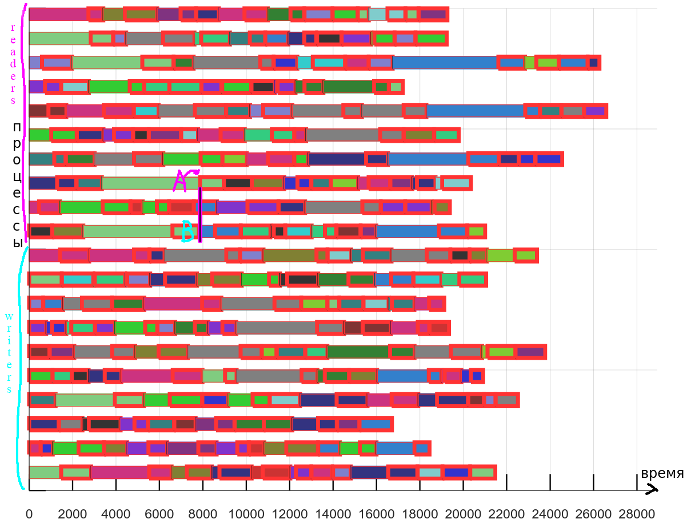
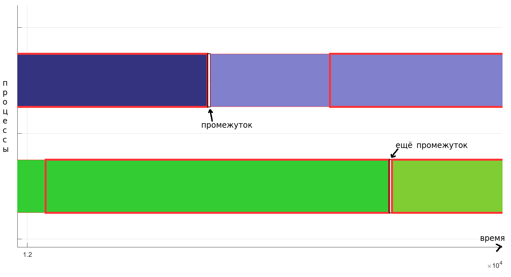
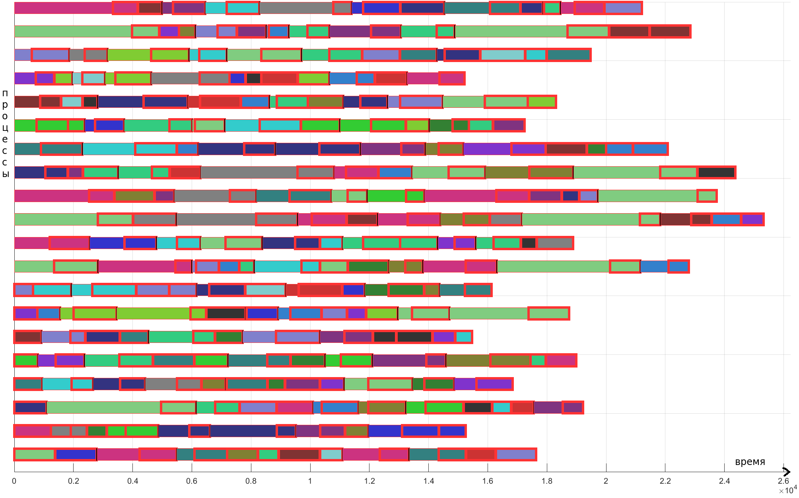
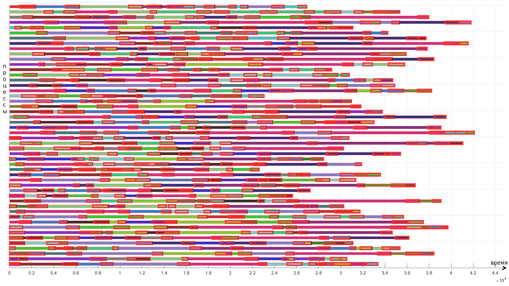
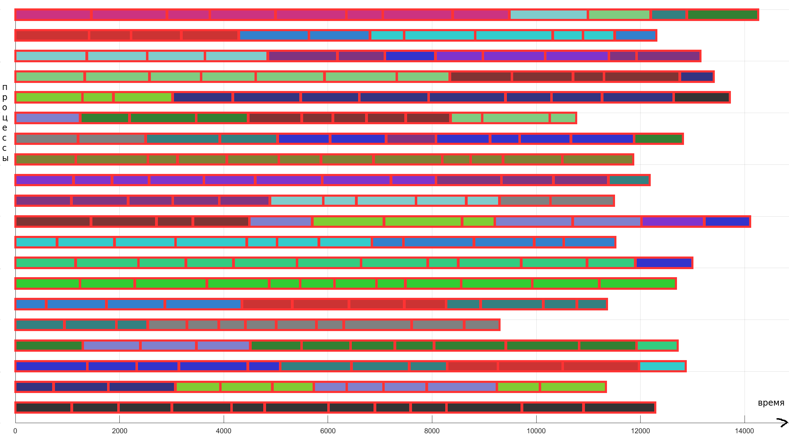
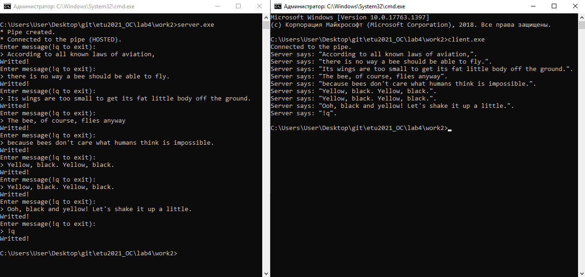

# Введение

Цель работы: исследовать инструменты и механизмы взаимодействия процессов в Windows.

Задания:

1) Реализация решения задачи о читателях-писателях:

- Выполнить решение задачи о читателях-писателях, для чего необходимо разработать консольные приложения «Читатель» и «Писатель»:

- одновременно запущенные экземпляры процессов-читателей и процессов-писателей должны совместно работать с буферной памятью в виде проецируемого файла:

- - размер страницы буферной памяти равен размеру физической страницы оперативной памяти;

- - число страниц буферной памяти равно сумме цифр в номере студенческого билета без учета первой цифры.

- страницы буферной памяти должны быть заблокированы в оперативной памяти (функция VirtualLock);

- длительность выполнения процессами операций «чтения» и «записи» задается случайным образом в диапазоне от 0,5 до 1,5 сек.;

- для синхронизации работы процессов необходимо использовать объекты синхронизации типа «семафор» и «мьютекс»;

- процессы-читатели и процессы-писатели ведут свои журнальные файлы, в которые регистрируют переходы из одного «состояния» в другое (начало ожидания, запись или чтение, переход к освобождению) с указанием кода времени (функция TimeGetTime). Для состояний «запись» и «чтение» необходимо также запротоколировать номер рабочей страницы.

- Запустите приложения читателей и писателей, суммарное количество одновременно работающих читателей и писателей должно быть не менее числа страниц буферной памяти. Проверьте функционирование приложений, проанализируйте журнальные файлы процессов, постройте сводные графики смены «состояний» для не менее 5 процессов-читателей и 5 процессов-писателей, дайте свои комментарии относительно переходов процессов из одного состояния в другое.

2) Использование именованных каналов для реализации сетевого межпроцессного взаимодействия.

- Создайте два консольных приложения с меню, которые выполняют:

- - приложение-сервер создает именованный канал (функция Win32 API – CreateNamedPipe), выполняет установление и отключение соединения (функции Win32 API – ConnectNamedPipe, DisconnectNamedPipe), создает объект «событие» (функция Win32 API – CreateEvent) осуществляет ввод данных с клавиатуры и их асинхронную запись в именованный канал (функция Win32 API – WriteFile), выполняет ожидание завершения операции ввода-вывода (функция Win32 API – WaitForSingleObject);

- - приложение-клиент подключается к именованному каналу (функция Win32 API – CreateFile), в асинхронном режиме считывает содержимое из именованного канала файла (функция Win32 API – ReadFileEx) и отображает на экран.

- Запустите приложения и проверьте обмен данных между процессами. Запротоколируйте результаты в отчет. Дайте свои комментарии в отчете относительно выполнения функций Win32 API.

Исходный код доступен в [этом репозитории](https://github.com/The220th/etu2021_OC): https://github.com/The220th/etu2021_OC

# Реализация решения задачи о читателях-писателях

В ходе выполнения лабораторной работы были написаны программы, которые решают эту задачу: диспетчер, читатель и писатель. Диспетчер создаёт процессы писателей и читателей (CreateProcessA), которые конкурируют за страницы памяти. Здесь "общая память" реализуется с помощью проецируемого файла.

Прежде чем приводить графики, нужно дать некоторые комментарии к ним. Рассмотрим график, который приведён на рисунке 1.

Рисунок 1 — Пример графика

На оси абсцисс показано время в миллисекундах, а по горизонтали — процессы. При этом в нижней половине — это писатели, а в верхней — читатели. Каждой странице соответствует свой цвет. Согласно варианту страниц должно быть 20, соответственно будет и 20 разных цветов. Если прямоугольник обведён красным контуром, то это означает, что читатель читает (писатель пишет). Если прямоугольник не обведён, то читатель/писатель ждёт, пока освободится страница этого цвета. 

Рассмотрим ситуацию, представленную на рисунке 1. Процесс-читатель ждёт болотную страницу. В точке ``А`` этот процесс-читатель дождался её и начал читать из этой страницы, потому что в точке ``B`` как раз другой процесс-читатель освободил болотную страницы.

На самом деле между ожиданием и записью есть промежутки, которые соответствуют периоду освобождения страниц. Пример такого промежутка приведён на рисунке 2. Просто, чтобы их увидеть, нужно очень сильно приблизить график.

Рисунок 2 — Пример промежутка

Согласно варианту страниц должно быть 20. Было проведено 4 замера:

- В сумме 20 процессов читателей и писателей, которые выбирают страницы случайным образом;

- В сумме 50 процессов читателей и писателей, которые выбирают страницы случайным образом;

- В сумме 20 процессов читателей и писателей, которые выбирают первую свободную страницу (лишь бы что-нибудь куда-нибудь записать/прочитать);

- В сумме 50 процессов читателей и писателей, которые выбирают первую свободную страницу (лишь бы что-нибудь куда-нибудь записать/прочитать).

Также есть один отдельный цвет, который обозначает, что процесс ждёт какую-нибудь (первую освободившуюся) страницу. Это чёрный цвет. Такой цвет хорошо наблюдается на рисунке 6.

Получились результаты, которые приведены на рисунках 3, 4, 5 и 6.

Рисунок 3 — 20 процессов, случайный выбор

Рисунок 4 — 50 процессов, случайный выбор

Рисунок 5 — 20 процессов, первая освободившаяся страница

На рисунке 5 в самом внизу процесс-писатель пишет в страницу не чёрного цвета, а тёмно-коричневого. 

Рисунок 6 — 50 процессов, первая освободившаяся страница

В данной лабораторной работе синхронизация осуществляется с помощью объектов ядра мьютексов, а не критических секций. Ведь синхронизацию нужно выполнять между процессами, а критические секции синхронизируют потоки в рамках одного процесса. Чего не скажешь о мьютексах и семафорах.

Из замеров можно явным образом увидеть, что при увеличении процессов увеличивается и среднее время ожидания, и соответственно время выполнения программы. Например, на рисунке 3 можно увидеть, что время выполнения примерно `25.5` секунд, а на рисунке 4 — `42.5` сек. Ведь теперь больше процессов конкурирует за одну страницу.

Если процессы выбирают какую-нибудь первую освободившуюся страницу, то никому почти не нужно ждать (см. рис. 5). Но это работает, если кол-во процессов не больше, чем кол-во страниц. Если процессов будет больше, то придётся всё равно ждать (см. рис. 6).

Из замеров видно, что программа, в которой процессы выбирают первую попавшуюся свободную страницу, работает на порядок быстрее, чем та, где процессы выбирают страницы рандомно. `25.5 сек`. (см. рис. 3) vs `14.5` сек. (см. рис. 5).

Протоколы программ, по которым строились графики, и журнальные файлы доступны:

- Для "20 процессов, случайный выбор" [здесь](https://github.com/The220th/etu2021_OC/tree/main/lab4/report/src/3AMEPbl/work1-RND20);

- Для "50 процессов, случайный выбор" [здесь](https://github.com/The220th/etu2021_OC/tree/main/lab4/report/src/3AMEPbl/work1-RND50);

- Для "20 процессов, первая освободившаяся страница" [здесь](https://github.com/The220th/etu2021_OC/tree/main/lab4/report/src/3AMEPbl/work1-NO_RND20);

- Для "50 процессов, первая освободившаяся страница" [здесь](https://github.com/The220th/etu2021_OC/tree/main/lab4/report/src/3AMEPbl/work1-NO_RND50).

Исходный код программы доступен [здесь](https://github.com/The220th/etu2021_OC/tree/main/lab4/work1): https://github.com/The220th/etu2021_OC/tree/main/lab4/work1.

# Использование именованных каналов для реализации межпроцессного взаимодействия

В ходе выполнения лабораторной работы были написаны программы, которые могут обмениваться данными с помощью именованного канала. 

Пример протокола выполнения приведён на рисунке 7.

Рисунок 7 — Пример протокола выполнения

Именованный канал — это файловый объект API Win32, с помощью которого можно установить связь между двумя процессами. В данном случае есть процесс-сервер, который создаёт именованный канал (CreateNamedPipeA), подключается к нему и начинает ожидать подключение клиента (ConnectNamedPipe). Процесс-клиент "подключается" к серверу (CreateFileA) и асинхронно читает из канала (ReadFileEx) данные, которые записывает сервер в канал (WriteFile). Чтобы гарантировать соединение клиент использует функцию WaitNamedPipeA. И сервер, и клиент работают с пайпом, как с файлом, что удобно. Также можно заметить, что процессы можно синхронизировать с помощью этих самых каналов.

Исходный код программ доступен [здесь](https://github.com/The220th/etu2021_OC/tree/main/lab4/work2): https://github.com/The220th/etu2021_OC/tree/main/lab4/work2.

# Вывод

В ходе выполнения лабораторной работы были исследованы некоторые инструменты и механизмы взаимодействия и синхронизации процессов в операционной системе Windows.
